# LangChain Memory — Deep Dive

---

## Overview: Why Memory Matters

Without memory, an LLM is like a person with amnesia. Every message starts from zero — it has no idea what was said before.

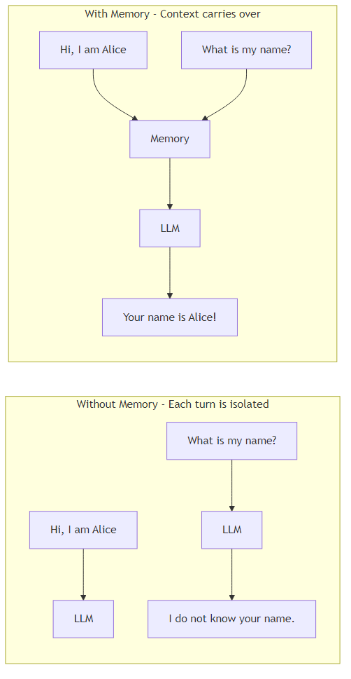

Memory in LangChain solves this by:
1. Storing what was said after each turn
2. Injecting that stored context into every new prompt

---

## How Many Memory Components Exist?

LangChain has **11 memory classes** and **21 storage backends**.

### The 11 Memory Classes

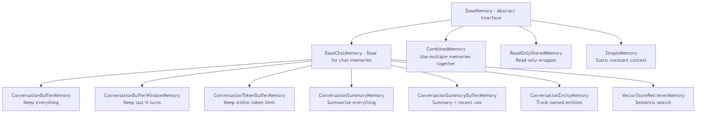

### The 21 Storage Backends

These are the physical places where messages get stored. Any memory class can use any backend.

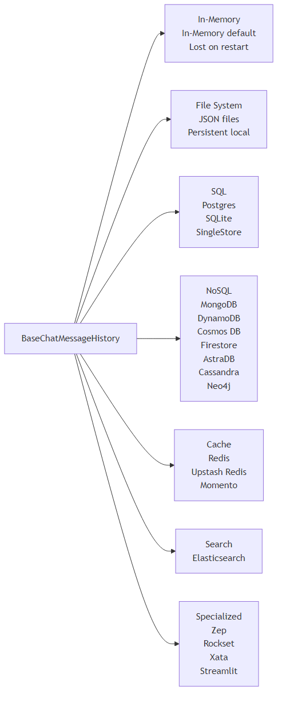

---

## The Universal Memory Lifecycle

Every memory type follows the same 3-step flow on every turn.

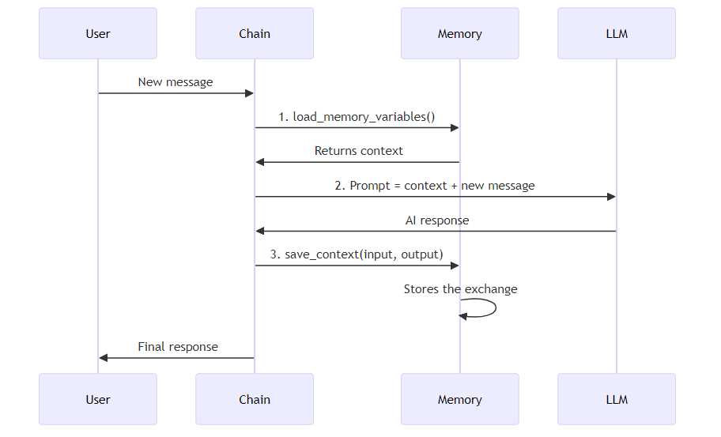

**Step 1 - Load:** Ask memory what it remembers. It returns context.

**Step 2 - Inject:** Build the full prompt = memory context + current message. LLM sees everything.

**Step 3 - Save:** Store the new input + output for next time.

---

## What Gets Injected Into the Prompt

Memory populates a `{history}` placeholder in your prompt template.

**Without memory - the LLM only sees the current message:**

```
Current message: What is my name?
AI: I do not know.
```

**With ConversationBufferMemory - the LLM sees full history:**

```
Human: Hi, I am Alice.
AI: Nice to meet you, Alice!
Human: I am a doctor in Paris.
AI: That is wonderful!

Current message: What is my name?
AI: Your name is Alice.
```

The `{history}` block is what memory injects. Different memory types inject different things — full history, a summary, entity facts, or similar past messages.

---

## Memory Type 1 — ConversationBufferMemory

**Strategy: Keep every single message.**

The simplest approach. Every message is stored and every message is sent to the LLM on every turn.

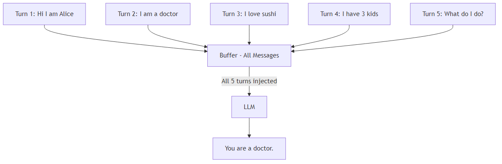

**Key settings:**
- `memory_key` — the variable name in your prompt (default: `"history"`)
- `human_prefix` — label for user messages (default: `"Human"`)
- `ai_prefix` — label for AI messages (default: `"AI"`)
- `return_messages` — return as list of objects vs plain string

**Example walkthrough:**

| Turn | User says | AI says | What is stored |
|------|-----------|---------|----------------|
| 1 | Hi, I am Alice | Nice to meet you! | Turn 1 added |
| 2 | I am a doctor | Interesting! | Turns 1-2 stored |
| 3 | What is my name? | Your name is Alice | Turns 1-3 stored |

On Turn 3, the LLM receives turns 1 and 2 as context, so it knows the answer.

**Best for:** Short conversations (under 20-30 turns).

**Problem:** After 100 turns, the LLM gets a massive block of text. This is slow, expensive, and may overflow the token limit.

---

## Memory Type 2 — ConversationBufferWindowMemory

**Strategy: Keep only the last K turns.**

Like buffer memory but with a sliding window. Once the window fills up, the oldest turn falls off.

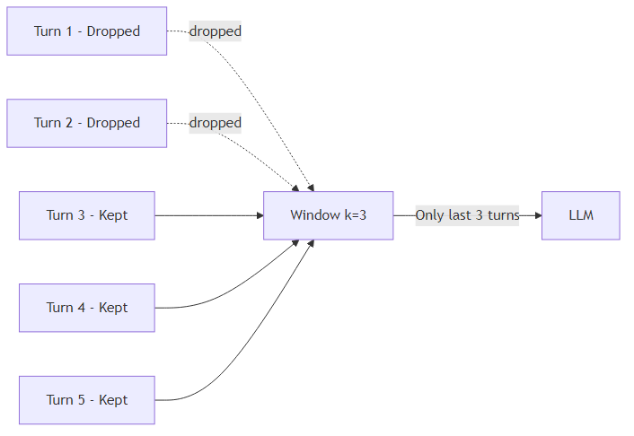

**Key settings:**
- `k` — number of conversation turns to keep (default: 5)
- Each turn = 1 human message + 1 AI message = 2 messages stored

**Example walkthrough (k=2):**

| Turn | User says | Window contains | AI can recall |
|------|-----------|-----------------|---------------|
| 1 | My favorite color is blue | Turn 1 | Yes |
| 2 | I live in Paris | Turns 1-2 | Yes |
| 3 | I am a doctor | Turns 2-3 (Turn 1 dropped!) | No longer knows color |
| 4 | What city do I live in? | Turns 3-4 | Yes, Paris (still in window) |
| 5 | What is my favorite color? | Turns 4-5 | No - Turn 1 was dropped |

**Best for:** Medium conversations where only recent context matters.

**Problem:** Old information is permanently lost. The LLM has no idea what happened 10 turns ago.

---

## Memory Type 3 — ConversationTokenBufferMemory

**Strategy: Keep messages until the token count hits a limit, then prune the oldest.**

Instead of counting turns, this counts tokens (the units of text LLMs process). When the total tokens exceed your limit, it drops messages from the front.

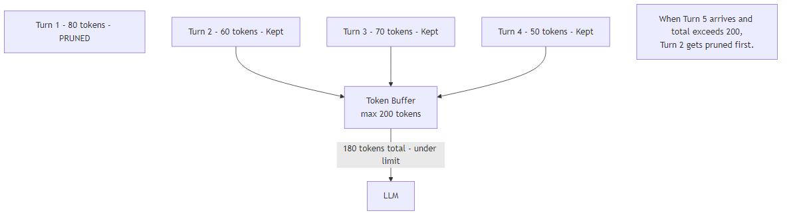

**Key settings:**
- `max_token_limit` — maximum total tokens to keep (default: 2000)
- `llm` — required, used to count tokens accurately

**Example walkthrough (max 100 tokens):**

```
After Turn 1: 30 tokens stored. Fine.
After Turn 2: 60 tokens stored. Fine.
After Turn 3: 95 tokens stored. Fine.
After Turn 4: 130 tokens stored. OVER LIMIT!
  -> Turn 1 is pruned. Now 100 tokens. OK.
After Turn 5: 130 tokens again. OVER LIMIT!
  -> Turn 2 is pruned. Now 100 tokens. OK.
```

**Best for:** When you need precise control over how much context is sent to the LLM. Prevents unexpected token overflows.

**Problem:** Like window memory, old information is permanently lost.

---

## Memory Type 4 — ConversationSummaryMemory

**Strategy: Compress old messages into a running summary.**

Instead of storing raw messages, after each turn it asks an LLM to update a rolling summary of the whole conversation. Only the summary is stored — not the raw messages.

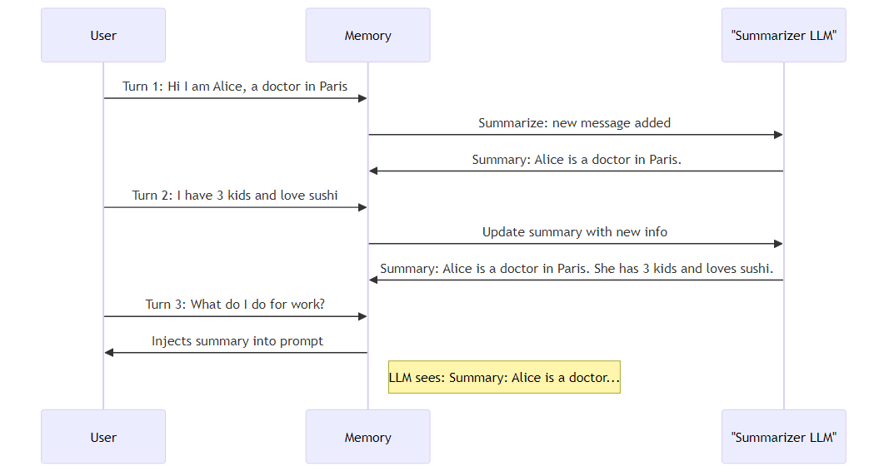

**Key settings:**
- `llm` — required, used to generate the summary
- `buffer` — the current summary string (starts empty)
- `summary_message_cls` — how the summary is wrapped (default: SystemMessage)

**Example walkthrough:**

```
After Turn 1:  Summary = "Alice is a doctor in Paris."
After Turn 2:  Summary = "Alice is a doctor in Paris with 3 kids who loves sushi."
After Turn 3:  Summary = "Alice is a doctor in Paris with 3 kids who loves sushi.
               She was asked about her job."
After Turn 10: Summary = "Alice is a doctor. She lives in Paris with her 3 kids.
               She enjoys sushi and hiking. She is planning a trip to Japan."
```

The entire history of 10 turns becomes one compact paragraph. The LLM never sees the raw messages — only this summary.

**Best for:** Long conversations where you want to preserve meaning but not raw text.

**Problem:** The summary can lose nuance. If the user said something very specific in Turn 2, the summary might not capture every detail.

---

## Memory Type 5 — ConversationSummaryBufferMemory

**Strategy: Summary of old messages + raw recent messages.**

The smartest standalone memory type. It keeps a running summary of older turns AND keeps the most recent turns verbatim. When the token limit is exceeded, the oldest raw messages get folded into the summary.

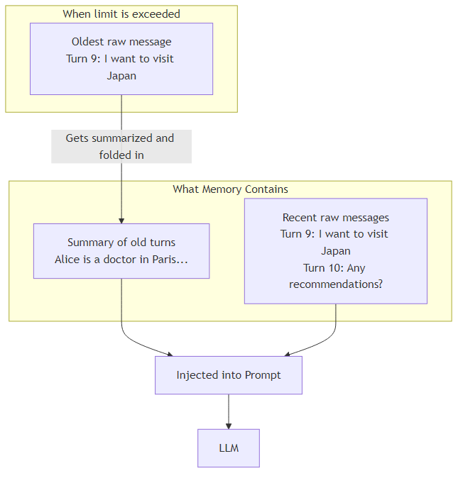

**Key settings:**
- `max_token_limit` — when raw messages exceed this, oldest ones get summarized
- `moving_summary_buffer` — the accumulated summary string
- `llm` — needed for both token counting and summarization

**Example walkthrough (max 200 tokens):**

```
Turns 1-6: Stored as raw messages. Total = 180 tokens. OK.
Turn 7 arrives: Total = 210 tokens. OVER!
  -> Turn 1 is summarized and merged into moving_summary_buffer
  -> Raw messages now = Turns 2-7 only. Total = 175 tokens. OK.

Turn 8 arrives: Total = 205 tokens. OVER!
  -> Turn 2 is summarized and merged. Raw = Turns 3-8.

What LLM sees on Turn 9:
  [Summary]: "Alice is a doctor in Paris. She has 3 kids. She loves sushi..."
  [Recent]:  Turn 7: "I am thinking of moving to London."
             Turn 8: "Any advice on London neighbourhoods?"
  [Current]: "What about schools in London?"
```

**Best for:** Most real-world chatbot scenarios. Balances full detail for recent turns with compressed context for older turns.

---

## Memory Type 6 — ConversationEntityMemory

**Strategy: Extract and track specific named entities (people, places, organizations).**

This memory uses an LLM to detect entities mentioned in the conversation and builds a knowledge store about each one. Every entity gets its own description that updates as more is said.

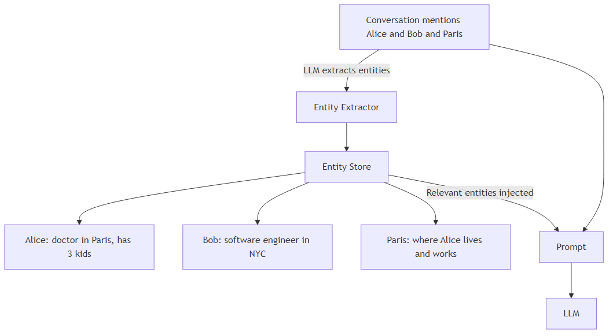

**Key settings:**
- `k` — number of recent message pairs to scan for entity extraction (default: 3)
- `entity_store` — where entities are stored (default: in-memory)
- `llm` — needed for extraction and summarization

**Entity Stores available:**

| Store | Best For |
|-------|----------|
| InMemoryEntityStore | Development and testing |
| RedisEntityStore | Production, fast lookup, auto-expiry |
| UpstashRedisEntityStore | Serverless production deployments |
| SQLiteEntityStore | Local file-based persistence |

**Example walkthrough:**

```
Turn 1: "I work with Alice. She is a doctor."
  Entity extracted: Alice
  Alice's entry: "Alice is a doctor."

Turn 2: "Alice works in Paris and has two kids."
  Entity updated: Alice
  Alice's entry: "Alice is a doctor who works in Paris and has two kids."

Turn 3: "My colleague Bob is an engineer."
  Entity extracted: Bob
  Bob's entry: "Bob is an engineer."

Turn 5: "Tell me about Alice."
  Memory injects:
    Entities: {"Alice": "Alice is a doctor who works in Paris and has two kids."}
  LLM answers: "Alice is a doctor in Paris. She has two kids."
```

**What gets injected into the prompt:**

```
Known entities:
  Alice: A doctor who works in Paris and has two kids.
  Bob: An engineer.

Conversation history (last 3 turns):
  Human: ...
  AI: ...
```

**Best for:** Conversations involving multiple people, places, or organizations that need to be tracked individually.

---

## Memory Type 7 — VectorStoreRetrieverMemory

**Strategy: Find past messages that are semantically similar to the current question.**

Instead of injecting recent or summarized history, this memory stores every message as a vector embedding (a mathematical fingerprint of meaning). When a new message arrives, it searches for the most *similar* past messages — regardless of when they happened.

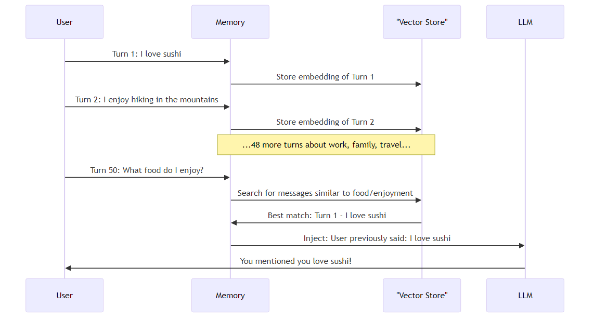

**Key settings:**
- `retriever` — a VectorStoreRetriever pointing to any vector store (FAISS, Pinecone, Chroma, etc.)
- `memory_key` — variable name injected into prompt
- `input_key` — which part of the input is used as the search query

**Example walkthrough:**

```
50-turn conversation covering: food, family, work, travel, hobbies.

Turn 50: User asks "What kind of food do I like?"

Memory does NOT look at the last 5 turns (which were about travel).
Memory searches all 50 turns for food-related content.
Found: Turn 1 ("I love sushi"), Turn 12 ("I tried ramen last week"), Turn 33 ("Not a big fan of spicy food")

LLM receives these 3 results and answers accurately.
```

**Best for:** Very long conversations where relevant info could be anywhere. Works like a search engine over your chat history.

**Limitation:** May miss sequential context (e.g., cause-and-effect across consecutive turns). Also requires setting up a vector store.

---

## Utility Memory 1 — CombinedMemory

**Strategy: Use multiple memory types at the same time.**

Sometimes one memory type is not enough. CombinedMemory lets you stack multiple memories together. Each contributes its own piece of context to the final prompt.

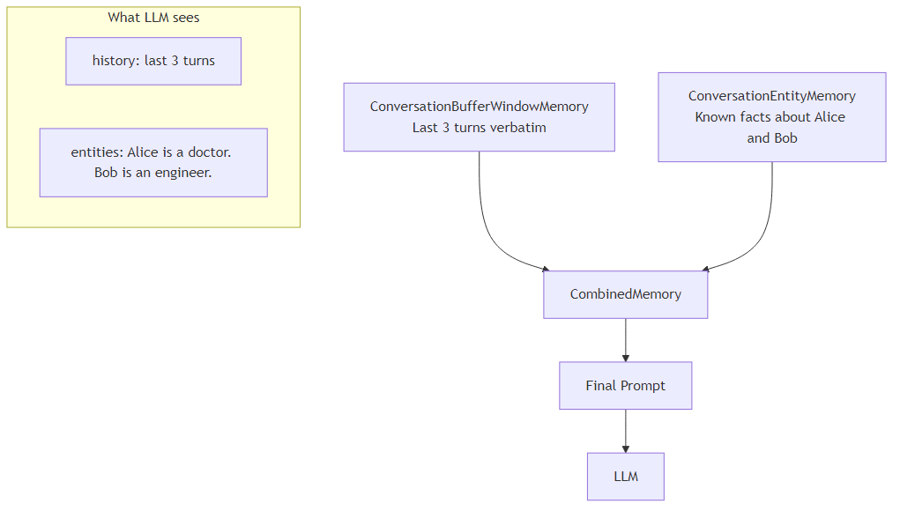

**Rule:** Each sub-memory must use a different `memory_key` so they do not conflict.

**Example:**

```
Memory 1 (BufferWindow, memory_key="history"):
  Injects: "Human: I want advice on moving. AI: Where are you thinking?"

Memory 2 (EntityMemory, memory_key="entities"):
  Injects: "Alice: doctor in Paris. Bob: engineer in NYC."

LLM sees both — recent conversation AND known entity facts.
```

**Best for:** Complex agents that need both recent context and long-term facts.

---

## Utility Memory 2 — ReadOnlySharedMemory

**Strategy: Share memory across multiple chains without letting one chain modify it.**

Wraps any memory in a read-only shell. The chain can read from it but cannot write to it.

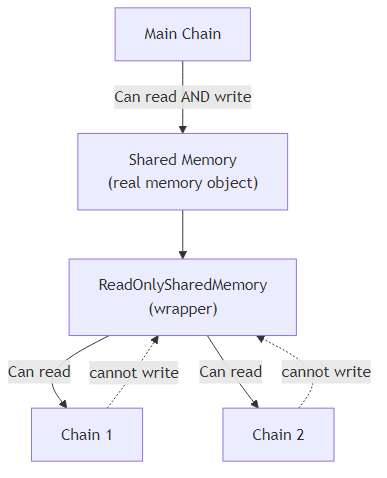

**Example:**

```
You have a main conversation chain that updates memory each turn.
You also have a summarization side-chain that needs to read memory.
Wrap the memory in ReadOnlySharedMemory for the side-chain.
The side-chain can see the history but cannot accidentally overwrite it.
```

---

## Utility Memory 3 — SimpleMemory

**Strategy: Inject static, constant context — never changes.**

Not really a "memory" — it is a way to inject fixed information into every prompt. It never saves anything from the conversation.

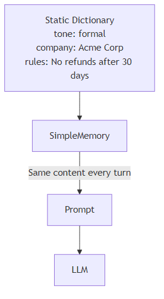

**Example:**

```
SimpleMemory contains:
  {
    "company_name": "Acme Corp",
    "policy": "Free returns within 30 days",
    "tone": "professional and friendly"
  }

Every LLM call automatically receives these facts.
Great for system-level instructions that never change.
```

---

## Side-by-Side Comparison

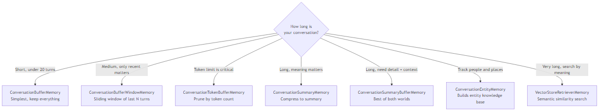

| Memory Type | Stores | Drops | Token Use | Needs LLM? |
|---|---|---|---|---|
| Buffer | Everything | Nothing | Grows forever | No |
| Buffer Window | Last k turns | Old turns | Stable | No |
| Token Buffer | Recent messages | Oldest by token | Capped | Yes (counting) |
| Summary | Summary only | Raw messages | Very small | Yes (summarize) |
| Summary Buffer | Summary + recent | Old raw messages | Capped | Yes (both) |
| Entity | Entities + last k | Nothing | Small | Yes (extract) |
| Vector Store | All as embeddings | Nothing | Small (top-k) | No (embedding model) |

---

## Full End-to-End Example

A 6-turn conversation using **ConversationSummaryBufferMemory** showing exactly what the LLM sees at each step.

**Setup:** max_token_limit = 150 tokens

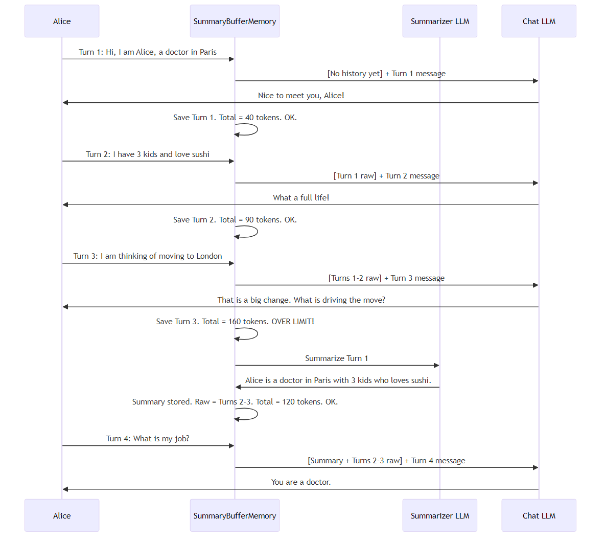

**What the LLM sees on Turn 4:**

```
[Summary]
Alice is a doctor in Paris with 3 kids who loves sushi.

[Recent raw messages]
Human: I have 3 kids and love sushi.
AI: What a full life!
Human: I am thinking of moving to London.
AI: That is a big change. What is driving the move?

[Current message]
Human: What is my job?
AI:
```

The LLM answers: *"You are a doctor."* — even though the original "I am a doctor" message was already pruned. The summary preserved it.

---

## Storage Backends — Where Messages Live

The memory type controls *what* to store and *how much*. The backend controls *where* it is stored.

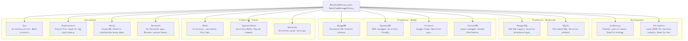

**Example — same memory, two backends:**

```
Development:
  Memory = ConversationBufferMemory(chat_memory=ChatMessageHistory())
  Messages stored in RAM. Lost when script ends.

Production:
  Memory = ConversationBufferMemory(chat_memory=RedisChatMessageHistory(session_id="user-42"))
  Messages stored in Redis. Persist across restarts. Survive server crashes.
  User logs back in tomorrow — full history is still there.
```

---

## Memory with Sessions — Multiple Users

In a real application, different users have different conversation histories. Sessions handle this.

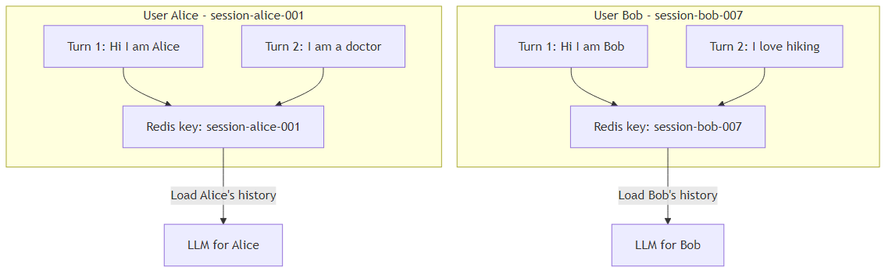

Each user gets a unique `session_id`. Their messages are stored under that key. When they send a message, only their history is loaded.

---

## Quick Reference — Choosing the Right Memory

| Situation | Best Memory Choice |
|---|---|
| Prototype / quick demo | ConversationBufferMemory |
| Only recent turns matter | ConversationBufferWindowMemory |
| Strict token budget | ConversationTokenBufferMemory |
| Long conversations, compact context | ConversationSummaryMemory |
| Long conversations, need recent detail | ConversationSummaryBufferMemory |
| Tracking specific people or places | ConversationEntityMemory |
| Huge history, find by meaning | VectorStoreRetrieverMemory |
| Need multiple strategies at once | CombinedMemory |
| Inject static instructions every turn | SimpleMemory |
| Share memory read-only across chains | ReadOnlySharedMemory |

---

## Summary

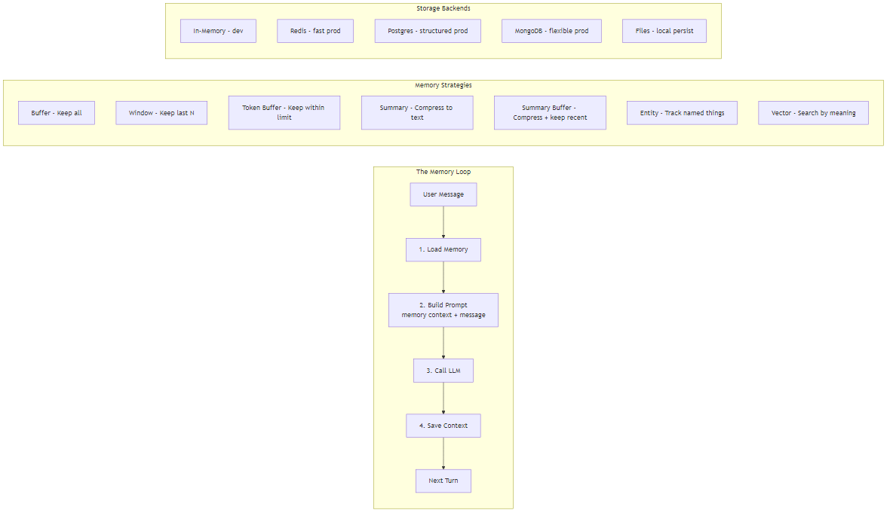

**The key insight:** Memory is not magic — it is just context injection. Every memory type is ultimately doing the same thing: deciding what text to put in front of the current message. The difference is *how* each type decides what that text should be.

- **Buffer** says: *"Put everything."*
- **Window** says: *"Put the last N turns."*
- **Token** says: *"Put as much as fits."*
- **Summary** says: *"Put a compressed version."*
- **Entity** says: *"Put the facts we know about relevant entities."*
- **Vector** says: *"Put the most semantically relevant past messages."*