# LangChain — A Simple Guide

---

## 1. Overall Components in LangChain

LangChain is a framework for building applications powered by language models. It provides building blocks that you wire together to create things like chatbots, document Q&A systems, and AI agents.

Think of LangChain like a set of LEGO bricks — each piece does one job, and you snap them together to build something bigger.

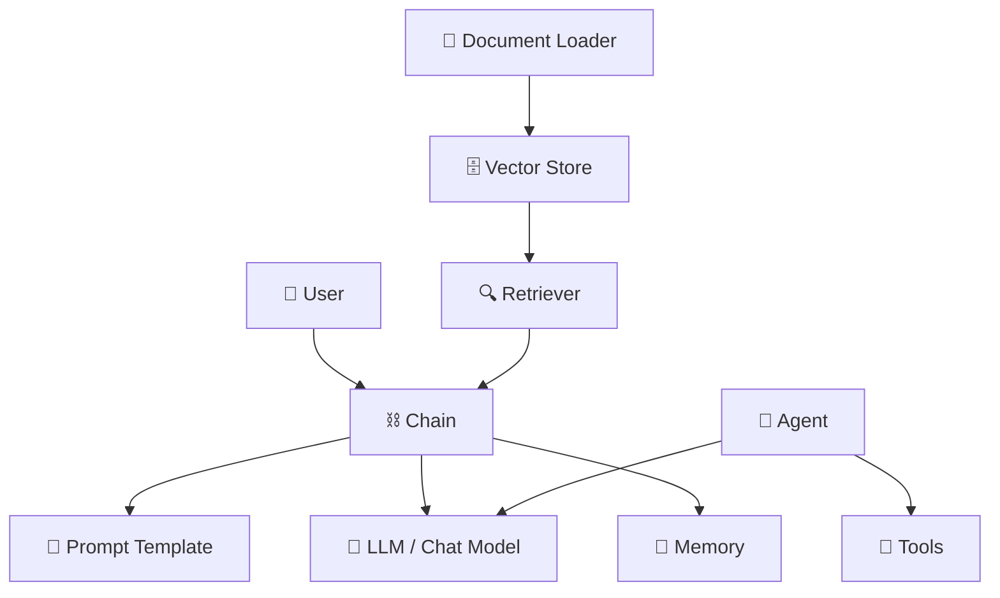

### The Main Building Blocks

| Component | What it does | Example |
|---|---|---|
| **LLM / Chat Model** | The brain — sends text in, gets text out | GPT-4, Claude, Gemini |
| **Prompt Template** | A reusable fill-in-the-blank text structure | "You are a helpful assistant. Answer: {question}" |
| **Chain** | Connects components into a pipeline | Prompt → LLM → Output |
| **Memory** | Remembers past conversation turns | "Earlier you said your name is Alice" |
| **Document Loader** | Reads files (PDFs, web pages, CSVs, etc.) | Load a PDF and split it into chunks |
| **Vector Store** | Stores text as searchable vectors | Pinecone, Chroma, FAISS |
| **Retriever** | Fetches relevant documents by similarity | Find the 3 most relevant chunks for a question |
| **Tools** | Functions an agent can call | Search the web, run Python, query a database |
| **Agent** | An LLM that decides which tool to use next | Research agent, coding agent |

---

### How a Basic Chain Works

**Example:** A simple Q&A pipeline

```
User asks: "What is the capital of France?"

1. Prompt Template fills in:
   "Answer the following question: What is the capital of France?"

2. LLM receives the filled prompt and responds:
   "The capital of France is Paris."

3. Chain returns the answer to the user.
```

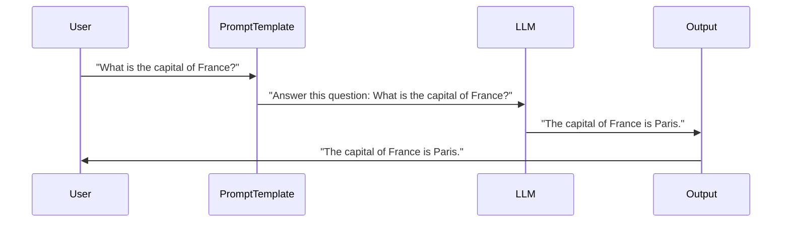

---

### How a RAG (Retrieval Augmented Generation) Pipeline Works

**Example:** A chatbot that answers questions from your company's PDF docs

```
User asks: "What is our refund policy?"

1. Retriever searches the vector store for relevant chunks
2. Top 3 relevant chunks are found from the PDF
3. Chunks + question are sent to the LLM
4. LLM answers using only the retrieved information
```

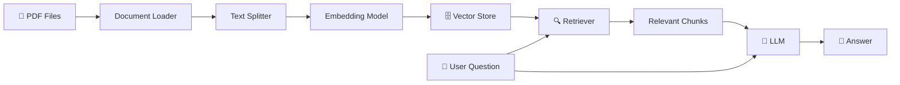

---

## 2. Memory Components in LangChain

Without memory, every message to an LLM is completely isolated — it has no idea what you said before. Memory solves this by storing and injecting past conversation context.

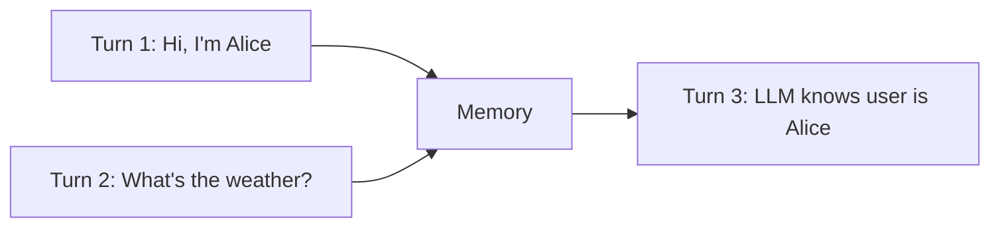

LangChain has many memory types, each with a different strategy for what to remember and how long to keep it.

---

### Memory Types at a Glance

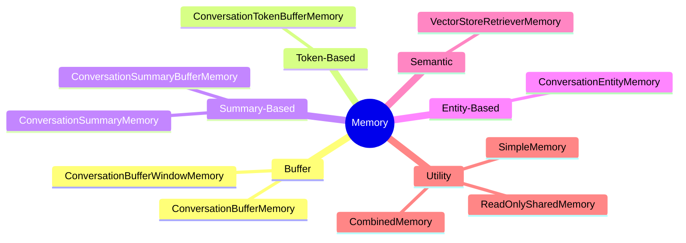

---

### Memory Type Comparison

| Memory Type | Strategy | Best For | Limitation |
|---|---|---|---|
| **Buffer** | Keep everything | Short conversations | Gets large fast |
| **Buffer Window** | Keep last N turns | Medium conversations | Loses older context |
| **Token Buffer** | Keep within token limit | Token-constrained models | Older context lost |
| **Summary** | Summarize old messages | Long conversations | Summary may lose detail |
| **Summary Buffer** | Summary + recent raw messages | Best of both worlds | More complex |
| **Entity** | Track named entities | Conversations about people/places | Requires LLM for extraction |
| **Vector Store** | Semantic similarity search | Very long histories | May miss sequential context |
| **Simple** | Static, never changes | Injecting constant instructions | Not dynamic |
| **Combined** | Multiple memories together | Complex use cases | More overhead |

---

### 1. ConversationBufferMemory — "Remember Everything"

Keeps a full transcript of the conversation and passes it all to the LLM every time.

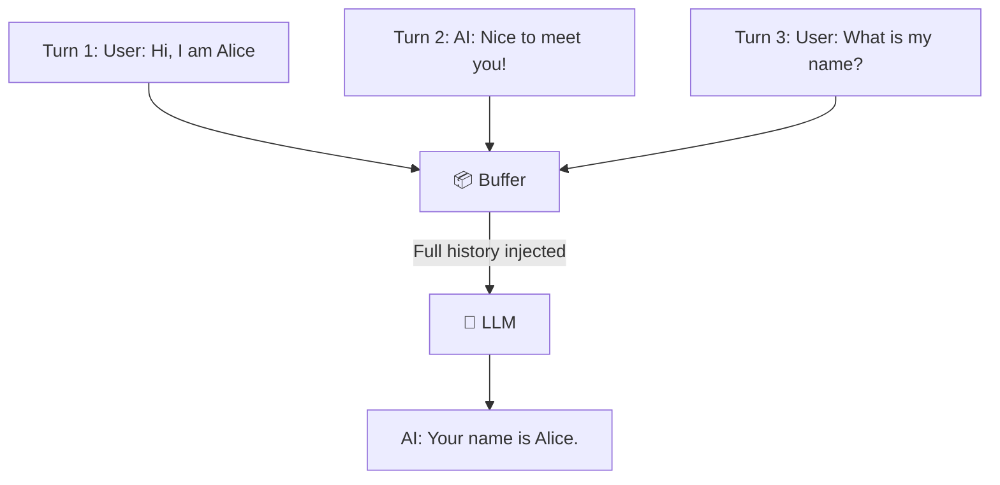

**Example:**
> Turn 1 — User: "Hi, I'm Alice."
> Turn 2 — User: "What's my name?"
> LLM sees the full history and replies: "Your name is Alice."

**Good for:** Short conversations.
**Problem:** After 100 turns, the LLM receives a huge block of text — expensive and may hit the token limit.

---

### 2. ConversationBufferWindowMemory — "Remember the Last N Turns"

Like Buffer memory, but it only keeps the most recent **k** turns. Older messages are dropped.

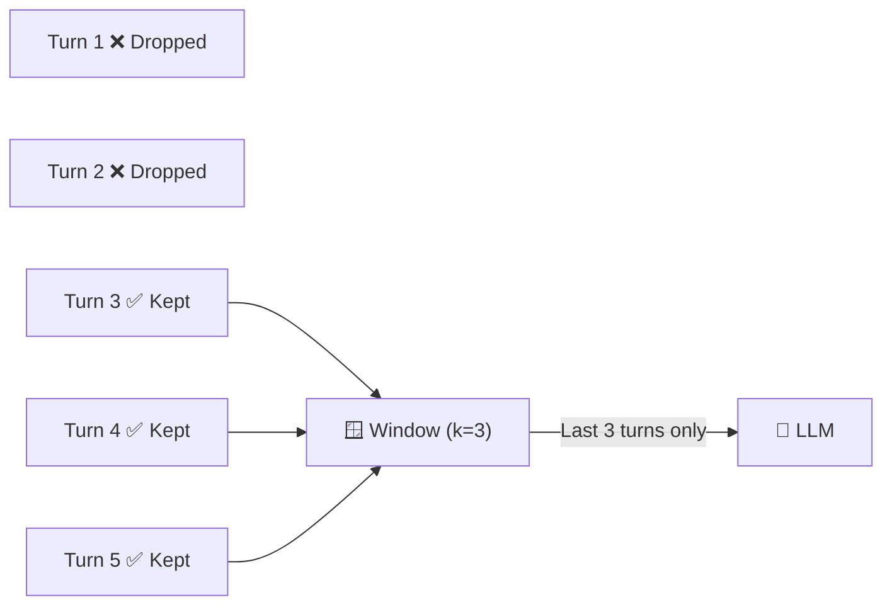

**Example (k=2):**
> Turn 1 — "My favorite color is blue."
> Turn 2 — "I live in Paris."
> Turn 3 — "What city do I live in?"
>
> Window includes turns 2 and 3. LLM replies: "You live in Paris."
> If you ask "what's my favorite color?" it won't know — turn 1 was dropped.

---

### 3. ConversationTokenBufferMemory — "Remember Until Full"

Keeps recent messages but prunes from the beginning once the total token count exceeds a set limit.

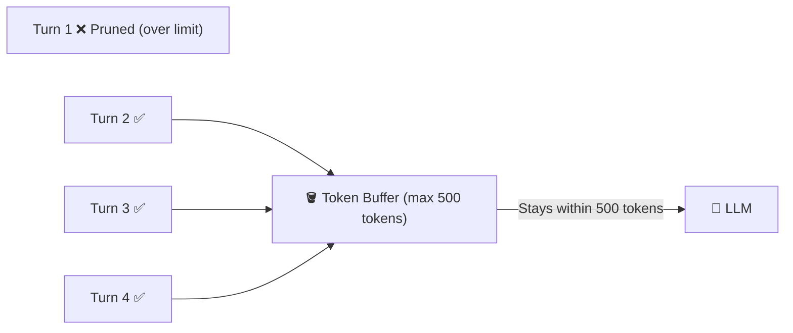

**Example (max 500 tokens):**
> The conversation grows. When it hits 501 tokens, the oldest message is dropped.
> The LLM always receives the most recent conversation that fits within 500 tokens.

---

### 4. ConversationSummaryMemory — "Compress Old Messages"

Instead of storing raw messages, it asks the LLM to **summarize** the conversation so far. Each new turn triggers a new summary.

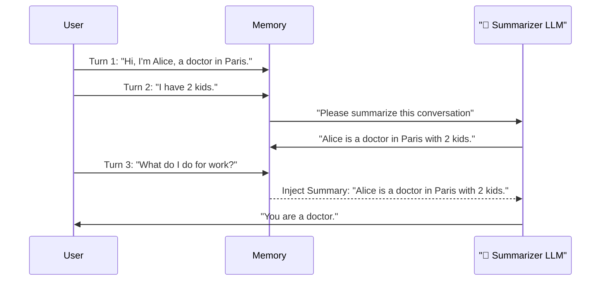

**Example:**
> After 10 turns about Alice's life, instead of 10 raw messages, memory holds:
> *"Alice is a doctor in Paris. She has 2 kids and enjoys cooking."*
>
> This compact summary is injected into every future prompt.

---

### 5. ConversationSummaryBufferMemory — "Summary + Recent Raw"

The **best of both worlds**: keeps a rolling summary of old messages AND keeps recent raw messages verbatim. Older messages get summarized; recent ones stay as-is.

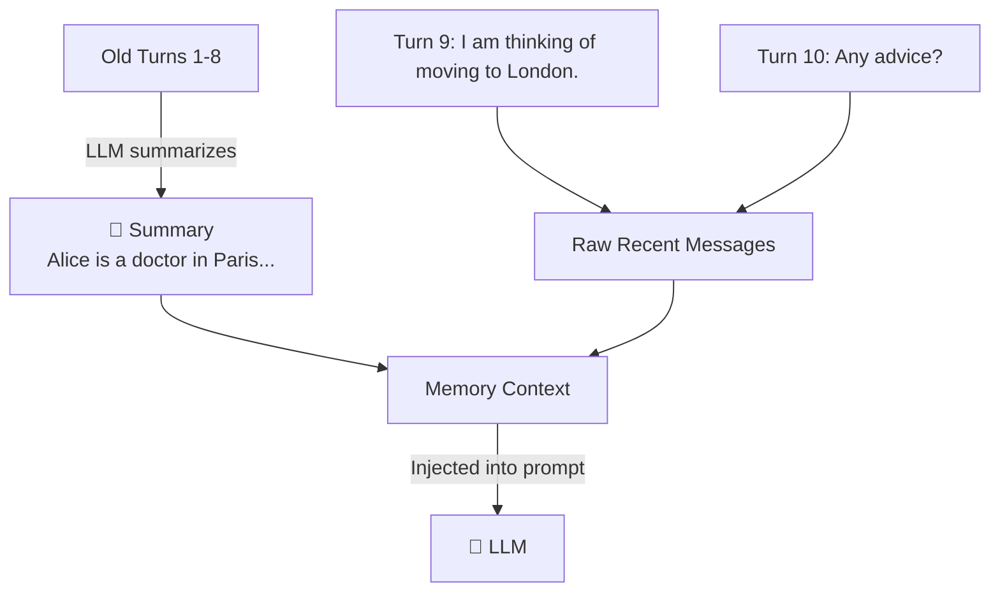

**Example:**
> Summary: *"Alice is a doctor in Paris. She mentioned she loves sushi."*
> Recent raw messages: Turn 9: "I'm thinking of moving to London." / Turn 10: "Any advice?"
>
> The LLM gets both the summary and the last 2 raw turns — full context without bloat.

---

### 6. ConversationEntityMemory — "Track Specific People and Things"

Uses an LLM to extract and track **entities** (people, places, organizations) from the conversation and builds a mini knowledge base about each one.

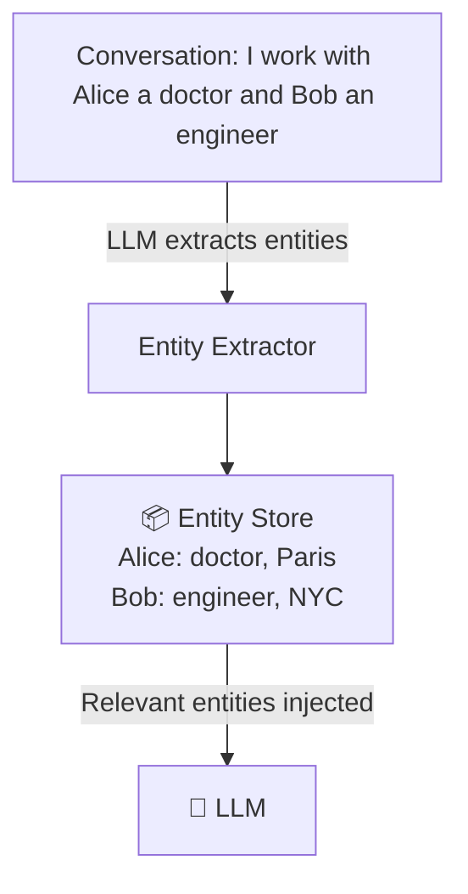

**Example:**
> Turn 1: "I work with Alice, she's a doctor, and Bob, who is an engineer."
> Turn 5: "Tell me about Alice."
>
> Memory injects: *"Alice: Works as a doctor."*
> LLM replies: "Alice is a doctor."
>
> Each entity gets its own summary that updates over time as more is said.

---

### 7. VectorStoreRetrieverMemory — "Search Past Conversations"

Stores every message as a **vector** (a mathematical representation of meaning). When the user says something new, it searches for the most *semantically similar* past messages and injects those — regardless of when they happened.

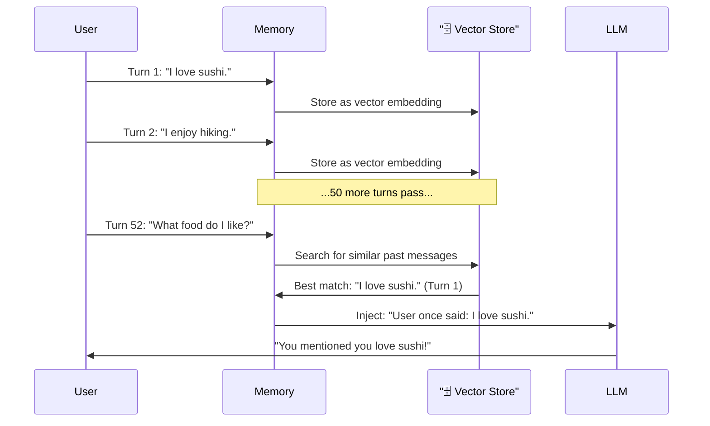

**Example:**
> You had a 50-turn conversation covering many topics.
> You ask: "What was I saying about food?"
>
> Vector search finds your earlier message "I love sushi" even though it was turn 1 — it doesn't rely on recency, it relies on **meaning**.

---

## 3. Deep Dive — How Memory Works

Every memory type follows the same 3-step lifecycle inside LangChain.

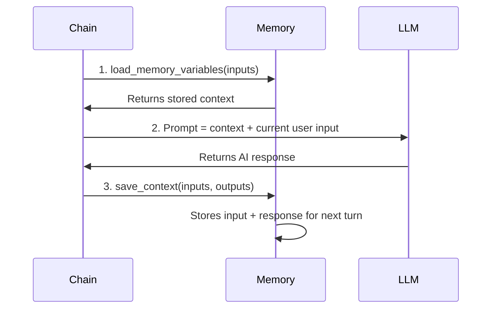

---

### The 3-Step Flow Explained

**Step 1 — Load:**
Before calling the LLM, the chain asks memory: *"What do you remember?"*
Memory returns whatever it has stored — full history, a summary, entity facts, or similar past messages.

**Step 2 — Inject:**
The chain builds the final prompt by combining:
- The memory context (retrieved in Step 1)
- The current user input

**Step 3 — Save:**
After the LLM responds, the chain tells memory: *"Here's what just happened."*
Memory stores both the user input and the AI response so it can use them next turn.

---

### What the Prompt Looks Like After Memory Injection

**Without memory (the LLM sees only the current message):**

```
Human: What's my name?
AI:
```

**With ConversationBufferMemory (the LLM sees full history):**

```
The following is a conversation:
Human: Hi, I'm Alice.
AI: Nice to meet you, Alice!
Human: I am a doctor.
AI: That's great!

Current input:
Human: What's my name?
AI:
```

The LLM now has all the context it needs to answer: *"Your name is Alice."*

---

### Memory Storage Backends

Memory doesn't just live in RAM. LangChain lets you plug in over 20 storage backends so memory persists across sessions, restarts, or multiple users.

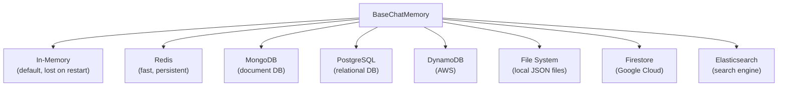

**Example:** A customer support chatbot using Redis as the backend.
> User starts a chat. Their session ID is `user-42`.
> Memory loads all past messages for `user-42` from Redis.
> After each turn, new messages are saved back to Redis.
> The user can close the browser, come back tomorrow, and the chatbot still remembers the conversation.

---

### Combining Multiple Memories with CombinedMemory

You can use multiple memory types at once by combining them. Each memory contributes its own piece of context to the prompt.

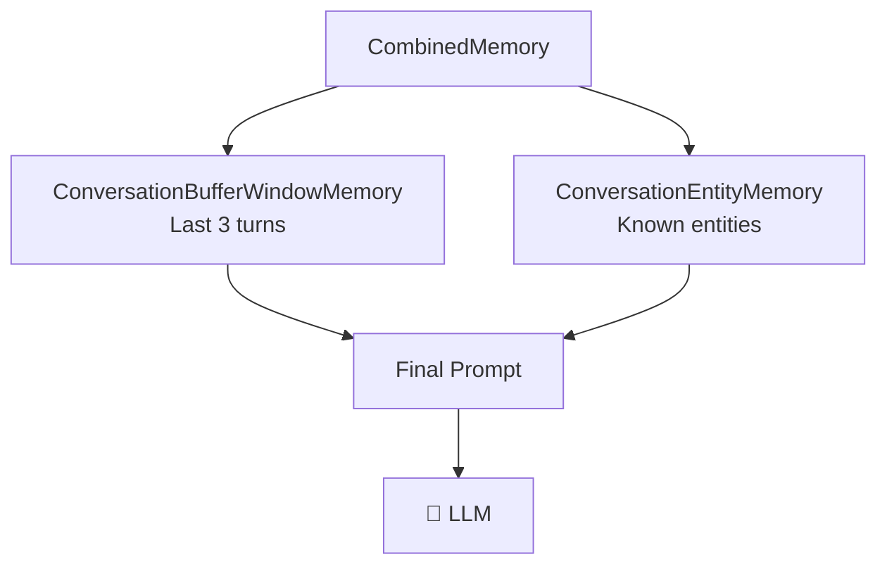

**Example:**
> You combine a BufferWindow memory (last 3 turns) and Entity memory (tracks people).
>
> Entity memory knows: *"Alice: doctor in Paris"*
> Buffer window knows: *"Turn 8: planning a trip. Turn 9: asked about flights."*
>
> The LLM gets both pieces injected, giving it rich context without storing everything.

---

### Full End-to-End Example

Putting it all together with **ConversationSummaryBufferMemory**:

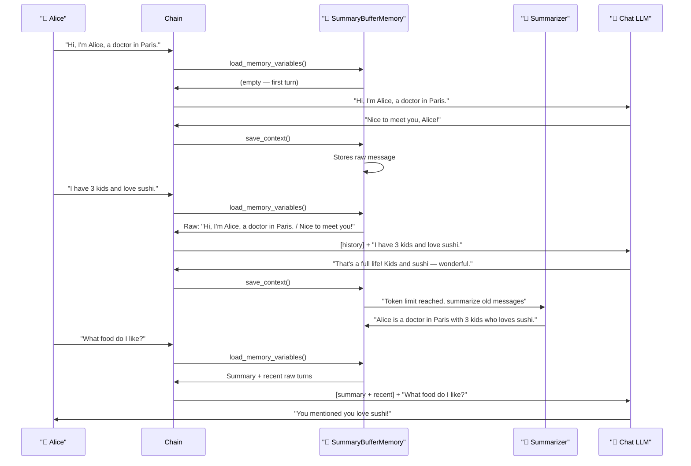

---

### Key Takeaways

| Concept | Simple Explanation |
|---|---|
| **Memory** | Gives the LLM a sense of history — it can recall what was said before |
| **Load** | Before each LLM call, memory injects past context into the prompt |
| **Save** | After each LLM call, memory stores what just happened |
| **Buffer** | Simple — keep everything (or a window of recent turns) |
| **Summary** | Smart — compress old messages into a short summary |
| **Entity** | Targeted — track specific people, places, and things |
| **Vector** | Semantic — search the past by meaning, not recency |
| **Backend** | Where messages are physically stored (RAM, Redis, DB, files) |
