# CrewAI Memory — Complete Guide

---

## The Big Picture: What is Memory?

Without memory, every agent starts completely fresh on every task. It has no idea what happened before, who it talked to, or what it learned. Memory fixes that.

Think of it like the difference between a goldfish (no memory) and a human assistant (rich memory). The human assistant remembers your name, your preferences, past conversations, and important decisions — so every interaction builds on the last.

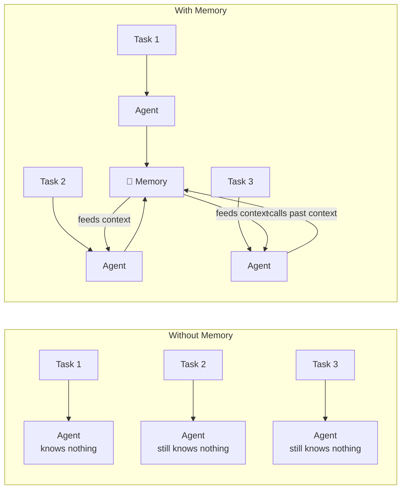

---

## How Many Components Does Memory Have?

CrewAI's memory system has **10 components** working together:

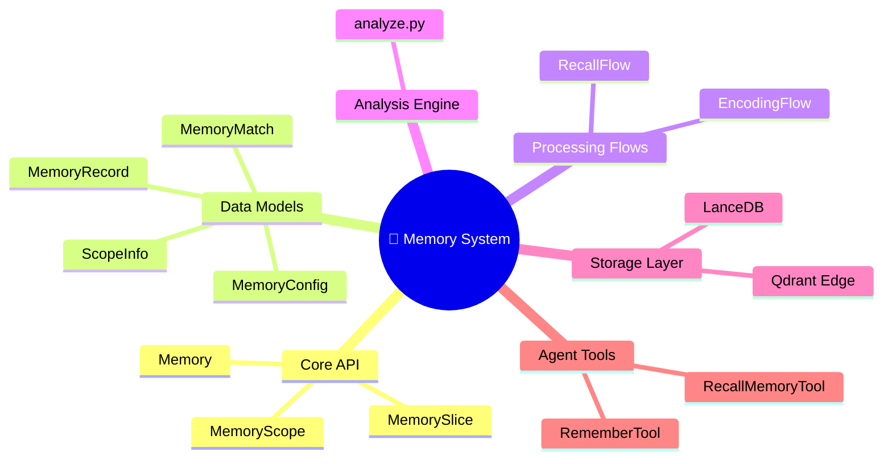

| # | Component | Role | Analogy |
|---|-----------|------|---------|
| 1 | **Memory** | The main brain — coordinates everything | The librarian |
| 2 | **MemoryScope** | A filtered view of memory | A section of the library |
| 3 | **MemorySlice** | A view across multiple scopes | Multi-section search |
| 4 | **MemoryRecord** | One piece of stored memory | A single index card |
| 5 | **MemoryMatch** | A search result with relevance score | A search result with ranking |
| 6 | **MemoryConfig** | All the settings and thresholds | The librarian's rulebook |
| 7 | **EncodingFlow** | The 5-step save pipeline | The filing process |
| 8 | **RecallFlow** | The intelligent search pipeline | The research process |
| 9 | **Analyze Engine** | LLM-powered categorization | The smart cataloguer |
| 10 | **Storage** (LanceDB/Qdrant) | Where data lives on disk | The filing cabinets |

---

## Component 1 — Memory (The Main Brain)

`Memory` is the central class. Every other component plugs into it. You interact with Memory through 4 core actions:

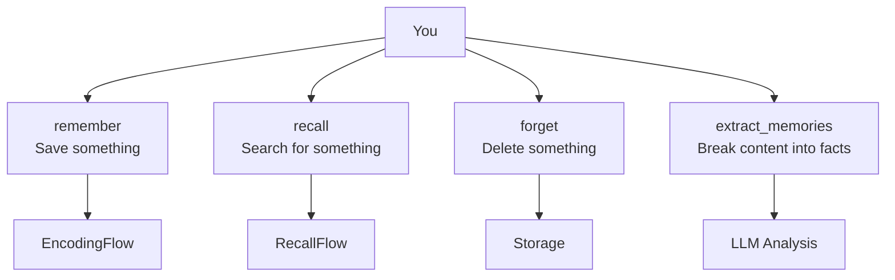

**Example — What you can do with Memory:**

> A support agent finishes a call. You tell Memory to **remember** "Customer John prefers phone calls over email."
>
> Two weeks later, a different agent is about to contact John. It asks Memory to **recall** "John's contact preferences." Memory returns the preference, and the agent calls instead of emailing.
>
> John changes his mind. You tell Memory to **forget** any preferences for John and save the new one.

---

## Component 2 — MemoryRecord (The Index Card)

Every single piece of memory is stored as a `MemoryRecord`. It's much more than just text — it contains rich metadata.

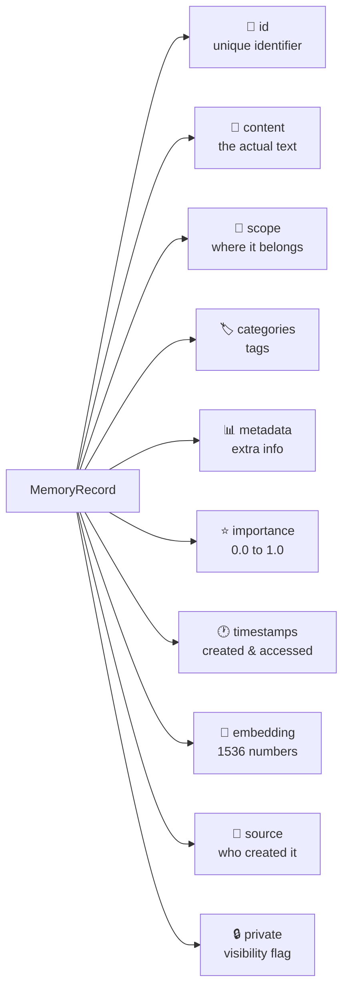

**Example — What a MemoryRecord looks like:**

> **Content:** "Sarah Chen is the CEO of TechCorp and prefers written reports over presentations"
>
> **Scope:** `/crew/client-team/agent/account-manager`
>
> **Categories:** `["client-info", "communication-preferences", "executive"]`
>
> **Importance:** `0.9` (high — contact info is critical)
>
> **Metadata:** entities=["Sarah Chen", "TechCorp"], topics=["communication"]
>
> **Private:** `false` (visible to the whole crew)

---

## Component 3 — MemoryMatch (The Search Result)

When you search memory, you don't get back raw records — you get `MemoryMatch` objects. Each match includes a relevance score and reasons why it matched.

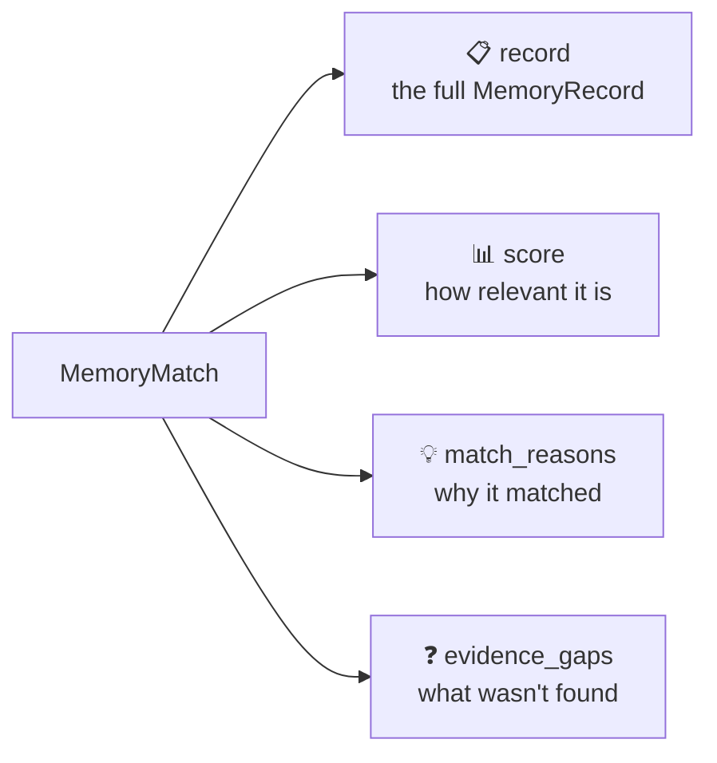

**Example:**

> You search for "What does the CEO of TechCorp prefer?"
>
> **Match #1:**
> - Content: "Sarah Chen prefers written reports"
> - Score: 0.87
> - Match reasons: "semantic: high similarity", "importance: 0.9"
>
> **Match #2:**
> - Content: "TechCorp has 3 offices"
> - Score: 0.52
> - Match reasons: "semantic: mentions TechCorp"
> - Evidence gaps: "CEO communication preference details"

---

## Component 4 — MemoryScope (The Library Section)

`MemoryScope` is a filtered window into memory. It restricts all operations to a specific path and below — agents can't accidentally read or write outside their scope.

```mermaid
graph TD
    Root[Full Memory\n/] --> C1[/crew/sales-team]
    Root --> C2[/crew/support-team]
    C1 --> A1[/crew/sales-team/agent/researcher]
    C1 --> A2[/crew/sales-team/agent/writer]
    C2 --> A3[/crew/support-team/agent/tier1]
    C2 --> A4[/crew/support-team/agent/tier2]

    style C1 fill:#4a9eff,color:#fff
    style A1 fill:#7bb8ff,color:#fff
    style A2 fill:#7bb8ff,color:#fff
```

**Example:**

> The Sales Team's researcher agent has a MemoryScope rooted at `/crew/sales-team/agent/researcher`.
>
> When it saves "Competitor X dropped prices by 15%", the record goes into `/crew/sales-team/agent/researcher/market-data` — NOT mixed in with the support team's memories.
>
> When it recalls, it only searches within its own scope. It cannot see the support team's customer data.

---

## Component 5 — MemorySlice (The Multi-Section Search)

`MemorySlice` is like searching multiple sections of the library at once. It searches across multiple scopes and combines the results.

```mermaid
graph LR
    MS[MemorySlice] -->|searches| S1[/crew/sales/findings]
    MS -->|searches| S2[/crew/research/findings]
    MS -->|searches| S3[/crew/marketing/findings]
    MS -->|merges & ranks| R[Combined Results]
```

**Example:**

> A summary agent needs to combine insights from three different teams: Sales, Research, and Marketing.
>
> It uses a MemorySlice that covers all three scopes. When it recalls "What do we know about customer preferences?", it searches all three scopes in parallel and returns the best combined results — ranked by relevance regardless of which team stored them.

---

## Component 6 — MemoryConfig (The Rulebook)

`MemoryConfig` holds all the tuning knobs for how memory behaves. You rarely touch this directly, but understanding it explains why memory behaves the way it does.

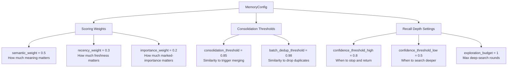

**Example — Why scoring weights matter:**

> You search for "client preferences from last month."
>
> - Record A: About client preferences — saved 2 months ago → semantic 0.95, but recency is low
> - Record B: Slightly less specific — saved yesterday → semantic 0.80, but very recent
>
> With weights (semantic=0.5, recency=0.3, importance=0.2):
> - Record A score: 0.95×0.5 + 0.30×0.3 + 0.5×0.2 = 0.475 + 0.09 + 0.10 = **0.665**
> - Record B score: 0.80×0.5 + 0.95×0.3 + 0.5×0.2 = 0.400 + 0.285 + 0.10 = **0.785**
>
> Record B wins because it's recent, even though it's slightly less semantically specific.

---

## Component 7 — EncodingFlow (The Filing Process)

When you save something to memory, it doesn't just get stored. It goes through a **5-step intelligent pipeline** called `EncodingFlow`.

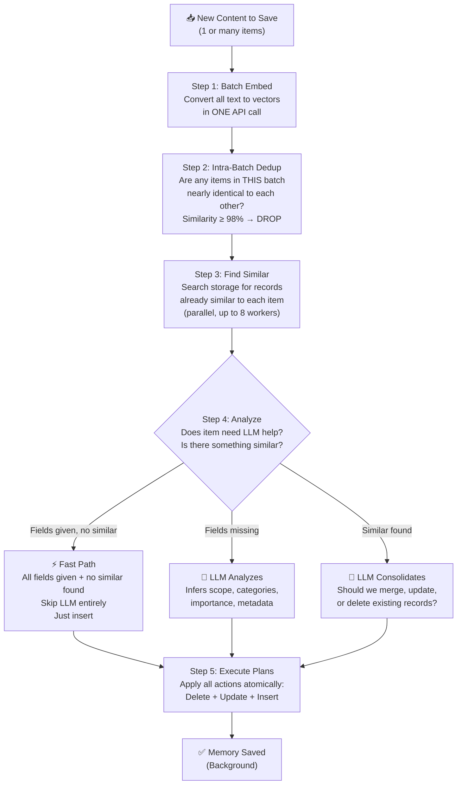

**Example walkthrough — Saving one memory:**

> You save: *"The client CEO Sarah Chen prefers quarterly written reports."*

**Step 1 — Convert to Vector:**
> The sentence is transformed into 1,536 numbers that capture its meaning. These numbers allow comparing it to other sentences by meaning, not words.

**Step 2 — Dedup Check:**
> Only 1 item in this save call, so nothing to compare within the batch. Move on.

**Step 3 — Search for Similar:**
> The system searches storage and finds an existing record: *"Sarah Chen, CEO of TechCorp, likes reports over presentations."*
> Similarity score: **0.91** — above the consolidation threshold of 0.85.

**Step 4 — LLM Consolidation:**
> Since something similar was found, the LLM is asked: "Should we merge these two records?"
> LLM responds: Update the existing record to combine both facts into *"Sarah Chen (CEO, TechCorp) prefers quarterly written reports over presentations."*

**Step 5 — Execute:**
> The old record is deleted. The new merged record is stored. Done.

---

## Component 8 — RecallFlow (The Research Process)

Recall is not a simple search. It has two modes and an intelligent multi-step process for complex queries.

### Two Recall Modes

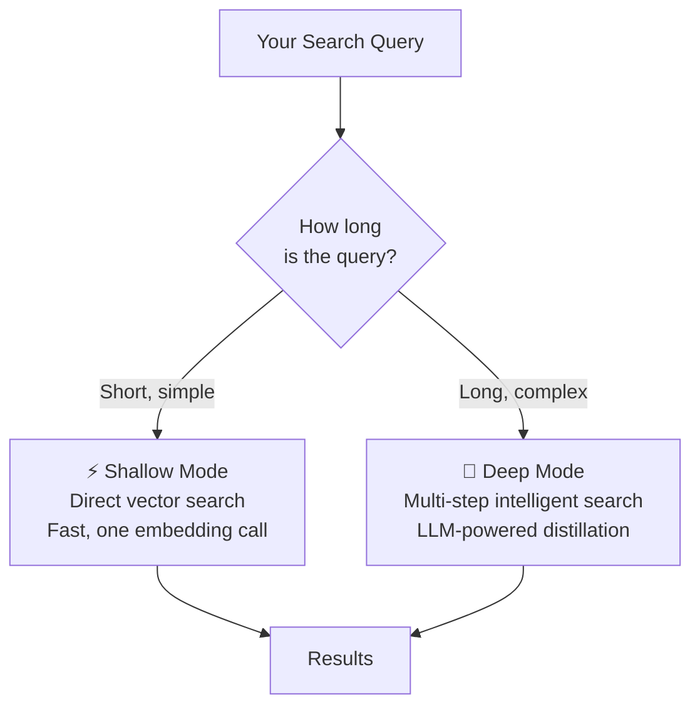

### Deep Recall — Step by Step

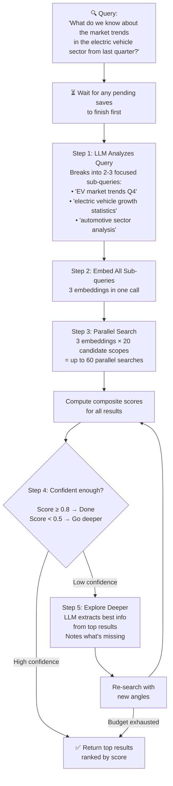

**Example:**

> **Query:** "What are our competitive advantages over Vendor X?"
>
> **Sub-queries generated by LLM:**
> - "our strengths compared to competitors"
> - "Vendor X weaknesses"
> - "product differentiation advantages"
>
> **Parallel search:** All three sub-queries searched across `/crew/research`, `/crew/sales`, `/crew/strategy` simultaneously.
>
> **Results found:** 12 records across 3 scopes. Confidence: 0.72 (medium).
>
> **Deep exploration:** LLM reads the top 5 results and asks: "What's still missing?" → Identifies: "pricing comparison not found."
>
> **Return:** Top 10 results ranked by composite score, with evidence gap: "pricing comparison data not in memory."

---

## Component 9 — Analyze Engine (The Smart Cataloguer)

The Analyze Engine uses an LLM to make intelligent decisions during both save and recall. It's called internally by EncodingFlow and RecallFlow.

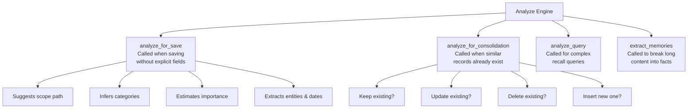

**Example — analyze_for_save:**

> You save raw text: *"Met with John Smith from Acme Corp today. He's the VP of Engineering. Wants a demo by March 15th. Mentioned their current tool is slow and expensive."*
>
> The Analyze Engine extracts:
> - **Scope:** `/crew/sales-team/leads/acme-corp`
> - **Categories:** `["lead", "contact-info", "pain-points", "timeline"]`
> - **Importance:** `0.85`
> - **Metadata:** entities=["John Smith", "Acme Corp"], dates=["March 15th"], topics=["demo", "pricing", "performance"]

**Example — extract_memories:**

> Same raw text gets split into discrete memory statements:
> 1. "John Smith is VP of Engineering at Acme Corp"
> 2. "Acme Corp wants a product demo by March 15th"
> 3. "Acme Corp's current tool is too slow and expensive"
>
> These 3 clean statements are each saved as separate MemoryRecords — easier to search later.

---

## Component 10 — Storage Layer (The Filing Cabinets)

All memory eventually lands in one of two storage backends. Both use **vector embeddings** for semantic search.

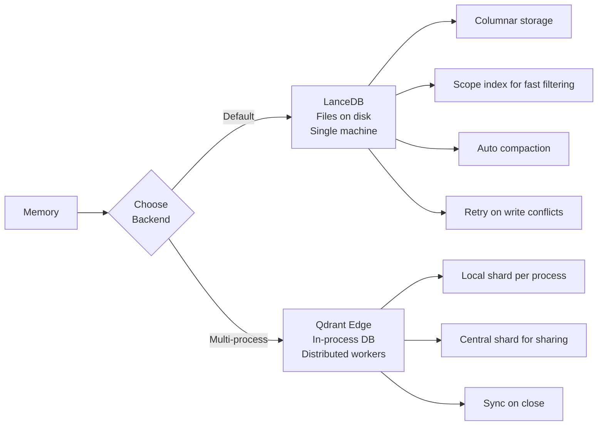

### LanceDB (Default)

Think of LanceDB as a local database that lives in a folder on your computer. Fast, simple, no server needed.

**Example:**
> You run a CrewAI pipeline on your laptop. All memories are saved to `~/.local/share/crewai/memory/`. The file grows as agents learn. Next time you run the same crew, it picks up where it left off.

### Qdrant Edge (Multi-Process)

When you run many worker processes in parallel (like in a production system), each worker needs its own local shard. Qdrant Edge handles this safely.

**Example:**
> You run 4 parallel crew instances to process 4 customer cases at once. Each instance writes to its own local shard. When each finishes, its memories sync to the central shard, so future queries see all combined memories.

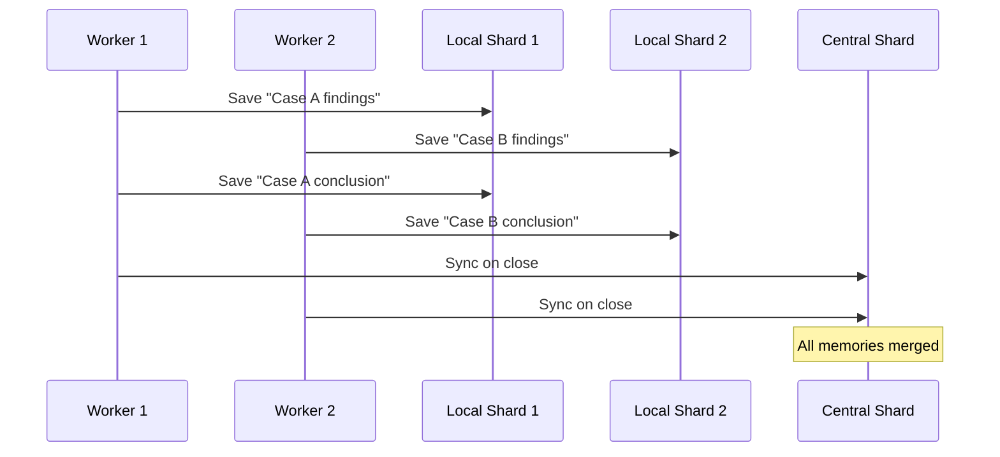

---

## The Composite Scoring System

When memory returns results, every result is scored by combining 3 factors:

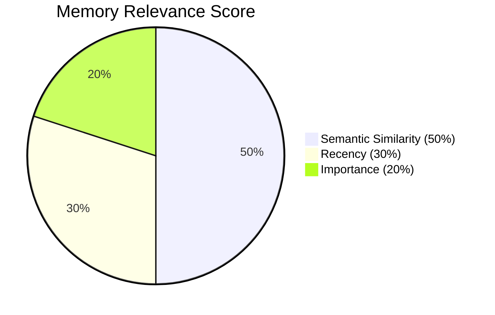

### Factor 1: Semantic Similarity (50%)

How closely does the meaning of the memory match the query? This uses vector math — not keyword matching.

**Example:**
> Query: "customer complaints about billing"
>
> Record A: "Client was upset about invoice errors" → Score: 0.88 (semantically very close, even though words differ)
>
> Record B: "Customer submitted billing complaint on Tuesday" → Score: 0.92 (even closer)

### Factor 2: Recency (30%)

Newer memories are more valuable. Memory uses **exponential decay** — importance halves every 30 days.

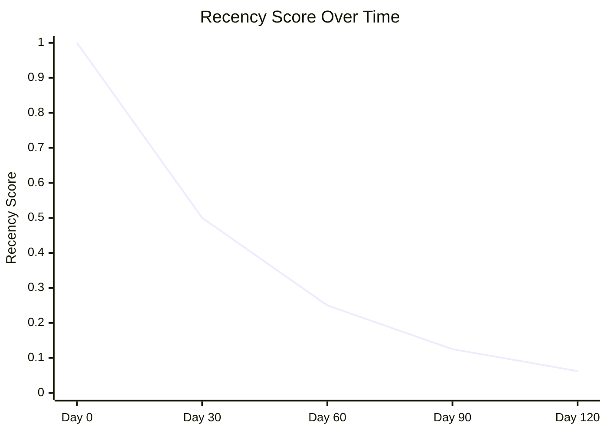

**Example:**
> Memory A: "Client prefers email" — saved **yesterday** → Recency score: ~1.0
>
> Memory B: "Client prefers email" — saved **2 months ago** → Recency score: ~0.25
>
> Memory A is ranked much higher, even if semantically identical.

### Factor 3: Importance (20%)

Records marked as important get a boost. Importance is set explicitly by the caller, or inferred by the LLM when saving.

**Example:**
> "Meeting scheduled for tomorrow" — Importance: 0.3 (low — temporary info)
>
> "CEO is Sarah Chen, +1 415-555-0100" — Importance: 0.95 (high — key contact info)

---

## Hierarchical Scoping — The Folder System

Memory is organized like a file system. Scopes are folders. This keeps memories isolated between teams, agents, and projects.

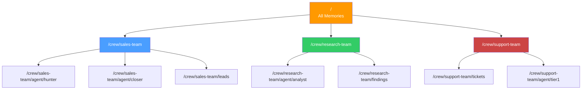

**Example — Why scoping matters:**

> The Sales Team stores: "TechCorp is interested in Plan B."
>
> The Support Team stores: "TechCorp ticket #442 is still open."
>
> When the Support agent recalls "What do we know about TechCorp?", it only searches `/crew/support-team/**` — it doesn't accidentally get confused by the Sales team's pricing notes.
>
> But if you create a MemorySlice across `/crew/sales-team` + `/crew/support-team`, a manager agent can see everything about TechCorp from all teams.

---

## Memory Tools — How Agents Use Memory

Agents interact with memory through two built-in tools. These are automatically given to agents when memory is enabled.

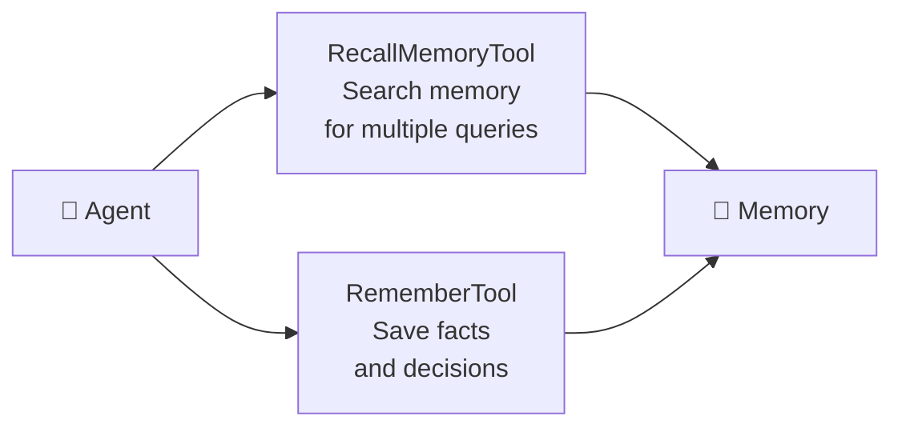

### RecallMemoryTool

Lets an agent search memory. The agent can send multiple search queries at once.

**Example:**
> Agent says to itself: "Before I answer the customer, let me check what I know about them."
>
> It calls RecallMemoryTool with:
> - "Customer billing history"
> - "Customer support tickets"
> - "Customer subscription plan"
>
> All three queries run, results are merged and deduplicated, and the top 20 most relevant memories are returned.

### RememberTool

Lets an agent save important facts it discovers.

**Example:**
> Agent just found out: "The customer upgraded to Premium in January."
>
> It calls RememberTool with this fact. Memory saves it, runs it through EncodingFlow, and it's available for future recall.

---

## Background Save — Non-Blocking Design

Saving to memory is done in the **background** so it doesn't slow down the agent.

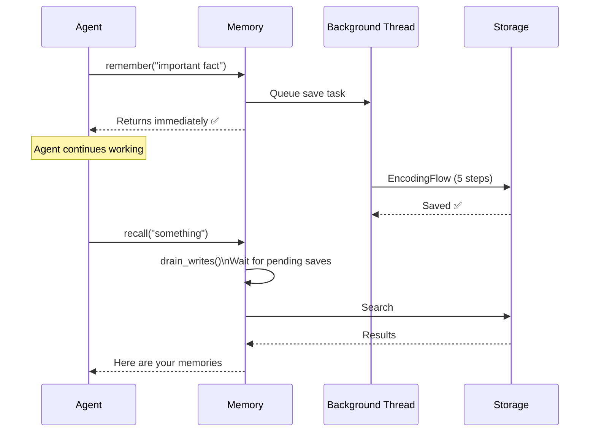

**Example:**
> An agent processes 50 tasks in a row, saving memories after each. Without background saves, each task would pause while the 5-step EncodingFlow runs.
>
> With background saves, the agent keeps working immediately. The saves run in parallel on a background thread.
>
> The only time the agent waits is when it tries to **recall** — at that point, Memory ensures all pending saves are done first, so the search is always up to date.

---

## Full Example: A Complete Memory Journey

Let's trace a complete scenario from start to finish.

### The Setup

> A research crew is writing a report on renewable energy. It has 3 agents: Researcher, Analyst, Writer.

```mermaid
graph LR
    subgraph Day 1 — Research Phase
        R[Researcher Agent] -->|finds facts| M[🧠 Memory]
        M -->|crew scope| SC1[/crew/energy-report/agent/researcher]
    end

    subgraph Day 2 — Analysis Phase
        A[Analyst Agent] -->|recalls Researcher's findings| M
        A -->|saves conclusions| SC2[/crew/energy-report/agent/analyst]
    end

    subgraph Day 3 — Writing Phase
        W[Writer Agent] -->|recalls all findings + conclusions| M
        M -->|MemorySlice across both scopes| W
    end
```

### Day 1 — Researcher Saves Findings

> **Researcher saves:**
> - "Solar panel costs dropped 89% since 2010"
> - "Wind energy accounts for 10% of US electricity"
> - "Battery storage capacity doubled in 2023"
>
> **EncodingFlow runs:**
> - All 3 facts embedded in one API call
> - No duplicates found in storage
> - LLM assigns: scope = `/crew/energy-report/agent/researcher/statistics`, categories = `["energy", "statistics", "renewable"]`, importance = 0.8
> - All 3 records saved to LanceDB

### Day 2 — Analyst Recalls and Analyzes

> **Analyst asks Memory:** "What statistics did the researcher find about energy trends?"
>
> **RecallFlow runs (deep mode):**
> - LLM breaks query into: "solar costs", "wind energy statistics", "battery storage"
> - 3 sub-queries searched in parallel
> - All 3 Day 1 records found. Confidence: 0.91 → high enough to return immediately
>
> **Analyst saves conclusion:**
> - "Renewable energy has become cost-competitive with fossil fuels due to dramatic cost reductions"
>
> **EncodingFlow checks for similar:**
> - Similarity to "Solar costs dropped 89%" = 0.72 (below consolidation threshold of 0.85)
> - Saved as new record in `/crew/energy-report/agent/analyst/conclusions`

### Day 3 — Writer Gets Everything

> **Writer uses MemorySlice** across both researcher and analyst scopes.
>
> **Writer asks Memory:** "Summarize all key findings for the final report"
>
> **RecallFlow searches both scopes simultaneously:**
> - Returns all 4 records (3 statistics + 1 conclusion), ranked by score
>
> **Writer uses these memories to write the final report** without needing to re-run any research.

---

## Consolidation — Keeping Memory Clean

Over time, agents learn the same thing multiple ways. Consolidation prevents memory from filling up with duplicates.

```mermaid
flowchart LR
    E1[Existing:\n'Client John likes email'] --> Compare{Similarity\nCheck}
    New[New:\n'John Smith prefers\nemail communication'] --> Compare
    Compare -->|Similarity = 0.91\nAbove threshold 0.85| LLM[LLM Decision]
    LLM -->|"These say the same thing.\nUpdate to be more specific."| Result[Updated Record:\n'John Smith prefers\nemail over phone calls']

    E2[Existing:\n'Paris is in France'] --> Compare2{Similarity\nCheck}
    New2[New:\n'Company founded in 2019'] --> Compare2
    Compare2 -->|Similarity = 0.12\nBelow threshold| Save[Save as\nnew separate record]
```

**Example scenarios:**

| Existing Memory | New Memory | Similarity | Result |
|----------------|------------|------------|--------|
| "Client prefers email" | "Client wants email updates" | 0.94 | Merge into one clean record |
| "Meeting on Monday" | "Monday standup at 9am" | 0.88 | Update existing with more detail |
| "Budget is $100k" | "New logo is ready" | 0.08 | Save as separate new record |
| "CEO name is Sarah" | "Sarah is the CEO" | 0.99 | Drop duplicate (same thing) |

---

## Privacy — Protecting Sensitive Information

Memory supports private records visible only to the source that created them.

```mermaid
graph LR
    A1[Agent 1\nsource=agent-1] -->|saves private=true| M[Memory]
    A2[Agent 2\nsource=agent-2] -->|recalls| M
    M -->|private records\nfiltered out| A2
    A1 -->|recalls own private records| M
    M -->|can see own private records| A1
```

**Example:**

> Agent 1 is drafting a response. It saves a private note: "Draft idea — not ready to share yet."
>
> Agent 2 searches memory for ideas. The draft is invisible because it's private and Agent 2 has a different source ID.
>
> Agent 1 searches its own memory and can see the draft.
>
> Once Agent 1 is ready to share, it updates the record with `private=false`. Now everyone can see it.

---

## Quick Reference — All Memory Operations

```mermaid
graph TD
    You --> R["remember(content)\nSave one fact"]
    You --> RM["remember_many(contents)\nSave many facts\nbackground, fast"]
    You --> RC["recall(query)\nFind relevant memories"]
    You --> F["forget(scope/id)\nDelete memories"]
    You --> E["extract_memories(text)\nBreak text into facts"]
    You --> U["update(id, content)\nEdit an existing memory"]
    You --> SC["scope(path)\nGet a MemoryScope view"]
    You --> SL["slice(paths)\nGet a MemorySlice view"]
    You --> LS["list_scopes(path)\nSee scope tree"]
    You --> I["info(path)\nScope statistics"]
    You --> T["tree(path)\nPrint scope tree"]
    You --> RS["reset(scope)\nDelete everything in scope"]
```

---

## Summary — How Everything Connects

```mermaid
flowchart TD
    U[👤 You or an Agent] -->|call remember| M[🧠 Memory API]
    U -->|call recall| M

    M -->|remember path| EF[EncodingFlow\n5-step save pipeline]
    M -->|recall path| RF[RecallFlow\nIntelligent search]

    EF -->|Step 4: needs analysis| AE[Analyze Engine\nLLM-powered]
    RF -->|Step 1: complex query| AE

    EF -->|Step 5: write| SB[Storage Backend]
    RF -->|Step 3: search| SB

    SB --> LDB[LanceDB\nDefault, local files]
    SB --> QE[Qdrant Edge\nMulti-process]

    M -->|filtered view| MS[MemoryScope]
    M -->|multi-scope view| ML[MemorySlice]

    AE -->|Save analysis| MA[MemoryAnalysis\nscope, categories,\nimportance]
    AE -->|Consolidation| CP[ConsolidationPlan\nkeep, update, delete]
    AE -->|Recall analysis| QA[QueryAnalysis\nsub-queries, complexity]

    Results[MemoryMatch\nrecord + score\n+ match reasons] -->|returned to| U
    SB -->|produces| Results
```

| You want to... | Component that handles it |
|---------------|--------------------------|
| Save a memory | `Memory.remember()` → `EncodingFlow` → `Storage` |
| Find a memory | `Memory.recall()` → `RecallFlow` → `Storage` |
| Auto-categorize | `Analyze Engine` (called automatically) |
| Merge duplicates | `EncodingFlow Step 4-5` + `Analyze Engine` |
| Isolate agent memory | `MemoryScope` |
| Search across teams | `MemorySlice` |
| Persist to disk | `LanceDB` or `Qdrant Edge` |
| Protect sensitive data | `MemoryRecord.private = true` |
| Rank search results | `MemoryConfig` weights (semantic + recency + importance) |
