# CrewAI Deep Dive

---

## Part 1 — Overall Components in CrewAI

CrewAI is a framework for building teams of AI agents that collaborate on complex tasks. Think of it like a company: you have a team of specialists, each with a role, working together toward a shared goal.

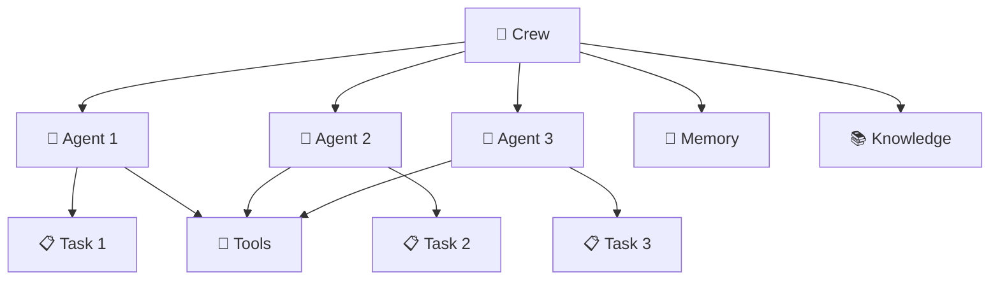

### The 6 Main Building Blocks

---

### 1. Agent — The Worker

An Agent is an autonomous AI worker with a specific role, goal, and personality. It uses tools, remembers things, and completes tasks.

**Example:**
> Imagine you are building a research assistant team. You create an Agent with the role "Senior Researcher", whose goal is to "find accurate information about any topic". This agent knows how to search the web and summarize findings.

---

### 2. Task — The Work Item

A Task is a specific unit of work assigned to an agent. It has a description (what to do) and an expected output (what to return).

**Example:**
> A Task might say: "Research the latest trends in electric vehicles and write a 3-paragraph summary." It gets assigned to the Researcher agent, which then completes it and returns the summary.

---

### 3. Crew — The Team

A Crew is the container that holds multiple agents and tasks together. It orchestrates who does what and in what order.

**Example:**
> A content writing crew might have 3 agents: Researcher → Writer → Editor. The Crew runs them in sequence — the Researcher gathers facts, the Writer drafts the article, the Editor polishes it.

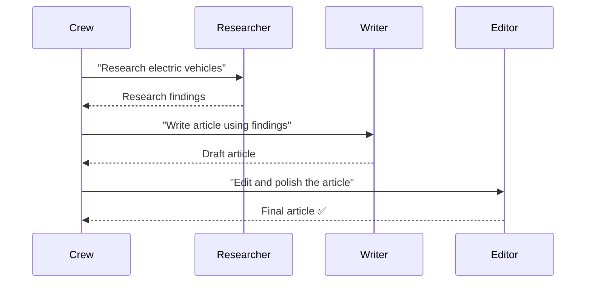

---

### 4. Tools — The Capabilities

Tools are things agents can use to get things done — like searching the web, reading files, or calling APIs. Every agent can be given a set of tools.

**Example:**
> A Researcher agent might have a WebSearchTool so it can look things up online, and a FileReadTool so it can read documents. Without tools, agents can only use their built-in knowledge.

---

### 5. Flow — The Smart Pipeline

Flow is an advanced workflow system for when you need precise control over how steps connect. Instead of a simple one-after-another sequence, Flows let you branch, route, and react to events.

**Example:**
> A customer support flow might check if the user's question is about billing or technical issues. If billing → route to the billing agent. If technical → route to the tech support agent. The flow decides the path based on content.

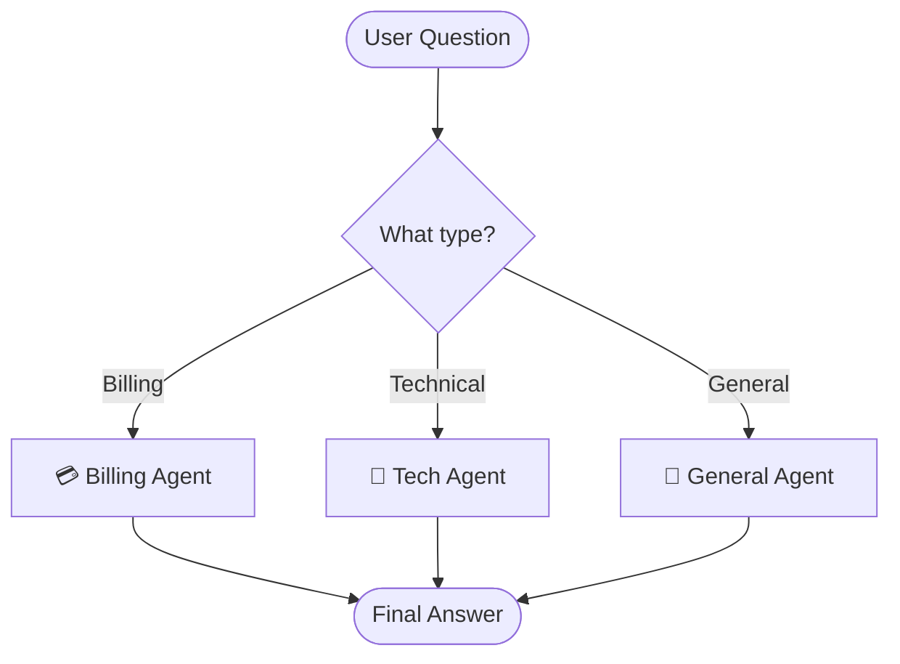

---

### 6. Knowledge — The Reference Library

Knowledge is a static reference that agents can consult — like a company handbook, a product manual, or a FAQ document. Unlike memory (which changes), knowledge stays fixed.

**Example:**
> You load your company's return policy into the Knowledge system. Any agent in your crew can now look up the policy when answering customer questions, without needing to re-read the document every time.

---

## Part 2 — Focus: Memory Components

Memory is what allows agents to remember things across tasks. Without memory, every task starts fresh — the agent has no idea what happened before.

CrewAI has a **unified memory system** — one smart memory that handles everything.

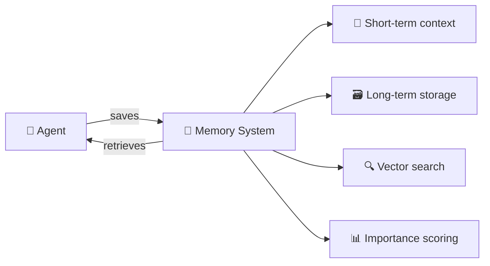

### The 4 Key Memory Concepts

---

### 1. Memory Records — What Gets Stored

Every memory is a record with more than just text. It includes:

- **Content** — what was remembered (e.g., "User prefers formal tone")
- **Scope** — where it belongs (e.g., `/crew/writing-team/agent/editor`)
- **Categories** — tags to organize it (e.g., `["preferences", "style"]`)
- **Importance** — how significant it is (0.0 to 1.0)
- **Timestamp** — when it was created

**Example:**
> After finishing a task, an agent saves: "The client wants the report in bullet points, not paragraphs." This gets stored with high importance (0.8) and tagged with `["client-preferences", "formatting"]`.

---

### 2. Scopes — Where Memories Live

Memory is organized in a hierarchy of scopes, like folders in a file system. This keeps memories from different agents and crews from mixing together.

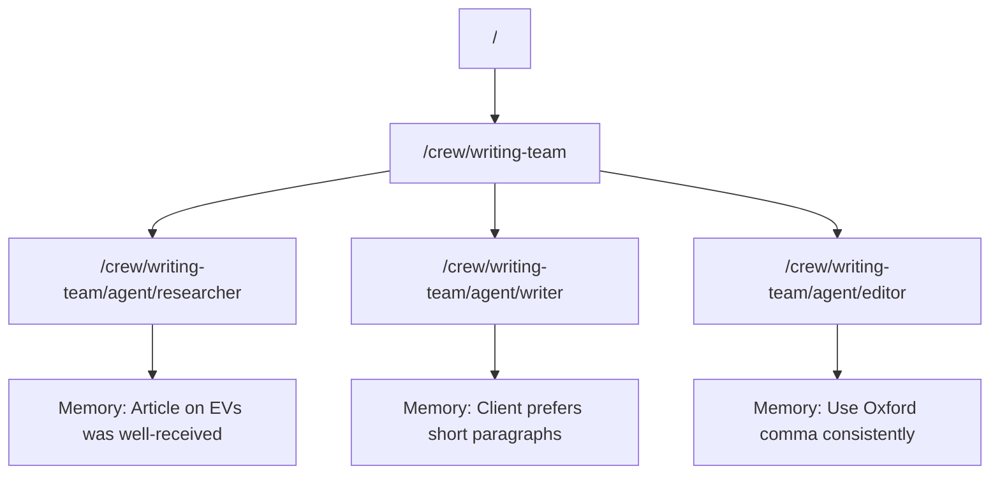

**Example:**
> The Researcher agent's memories about research findings are stored under its own scope. The Writer agent cannot accidentally mix its memories with the Researcher's memories.

---

### 3. Storage Backends — Where Data Lives on Disk

Memory needs to be saved somewhere. CrewAI supports two storage options:

| Backend | Best For | How It Works |
|---------|----------|--------------|
| **LanceDB** (default) | Single machine, local apps | Files on disk with vector search |
| **Qdrant Edge** | Multi-process, distributed | In-process vector DB, syncs across workers |

Both backends store **vector embeddings** — mathematical representations of text that allow searching by meaning, not just keywords.

---

### 4. Memory Tools — How Agents Use Memory

Agents get two tools automatically when memory is enabled:

- **RememberTool** — saves something to memory
- **RecallMemoryTool** — searches memory for relevant information

**Example:**
> An agent is working on day 5 of a long project. It uses RecallMemoryTool to ask "What did the client say about formatting last week?" and gets back the relevant memory record automatically.

---

## Part 3 — Deep Dive: How Memory Works

Now let's look under the hood. When an agent saves or retrieves a memory, a sophisticated multi-step process runs behind the scenes.

---

### Saving a Memory (The Remember Path)

When something gets saved to memory, it goes through 5 steps:

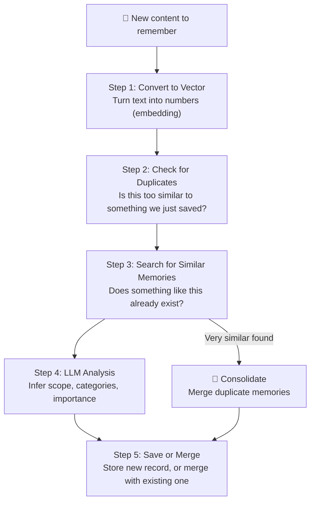

#### Step-by-Step Example

> **Situation:** An agent just completed a task and wants to save: "The client CEO's name is Sarah Chen and she prefers email updates on Fridays."

1. **Convert to Vector** — The text is turned into 1536 numbers that capture its meaning mathematically.

2. **Check for Duplicates** — If you're saving many things at once, near-identical items (similarity > 98%) are dropped before even reaching storage.

3. **Search for Similar Memories** — The system searches existing memories. It finds an old record: "Client contact is S. Chen, updates preferred weekly."

4. **LLM Analysis** — The AI figures out:
   - Scope: `/crew/client-project/agent/account-manager`
   - Categories: `["client-info", "communication-preferences"]`
   - Importance: `0.9` (high — this is contact info)

5. **Save or Merge** — Since a similar record exists (similarity > 85%), the two records are **consolidated** into one updated record: "Client CEO Sarah Chen prefers email updates every Friday."

---

### Retrieving a Memory (The Recall Path)

Recall is smarter than a simple keyword search. It uses meaning-based search and can go deeper if needed.

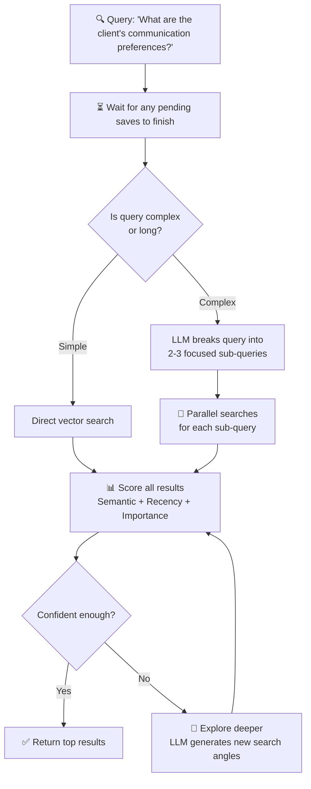

#### How Results Are Scored

Every memory match gets a **composite score** from three factors:

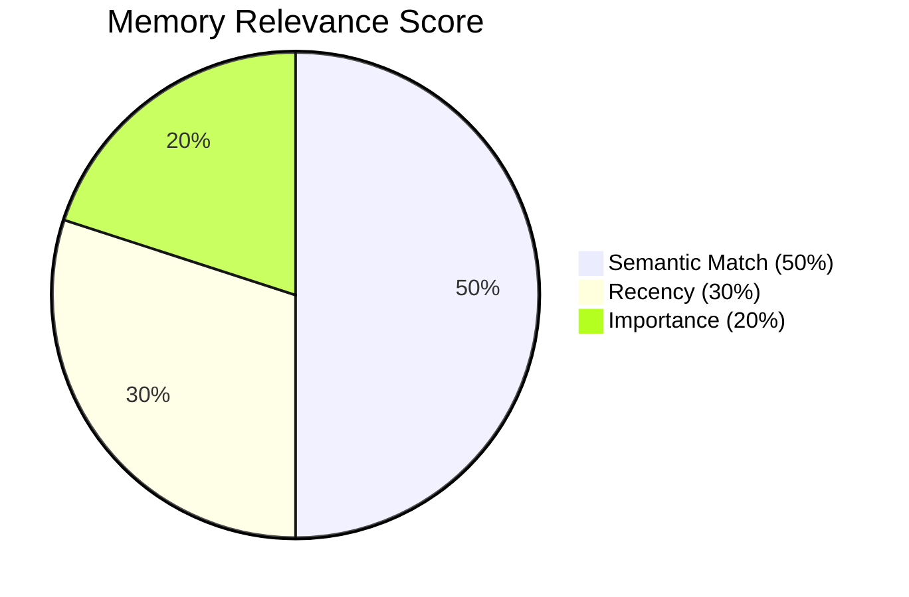

- **Semantic Match (50%)** — How similar is the meaning to the query?
- **Recency (30%)** — How recent is the memory? Older memories fade (halve every 30 days)
- **Importance (20%)** — Was this marked as important when saved?

**Example:**
> Two memories both match the query "client communication preferences":
> - Memory A: "Client prefers email" — saved 2 months ago, importance 0.5
> - Memory B: "Client prefers Friday email updates" — saved 3 days ago, importance 0.9
>
> Memory B scores higher because it's more recent AND more important, even if Memory A had a slightly better semantic match.

---

### The Full Picture: Memory in a Crew Run

Here's how memory flows during a complete crew execution:

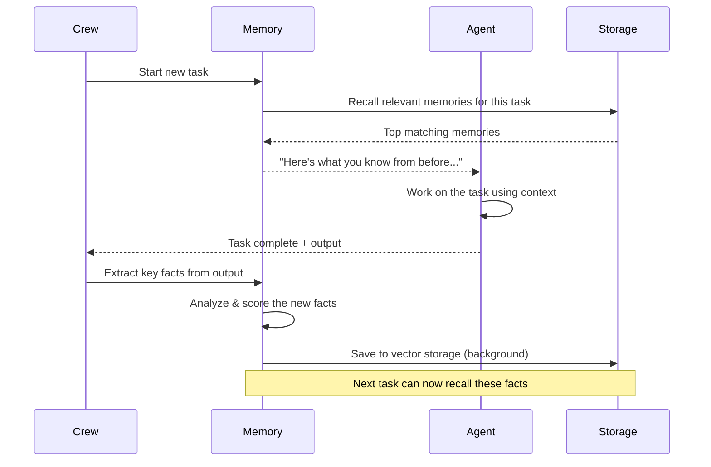

**Example walkthrough:**

> **Day 1:** Agent researches a topic. Key finding "Market grew 40% in 2024" is saved to memory.
>
> **Day 3:** A different agent is writing a report. Before starting, memory is recalled. The system finds the "40% growth" fact and injects it into the agent's context.
>
> **Day 3 (continued):** The writing agent uses the fact in the report without needing to re-research it.

---

### Automatic Consolidation — Keeping Memory Clean

Over time, memory can accumulate near-duplicate records. CrewAI automatically consolidates these.

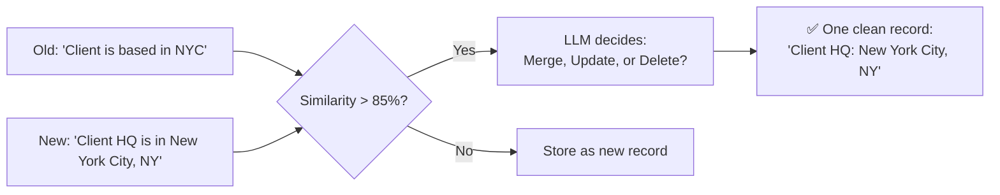

This keeps memory lean and avoids confusion from contradictory or redundant records.

---

### Privacy and Isolation

Memory supports privacy at the record level. Private memories are only visible to the agent or scope that created them — other agents cannot accidentally read them.

**Example:**
> An agent saves a draft response that it's still working on as a private memory. Other agents querying the same memory system won't see this draft until the agent marks it public.

---

## Summary

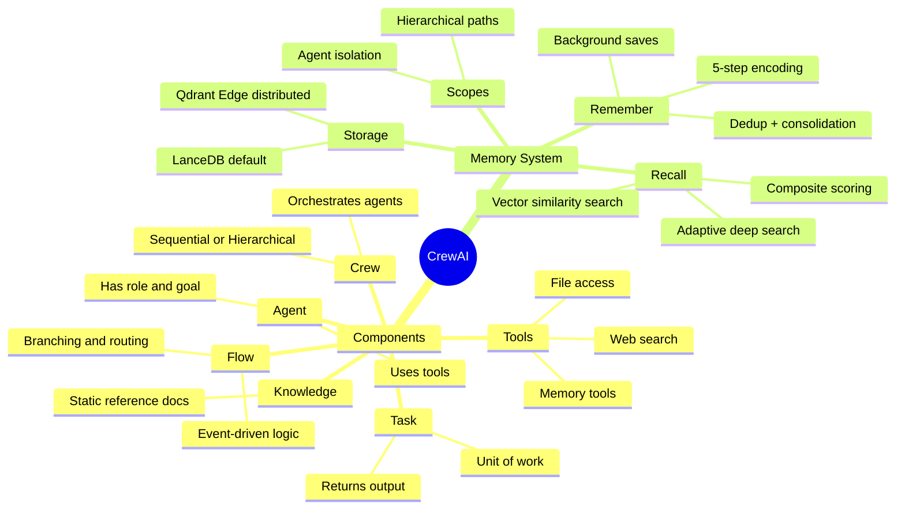

| Concept | Simple Analogy |
|---------|----------------|
| Agent | A specialist employee |
| Task | A work assignment |
| Crew | The whole team |
| Flow | A decision flowchart |
| Tools | The apps on your phone |
| Knowledge | The company handbook |
| Memory | An employee's personal notes |
| Scope | A filing cabinet drawer |
| Consolidation | Merging duplicate sticky notes |
| Recall depth | Glancing at notes vs. deep research |
