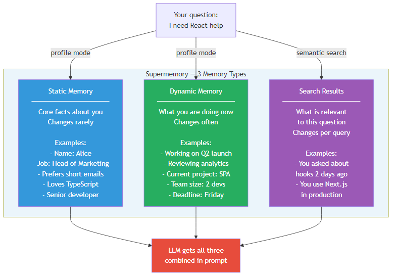
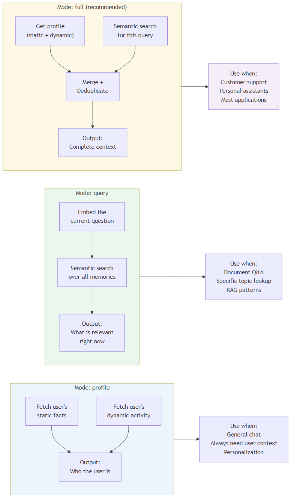
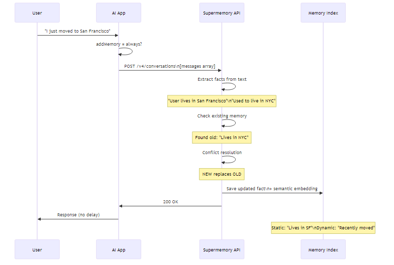
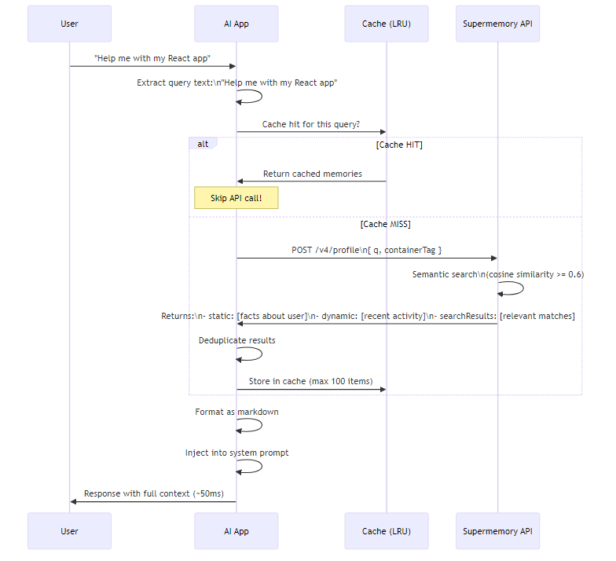
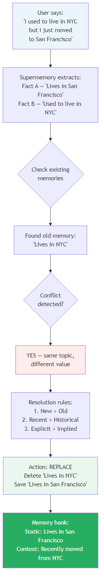
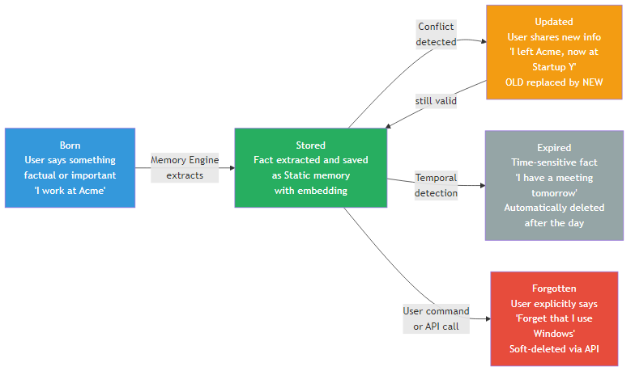
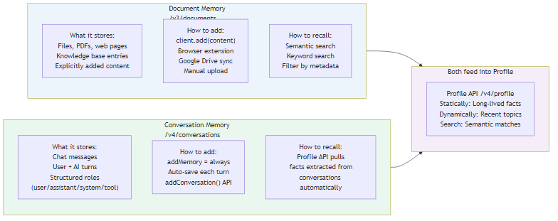
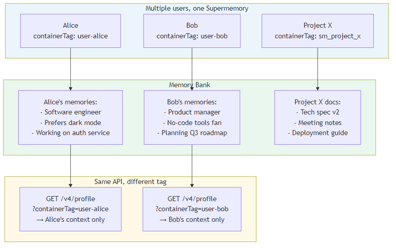
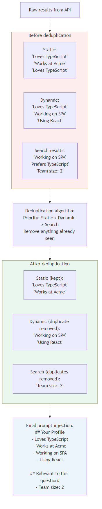
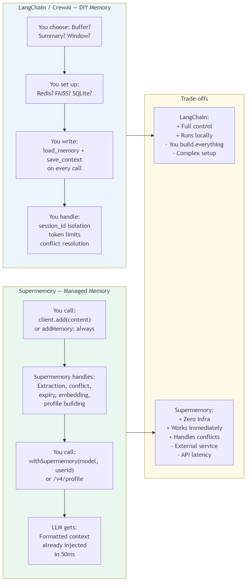

# Supermemory — Deep Dive into Memory Types
### How memory is designed, what types exist, and how they work together

> **Simple language, plain examples.** No deep tech required for most sections.
> Developer code examples are clearly marked.

---

## Contents

1. [The Big Picture](#1-the-big-picture)
2. [The 3 Memory Types](#2-the-3-memory-types)
3. [Static Memory — Who You Are](#3-static-memory--who-you-are)
4. [Dynamic Memory — What You Are Doing](#4-dynamic-memory--what-you-are-doing)
5. [Search Results — What Is Relevant Right Now](#5-search-results--what-is-relevant-right-now)
6. [How Memory Types Work Together](#6-how-memory-types-work-together)
7. [The 3 Retrieval Modes](#7-the-3-retrieval-modes)
8. [How Memory Gets Saved](#8-how-memory-gets-saved)
9. [How Memory Gets Recalled](#9-how-memory-gets-recalled)
10. [Conflict Resolution — When Facts Change](#10-conflict-resolution--when-facts-change)
11. [The Memory Lifecycle — Born, Updated, Expired, Forgotten](#11-the-memory-lifecycle--born-updated-expired-forgotten)
12. [Document Memory vs Conversation Memory](#12-document-memory-vs-conversation-memory)
13. [Container Tags — Keeping Users Separate](#13-container-tags--keeping-users-separate)
14. [Deduplication — No Repeated Facts](#14-deduplication--no-repeated-facts)
15. [The Full Pipeline End to End](#15-the-full-pipeline-end-to-end)
16. [Supermemory vs LangChain — Different Approaches](#16-supermemory-vs-langchain--different-approaches)
17. [Quick Reference](#17-quick-reference)

---

## 1. The Big Picture

Think of Supermemory like a **very smart notebook** that lives between you and your AI assistant.

Every time you say something, it writes down the important parts. Every time you ask a question, it finds the relevant notes and quietly hands them to the AI before it answers.

The AI gets smarter with every conversation — without you doing anything extra.

```
Without Supermemory:
  Monday  → "I'm a software engineer at Acme"
  Tuesday → "I'm working on a React app"
  Wednesday → "What was I working on?"
            → AI: "I don't know. Tell me about yourself."

With Supermemory:
  Monday  → "I'm a software engineer at Acme"  [saved]
  Tuesday → "I'm working on a React app"        [saved]
  Wednesday → "What was I working on?"
            → AI: "You're building a React app at Acme. Want help with that?"
```


---

## 2. The 3 Memory Types

Supermemory stores everything in **3 types of memory**. Each type answers a different question.



| Memory Type | Question it answers | Changes how often |
|-------------|--------------------|--------------------|
| **Static** | Who are you? | Rarely — only when big life facts change |
| **Dynamic** | What are you doing right now? | Often — updates as your activity changes |
| **Search Results** | What is relevant to this specific question? | Every query — different each time |

**Simple analogy:**
- Static = your resume (name, job, skills — stable)
- Dynamic = your calendar (current project, this week's tasks — changes)
- Search Results = a smart search of your entire history (changes per question)

---

## 3. Static Memory — Who You Are

Static memory holds **facts about you that do not change often**.

Think of it as your identity card inside the AI's mind.


### What goes into Static

- **Identity**: Name, job title, company, location
- **Preferences**: "Prefers short emails", "loves TypeScript", "no jargon"
- **Skills**: "Senior developer", "5 years of React experience"
- **Long-term goals**: "Building a startup", "learning machine learning"

### Real example

```
User says: "I'm Sarah, head of marketing at Acme. I hate bullet points in emails."

Supermemory saves:
  Static: "Name: Sarah"
  Static: "Role: Head of Marketing at Acme"
  Static: "Preference: Does not like bullet points in emails"
```

Next time Sarah chats — even weeks later — the AI already knows all of this.

### When does Static change?

Only when Sarah explicitly shares new information:
```
"I got a promotion — I'm now VP of Marketing."
→ Old: "Head of Marketing"  →  New: "VP of Marketing"
```

---

## 4. Dynamic Memory — What You Are Doing

Dynamic memory holds **recent and current activity**. It reflects what you are focused on right now.

### What goes into Dynamic

- **Active projects**: "Working on the Q2 product launch"
- **Recent topics**: "Has been asking about React performance this week"
- **Short-term context**: "Reviewing the analytics dashboard"
- **Near-term plans**: "Presenting to investors on Friday"

### Real example

```
Tuesday:  "I'm reviewing the Q2 campaign analytics"
           → Dynamic: "Reviewing Q2 campaign analytics"

Thursday: "I finished the analytics, now I'm writing the Q3 plan"
           → Dynamic updated: "Writing Q3 marketing plan"
           → Old Q2 analytics entry fades out
```

### The key difference from Static

| Static | Dynamic |
|--------|---------|
| "Sarah is Head of Marketing" — still true next year | "Sarah is working on Q2 launch" — may not be true next week |
| Needs an explicit update to change | Fades out naturally as new activity takes over |
| Fetched in every conversation | Most useful when it matches the current topic |

---

## 5. Search Results — What Is Relevant Right Now

Search Results are **not stored separately** — they are retrieved fresh for each question.

When you ask something, Supermemory searches all your past memories and documents to find the ones most related to your current question.

### How it works

```
Your question: "Help me write a follow-up email to John about the React project"

Supermemory searches:
  ✓ "John is Alice's manager — likes concise updates" (relevance: 0.92)
  ✓ "React project deadline is end of month" (relevance: 0.87)
  ✓ "Alice prefers email over Slack" (relevance: 0.73)
  ✗ "Alice lives in New York" (relevance: 0.21 — below threshold 0.6, dropped)
```

The threshold is **0.6 (60% similarity minimum)** — only relevant results make it through.

### What "semantic similarity" means (plain English)

The system does not search for matching words. It searches for **matching meaning**.

```
Question: "Tell me about my boss"
Finds: "John is Sarah's manager at Acme"   ← matched "boss" = "manager"

Question: "What coding languages do I use?"
Finds: "Sarah loves TypeScript"             ← matched "coding languages" = "TypeScript"
```

---

## 6. How Memory Types Work Together

Here is how all three types combine every time you ask something:

**Scenario:** Alice asks "Help me write a message to my team about the React migration."

**Step 1 — Fetch Static** (who Alice is):
```
- Software engineer at Acme
- Prefers direct, short communication
- 7 years of React experience
```

**Step 2 — Fetch Dynamic** (what Alice is doing now):
```
- Currently leading React migration project
- Migration deadline: end of quarter
- Team size: 4 developers
```

**Step 3 — Semantic Search** (what matches this question):
```
- "Team meeting last week: two devs worried about timeline"
- "React migration scope: replace class components with hooks"
- "Alice prefers async communication for her team"
```

**Step 4 — Combine and inject**:

```
System prompt:
───────────────────────────────────────
## What I know about you (Profile)
- Software engineer at Acme
- Prefers direct, short communication
- Leading React migration project
- Migration deadline: end of quarter
- Team: 4 developers

## Relevant to your question
- Two devs worried about timeline (last meeting)
- Migration scope: class → hooks
- You prefer async communication

## Your message to write:
Alice: "Help me write a message to my team..."
───────────────────────────────────────
```

The AI now writes a much better message than if it had no memory at all.

---

## 7. The 3 Retrieval Modes

When your app calls Supermemory, you choose **how** to retrieve memories. Three modes available:



### Mode 1 — `profile`

Gets **Static + Dynamic** only. Does not run a semantic search.

```typescript
const model = withSupermemory(openai("gpt-4o"), "user_alice", {
  mode: "profile"
})
```

**Use when:** You always want the user's core facts injected, regardless of topic. Good for personalization bots that greet users, help desks that need to know who they are talking to.

**Example result:**
```
Static:  Sarah, Head of Marketing, prefers short emails
Dynamic: Working on Q2 launch, reviewing analytics
```

---

### Mode 2 — `query`

Only runs **semantic search** based on the current question. Does not fetch profile.

```typescript
const model = withSupermemory(openai("gpt-4o"), "user_alice", {
  mode: "query"
})
```

**Use when:** You have a large knowledge base and only want to inject the pieces that match the current question. Good for document Q&A, RAG patterns.

**Example result:**
```
"User asked about React hooks 3 days ago"
"User's React migration uses hooks-only pattern"
```

---

### Mode 3 — `full` (recommended for most apps)

Gets **profile + semantic search** combined. Best coverage.

```typescript
const model = withSupermemory(openai("gpt-4o"), "user_alice", {
  mode: "full"
})
```

**Use when:** Building a personal assistant, customer support bot, or any app where you want the AI to truly "know" the user.

**Example result:**
```
Static:  Sarah, Head of Marketing
Dynamic: Working on Q2 launch
Search:  "Sarah asked about email automation yesterday"
```

---

## 8. How Memory Gets Saved

Every time you have a conversation, Supermemory can save it automatically.



### Auto-save (simplest)

Turn on `addMemory: "always"` — Supermemory saves every conversation automatically.

```typescript
const model = withSupermemory(openai("gpt-4o"), "user_alice", {
  addMemory: "always"   // save every turn automatically
})
```

Under the hood, it posts to `/v4/conversations`. The backend:
1. Reads all messages in the conversation
2. Extracts key facts (not small talk, only important info)
3. Decides: is this Static or Dynamic?
4. Checks for conflicts with existing memory
5. Saves with semantic embedding for future search

### Manual save

```typescript
// Save a specific piece of information directly
await client.add({
  content: "Alice prefers meetings before noon",
  containerTag: "user_alice",
})
```

### File or document

```typescript
// Save a whole document (PDF content, web page, notes)
await client.add({
  content: fullDocumentText,
  containerTag: "user_alice",
  metadata: { source: "google-drive", title: "Q2 Marketing Plan" }
})
```

### What gets extracted vs ignored

| Saved as memory | Ignored |
|----------------|---------|
| "I'm a software engineer" | "Hello!" |
| "I prefer TypeScript" | "Thanks, that helps" |
| "My deadline is Friday" | "Can you explain that again?" |
| "I live in San Francisco" | "Hm, interesting" |

The engine filters out greetings, filler, and small talk.

---

## 9. How Memory Gets Recalled

Every time you send a message, Supermemory retrieves the right context before the AI sees it.



### Step by step

1. **Your message arrives** → "Help me optimize my React app"
2. **Cache check** → Was this exact query asked recently? If yes, use cached result (no API call)
3. **Fetch memories** → Call `/v4/profile` with query + container tag
4. **Deduplicate** → Remove any repeated facts from the results
5. **Format** → Convert to clean markdown
6. **Inject** → Add to system prompt before your message
7. **AI responds** with full context — in about 50ms

### The cache

The system uses an **LRU (Least Recently Used) cache** with up to 100 entries.

```
Cache key: "user-alice : conv-thread-001 : full : help me optimize react app"
           [user]       [conversation]   [mode] [normalized query text]
```

If you ask the same (or very similar) question twice in the same conversation turn, it skips the API call and reuses the result. This keeps responses fast.

---

## 10. Conflict Resolution — When Facts Change

When you share new information that contradicts old information, Supermemory **automatically resolves the conflict**.



### Example

```
Monday:   "I live in New York"
           → Static saved: "Lives in New York"

Thursday: "I just moved to San Francisco last week"
           → Supermemory detects conflict with "Lives in New York"
           → Resolution: NEW replaces OLD
           → Static updated: "Lives in San Francisco"
           → Context note: "Recently moved from New York"
```

### Resolution rules

| Rule | What it means |
|------|--------------|
| **New > Old** | Recent information wins over older information |
| **Explicit > Implied** | "I moved to SF" overrides an implied location |
| **Temporal awareness** | "I used to live in NYC" signals the old fact is historical |

### Automatic expiry

Some facts expire on their own:

```
User says: "I have a big presentation tomorrow"
→ Saved as Dynamic with temporal marker: "tomorrow"
→ After the day, this fact is automatically expired
→ AI will not keep reminding you about a presentation that already happened
```

---

## 11. The Memory Lifecycle — Born, Updated, Expired, Forgotten

Every piece of memory has a life cycle:



| Stage | What happens | Example |
|-------|-------------|---------|
| **Born** | User says something factual | "I work at Acme" |
| **Stored** | Extracted and embedded | Saved as Static |
| **Updated** | New conflicting fact arrives | "I left Acme, now at Startup Y" |
| **Expired** | Time-sensitive fact passes | "Meeting tomorrow" → auto-deleted |
| **Forgotten** | User explicitly removes it | "Forget that I use Windows" |

### Explicit forget

```typescript
// User says "forget that I use Windows"
// MCP tool or API call:
await client.memoryForget({ content: "uses Windows" })
```

---

## 12. Document Memory vs Conversation Memory

Supermemory has **two ways to store information**:



### Document Memory (`/v3/documents`)

Stores files, pages, and explicitly added content.

| What it holds | How to add it |
|--------------|---------------|
| Uploaded PDFs | `client.add(content)` |
| Web pages | Browser extension (one click) |
| Google Drive files | Connector — auto-sync |
| GitHub repos | Connector — auto-sync |
| Meeting notes | Manual API call |

**Good for:** Static reference material. Things that don't change. Knowledge base entries.

**Example:**
```
You upload "React Best Practices 2024.pdf"
Later: "What is the recommended way to handle state in React?"
→ AI searches the document and answers from your uploaded material
```

---

### Conversation Memory (`/v4/conversations`)

Stores what you said and what the AI replied.

| What it holds | How to add it |
|--------------|---------------|
| Chat turns (user + AI) | `addMemory: "always"` auto-save |
| Structured messages | `addConversation()` API |
| Multi-modal content | Images + text in same turn |

**Good for:** Learning about you over time. Episodic recall ("what did we discuss before?").

**Example:**
```
Tuesday:  "I'm building an auth service with JWT"
           [auto-saved as conversation memory]

Thursday: "I want to add OAuth to it"
           → AI already knows: JWT auth service
           → AI: "For your JWT service, here's how to add OAuth..."
```

---

### Both feed the same profile

Both document and conversation memory contribute to your profile. When you call `/v4/profile`, Supermemory searches across both sources.

---

## 13. Container Tags — Keeping Users Separate

Every piece of memory is tagged with a **container tag** — like a folder for each user or project.



### Why this matters

```
WITHOUT container tags:
  Alice: "I'm a developer"
  Bob:   "I'm a designer"
  AI: (confused mix of both users' memories)

WITH container tags:
  Alice → containerTag: "user-alice"
  Bob   → containerTag: "user-bob"
  AI:   Retrieves only Alice's memories when Alice is talking
```

### Code example

```typescript
// Each user gets their own isolated memory space
const aliceModel = withSupermemory(baseModel, "user-alice")
const bobModel   = withSupermemory(baseModel, "user-bob")

// Memories never mix
aliceModel.chat("I'm a developer")   // saves to "user-alice" only
bobModel.chat("I'm a designer")       // saves to "user-bob" only
```

### Project memory (shared across users)

```typescript
// Use a project tag for shared team knowledge
await client.add({
  content: "Project X launch is on March 15",
  containerTag: "sm_project_x"   // sm_project_ prefix for projects
})
```

---

## 14. Deduplication — No Repeated Facts

When all three memory types are fetched together, the same fact might appear in multiple places. Supermemory removes duplicates automatically.



### Priority order

```
Static > Dynamic > Search Results
```

If a fact appears in Static AND in Search Results, the Static version is kept and the Search Result duplicate is dropped.

### Example

```
Before deduplication:
  Static:   ["Loves TypeScript", "Works at Acme", "Loves TypeScript"]  ← duplicate!
  Dynamic:  ["Loves TypeScript", "Working on SPA"]                     ← duplicate!
  Search:   ["Working on SPA", "Team size: 2"]                         ← duplicate!

After deduplication:
  Static:   ["Loves TypeScript", "Works at Acme"]
  Dynamic:  ["Working on SPA"]              ← "Loves TypeScript" removed (already in Static)
  Search:   ["Team size: 2"]                ← "Working on SPA" removed (already in Dynamic)
```

The AI gets clean, non-repetitive context.

---

## 15. The Full Pipeline End to End

Here is the complete journey — from something you say to how the AI responds with your context:


### Saving side (left to right)

```
1. You chat, upload a file, or connect Google Drive
2. Supermemory reads the content
3. Extracts facts (ignores noise)
4. Checks for conflicts with existing memory
5. Resolves conflicts (new > old)
6. Expires time-sensitive facts
7. Saves to Static or Dynamic profile + vector index
```

### Retrieval side (right to left)

```
1. You send a new message
2. System checks cache (100-item LRU)
3. On cache miss: calls /v4/profile with your query
4. Gets Static + Dynamic + Search Results
5. Deduplicates
6. Formats as markdown
7. Injects into system prompt before your message
8. LLM sees full context and responds (~50ms total)
```

---

## 16. Supermemory vs LangChain — Different Approaches

Both solve the same problem: giving AI a memory. They solve it very differently.



### LangChain / CrewAI approach — "Build it yourself"

You decide every detail:
- Which memory class to use (Buffer? Summary? Window?)
- Which storage backend (Redis? FAISS? SQLite?)
- How to handle session isolation, token limits, conflicts

**Pros:** Full control, runs locally, no external dependency
**Cons:** You build and maintain everything

### Supermemory approach — "Managed service"

You call one function. Supermemory handles everything:
- Extraction, conflict resolution, expiry
- Profile building, embeddings, search
- Session isolation via container tags

```typescript
// LangChain — you manage all of this:
memory = ConversationSummaryBufferMemory(
    llm=llm,
    chat_memory=RedisChatMessageHistory(session_id=session_id),
    max_token_limit=2000
)
chain = ConversationChain(llm=llm, memory=memory)

// Supermemory — two lines:
const model = withSupermemory(openai("gpt-4o"), "user_alice")
```

**Pros:** Zero infra, instant setup, handles conflicts automatically
**Cons:** External API dependency, data lives on Supermemory servers

### When to use which

| Use LangChain if... | Use Supermemory if... |
|--------------------|-----------------------|
| You need full offline operation | You want fast time-to-value |
| Data cannot leave your servers | You want smart conflict resolution |
| You need custom memory logic | You want automatic profile building |
| You're building a complex multi-agent system | You're building a product, not infrastructure |

---

## 17. Quick Reference

### Memory type cheat sheet

| Type | Stores | Lives until | Retrieved by |
|------|--------|-------------|-------------|
| **Static** | Core identity facts | Explicit update | `profile` or `full` mode |
| **Dynamic** | Recent activity | Naturally fades, or explicit update | `profile` or `full` mode |
| **Search Results** | Semantically relevant past memories | Not stored — computed per query | `query` or `full` mode |
| **Document** | Files, web pages, knowledge base | Explicit delete | Search API |
| **Conversation** | Chat history | Explicit delete | Profile API (via extraction) |

### Retrieval mode cheat sheet

| Mode | Returns | Use case |
|------|---------|---------|
| `profile` | Static + Dynamic | Always need user facts |
| `query` | Semantic search only | Document Q&A, RAG |
| `full` | Everything combined | Personal assistants, support bots |

### Key numbers

| Parameter | Value | What it means |
|-----------|-------|--------------|
| Similarity threshold | 0.6 (60%) | Minimum relevance to include in search results |
| Default result limit | 10 | Max memories returned per search |
| Cache size | 100 entries | Per-turn LRU cache before API calls |
| Response time | ~50ms | Profile fetch including search |

### The one-sentence summary

Supermemory automatically learns **who you are** (Static), **what you are doing now** (Dynamic), and **what is relevant to each question** (Search Results) — then silently hands all of it to your AI before it responds.

---

*Source code: `lib/SuperMemory/` in this repo*
*Official docs: supermemory.ai/docs*
