# AI Agent Memory — Complete Architecture Guide
## Covering LangChain & CrewAI

---

## Contents

1. [What is Memory and Why It Matters](#1-what-is-memory-and-why-it-matters)
2. [The Universal Memory Taxonomy](#2-the-universal-memory-taxonomy)
3. [Memory Types — Decision Guide](#3-memory-types--decision-guide)
4. [LangChain Memory Architecture](#4-langchain-memory-architecture)
5. [CrewAI Memory Architecture](#5-crewai-memory-architecture)
6. [LangChain vs CrewAI — Side by Side](#6-langchain-vs-crewai--side-by-side)
7. [How Memory Works Technically](#7-how-memory-works-technically)
8. [Real-World Patterns](#8-real-world-patterns)
9. [Pros and Cons of Each Approach](#9-pros-and-cons-of-each-approach)
10. [Quick Reference](#10-quick-reference)

---

## 1. What is Memory and Why It Matters

Without memory, every LLM call starts from zero. The agent has no idea what happened before, who it talked to, or what it learned. It's like hiring a brilliant expert who develops amnesia between every meeting.

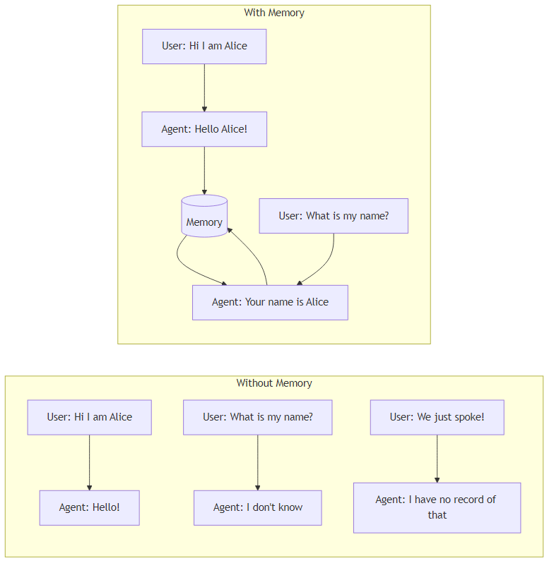

**Memory solves three problems:**

| Problem | Without Memory | With Memory |
|---------|---------------|-------------|
| Context | Agent forgets everything between turns | Agent builds on each interaction |
| Personalization | Every user gets identical generic responses | Agent adapts to each user's history |
| Multi-agent coordination | Agents duplicate work, contradict each other | Agents share findings, build together |

---

## 2. The Universal Memory Taxonomy

Cognitive science has studied human memory for decades. AI agent memory mirrors the same patterns.

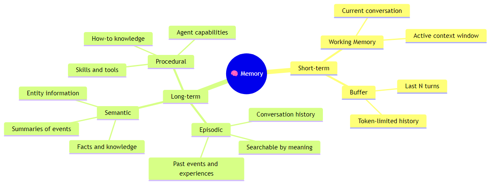

### The 4 Memory Types — Core Concepts

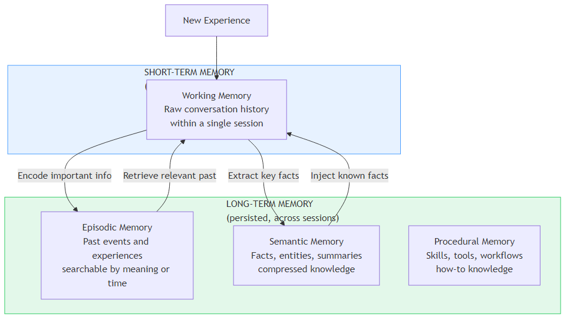

### How This Maps to Both Frameworks

| Cognitive Type | LangChain Implementation | CrewAI Implementation |
|---------------|--------------------------|----------------------|
| **Working Memory** | ConversationBufferMemory | In-task context (LLM context window) |
| **Short-term Buffer** | BufferWindowMemory, TokenBufferMemory | — |
| **Episodic (Long-term)** | VectorStoreRetrieverMemory | Long-term Memory (LanceDB/Qdrant) |
| **Semantic (Facts)** | ConversationEntityMemory, SummaryMemory | Short-term Memory + Entity Memory |
| **Compressed History** | ConversationSummaryMemory | Analyze Engine → summary records |
| **Cross-agent Shared** | ReadOnlySharedMemory, CombinedMemory | MemorySlice across scopes |

---

## 3. Memory Types — Decision Guide

### Decision Tree — Which Memory to Use?

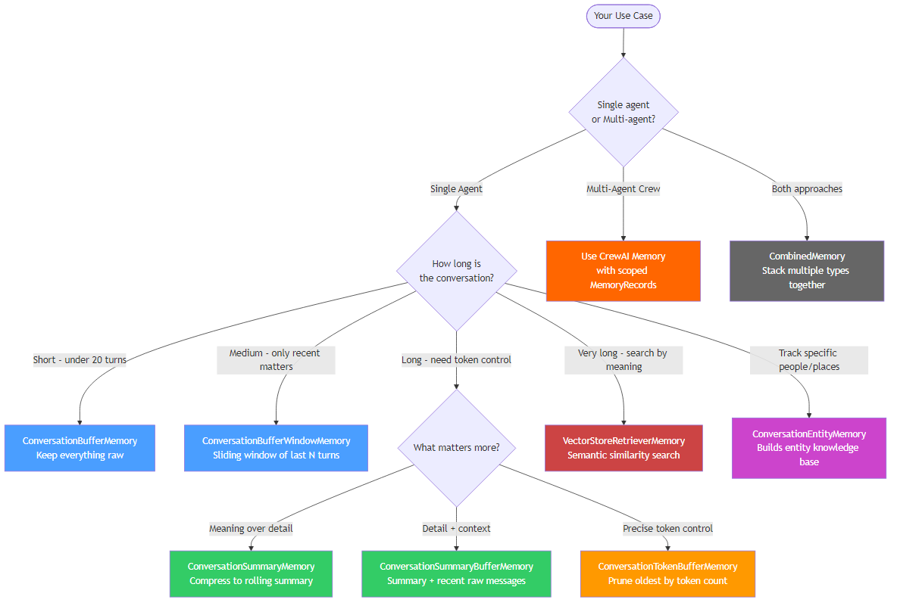

### Decision by Data Type

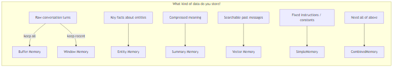

### Quick Use-Case Table

| Situation | Best Choice | Why |
|-----------|-------------|-----|
| Quick prototype / demo | `ConversationBufferMemory` | Zero setup, works immediately |
| Customer support chat | `ConversationSummaryBufferMemory` | Long sessions, need detail + context |
| Coding assistant | `ConversationBufferWindowMemory` | Recent code is what matters |
| Personal assistant | `ConversationEntityMemory` + `VectorStoreRetrieverMemory` | Tracks people and finds past conversations |
| Research agent | `VectorStoreRetrieverMemory` | Search huge knowledge base by meaning |
| Multi-agent pipeline | CrewAI Memory with scopes | Agents share and isolate memories |
| Production chatbot | `ConversationSummaryBufferMemory` + Redis backend | Persistent, bounded, scalable |
| Inject system rules | `SimpleMemory` | Static context, never changes |
| Share memory across chains | `ReadOnlySharedMemory` | One source of truth, write-protected |

---

## 4. LangChain Memory Architecture

### The Big Picture

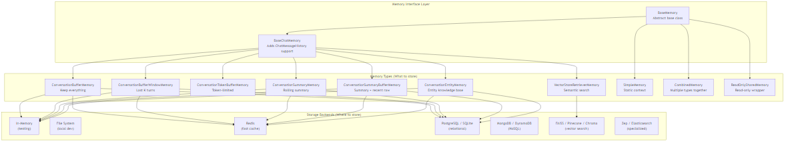

### The Universal 3-Step Lifecycle

Every LangChain memory type follows the same lifecycle on every turn:

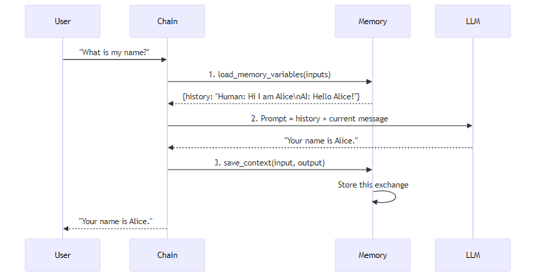

**The key insight:** Memory is just *context injection*. It decides what text to prepend to the current message. Each type uses a different strategy to pick that text.

### The 7 Memory Strategies — Visual Comparison

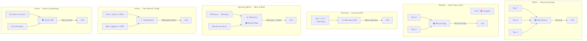

### Token Budget — How Each Type Uses Tokens

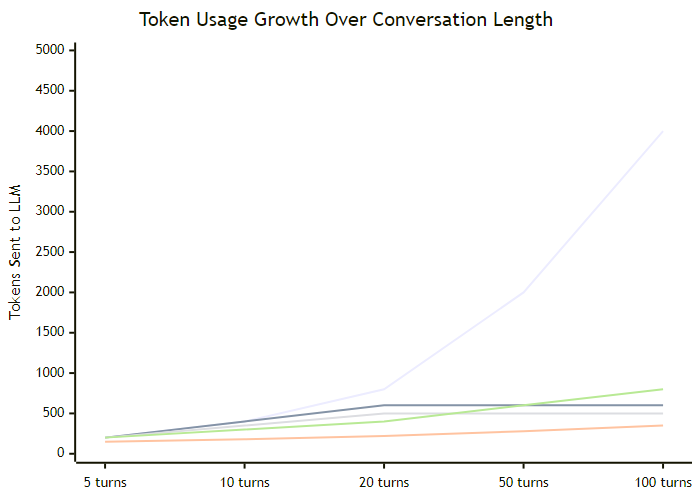

> **Lines (top to bottom):** Buffer (grows forever) → Window (stable) → Summary (very small) → Summary Buffer (capped) → Vector (only top-k results)

---

## 5. CrewAI Memory Architecture

### The Big Picture

CrewAI memory is designed for **multi-agent coordination**, not single-agent conversations. Every memory is stored in a **hierarchical scope tree**, like a file system. Agents can only see their own scope — but a MemorySlice can search across multiple scopes.

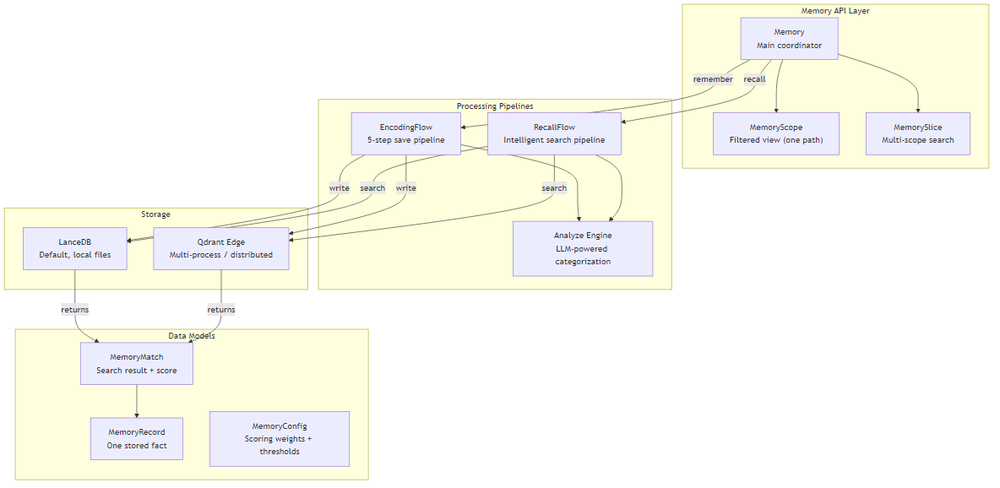

### Hierarchical Scope Tree

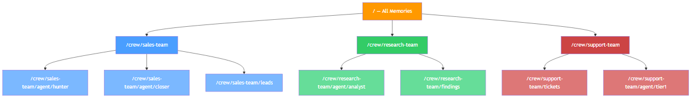

**Rule:** An agent with scope `/crew/sales-team/agent/hunter` can only read/write within its subtree. It is invisible to the support team and vice versa — unless a MemorySlice bridges the two.

### MemoryRecord — One Piece of Memory

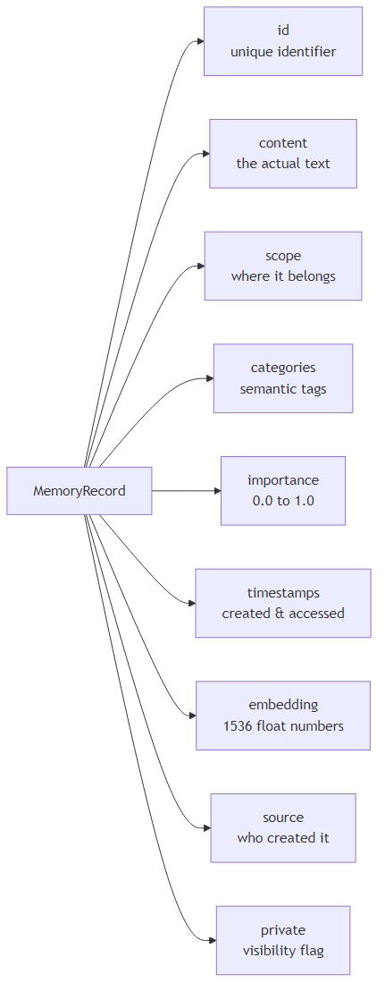

### The 5-Step EncodingFlow (Save Pipeline)

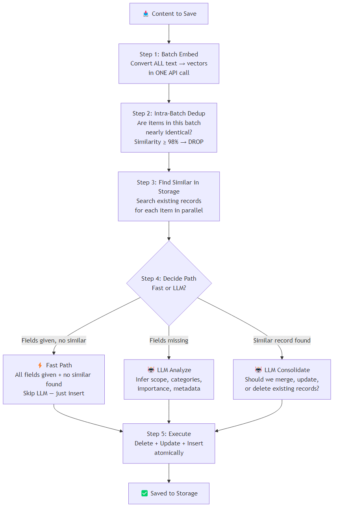

### The RecallFlow (Search Pipeline)

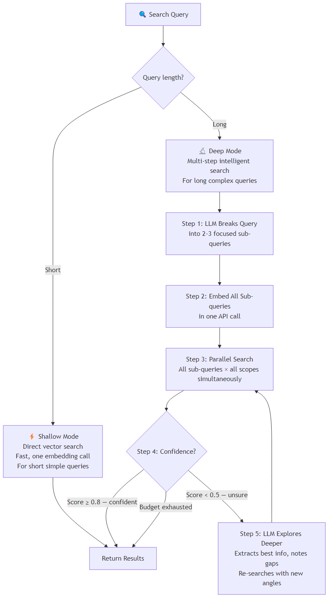

### Composite Scoring — How Results Are Ranked

Every search result gets a score combining 3 factors:

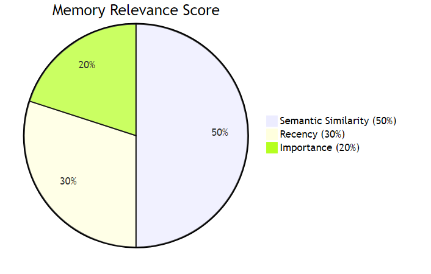

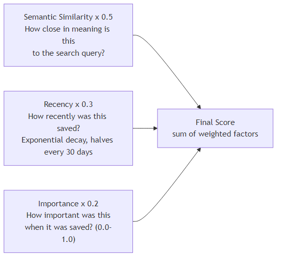

**Example:**

| Record | Semantic | Recency | Importance | Score |
|--------|----------|---------|------------|-------|
| "Client wants email" — saved yesterday, importance 0.9 | 0.88 | 1.0 | 0.9 | **0.44 + 0.30 + 0.18 = 0.92** |
| "Client wants email" — saved 2 months ago, importance 0.9 | 0.88 | 0.25 | 0.9 | **0.44 + 0.08 + 0.18 = 0.70** |

The recent record wins even though content is identical.

---

## 6. LangChain vs CrewAI — Side by Side

### Design Philosophy

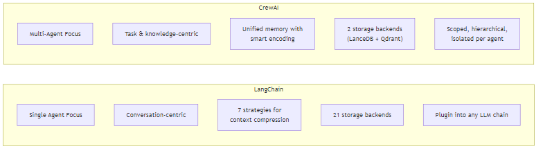

### Feature Comparison

| Feature | LangChain | CrewAI |
|---------|-----------|--------|
| **Primary use** | Single-agent conversation | Multi-agent crew coordination |
| **Memory model** | Strategy-based (choose 1 of 7) | Unified with scoped storage |
| **Storage options** | 21 backends | LanceDB (local) or Qdrant (distributed) |
| **Context injection** | `{history}` placeholder in prompt | RecallMemoryTool + RememberTool |
| **Deduplication** | Manual | Automatic (similarity threshold) |
| **Agent isolation** | Not built-in (use ReadOnlySharedMemory) | Built-in via scope paths |
| **Cross-agent sharing** | CombinedMemory | MemorySlice |
| **LLM-powered compression** | SummaryMemory, EntityMemory | Analyze Engine (automatic) |
| **Semantic search** | VectorStoreRetrieverMemory | All memories indexed as vectors |
| **Background saves** | No (synchronous) | Yes (non-blocking) |
| **Importance scoring** | No | Yes (0.0–1.0, weighted in recall) |
| **Setup complexity** | Low | Medium |

### When to Choose Which

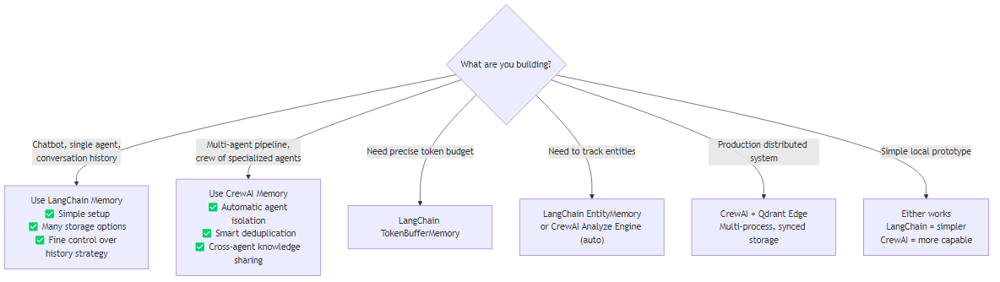

---

## 7. How Memory Works Technically

### Vector Embeddings — The Foundation

Both frameworks rely on **vector embeddings** for semantic search. This is how meaning is compared mathematically.

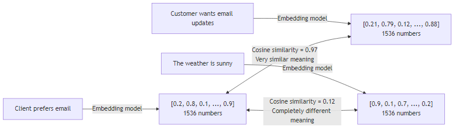

**Key insight:** Words don't need to match — *meaning* matches. "Client prefers email" and "Customer wants email updates" have different words but similar vectors.

### LangChain — Context Injection Mechanics

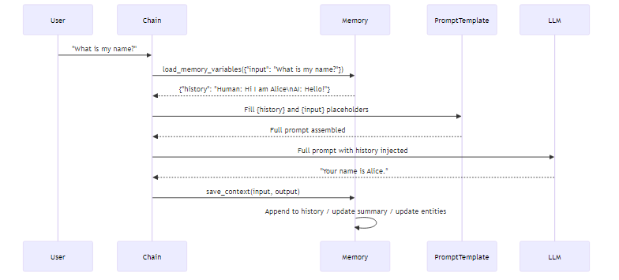

### CrewAI — Background Save Mechanics

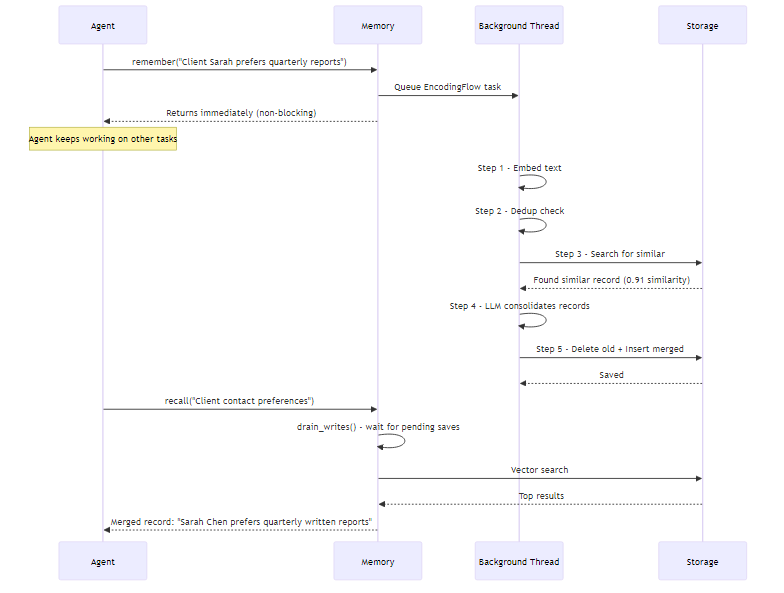

### Memory Consolidation — Keeping Memory Clean

CrewAI automatically merges similar records to avoid duplicates:

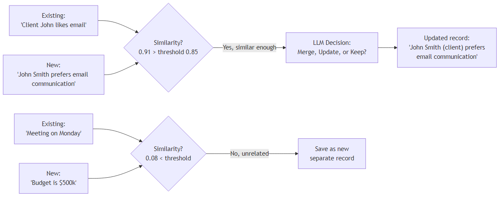

### Session vs Persistent Memory

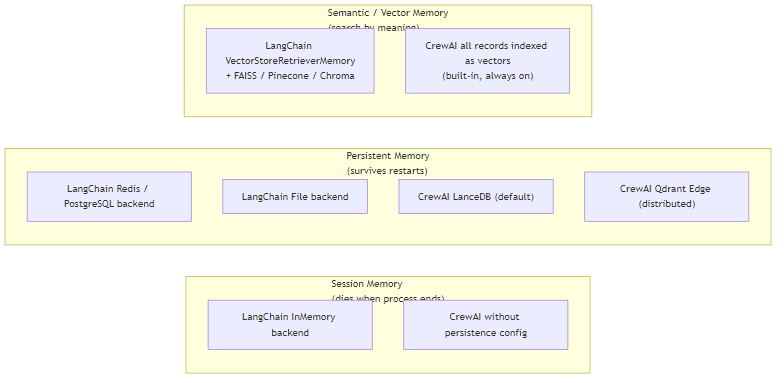

---

## 8. Real-World Patterns

### Pattern 1 — Simple Chatbot (LangChain)

Use `ConversationSummaryBufferMemory` with a Redis backend for a production chatbot.

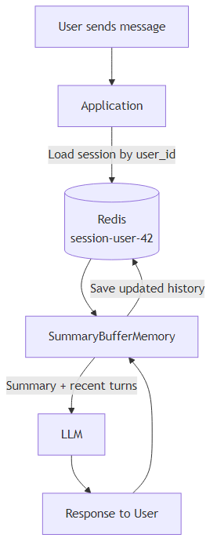

**Good for:** Customer support, personal assistants, FAQ bots.

### Pattern 2 — Research Crew (CrewAI)

Three agents share knowledge through scoped memory.

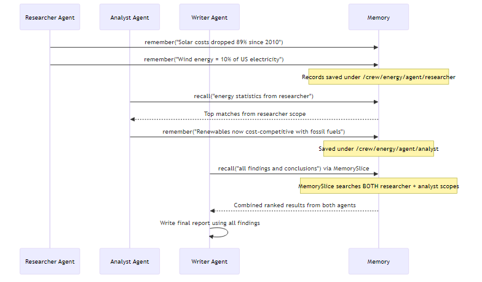

### Pattern 3 — Multi-User Production (LangChain + Redis)

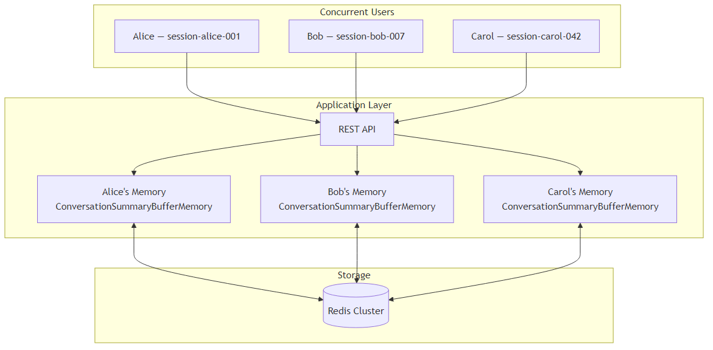

Each user's history is completely isolated by `session_id`. Sessions persist across server restarts.

### Pattern 4 — Parallel Crew Workers (CrewAI + Qdrant Edge)

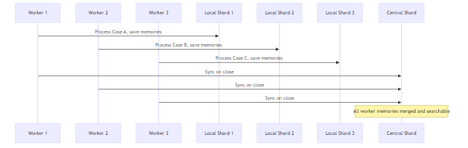

**Good for:** Processing many customers, documents, or cases in parallel.

---

## 9. Pros and Cons of Each Approach

### LangChain Memory

| Memory Type | Pros | Cons |
|-------------|------|------|
| **BufferMemory** | Dead simple, no LLM calls, zero latency | Token usage grows unbounded; breaks for long conversations |
| **BufferWindowMemory** | Stable token usage, simple to reason about | Old info permanently lost; window size is a guess |
| **TokenBufferMemory** | Precise token control, predictable cost | Still loses old info; requires LLM for counting |
| **SummaryMemory** | Very small token usage, scales to any length | Loses nuance; extra LLM call per turn adds latency + cost |
| **SummaryBufferMemory** | Best balance — detail for recent, compressed for old | More complex; still needs LLM; slight latency |
| **EntityMemory** | Tracks facts about specific people/places over time | Only as good as LLM extraction; can miss entities |
| **VectorStoreRetrieverMemory** | Searches all history by meaning, no size limit | Needs vector store setup; misses sequential context |
| **CombinedMemory** | Maximum flexibility | Complex setup; key conflicts possible; debugging harder |
| **SimpleMemory** | Zero overhead, perfect for static rules | Not real memory — just a constant injected every turn |

### CrewAI Memory

| Aspect | Pros | Cons |
|--------|------|------|
| **Unified system** | One API for all memory needs | Less granular control per memory type |
| **Auto-deduplication** | Memory stays clean without manual effort | LLM call overhead for consolidation |
| **Hierarchical scopes** | Natural agent isolation, no accidental leakage | Scope design requires upfront planning |
| **MemorySlice** | Flexible cross-agent knowledge sharing | Slightly more complex query patterns |
| **Importance scoring** | Frequently accessed / high-importance info surfaces first | LLM assigns importance — not always accurate |
| **Background saves** | Non-blocking, agent keeps working | Race conditions possible if recall happens too fast |
| **Semantic search always on** | All records searchable by meaning, out of the box | LanceDB not distributed; Qdrant Edge more complex |
| **Analyze Engine** | Auto-categorizes, auto-scopes, no manual tagging | LLM call on every save without fast path |

### Overall Comparison

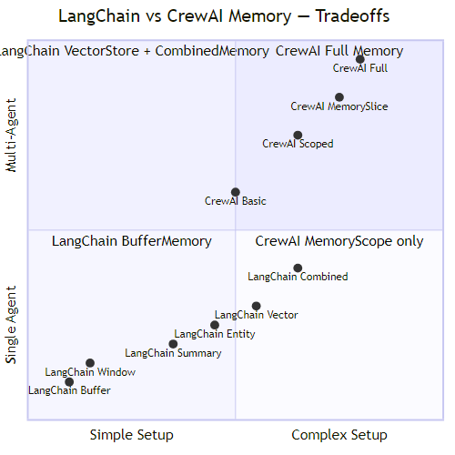

---

## 10. Quick Reference

### LangChain — Choose by Situation

| Situation | Memory Type | Storage Backend |
|-----------|-------------|-----------------|
| Prototype / demo | `ConversationBufferMemory` | In-memory |
| Chatbot, short sessions | `ConversationBufferWindowMemory` | Redis |
| Strict token budget | `ConversationTokenBufferMemory` | Redis |
| Long sessions, compressed | `ConversationSummaryMemory` | Redis / PostgreSQL |
| Long sessions, best quality | `ConversationSummaryBufferMemory` | Redis / PostgreSQL |
| Track people and places | `ConversationEntityMemory` | Redis / SQLite |
| Search all history by meaning | `VectorStoreRetrieverMemory` | FAISS / Pinecone / Chroma |
| Need multiple strategies | `CombinedMemory` | Mix |
| Share memory read-only | `ReadOnlySharedMemory` | Wrap any backend |
| Static system instructions | `SimpleMemory` | None needed |

### CrewAI — Key Operations

| Operation | Method | When to Use |
|-----------|--------|-------------|
| Save a fact | `memory.remember(content)` | After agent discovers something important |
| Save many facts | `memory.remember_many(contents)` | Batch save after a research phase |
| Search memory | `memory.recall(query)` | Before starting a task to check prior knowledge |
| Delete memories | `memory.forget(scope)` | Clean up stale or wrong information |
| Break text into facts | `memory.extract_memories(text)` | When saving long reports or documents |
| Isolate an agent | `memory.scope(path)` | Give an agent its own private memory region |
| Search across agents | `memory.slice(paths)` | Manager agent needs everyone's findings |
| See scope structure | `memory.tree(path)` | Debug what agents have remembered |

### All Memory Types at a Glance

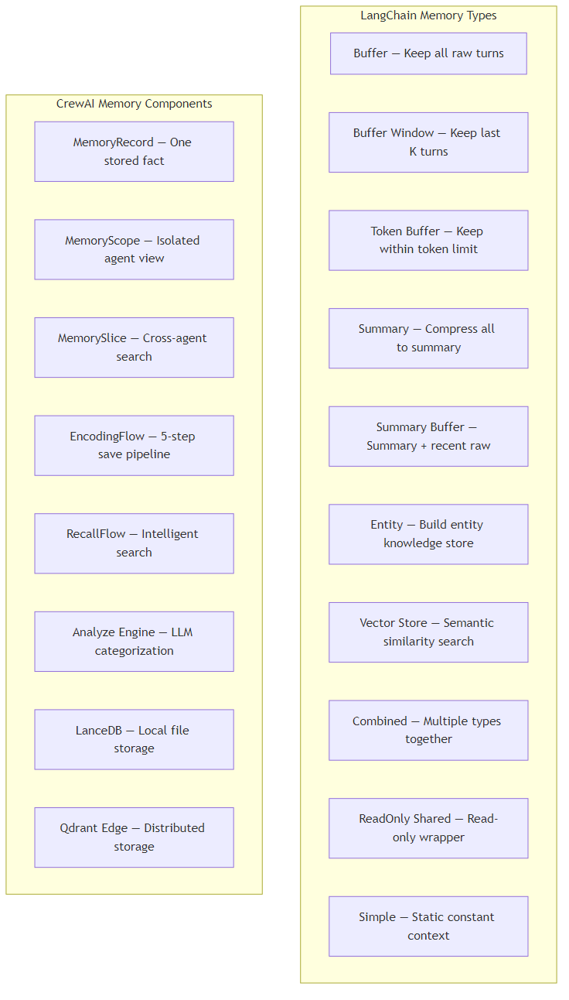

### The Golden Rules

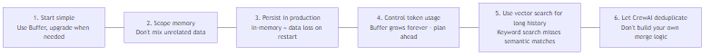

---

## Summary — The Big Picture

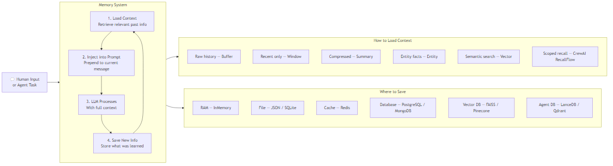

**The core truth about memory in both frameworks:**

> Memory is not magic. It is **context engineering** — deciding what information to prepend to a prompt so the LLM can answer as if it remembers. Every strategy, every component, every storage backend exists to answer one question: *"What context does the LLM need right now, and how do we get it there efficiently?"*

| Framework | Best Summary |
|-----------|-------------|
| **LangChain** | Give you 7 strategies and 21 backends. You choose what to keep and where to put it. Maximum flexibility, minimum magic. |
| **CrewAI** | One unified system that automatically embeds, deduplicates, categorizes, and scopes everything. Less control, more automation. |
