# Supermemory — Simple Guide for Everyone

> **Who this guide is for:** Anyone curious about Supermemory — no tech background needed.
> Developers can read the deeper sections for code examples and architecture details.

---

## Table of Contents

1. [What is Supermemory?](#1-what-is-supermemory)
2. [The Problem It Solves](#2-the-problem-it-solves)
3. [How It Works — Simple Version](#3-how-it-works--simple-version)
4. [How It Works — Under the Hood](#4-how-it-works--under-the-hood)
5. [Main Components](#5-main-components)
6. [Deep Dive into Each Component](#6-deep-dive-into-each-component)
   - [Memory Engine](#61-memory-engine)
   - [User Profiles](#62-user-profiles)
   - [Hybrid Search](#63-hybrid-search)
   - [Connectors](#64-connectors)
   - [File Processing](#65-file-processing)
   - [MCP Server](#66-mcp-server-model-context-protocol)
   - [Web App](#67-web-app)
   - [Browser Extension](#68-browser-extension)
   - [Framework Tools](#69-framework-tools-for-developers)
   - [Memory Graph](#610-memory-graph)
7. [Real-World Examples](#7-real-world-examples)
8. [Benchmark Results](#8-benchmark-results)
9. [Quick Start](#9-quick-start)

---

## 1. What is Supermemory?

**Supermemory is a memory system for AI.**

When you talk to an AI assistant (like ChatGPT or Claude), it forgets everything the moment you close the chat. Every time you come back, it acts like it has never met you before.

Supermemory fixes that. It gives AI a long-term memory — so your AI can remember your name, your preferences, your projects, and past conversations.

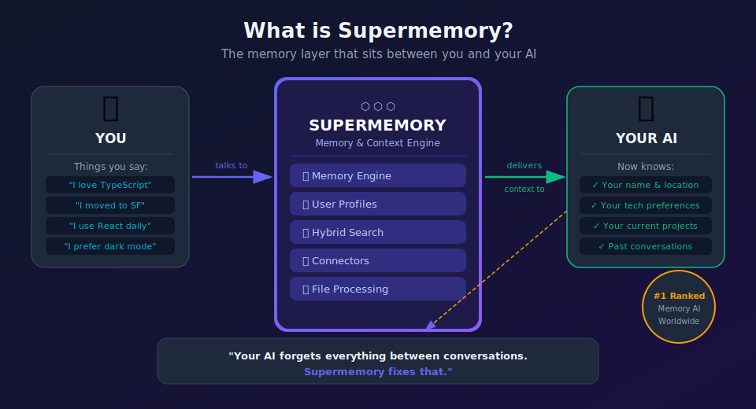

```
Without Supermemory:
  You: "I love dark mode and use TypeScript"
  AI: "Got it!"
  [Next day...]
  You: "What do I like?"
  AI: "I don't know — I have no memory of previous chats."

With Supermemory:
  You: "I love dark mode and use TypeScript"
  AI: "Got it!" [saves this]
  [Next day...]
  You: "What do I like?"
  AI: "You love dark mode and use TypeScript!"
```

It is the **#1 ranked memory system** across three major AI memory tests (LongMemEval, LoCoMo, ConvoMem).

---

## 2. The Problem It Solves

Imagine hiring an assistant who forgets everything after every meeting. Every morning you have to re-explain who you are, what project you're on, what you like. That would be exhausting.

That is exactly how most AI tools work today.

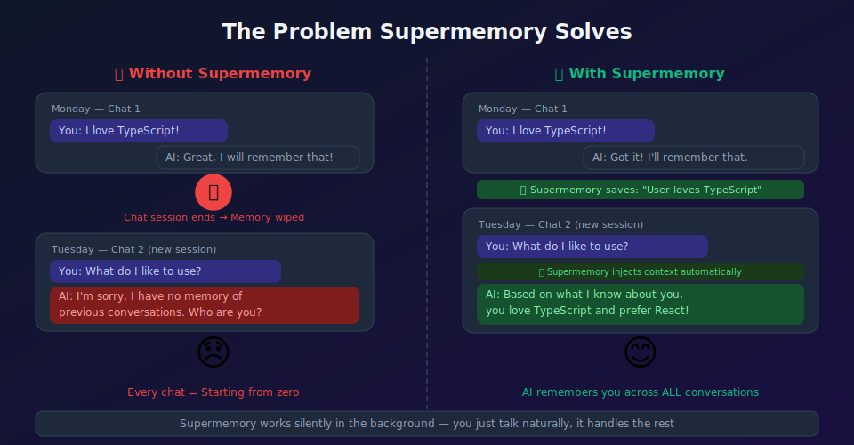

Supermemory is the "notebook" that sits between you and your AI — silently keeping track of everything important, so you never have to repeat yourself.

Beyond personal memory, it also helps **developers** build smarter AI apps without building a complex memory system from scratch.

---

## 3. How It Works — Simple Version

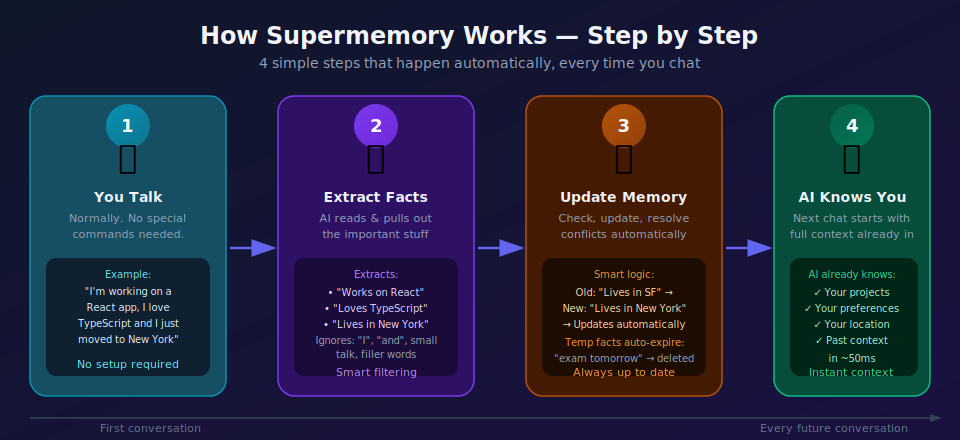

Four steps that happen automatically every time you chat:

**Step 1 — You talk normally.** No special commands needed.
> "I'm working on a React app, I love TypeScript and I just moved to New York"

**Step 2 — Supermemory extracts the facts.**
> Saves: "Works on React" · "Loves TypeScript" · "Lives in New York"
> Ignores: "I", "and", small talk, filler words

**Step 3 — Memory gets updated.**
> Compares new facts to old ones. Resolves conflicts. Expires time-sensitive info.

**Step 4 — Next chat, your AI already knows you.**
> All facts injected before the conversation starts. ~50ms.

### Memory vs. Simple Notes

Supermemory does more than just save text:

| What it does | Example |
|---|---|
| Saves facts | "User lives in San Francisco" |
| Updates facts | "User moved to New York" → old fact replaced |
| Forgets expired facts | "I have an exam tomorrow" → deleted after the day |
| Resolves conflicts | Old: "likes coffee", New: "quit coffee" → keeps new |
| Builds your profile | Combines all facts into a summary of who you are |

---

## 4. How It Works — Under the Hood

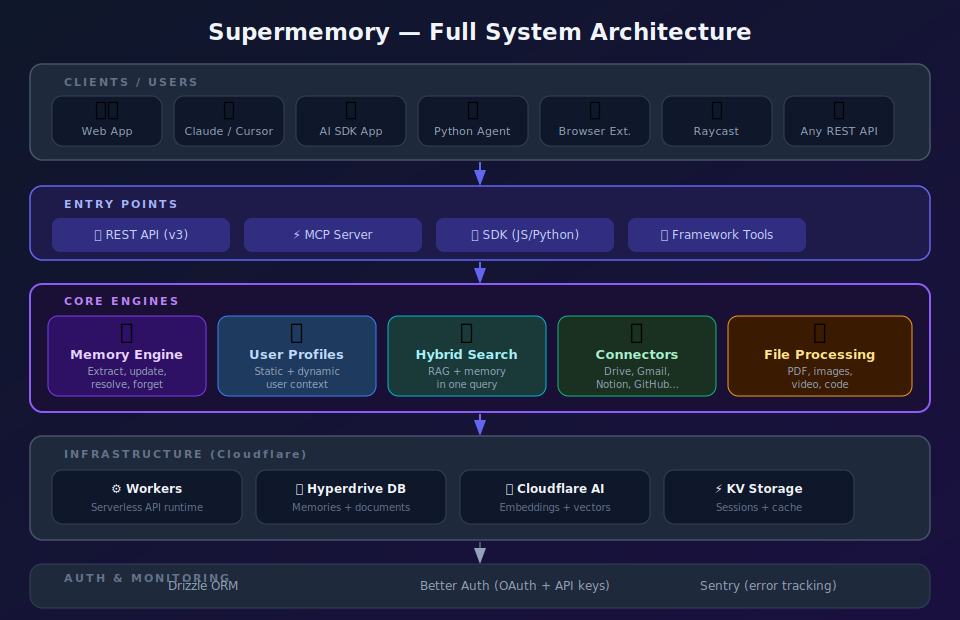

The system has five layers:

1. **Clients** — the tools you use (web app, Claude, Cursor, VS Code, your own app)
2. **Entry Points** — REST API, MCP server, SDKs, framework tools
3. **Core Engines** — Memory Engine, User Profiles, Hybrid Search, Connectors, File Processing
4. **Infrastructure** — Cloudflare Workers, database, AI embeddings, caching
5. **Auth & Monitoring** — login, API keys, error tracking

### Technology Stack

| Layer | Technology | What it does |
|---|---|---|
| Backend | Cloudflare Workers | Runs the API, fast and global |
| Database | Cloudflare Hyperdrive + Drizzle ORM | Stores memories and documents |
| AI/Embeddings | Cloudflare AI | Converts text to searchable vectors |
| Web App | Next.js | Dashboard at app.supermemory.ai |
| MCP Server | Hono + Durable Objects | Talks to Claude, Cursor, etc. |
| Auth | Better Auth | Login and user management |
| Build | Turbo (monorepo) + Bun | Fast builds across all packages |

---

## 5. Main Components

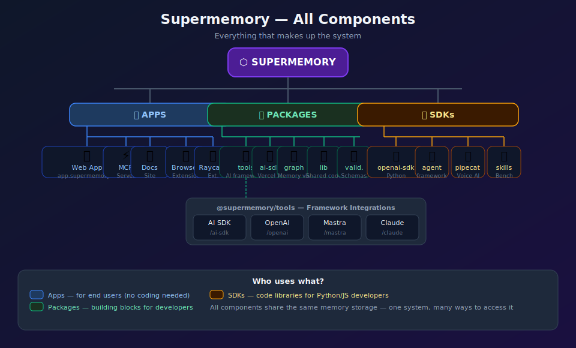

Everything that makes up Supermemory:

| Category | Components |
|---|---|
| **Apps** | Web App, MCP Server, Browser Extension, Raycast Extension, Docs |
| **Packages** | tools, ai-sdk, memory-graph, lib, validation, ui, hooks |
| **SDKs** | openai-sdk-python, agent-framework-python, pipecat-sdk-python |

All components share the same memory storage — one system, many ways to access it.

---

## 6. Deep Dive into Each Component

---

### 6.1 Memory Engine

**What it is:** The brain of Supermemory. It reads conversations and documents, pulls out important facts, and keeps them organized.

**Simple analogy:** A very smart assistant who reads everything you say and writes notes — but only the important stuff. And they update their notes when things change.

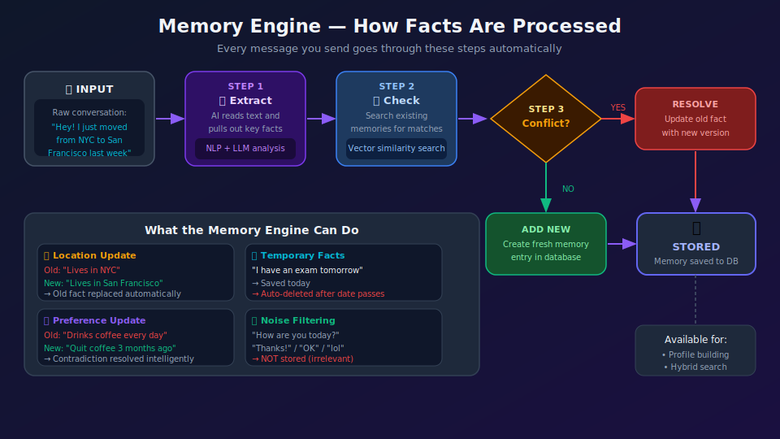

**How it processes a message:**

```
INPUT: "I used to live in NYC but I just moved to San Francisco last week"

STEP 1 → Extract facts:
          "Lives in San Francisco" (new)
          "Used to live in NYC" (old context)

STEP 2 → Check existing memory:
          Found old memory: "Lives in NYC"

STEP 3 → Conflict detected → Resolve:
          Replace "Lives in NYC" with "Lives in San Francisco"

STEP 4 → Store updated memory
```

**Key behaviors:**

| Behavior | What it means |
|---|---|
| Fact extraction | Pulls key information from text automatically |
| Temporal awareness | Knows "I used to" means old info |
| Contradiction handling | New facts replace old ones |
| Auto-forgetting | Time-sensitive facts ("exam tomorrow") expire |
| Noise filtering | "How are you?" does not become a memory |

### Memory Lifecycle

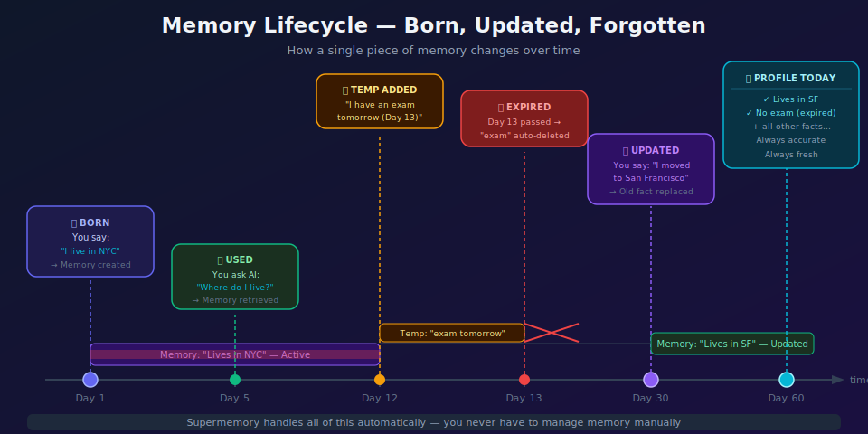

A memory is born when you say something important, gets updated when you share new info, and expires when it's no longer relevant — all automatically.

---

### 6.2 User Profiles

**What it is:** A summary card about each user. Built automatically from everything Supermemory learns.

**Simple analogy:** A contact card that fills itself in as you talk. It has two sections — permanent facts and current activity.

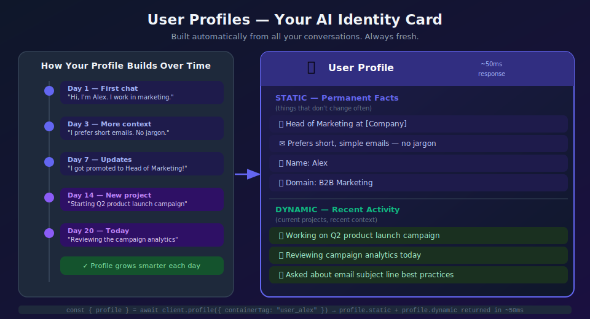

**Profile structure:**

```
USER PROFILE for "user_alex"
+------------------------------------------+
| STATIC (permanent facts)                 |
|  - Head of Marketing at Acme             |
|  - Prefers short emails — no jargon      |
|  - Name: Alex                            |
+------------------------------------------+
| DYNAMIC (recent activity)                |
|  - Working on Q2 product launch          |
|  - Reviewing campaign analytics          |
+------------------------------------------+
```

**For developers:** One API call, ~50ms response time.

```typescript
const { profile } = await client.profile({ containerTag: "user_alex" });
// profile.static  = ["Head of Marketing", "Prefers short emails"]
// profile.dynamic = ["Working on Q2 launch", "Reviewing analytics"]
```

---

### 6.3 Hybrid Search

**What it is:** A search system that finds relevant memories AND relevant documents at the same time.

**Simple analogy:** A librarian who can find both personal notes about you AND relevant reference books — all in one search.

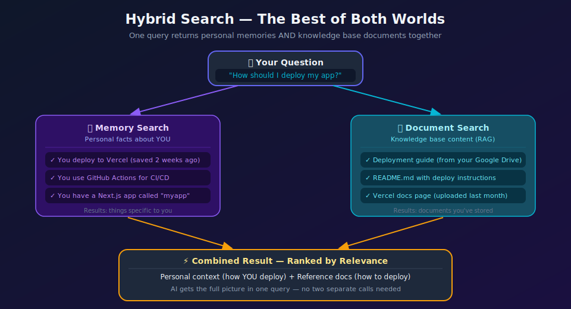

### Search Modes

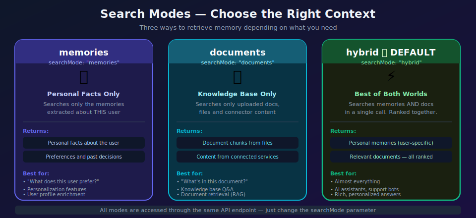

| Mode | What it finds | Best for |
|---|---|---|
| `memories` | Only personal facts about the user | Personalization |
| `documents` | Only files and knowledge base content | Document Q&A |
| `hybrid` (default) | Both combined — ranked together | Almost everything |

```typescript
// Hybrid search — returns personal + document results together
const results = await client.search.memories({
  q: "How should I deploy my app?",
  containerTag: "user_123",
  searchMode: "hybrid",
});
// Returns: "You deploy to Vercel" (memory) + your deployment docs (documents)
```

---

### 6.4 Connectors

**What it is:** Automatic bridges to your existing tools. Supermemory can pull information from services you already use.

**Simple analogy:** Instead of manually copying your Google Docs into Supermemory, you just connect your Google account and it syncs automatically.

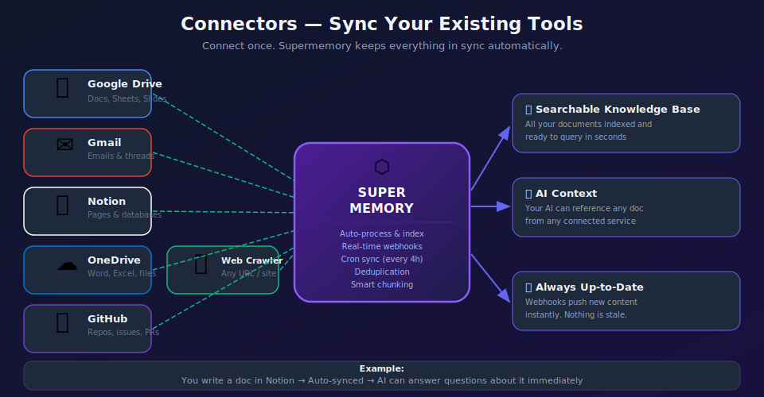

**Supported connectors:**

| Service | What gets synced |
|---|---|
| Google Drive | Docs, Sheets, Slides |
| Gmail | Emails and threads |
| Notion | Pages and databases |
| OneDrive | Word, Excel, files |
| GitHub | Repos, issues, pull requests |
| Web Crawler | Any URL or website |

**How it stays fresh:**
- Webhooks push new content instantly when you make changes
- Cron job runs every 4 hours as a backup sync
- Duplicate content is automatically detected and skipped

**Example:**
> You write a doc in Google Drive: "Meeting notes — Q1 goals"
> Without doing anything else, your AI can answer: "What were our Q1 goals?"

---

### 6.5 File Processing

**What it is:** The ability to read many types of files and make them searchable.

**Simple analogy:** A smart scanner that does not just take a picture — it actually reads and understands the content.

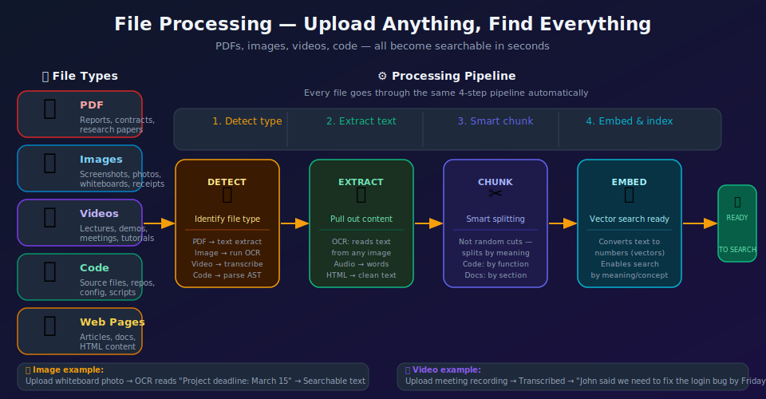

**Processing pipeline:**
1. **Detect** — Identify the file type
2. **Extract** — Pull out the text (OCR for images, transcription for video, AST for code)
3. **Chunk** — Split into meaningful pieces by section or function
4. **Embed** — Convert to vectors for semantic search

**Practical examples:**
- Upload a whiteboard photo → OCR reads "Project deadline: March 15" → Searchable
- Upload a meeting recording → Transcribed → "John said to fix the login bug by Friday"
- Upload a PDF report → Extracted page by page → Full text searchable

---

### 6.6 MCP Server (Model Context Protocol)

**What it is:** A bridge that connects Supermemory to AI coding tools like Claude, Cursor, and Windsurf.

**Simple analogy:** MCP is like a universal socket adapter. Supermemory plugs in once, and then any compatible AI tool can use it.

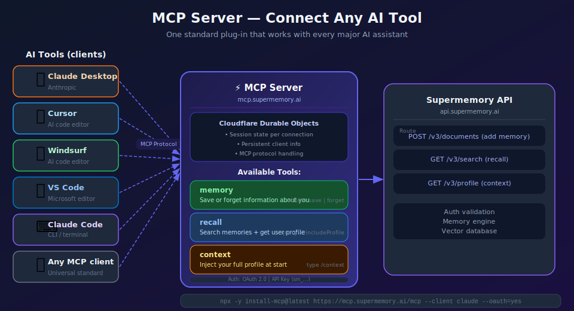

**Three tools available to the AI:**

| Tool | What the AI can do |
|---|---|
| `memory` | Save or forget information about you |
| `recall` | Search memories and get your profile |
| `context` | Inject your full profile at conversation start (type `/context`) |

**Works with:** Claude Desktop · Cursor · Windsurf · VS Code · Claude Code · OpenCode

**Quick install (no coding needed):**
```bash
npx -y install-mcp@latest https://mcp.supermemory.ai/mcp --client claude --oauth=yes
```
Replace `claude` with your client: `cursor`, `windsurf`, `vscode`, etc.

---

### 6.7 Web App

**What it is:** The main user interface at `app.supermemory.ai`. A dashboard where you can view, search, and manage your memories without any code.

**What you can do:**
- See all your memories in one place
- Search across everything
- Connect external services (Google Drive, Notion, etc.)
- Upload files
- View the memory graph (visual map of connections)
- Chat with Nova — an AI assistant that has access to all your memories

**Built with:** Next.js, deployed on Cloudflare via OpenNext.

---

### 6.8 Browser Extension

**What it is:** A Chrome/Firefox extension that lets you save any web page to your Supermemory with one click.

**Simple analogy:** A smart bookmark that reads the page and makes the content searchable.

```
You visit an article:
  "10 tips for better React performance"
  ↓
  [Click extension button]
  ↓
  Page content extracted and saved
  ↓
  Later: ask your AI "How can I make React faster?"
  → AI finds that article and summarizes the key points
```

**Built with:** WXT (Web Extension Tools), TypeScript.

---

### 6.9 Framework Tools (for Developers)

**What it is:** Ready-made packages that let developers add Supermemory to their AI apps with minimal code.

**Simple analogy:** Instead of building plumbing from scratch, you use pre-made connectors.

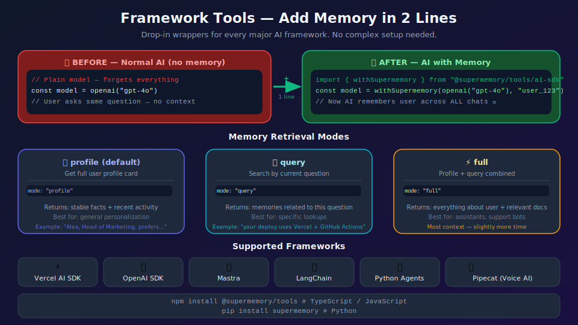

**The simplest way to add memory to your AI (2 lines):**

```typescript
// BEFORE: normal model (forgets everything)
const model = openai("gpt-4o")

// AFTER: model with memory (2 lines)
import { withSupermemory } from "@supermemory/tools/ai-sdk"
const model = withSupermemory(openai("gpt-4o"), "user_123")
// That's it — AI now remembers this user across all conversations
```

**Memory retrieval modes:**

| Mode | Description | Best for |
|---|---|---|
| `profile` (default) | Get user's full profile card | General personalization |
| `query` | Search memories based on current question | Specific lookups |
| `full` | Profile + query search combined | Assistants, support bots |

**Auto-save conversations:**
```typescript
const model = withSupermemory(openai("gpt-4o"), "user_123", {
  addMemory: "always"  // automatically save user messages as memories
})
```

**Supported frameworks:**
- Vercel AI SDK · OpenAI SDK (TypeScript/Python)
- Mastra · LangChain · LangGraph
- Claude Memory Tool · n8n · Agno
- Pipecat (Voice AI)

---

### 6.10 Memory Graph

**What it is:** A visual map showing how your documents and memories connect to each other.

**Simple analogy:** Like a mind map — you can see which documents are related and which memories came from which conversations.

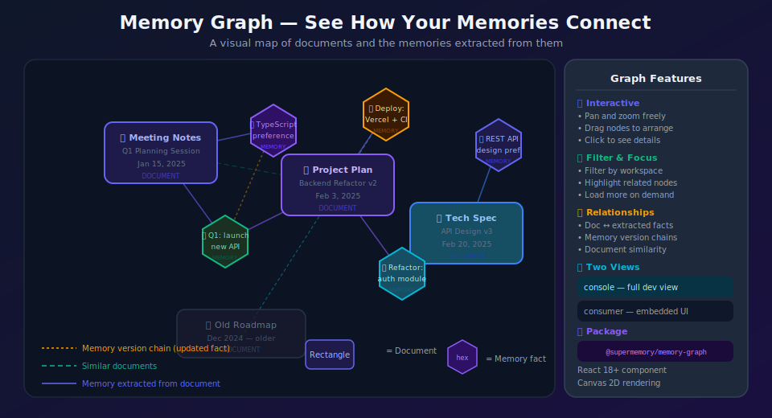

**Shapes in the graph:**
- **Rectangle** = Document (a file, a conversation, a page)
- **Hexagon** = Memory fact (a specific piece of information extracted)
- **Lines** = Connections (which facts came from which documents, which docs are similar)

**Features:**
- Drag and move nodes to arrange them
- Zoom in/out
- Filter by workspace
- Load more data on demand
- Two modes: full console view (for developers) or embedded consumer view

---

## 7. Real-World Examples

### Example 1: Personal AI Assistant

> Sarah uses Claude Desktop with the Supermemory MCP plugin.
>
> **Week 1:** She tells Claude she is working on a Python web scraper for her research.
> **Week 2:** She opens a new chat and asks "Can you help me optimize my scraper?"
>
> **Without Supermemory:** Claude says "What scraper? Tell me about it."
>
> **With Supermemory:** Claude says "Sure! Your Python web scraper — want me to look at async performance or memory usage first?"

### Example 2: Developer Building a Customer Support Bot

```typescript
// Without Supermemory — every chat starts blank
const response = await openai.chat.completions.create({
  messages: [{ role: "user", content: "I have a billing issue" }]
})
// AI has no idea who this user is

// With Supermemory — AI knows the customer's history
const openaiWithMemory = withSupermemory("customer_456", { mode: "full" })
const response = await openaiWithMemory.chat.completions.create({
  messages: [{ role: "user", content: "I have a billing issue" }]
})
// AI already knows: "Premium plan, uses API, had a billing issue last month"
```

### Example 3: Connecting Google Drive

> A researcher connects their Google Drive.
> They have 200 research papers stored there.
> After connecting, they can ask their AI:
> "What did the Smith 2023 paper say about neural plasticity?"
> And get an answer — without copy-pasting anything.

### Example 4: Using the Browser Extension

> A student reads a long article about climate change and clicks the extension.
> Two weeks later, while writing an essay, they ask their AI:
> "What were the key points from that climate article I read?"
> The AI finds it and summarizes the key points instantly.

---

## 8. Benchmark Results

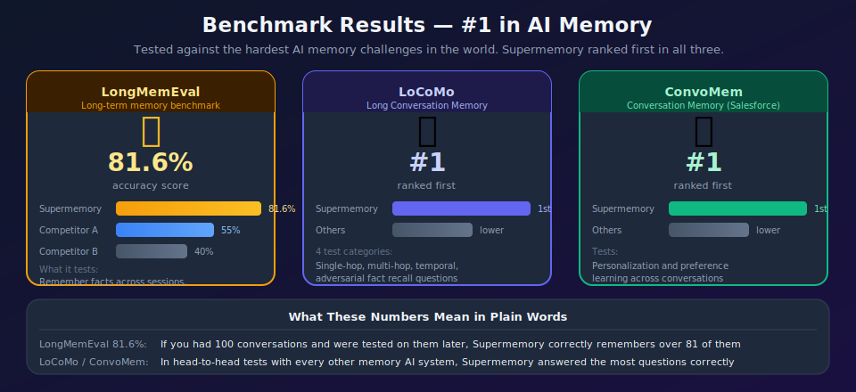

Supermemory is tested against the hardest AI memory challenges in the world:

| Benchmark | What it tests | Result |
|---|---|---|
| **LongMemEval** | Remember facts across sessions, handle updates | **81.6% — #1** |
| **LoCoMo** | Single-hop, multi-hop, temporal, adversarial recall | **#1** |
| **ConvoMem** | Personalization and preference learning | **#1** |

**What these numbers mean in plain words:**

LongMemEval is like a test where you read 100 pages of conversation history, then answer questions. An 81.6% score means Supermemory correctly answers more than 4 out of 5 questions — even when the answer requires combining multiple facts or understanding that old information was updated.

---

## 9. Quick Start

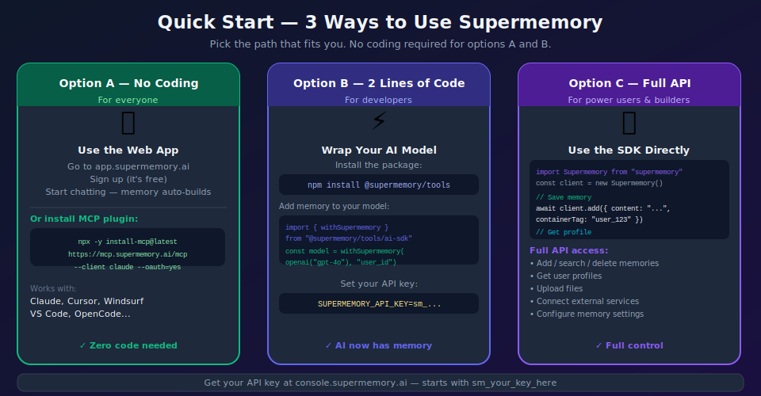

### Option A: No Coding — Use the Web App or MCP Plugin

Go to [app.supermemory.ai](https://app.supermemory.ai) and sign up for free.

Or install the MCP plugin for your AI tool:
```bash
npx -y install-mcp@latest https://mcp.supermemory.ai/mcp --client claude --oauth=yes
```
Replace `claude` with `cursor`, `windsurf`, or `vscode`.

### Option B: Add Memory to Your AI in 2 Lines

```bash
npm install @supermemory/tools
```

```typescript
import { withSupermemory } from "@supermemory/tools/ai-sdk"
import { openai } from "@ai-sdk/openai"
import { generateText } from "ai"

const model = withSupermemory(openai("gpt-4o"), "user_123")

const result = await generateText({
  model,
  messages: [{ role: "user", content: "What do you know about me?" }],
})
```

### Option C: Use the Full API

```bash
npm install supermemory    # JavaScript
pip install supermemory    # Python
```

```typescript
import Supermemory from "supermemory"

const client = new Supermemory()  // uses SUPERMEMORY_API_KEY env var

// Save a memory
await client.add({
  content: "User loves TypeScript and hates meetings",
  containerTag: "user_123",
})

// Get their profile
const { profile } = await client.profile({ containerTag: "user_123" })
console.log(profile.static)   // ["Loves TypeScript", "Hates meetings"]
console.log(profile.dynamic)  // ["Working on auth migration"]

// Search
const results = await client.search.memories({
  q: "programming preferences",
  containerTag: "user_123",
  searchMode: "hybrid",
})
```

### Environment Variables

```env
SUPERMEMORY_API_KEY=sm_your_key_here
```

Get your API key at [console.supermemory.ai](https://console.supermemory.ai).

---

## Summary

Everything in one picture:

```
+================================================================+
|                       SUPERMEMORY                              |
|                                                                |
|  WHO USES IT:                                                  |
|  - Regular people    → Web App, Browser Extension, MCP        |
|  - AI tool users     → MCP plugin for Claude/Cursor/Windsurf  |
|  - Developers        → API, SDKs, Framework tools             |
|                                                                |
|  WHAT IT DOES:                                                 |
|  1. Listens to conversations                                   |
|  2. Extracts important facts                                   |
|  3. Keeps facts up to date (handles changes & conflicts)       |
|  4. Forgets things that expire automatically                   |
|  5. Syncs from your existing tools (Drive, Notion, etc.)       |
|  6. Processes your files (PDF, images, video, code)            |
|  7. Returns full user context in ~50ms                         |
|                                                                |
|  THE RESULT:                                                   |
|  Your AI remembers you. It gets smarter every conversation.    |
+================================================================+
```

---

*Source: [github.com/supermemoryai/supermemory](https://github.com/supermemoryai/supermemory)*
*Documentation: [supermemory.ai/docs](https://supermemory.ai/docs)*
