# AI Agent Memory — Design Guide
## How to Design Great Memory Architecture, Case by Case

---

## Contents

1. [The Design Mindset](#1-the-design-mindset)
2. [The 4 Memory Layers](#2-the-4-memory-layers)
3. [Requirements Checklist](#3-requirements-checklist)
4. [The Design Framework — Decision Flow](#4-the-design-framework--decision-flow)
5. [Case 1 — Simple Chatbot](#5-case-1--simple-chatbot)
6. [Case 2 — Customer Support System](#6-case-2--customer-support-system)
7. [Case 3 — Personal Assistant](#7-case-3--personal-assistant)
8. [Case 4 — Coding Assistant](#8-case-4--coding-assistant)
9. [Case 5 — Research Agent](#9-case-5--research-agent)
10. [Case 6 — Multi-Agent Crew](#10-case-6--multi-agent-crew)
11. [Case 7 — RAG + Chat Hybrid](#11-case-7--rag--chat-hybrid)
12. [Case 8 — Managed Memory with Supermemory](#12-case-8--managed-memory-with-supermemory)
13. [Anti-Patterns to Avoid](#13-anti-patterns-to-avoid)
14. [Quick Reference Card](#14-quick-reference-card)

---

## 1. The Design Mindset

Before picking a memory type, answer this: **"What does the LLM need to remember, and when?"**

Memory is not storage. Storage is a side effect. The real goal is **context injection** — getting the right information into the prompt at the right time.

Three questions to start every design:

| Question | Why it matters |
|----------|---------------|
| **What** does the agent need to remember? | Defines the memory type (conversation, facts, documents) |
| **When** does it need to remember? | Defines persistence (this turn, this session, forever) |
| **Who** shares the memory? | Defines scope (one user, many users, many agents) |

---

## 2. The 4 Memory Layers

Think of memory as four layers, from fastest to slowest, cheapest to most expensive:

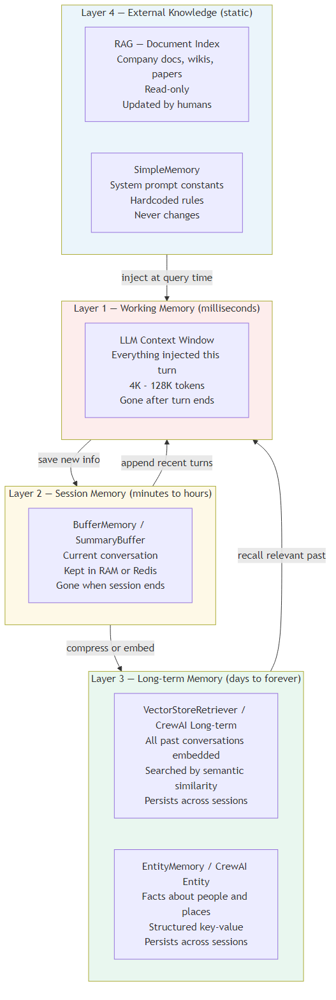

| Layer | What it holds | Lives until | Cost |
|-------|--------------|-------------|------|
| **Working** | Current prompt + injected context | End of LLM call | Cheapest (tokens) |
| **Session** | Current conversation history | Session ends | Low (RAM or Redis) |
| **Long-term** | All past conversations, facts | Forever | Medium (vector DB) |
| **External Knowledge** | Documents, wikis, static rules | Changed by humans | Low (read-only) |

**Rule of thumb:** Start at the bottom layer (simplest) and add layers only when you need them.

---

## 3. Requirements Checklist

Before writing a single line of code, fill out this checklist:

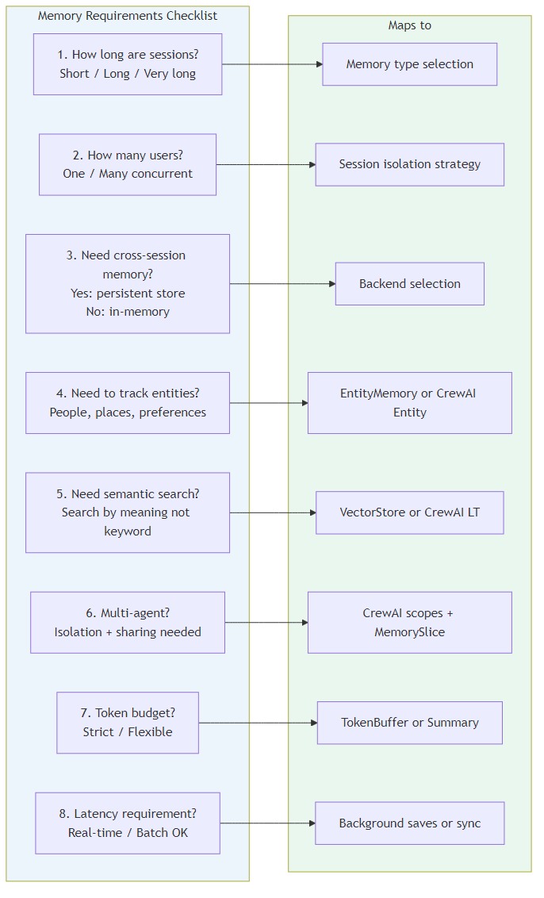

| # | Question | Options |
|---|----------|---------|
| 1 | How long are sessions? | Short (<10 turns) / Long (10-100) / Very long (100+) |
| 2 | How many concurrent users? | One / Dozens / Thousands |
| 3 | Need memory across sessions? | Yes (persistent backend) / No (in-memory) |
| 4 | Need to track entities? | People, places, preferences → EntityMemory |
| 5 | Need to search history by meaning? | Yes → VectorStore / CrewAI long-term |
| 6 | Is this multi-agent? | Yes → CrewAI scopes + MemorySlice |
| 7 | Token budget constrained? | Yes → SummaryMemory / TokenBuffer |
| 8 | Latency sensitive? | Yes → avoid LLM-powered memory on every turn |

---

## 4. The Design Framework — Decision Flow

Use this flowchart whenever you start a new memory design:

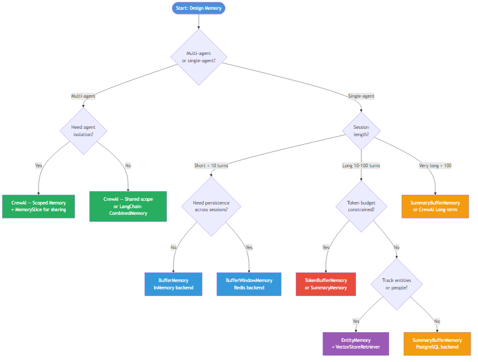

**The two main forks:**
- **Multi-agent?** → CrewAI with scoped memory is almost always the right choice.
- **Single-agent?** → Pick based on session length and what needs to persist.

---

## 5. Case 1 — Simple Chatbot

### Scenario
A demo bot, FAQ assistant, or internal tool. Single user, short sessions, no need to remember across days.

### Memory Architecture

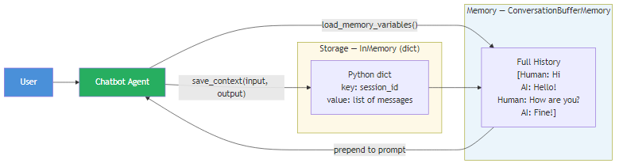

### Design Decisions

| Decision | Choice | Reason |
|----------|--------|--------|
| Memory type | `ConversationBufferMemory` | Zero setup, works immediately |
| Backend | InMemory (Python dict) | No infra needed for a prototype |
| Persistence | None | Sessions are short-lived |
| Token limit | None | Short sessions won't overflow |

### Code

```python
from langchain.memory import ConversationBufferMemory
from langchain.chains import ConversationChain
from langchain_anthropic import ChatAnthropic

memory = ConversationBufferMemory()
chain = ConversationChain(
    llm=ChatAnthropic(model="claude-sonnet-4-6"),
    memory=memory
)

chain.predict(input="Hello!")
chain.predict(input="What did I just say?")  # Agent remembers
```

### When to upgrade
- Session grows beyond 20+ turns → switch to `ConversationSummaryBufferMemory`
- Multiple users → add `session_id` isolation and a Redis backend
- Need to survive server restarts → add a persistent backend

---

## 6. Case 2 — Customer Support System

### Scenario
A support chatbot handling hundreds of users simultaneously. Sessions last 10-50 turns. Agents need to remember the full support context ("Alice already told us her order number"). Sessions must survive server restarts.

### Memory Architecture

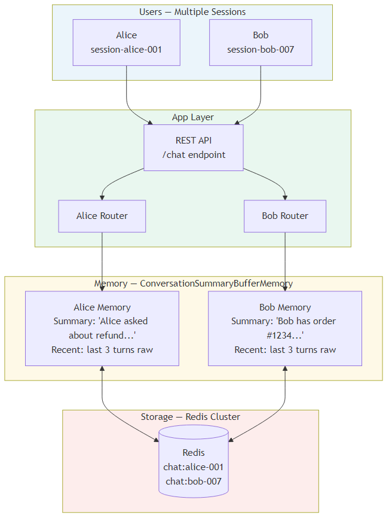

### Design Decisions

| Decision | Choice | Reason |
|----------|--------|--------|
| Memory type | `ConversationSummaryBufferMemory` | Long sessions, need detail + compressed history |
| Backend | Redis Cluster | Fast, persistent, handles thousands of sessions |
| Session isolation | `session_id` as Redis key prefix | Each user's history is completely separate |
| Token limit | `max_token_limit=2000` | Cap token usage per session |

### Code

```python
from langchain.memory import ConversationSummaryBufferMemory
from langchain_community.chat_message_histories import RedisChatMessageHistory
from langchain_anthropic import ChatAnthropic

def get_memory(session_id: str):
    history = RedisChatMessageHistory(
        session_id=session_id,
        url="redis://localhost:6379"
    )
    return ConversationSummaryBufferMemory(
        llm=ChatAnthropic(model="claude-haiku-4-5-20251001"),  # cheap model for summarization
        chat_memory=history,
        max_token_limit=2000,
        return_messages=True
    )

# Each user gets their own isolated memory
alice_memory = get_memory("support-alice-001")
bob_memory   = get_memory("support-bob-007")
```

### Key Design Rules
1. **Never share a memory object across users.** Always create one per `session_id`.
2. **Use a cheap model for summarization** (Haiku, not Opus) — this runs on every turn.
3. **Set `max_token_limit`** — otherwise summary never kicks in.
4. **TTL on Redis keys** — expire old sessions automatically (`RedisChatMessageHistory(ttl=86400)` for 24h).

---

## 7. Case 3 — Personal Assistant

### Scenario
An assistant that knows you over time. It remembers your preferences, the people you've mentioned, your recurring projects. You talk to it every day. It needs to recall a conversation from three weeks ago if relevant.

### Memory Architecture

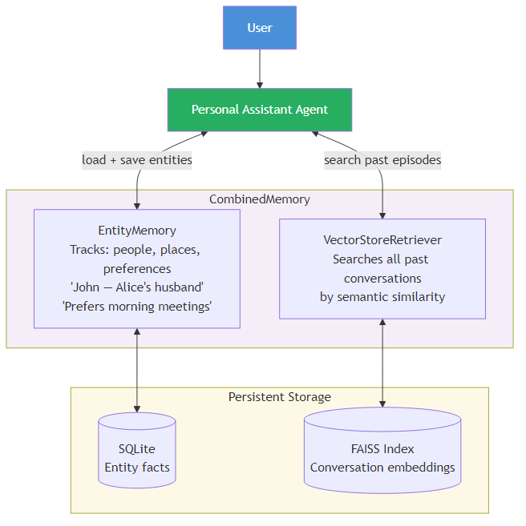

### Design Decisions

| Decision | Choice | Reason |
|----------|--------|--------|
| Entity tracking | `ConversationEntityMemory` | Builds a knowledge graph of people + preferences |
| Episodic recall | `VectorStoreRetrieverMemory` | Search all past conversations by meaning |
| Combine both | `CombinedMemory` | Use both simultaneously |
| Backend | SQLite (entities) + FAISS (vectors) | Local, zero infra, good for single user |

### Code

```python
from langchain.memory import (
    ConversationEntityMemory,
    VectorStoreRetrieverMemory,
    CombinedMemory
)
from langchain_community.vectorstores import FAISS
from langchain_anthropic import ChatAnthropic

llm = ChatAnthropic(model="claude-sonnet-4-6")

# Track entities — who/what the user mentions
entity_memory = ConversationEntityMemory(llm=llm)

# Search past conversations by meaning
vectorstore = FAISS.load_local("./my_assistant_memory", embeddings)
vector_memory = VectorStoreRetrieverMemory(
    retriever=vectorstore.as_retriever(search_kwargs={"k": 3})
)

# Use both
memory = CombinedMemory(memories=[entity_memory, vector_memory])
```

### Key Design Rules
1. **FAISS for single user, Pinecone for multiple users** — FAISS is a local file; Pinecone scales.
2. **Entity memory uses LLM calls** — choose a fast model.
3. **Save every conversation** to the vector store, even short ones — future recall is only as good as past saves.
4. **Add metadata** to vector records (date, topic) so you can filter by time if needed.

---

## 8. Case 4 — Coding Assistant

### Scenario
An IDE-integrated coding assistant. The conversation is always about the current code — recent context matters most, old context is usually irrelevant. Sessions are focused and short but may iterate over 20+ turns.

### Memory Architecture

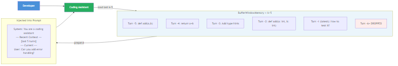

### Design Decisions

| Decision | Choice | Reason |
|----------|--------|--------|
| Memory type | `ConversationBufferWindowMemory` | Last k turns is what matters |
| Window size | `k=5` to `k=10` | Old code discussion is rarely useful |
| Backend | InMemory | Sessions are short, no need to persist |
| Persistence | None | Each file/feature is a fresh session |

### Code

```python
from langchain.memory import ConversationBufferWindowMemory

memory = ConversationBufferWindowMemory(
    k=6,                    # keep last 6 turns
    return_messages=True,   # return as Message objects
    memory_key="chat_history"
)
```

### Key Design Rules
1. **Don't use BufferMemory here** — a long debugging session will overflow the context window.
2. **k=5-10 is usually right** — the user is fixing one thing at a time, not referencing a conversation from 30 turns ago.
3. **Add the current file content as a system message**, not as memory — that's static context, not conversation history.
4. **If the user says "go back to what you suggested before"** and it's dropped from the window, that's acceptable UX — the window trade-off is explicit.

---

## 9. Case 5 — Research Agent

### Scenario
An agent that reads papers, scrapes websites, and builds a knowledge base over weeks. It needs to search everything it has ever discovered by meaning — not just recent turns. The knowledge base can grow to thousands of records.

### Memory Architecture

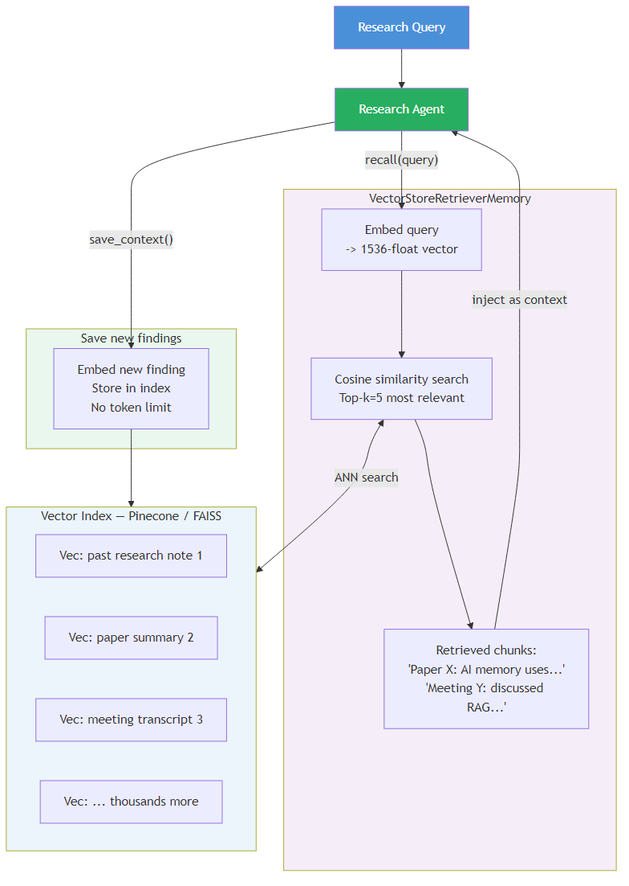

### Design Decisions

| Decision | Choice | Reason |
|----------|--------|--------|
| Memory type | `VectorStoreRetrieverMemory` | Semantic search across unlimited history |
| Backend | Pinecone or Chroma | Scales to millions of records |
| Top-k | `k=5` | Return 5 most relevant past findings |
| No buffer memory | — | Sequential history is not important here; semantic relevance is |

### Code

```python
from langchain.memory import VectorStoreRetrieverMemory
from langchain_community.vectorstores import Chroma
from langchain_openai import OpenAIEmbeddings

vectorstore = Chroma(
    collection_name="research_memory",
    embedding_function=OpenAIEmbeddings(),
    persist_directory="./research_db"
)

memory = VectorStoreRetrieverMemory(
    retriever=vectorstore.as_retriever(search_kwargs={"k": 5}),
    memory_key="relevant_history",
    return_docs=True
)
```

### Key Design Rules
1. **Save every finding immediately** — call `memory.save_context()` after every tool result.
2. **Add metadata** to each record: source URL, date, topic, confidence.
3. **Don't combine with BufferMemory** unless you also need a running conversation — they serve different purposes.
4. **Chroma for local dev, Pinecone for production** — Pinecone handles concurrent writes better.

---

## 10. Case 6 — Multi-Agent Crew

### Scenario
A crew of agents working together: a Researcher finds raw facts, an Analyst interprets them, a Writer drafts output. Each agent needs private memory. A Manager needs to see what everyone has found.

### Memory Architecture

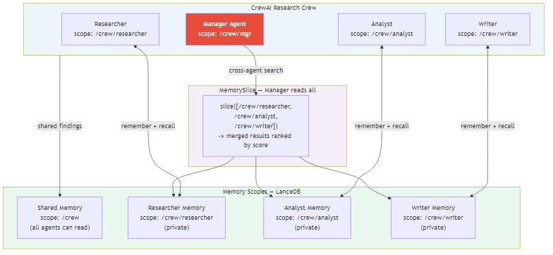

### Design Decisions

| Decision | Choice | Reason |
|----------|--------|--------|
| Framework | CrewAI | Built-in scoped isolation, MemorySlice |
| Agent isolation | Scope per agent: `/crew/researcher` | Agents can't overwrite each other |
| Shared findings | MemorySlice across all agent scopes | Manager sees everyone's work |
| Storage | LanceDB (local) or Qdrant (distributed) | Depends on team size |

### Code

```python
from crewai.memory import CrewMemory

memory = CrewMemory(storage="lancedb", path="./crew_memory")

# Researcher saves private findings
researcher_mem = memory.scope("/crew/researcher")
researcher_mem.remember("Company X revenue grew 40% YoY based on Q3 report")

# Analyst saves interpretation
analyst_mem = memory.scope("/crew/analyst")
analyst_mem.remember("Revenue growth driven by APAC expansion")

# Manager reads everything with MemorySlice
manager_mem = memory.slice(["/crew/researcher", "/crew/analyst"])
results = manager_mem.recall("What do we know about revenue?")
# Returns ranked results from both agents
```

### Key Design Rules
1. **Design scopes before coding** — plan the scope tree like a file system. `/crew/team-name/agent-name` is a good pattern.
2. **Use MemorySlice for coordination** — never let agents directly share a scope (they'll overwrite each other).
3. **Set importance on critical facts** — `remember(content, importance=0.9)` makes them surface first in recall.
4. **Call `drain_writes()`** before a recall that depends on recent saves — CrewAI saves are async by default.

### Scope Design Template

```
/crew
  /crew/shared         ← All agents can read; manager writes here
  /crew/researcher     ← Researcher's private memory
  /crew/analyst        ← Analyst's private memory
  /crew/writer         ← Writer's private memory
```

---

## 11. Case 7 — RAG + Chat Hybrid

### Scenario
A product assistant that answers questions using a company knowledge base (documents, FAQs), while also maintaining a conversational context so follow-up questions work naturally ("What about the pricing for that plan?").

### Memory Architecture

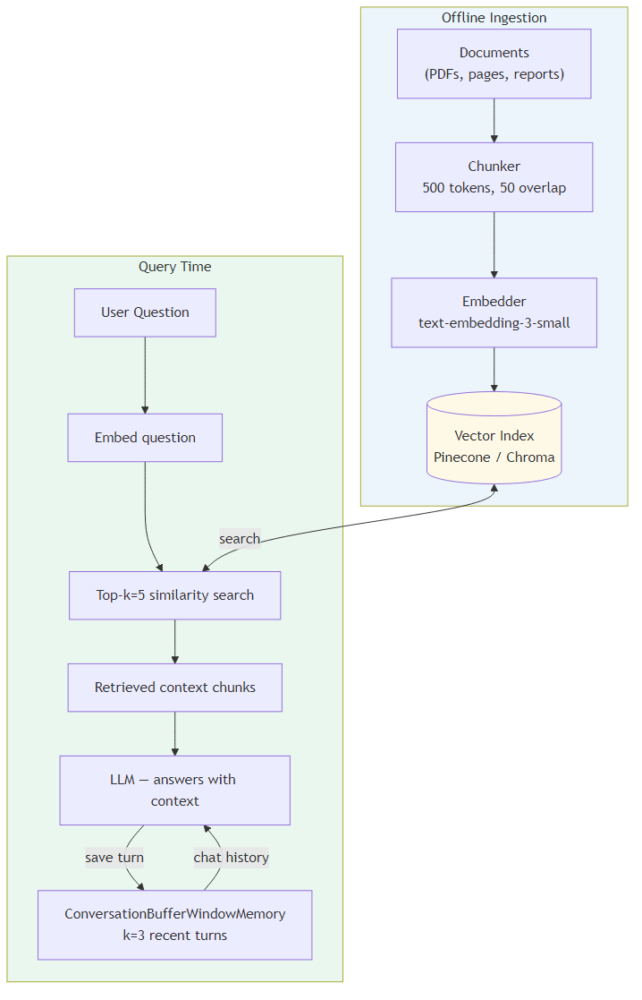

### Design Decisions

| Decision | Choice | Reason |
|----------|--------|--------|
| Document retrieval | VectorStore (Pinecone/Chroma) | Semantic search over documents |
| Conversation memory | `ConversationBufferWindowMemory` k=3 | Short window for follow-up resolution |
| Ingestion | Offline chunking + embedding | Documents don't change every turn |
| Chunk size | 500 tokens, 50 token overlap | Balance context vs. precision |

### Code

```python
from langchain.chains import ConversationalRetrievalChain
from langchain.memory import ConversationBufferWindowMemory
from langchain_community.vectorstores import Chroma
from langchain_anthropic import ChatAnthropic

# Document retriever (built offline)
vectorstore = Chroma.from_documents(documents, embeddings)
retriever = vectorstore.as_retriever(search_kwargs={"k": 4})

# Short conversation memory for follow-ups
memory = ConversationBufferWindowMemory(
    k=3,
    memory_key="chat_history",
    return_messages=True,
    output_key="answer"
)

# Combine both
chain = ConversationalRetrievalChain.from_llm(
    llm=ChatAnthropic(model="claude-sonnet-4-6"),
    retriever=retriever,
    memory=memory,
    return_source_documents=True
)

result = chain({"question": "What plans do you offer?"})
result = chain({"question": "What about the pricing?"})  # uses memory to resolve "that"
```

### Key Design Rules
1. **Separate retrieval from conversation memory** — these solve different problems.
2. **Keep conversation window small (k=3)** — only needed for pronoun resolution and follow-ups.
3. **Ingest documents offline** — never embed documents at query time.
4. **Return source documents** so users can verify where answers come from.
5. **Add metadata filters** — filter by product, date, or category to avoid irrelevant chunks.

---

## 12. Case 8 — Managed Memory with Supermemory

### Scenario
You are building a user-facing product — a personal assistant, customer support bot, or onboarding agent — and you do not want to build and operate memory infrastructure. You need smart conflict resolution (users update their info over time), cross-session persistence, and semantic recall, all without managing Redis, FAISS, or vector databases.

### Memory Architecture

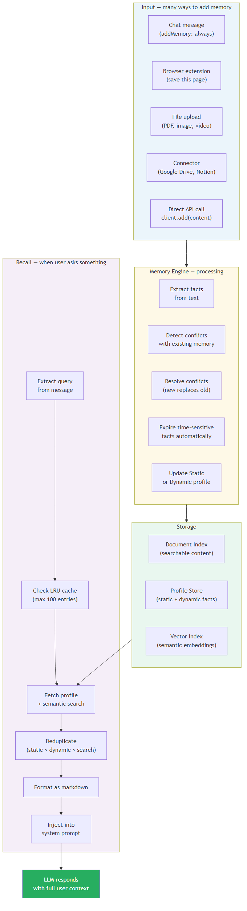

### Design Decisions

| Decision | Choice | Reason |
|----------|--------|--------|
| Memory framework | Supermemory managed service | Zero infra, automatic extraction + conflict resolution |
| Retrieval mode | `full` | Profile (who the user is) + semantic search (what's relevant now) |
| Auto-save | `addMemory: "always"` | Every conversation saved automatically |
| User isolation | `containerTag` per user | Built-in; no manual session management |
| Conflict handling | Automatic (new > old) | User says "I moved" — old location replaced immediately |

### Code

```typescript
import { withSupermemory } from "@supermemory/tools/ai-sdk"
import { anthropic } from "@ai-sdk/anthropic"
import { generateText } from "ai"

// Wrap your model — memory is now automatic
const model = withSupermemory(
  anthropic("claude-sonnet-4-6"),
  "user-alice",              // one container tag per user
  {
    mode: "full",            // profile + semantic search
    addMemory: "always"      // auto-save every conversation
  }
)

const result = await generateText({
  model,
  messages: [{ role: "user", content: "Help me with my React migration" }]
})
// AI already knows: Alice is a senior dev, currently leading React migration,
// team of 4, deadline end of quarter — all from past conversations
```

### What Supermemory injects automatically

```
## What I know about Alice (Profile)
Static:
  - Senior software engineer at Acme
  - 7 years of React experience
  - Prefers direct, concise communication

Dynamic:
  - Currently leading React migration project
  - Deadline: end of quarter
  - Team size: 4 developers

## Relevant to this question
  - "Two team members worried about timeline" (last meeting, 3 days ago)
  - "Migration scope: replace class components with hooks"
  - "Alice prefers async team communication"
```

### How Static vs Dynamic memory looks over time

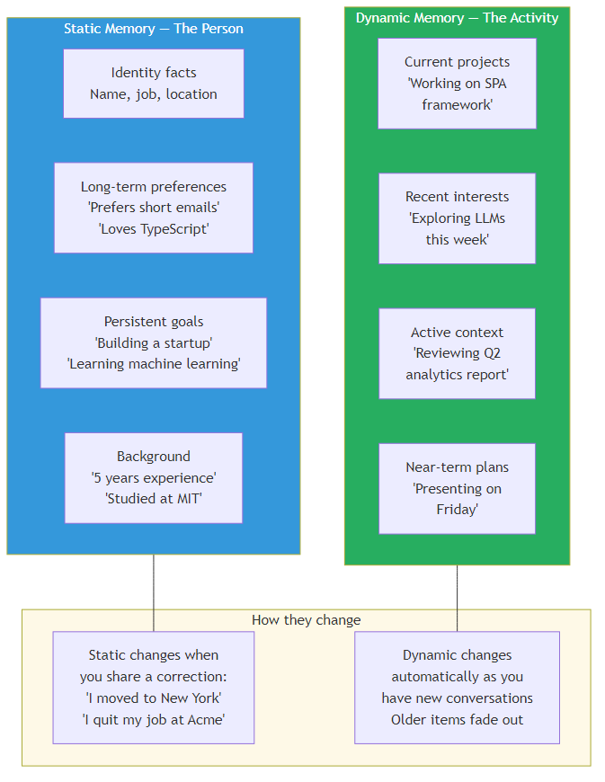

### Key Design Rules
1. **Use `full` mode for most user-facing products** — you almost always need both "who the user is" and "what's relevant now."
2. **One `containerTag` per user** — never share tags across users.
3. **Use a project tag for shared team context** — `"sm_project_x"` lets multiple users access the same knowledge.
4. **Call `client.add()` for important one-off facts** — for facts you know are important but may not surface from conversation alone.
5. **Supermemory does NOT replace RAG** — for large private document corpora, combine Supermemory (user memory) with your own vector store (document retrieval).

### When to choose Supermemory over LangChain/CrewAI

| Choose Supermemory when | Choose LangChain/CrewAI when |
|------------------------|------------------------------|
| You want working memory in hours, not days | You need full data sovereignty (data can't leave your infra) |
| Users update their info often (conflict resolution matters) | You have complex custom memory logic |
| You are building a product, not infrastructure | You are already in a LangChain or CrewAI ecosystem |
| Small team, limited DevOps capacity | You need fine-grained control over every memory decision |

---

## 13. Anti-Patterns to Avoid

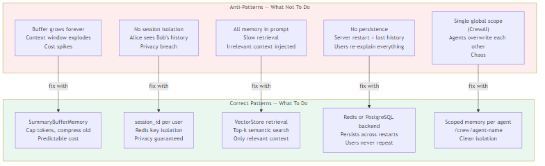

### The 5 Most Common Mistakes

| Anti-Pattern | What Happens | Fix |
|-------------|--------------|-----|
| **Buffer grows forever** | Token count explodes, costs spike, context window overflow | Use `SummaryBufferMemory` with `max_token_limit` |
| **One memory for all users** | Alice sees Bob's history, privacy violation | Always use `session_id` per user |
| **All history in prompt** | Irrelevant 10-turn-old messages crowd out relevant context | Use `VectorStoreRetrieverMemory` for semantic retrieval |
| **No persistence** | Server restart = all memory lost, users re-explain everything | Use Redis, PostgreSQL, or SQLite backend |
| **Global scope in CrewAI** | Agents overwrite each other, facts get corrupted | Create one scope path per agent |

### Red Flags During Design

- "I'll just use BufferMemory for now and fix it later" — later never comes; token costs will force the fix in production.
- "All agents write to the same memory key" — this is a race condition waiting to happen.
- "We don't need persistence, users can just repeat themselves" — users will not tolerate this.
- "Let's put the entire knowledge base in the system prompt" — this is not RAG, this is expensive and ineffective.

---

## 14. Quick Reference Card

### Pick Your Memory Type

| Your situation | LangChain | CrewAI | Supermemory |
|----------------|-----------|--------|-------------|
| Quick prototype | `ConversationBufferMemory` | — | `withSupermemory(model, userId)` |
| Short sessions, no persistence | `BufferWindowMemory` (k=5) | — | `mode: "profile"` |
| Long sessions, token cap needed | `SummaryBufferMemory` | CrewAI Short-term | Auto (managed, no token limit concern) |
| Track people and facts | `EntityMemory` | CrewAI Entity scope | Static Memory (auto-extracted) |
| Search all past conversations | `VectorStoreRetrieverMemory` | CrewAI Long-term | `mode: "query"` or `"full"` |
| Many users, isolated sessions | Any + Redis + `session_id` | — | `containerTag` per user (built-in) |
| Multiple agents coordinating | `CombinedMemory` + `ReadOnlySharedMemory` | Scoped Memory + MemorySlice | Shared `containerTag` |
| Documents + conversation | `ConversationalRetrievalChain` | RAG + CrewAI LT | Document Memory + `mode: "full"` |
| Static system rules | `SimpleMemory` | System prompt | System prompt (Supermemory doesn't replace this) |
| Cross-session user identity | Manual EntityMemory + SQLite | — | Static Memory (automatic, persistent) |
| Conflict resolution (user moved, changed job) | Manual | Analyze Engine | Automatic (new > old, built-in) |

### Pick Your Storage Backend

| Situation | Backend | Notes |
|-----------|---------|-------|
| Local dev / prototype | InMemory (dict) | Lost on restart |
| Single user, persistent | SQLite | File-based, zero infra |
| Multi-user, fast | Redis | Sub-millisecond, set TTL |
| Multi-user, queryable | PostgreSQL | SQL queries on history |
| Semantic search, local | FAISS | File-based vector index |
| Semantic search, production | Pinecone / Chroma | Distributed, scalable |
| CrewAI, local | LanceDB | Built-in to CrewAI |
| CrewAI, distributed | Qdrant Edge | Multi-node support |
| No infra at all | **Supermemory API** | Fully managed; containerTag per user |

### The 7 Design Rules (Never Break These)

1. **One memory object per user** — never share across sessions.
2. **Cap your token budget** — always set `max_token_limit` for buffer memories.
3. **Use a cheap model for memory ops** — Haiku for summarization, not Opus.
4. **Persist what matters** — if users would be upset to repeat it, store it.
5. **Scope your agents** — in multi-agent systems, private scope first, share explicitly.
6. **Search by meaning, not keyword** — use vector retrieval, not string search, for recall.
7. **Don't build memory infra if you don't need to** — if your use case fits Supermemory's model (user-facing product, need conflict resolution, cross-session identity), start managed and only move to self-hosted if data sovereignty demands it.

---

## Summary — The Design Process

```
1. Fill the requirements checklist (Section 3)
2. Follow the decision flow (Section 4)
3. Find your case (Sections 5-12)
4. Check anti-patterns (Section 13)
5. Confirm storage backend (Section 14)
```

**The three paths:**

| If you are... | Start with |
|---------------|-----------|
| Building a prototype or internal tool | LangChain + BufferMemory |
| Building a multi-agent system | CrewAI + scoped memory |
| Building a user-facing product fast | Supermemory + `withSupermemory()` |

> **The core truth:** Memory design is not about picking the fanciest component. It is about understanding what the agent needs to remember, when it needs it, and who else needs to see it. Start simple, measure the gaps, and add complexity only where reality demands it. If you can avoid building memory infrastructure entirely — do it.
