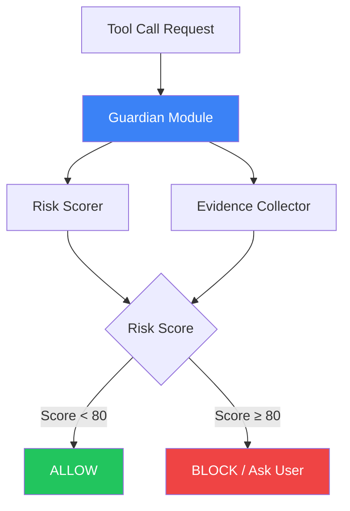
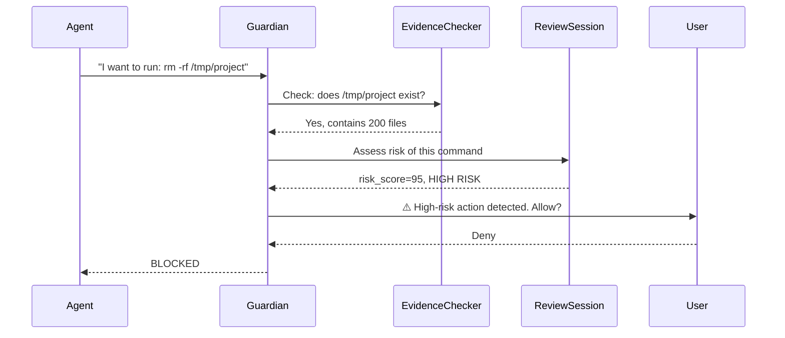
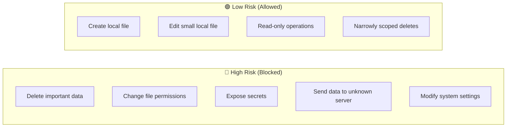

# Codex — GuardRails

## Context

**Codex** is OpenAI's CLI coding agent. It runs on your local machine, reads your files, writes code, and executes shell commands on your behalf.

Because it can **delete files, run scripts, and change system settings**, Codex needs a safety layer to stop it from doing something dangerous by accident.

That safety layer is called the **Guardian**.

---

## What Are GuardRails?

GuardRails in Codex = a **Guardian module** that checks every tool call before it runs.

Think of it like a security guard at the door:

```
Agent wants to run a command
        ↓
  Guardian reviews it
        ↓
  Is it risky? → YES → BLOCK (or ask user)
                 NO  → ALLOW
```

---

## Why Do We Need GuardRails?

| Without GuardRails | With GuardRails |
|--------------------|-----------------|
| Agent deletes wrong folder | Blocked before it runs |
| Agent changes file permissions | Flagged as high risk |
| Agent sends secrets to unknown server | Caught and rejected |
| No visibility into what agent does | Full audit trail |

The core problem: **AI agents make mistakes**. GuardRails turn mistakes into safe failures instead of disasters.

---

## Main Components (4 Parts)



### 1. Guardian Module (`guardian/mod.rs`)
The main controller. Receives every tool call, orchestrates the review process.

### 2. Risk Scorer
Assigns a score from **0 to 100** to each action.

| Score Range | Meaning | Action |
|-------------|---------|--------|
| 0–30 | Low risk | Auto-allow |
| 31–79 | Medium risk | Allow with caution |
| 80–100 | High risk | Block or require approval |

Default threshold: **80**

### 3. Evidence Collector
Before deciding, the Guardian does quick **read-only checks**:
- Does the target file/folder actually exist?
- What is the scope of the destructive command?
- Is this path within the user-authorized area?

It treats the AI's own transcript as **untrusted**. It verifies facts independently.

### 4. Approval Session (`review_session.rs`)
A separate LLM session dedicated only to safety review. It does NOT share context with the main agent — avoiding bias.

---

## How They Work Together



**Timeout:** If the review takes longer than **90 seconds**, the action is automatically denied.

---

## Risk Categories



---

## Summary

- **What:** A Guardian module with risk scoring for every agent action
- **Why:** Prevent irreversible mistakes from AI agent execution
- **Components:** Guardian Module → Evidence Collector → Risk Scorer → Approval Session
- **Default block threshold:** Score ≥ 80 out of 100
- **Built in:** Rust (`codex-rs/core/src/guardian/`)
