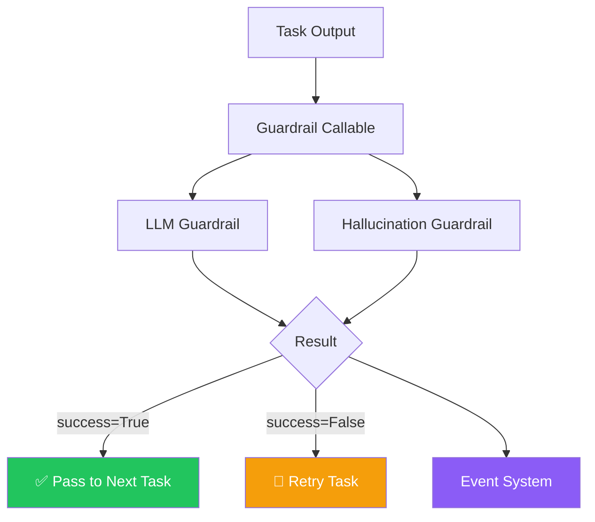
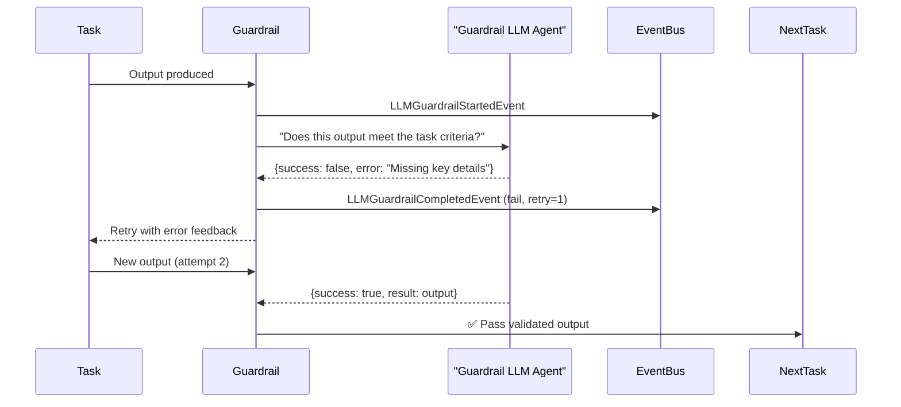
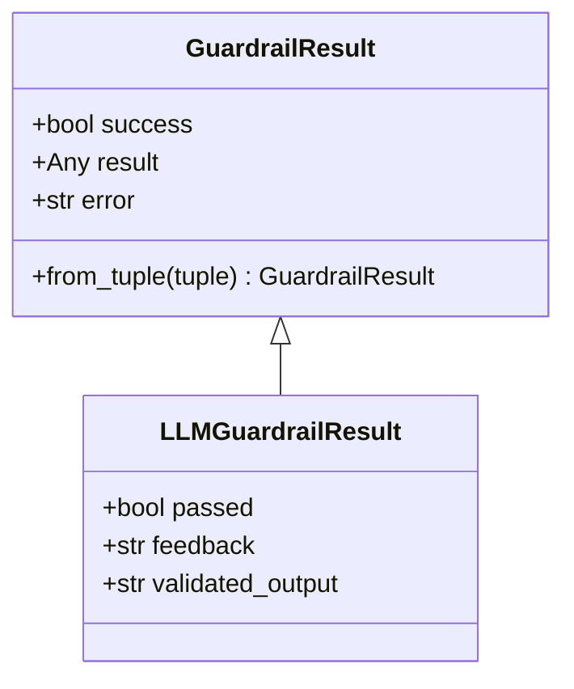
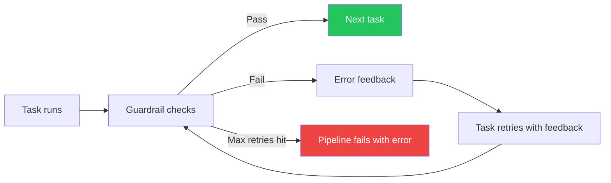

# CrewAI — GuardRails

## Context

**CrewAI** is a Python framework for building teams of AI agents ("crews") that collaborate to complete tasks. Each agent has a role, tools, and assigned tasks.

A crew might have agents like: **Researcher → Writer → Editor**. Each hands off work to the next.

The problem: how do you ensure that what one agent produces is actually **correct and trustworthy** before the next agent uses it?

That is what GuardRails solve.

---

## What Are GuardRails?

GuardRails in CrewAI = **validators attached to tasks**.

After a task finishes, the guardrail checks: *"Is this output good enough to pass on?"*

```
Task runs → Output produced → Guardrail checks → Pass? → Next task
                                                   Fail? → Retry
```

---

## Why Do We Need GuardRails?

| Without GuardRails | With GuardRails |
|--------------------|-----------------|
| Hallucinated facts flow downstream | Caught before next agent sees them |
| Wrong format passed to next tool | Validated at handoff |
| No feedback to fix bad output | Clear error message for retry |
| Silent failures cascade | Fail fast with audit trail |

In multi-agent pipelines, **one bad output ruins everything downstream**. GuardRails are the quality gates between steps.

---

## Main Components (4 Parts)



### 1. Guardrail Callable (`utilities/guardrail.py`)
The core interface. Any function that takes a task output and returns `(bool, result_or_error)`.

```python
# Simple example
def check_word_count(output) -> tuple[bool, Any]:
    if len(output.raw.split()) < 100:
        return (False, "Output too short, needs at least 100 words")
    return (True, output)
```

### 2. LLM Guardrail (`tasks/llm_guardrail.py`)
Uses an LLM to validate output against the task description.

- Creates a dedicated "Guardrail Agent" — separate from the main crew
- Compares the output against what the task was supposed to achieve
- Returns a structured pass/fail result

### 3. Hallucination Guardrail (`tasks/hallucination_guardrail.py`)
Checks if the output contains **invented facts** not supported by the context.

- Enterprise/premium feature
- Validates claims against source materials
- Configurable confidence threshold

### 4. Event System (`events/types/llm_guardrail_events.py`)
Emits events so you can observe what's happening:
- `LLMGuardrailStartedEvent` — validation began
- `LLMGuardrailCompletedEvent` — validation done, with result

---

## How They Work Together



---

## GuardRail Result Structure



When `success = True` → result flows to next task
When `success = False` → error message sent back to task as retry feedback

---

## Retry Flow



---

## Summary

- **What:** Callable validators attached to each task in a crew
- **Why:** Catch bad/hallucinated output before it flows to the next agent
- **Components:** Guardrail Callable → LLM Guardrail → Hallucination Guardrail → Event System
- **Result format:** `(True, result)` = pass | `(False, error_message)` = fail + retry
- **Built in:** Python (`crewai/src/crewai/utilities/guardrail.py`)
