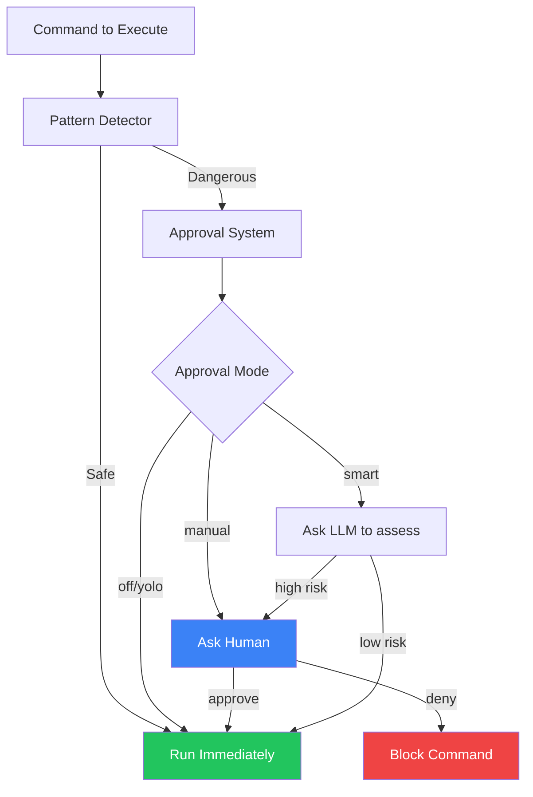
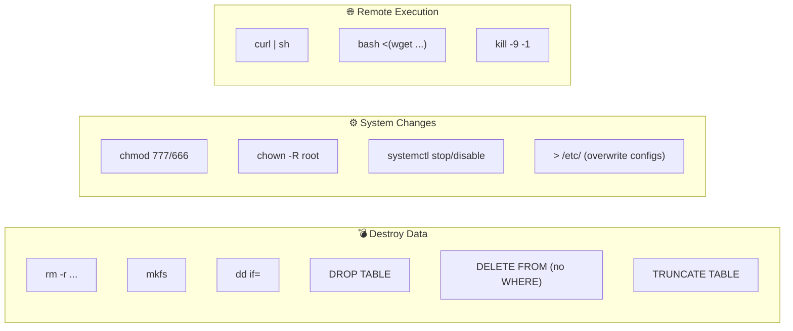
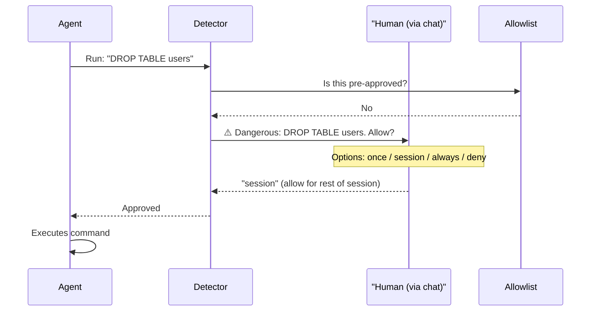
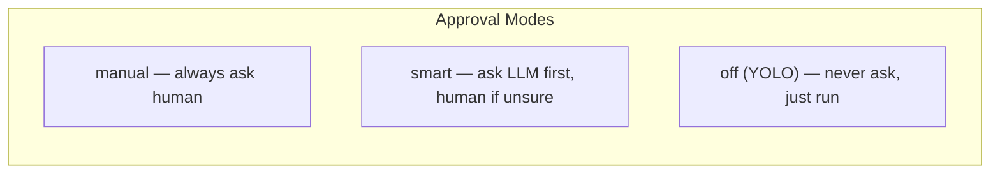
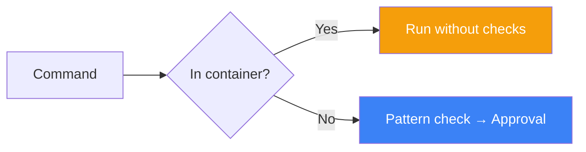

# Hermes Agent — GuardRails

## Context

**Hermes Agent** (by Nous Research) is a self-improving AI agent that learns new skills from experience. It runs on servers, VPS, and cloud platforms, and can be accessed via Telegram, Discord, Slack, and other chat platforms.

Because Hermes executes real shell commands on real servers, it needs a way to stop **dangerous operations** before they cause irreversible damage.

---

## What Are GuardRails?

GuardRails in Hermes = a **dangerous command detection + approval system**.

Before any command runs, Hermes checks it against a list of known-dangerous patterns. If it matches, it stops and asks for permission.

```
Command about to run
        ↓
Pattern check (does it look dangerous?)
        ↓
YES → Ask human to approve  →  Approve / Deny
NO  → Run it
```

---

## Why Do We Need GuardRails?

| Scenario | Without GuardRails | With GuardRails |
|----------|-------------------|-----------------|
| Agent runs `rm -rf /` | Server destroyed | Blocked, user alerted |
| Agent drops a database table | Data permanently lost | Approval required |
| Agent runs `curl \| sh` from internet | Malware executed | Flagged and blocked |
| Agent kills all processes | System crash | Human must approve |

Hermes is a **persistent agent on live servers**. Mistakes aren't just bugs — they can delete production data or crash systems.

---

## Main Components (4 Parts)



### 1. Pattern Detector
Checks the command against known-dangerous patterns before execution.

### 2. Approval System
Routes the command to the right approval flow based on mode.

### 3. Allowlist (`~/.hermes/config.yaml`)
Stores commands you've already approved as "always allow". Hermes won't ask again.

### 4. YOLO Mode
A way to disable all guardrails for the session (use with caution).

---

## Dangerous Patterns Detected



---

## How They Work Together



---

## Approval Options

| Option | What it does |
|--------|-------------|
| **once** | Allow this one time only |
| **session** | Allow for the rest of this session |
| **always** | Save to allowlist, never ask again |
| **deny** | Block it (default if no response in 60s) |

---

## Approval Modes



YOLO mode can be toggled:
- CLI: `hermes --yolo`
- Chat command: `/yolo`
- Env variable: `HERMES_YOLO_MODE=1`

---

## Container Bypass

When Hermes detects it's running inside a container (Docker, Singularity, Modal), it skips the dangerous command checks. The container itself is the safety boundary.



---

## Summary

- **What:** Pattern-based dangerous command detection with human-in-the-loop approval
- **Why:** Prevent irreversible damage on live servers from agent mistakes
- **Components:** Pattern Detector → Approval System → Allowlist → YOLO Mode
- **Default behavior:** Prompt user, deny if no response within 60 seconds
- **Built in:** Python (`hermes-agent/`) with chat-based approval flow
