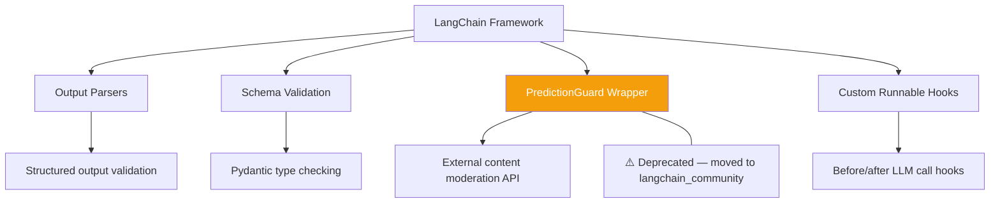
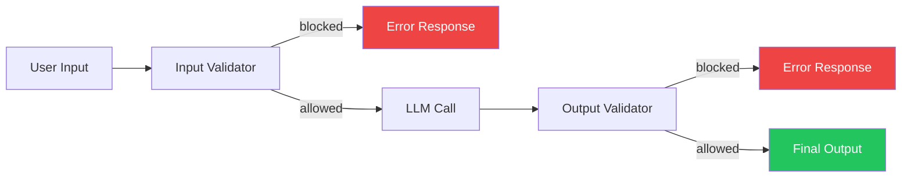

# LangChain — GuardRails

## Context

**LangChain** is a framework for building LLM-powered applications and agents. It provides components for chaining together: LLMs, tools, memory, retrievers, and agents.

LangChain is primarily a **plumbing framework** — it connects pieces together. It does not have an opinionated, built-in guardrails system.

---

## What Are GuardRails in LangChain?

LangChain does **not have native guardrails**.

Instead, it relies on:
1. **External services** (like PredictionGuard) integrated as LLM wrappers
2. **Custom validation** you add yourself at the chain level
3. **Third-party libraries** like `guardrails-ai` or `nemo-guardrails`

```
LangChain Chain
      ↓
  Your custom validator  ← you must build this
      ↓
   LLM call
      ↓
  Output parser / validator  ← partially provided
```

---

## Why Does This Matter?

| Expectation | Reality |
|------------|---------|
| "LangChain has guardrails built-in" | ❌ No native guardrails |
| "I can add my own validators" | ✅ Yes, via custom runnables |
| "There's a guardrail integration" | ✅ PredictionGuard (deprecated in core, moved to community) |
| "LangGraph has guardrails" | ✅ Via custom node logic only |

If you want guardrails with LangChain, **you integrate an external solution**.

---

## What LangChain Does Provide



### 1. Output Parsers
Parse and **validate the format** of LLM outputs.
- `PydanticOutputParser` — validate against a schema
- `JsonOutputParser` — enforce JSON structure
- If validation fails → retry or raise error

### 2. PredictionGuard (Deprecated)
Was a wrapper for the external **PredictionGuard** service:
- Content filtering
- Factual consistency checking
- PII detection

Now moved to `langchain_community.llms.PredictionGuard`.
Not a native guardrail — just a wrapper for an external API.

### 3. Custom Runnable
You can insert validators anywhere in a chain using `RunnableLambda`:

```python
from langchain_core.runnables import RunnableLambda

def my_guardrail(output: str) -> str:
    if "harmful content" in output.lower():
        raise ValueError("Output blocked by guardrail")
    return output

chain = llm | RunnableLambda(my_guardrail) | next_step
```

---

## How to Add GuardRails (Recommended Pattern)



This is a **custom pattern** — LangChain does not enforce or provide this out of the box.

---

## Third-Party GuardRail Libraries for LangChain

| Library | What it does |
|---------|-------------|
| `guardrails-ai` | Validate output structure, format, content |
| `nemo-guardrails` (NVIDIA) | Conversation flow control and content policies |
| `PredictionGuard` | Content moderation, factual consistency |
| LLM Judge patterns | Use a second LLM to evaluate the first LLM's output |

---

## Summary

- **What:** No built-in guardrails — relies on external services or custom code
- **Why it matters:** You are responsible for adding guardrails if you use LangChain
- **What's provided:** Output parsers, schema validation, and an external PredictionGuard wrapper
- **Recommendation:** Use `guardrails-ai` or `nemo-guardrails` alongside LangChain
- **Built in:** Python (`langchain/`) — guardrail support is intentionally delegated to integrations
