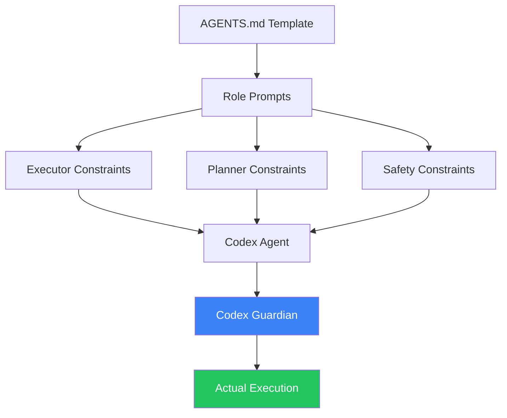
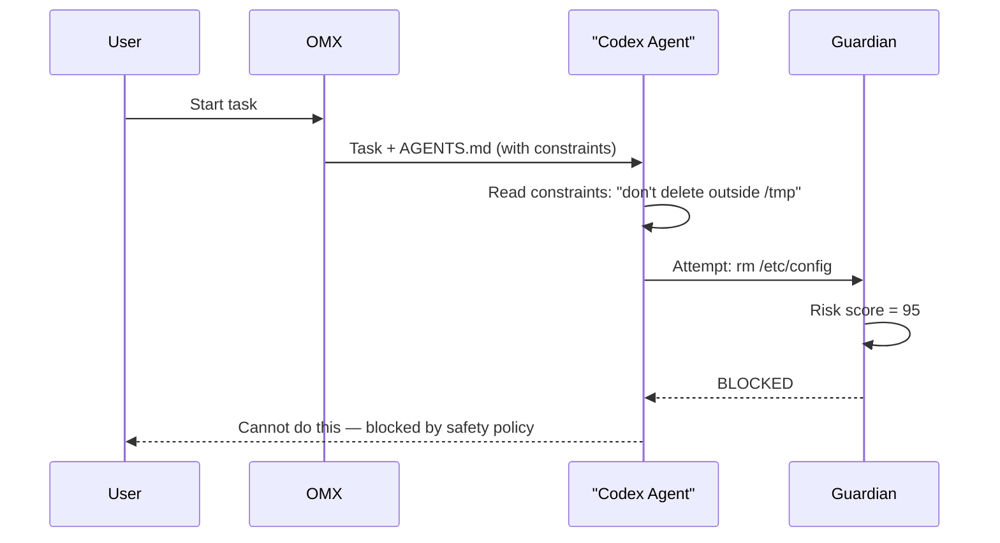

# Oh-My-Codex (OMX) — GuardRails

## Context

**Oh-My-Codex (OMX)** is a workflow layer that sits on top of the Codex CLI. It adds better prompts, structured workflows, and role-based agent guidance — while keeping Codex as the actual execution engine.

Think of OMX as a **set of instructions and rules** given to the Codex agent to shape how it behaves.

---

## What Are GuardRails in OMX?

OMX does **not have runtime guardrails**.

Instead, it uses **prompt-based constraints** — safety rules written in plain text that the agent reads and is supposed to follow.

```
Agent receives prompt with constraints
        ↓
Agent reads: "Do not do X. Always check Y first."
        ↓
Agent follows rules (based on LLM understanding, not code enforcement)
```

This is **behavioral guidance**, not technical enforcement.

---

## Why Does This Matter?

| Technical GuardRail | Prompt-Based Constraint (OMX approach) |
|--------------------|-----------------------------------------|
| Code checks the action | LLM interprets the instruction |
| Always enforced | Depends on model following instructions |
| Hard stop / block | Soft guidance / suggestion |
| No bypass possible | Can drift with complex prompts |

OMX keeps things simple and flexible. The actual safety enforcement is **delegated to Codex's Guardian** (see `01_codex_guardrails.md`).

---

## Main Components (3 Parts)



### 1. AGENTS.md Template
A markdown file given to the agent as its operating guide. Defines:
- What the agent is allowed to do
- What it should verify before acting
- Behavioral constraints for each role

### 2. Role-Specific Constraints
Different agent roles get different constraint levels:

| Role | Key Constraint |
|------|---------------|
| **Executor** | Treat newer user instructions as local overrides to earlier plans |
| **Planner** | Preserve non-conflicting constraints from previous steps |
| **Reviewer** | Validate output before signing off |

### 3. Guidance Schema (`docs/guidance-schema.md`)
Defines the structure of how guidance/constraints are written and passed to agents. Includes a "safety constraints" section per agent.

---

## How Constraints Flow



Note: OMX's prompt constraints guide the agent's **intent**. The Codex Guardian handles **enforcement**.

---

## What OMX Constraints Look Like

Example from executor constraints:

```markdown
## Safety Constraints
- Never overwrite files outside the project directory without explicit user confirmation
- Always show a diff before applying changes to existing files
- If a command could affect system state, pause and confirm with the user
- Treat user instructions in later messages as overrides to earlier plans
```

These are **plain English rules** embedded in the agent's system prompt.

---

## OMX + Codex: Two Layers


---

## Summary

- **What:** Prompt-based behavioral constraints, not runtime guardrails
- **Why it matters:** OMX shapes agent *intent*; Codex Guardian handles *enforcement*
- **Components:** AGENTS.md Template → Role Prompts (Executor/Planner) → Guidance Schema
- **Actual safety:** Delegated to Codex's Guardian module
- **Built in:** Markdown files and prompt templates (`oh-my-codex/docs/`, `oh-my-codex/prompts/`)
