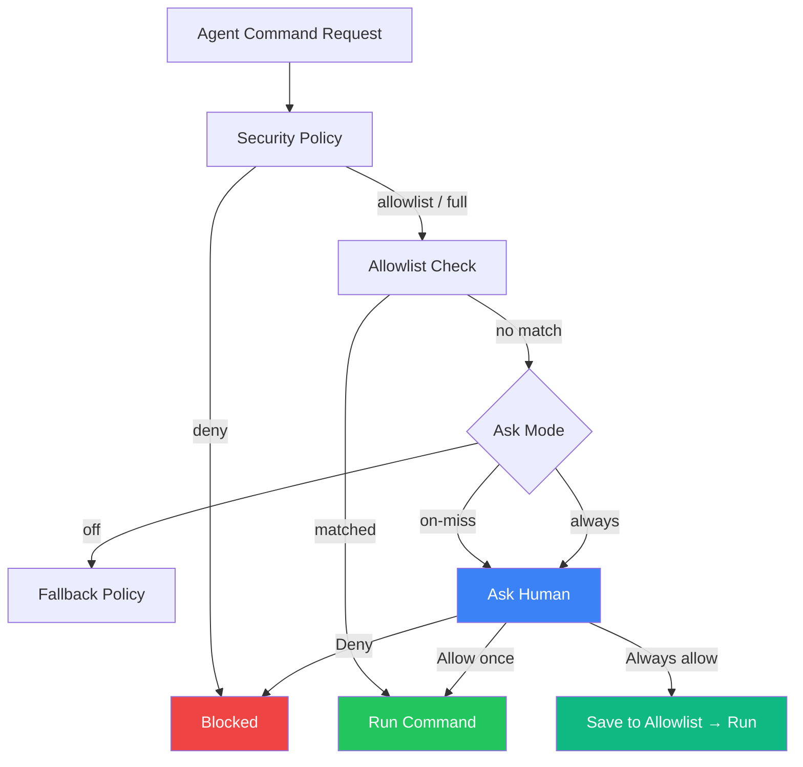
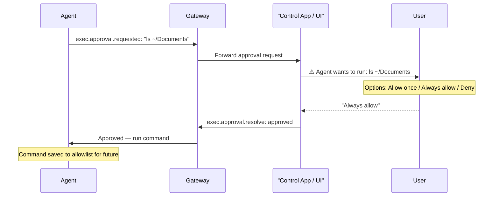
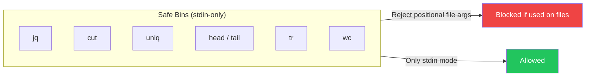
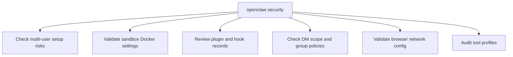

# OpenClaw — GuardRails

## Context

**OpenClaw** is a personal AI assistant that runs on your own devices and talks to you through WhatsApp, Telegram, Slack, Discord, and other chat platforms.

Because OpenClaw can execute commands on your computer or server (via a "node host"), it needs a way to control **which commands are allowed to run** — and when a human must approve first.

---

## What Are GuardRails?

GuardRails in OpenClaw = **Exec Approvals** — a three-layer safety system that controls command execution.

```
Agent wants to run a command
        ↓
Layer 1: Security Policy — is execution even allowed?
        ↓
Layer 2: Allowlist — is this specific command pre-approved?
        ↓
Layer 3: Ask Human — prompt user if still unsure
        ↓
Run or Block
```

All three layers must agree before a command runs.

---

## Why Do We Need GuardRails?

| Without GuardRails | With GuardRails |
|--------------------|-----------------|
| Any agent can run any command | Only approved commands run |
| Rogue plugin could execute system commands | Blocked at policy layer |
| No audit of what ran | Full command history with timestamps |
| Hard to trust AI agents on your computer | Clear approval flow builds trust |

OpenClaw runs on **your personal machine**. Every command it executes affects your real files and system.

---

## Main Components (4 Parts)



### 1. Security Policy
Top-level setting that controls the overall posture.

| Policy | Meaning |
|--------|---------|
| `deny` | Block ALL exec requests |
| `allowlist` | Only run pre-approved commands |
| `full` | Allow everything |

Default: `deny` (most restrictive)

### 2. Allowlist
A list of pre-approved command patterns per agent.

- Uses **glob patterns** (e.g., `~/Projects/**/bin/rg`)
- Case-insensitive matching
- Tracks: last used time, exact command, resolved path
- Per-agent configuration

### 3. Ask Mode
Determines when to prompt the human.

| Ask Mode | When it prompts |
|----------|----------------|
| `off` | Never — just apply policy |
| `on-miss` | Only when command not in allowlist |
| `always` | Always ask, even for allowlisted commands |

### 4. Ask Fallback
What to do when the user interface is not available (e.g., headless server, no UI open).

| Fallback | Behavior |
|----------|---------|
| `deny` | Block command |
| `allowlist` | Allow only if allowlisted |
| `full` | Allow everything |

---

## How They Work Together



---

## Safe Bins (Stdin-Only Whitelist)

OpenClaw has a list of commands considered safe for stdin-only use: `jq`, `cut`, `uniq`, `head`, `tail`, `tr`, `wc`.

These commands are safe because they:
- Only read from stdin (not files on disk)
- Cannot write or modify files
- Have restricted flag policies enforced



---

## Security Audit Command

OpenClaw provides a security audit tool (`openclaw security`) that checks your configuration:



---

## Config Example

```json
{
  "defaults": {
    "security": "deny",
    "ask": "on-miss",
    "askFallback": "deny"
  },
  "agents": {
    "main": {
      "security": "allowlist",
      "allowlist": [
        {
          "pattern": "~/Projects/**/bin/rg",
          "lastResolvedPath": "/Users/user/Projects/.../bin/rg"
        }
      ]
    }
  }
}
```

---

## Summary

- **What:** Three-layer exec approval system: Policy → Allowlist → Ask Human
- **Why:** Control exactly which commands your personal AI can run on your machine
- **Components:** Security Policy → Allowlist → Ask Mode → Ask Fallback
- **Default:** Deny all, ask on unknown commands
- **Built in:** TypeScript (`openclaw-main/extensions/`) + config JSON
