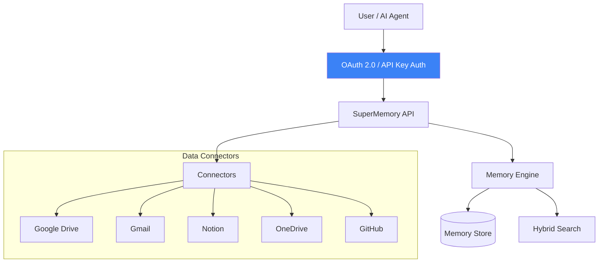
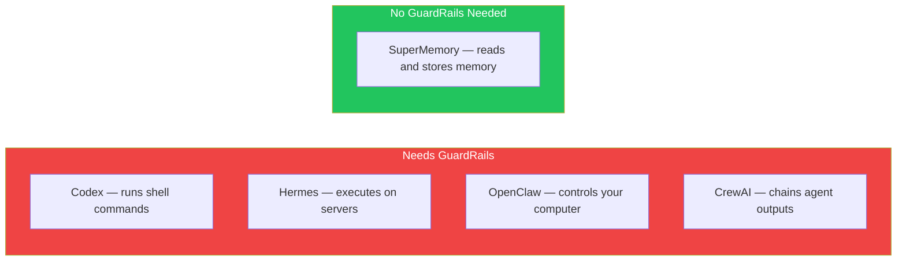
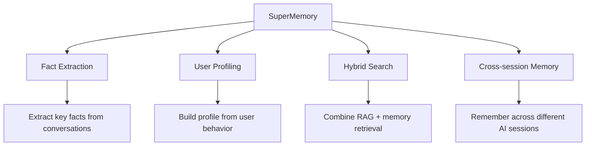

# SuperMemory — GuardRails

## Context

**SuperMemory** is a memory and context engine for AI. It stores facts, user preferences, and conversation history across sessions. It connects to data sources like Google Drive, Gmail, Notion, OneDrive, and GitHub to build a persistent memory layer for AI assistants.

SuperMemory is not an agent that executes commands. It is a **storage and retrieval service**.

---

## Does SuperMemory Have GuardRails?

**No — SuperMemory does not have guardrails.**

It is a memory store, not an action executor. There is no concept of "dangerous operations" to guard against.

```
AI Agent asks SuperMemory: "What did the user say about their project last week?"
SuperMemory answers: "They mentioned the deadline is Friday."

No commands executed. No risky actions. No guardrails needed.
```

---

## What SuperMemory Has Instead

SuperMemory has **access control and API security**, not guardrails:



| Security Feature | Purpose |
|-----------------|---------|
| OAuth 2.0 | Authenticate users to connect data sources |
| API Keys | Authenticate AI agents accessing memory |
| Per-user isolation | Each user's memory is separate |
| Data connector scopes | Only access what's authorized |

---

## Why No GuardRails?

Guardrails are needed when an agent can **cause harm** through actions. SuperMemory only:

1. **Reads** from connected data sources
2. **Stores** facts and user preferences
3. **Retrieves** relevant context for queries



---

## What SuperMemory Focuses On



---

## Summary

- **GuardRails:** ❌ Not supported — not applicable to a memory service
- **What it has instead:** OAuth/API key access control, per-user isolation
- **Why no guardrails needed:** SuperMemory only reads and stores data — it does not execute commands or take actions
- **Built in:** TypeScript/API (`SuperMemory/`)

---

## Quick Reference: GuardRails Across All Libraries

| Library | Has GuardRails | Type |
|---------|--------------|------|
| Codex | ✅ Yes | Risk scoring Guardian module |
| CrewAI | ✅ Yes | Task output validation |
| Hermes Agent | ✅ Yes | Dangerous command approval |
| OpenClaw | ✅ Yes | Exec approval + allowlist |
| LangChain | ⚠️ Partial | External integrations only |
| Oh-My-Codex | ⚠️ Soft | Prompt-based constraints only |
| SuperMemory | ❌ No | Not applicable (memory store) |
