# GuardRails Design — Overall Guide

## Context

This document synthesizes guardrails patterns from 7 real agent frameworks (Codex, CrewAI, Hermes, OpenClaw, LangChain, Oh-My-Codex, SuperMemory).

It answers:
- **What** types of guardrails exist
- **Why** we need them
- **How** each type works
- **How to think** when designing guardrails for your own system

---

## The Core Problem

AI agents are given **autonomy** to take actions. But autonomy without limits leads to mistakes — and some mistakes cannot be undone.

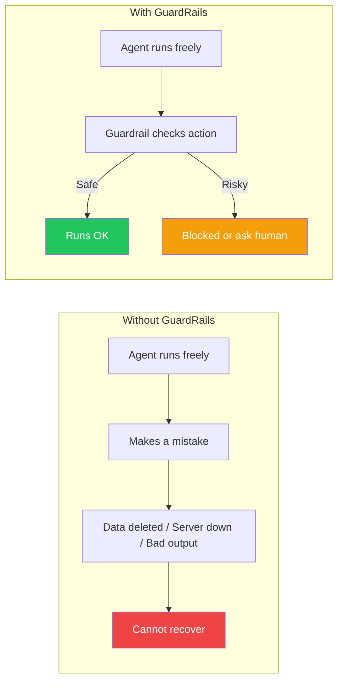

The goal of guardrails: **let agents be useful without letting them be dangerous**.

---

## Why Do We Need GuardRails?

Three root causes drive the need:

### 1. Agents Make Mistakes
LLMs hallucinate. They misread instructions. They take shortcuts. Without guardrails, mistakes reach the real world.

### 2. Some Actions Are Irreversible
Deleting a database, sending an email, pushing to production — once done, they cannot be undone. Guardrails create a moment to pause before irreversible actions.

### 3. Pipelines Amplify Errors
In multi-agent systems, one agent's bad output becomes the next agent's bad input. Errors compound. Guardrails are the quality gates that stop the chain reaction.

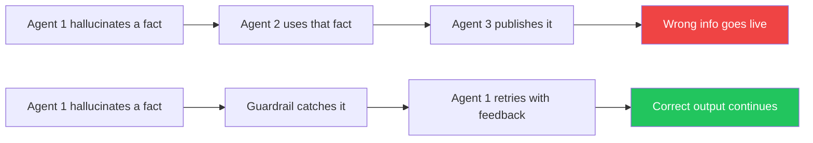

---

## The 4 Types of GuardRails

All guardrails in the 7 libraries fall into one of four types.

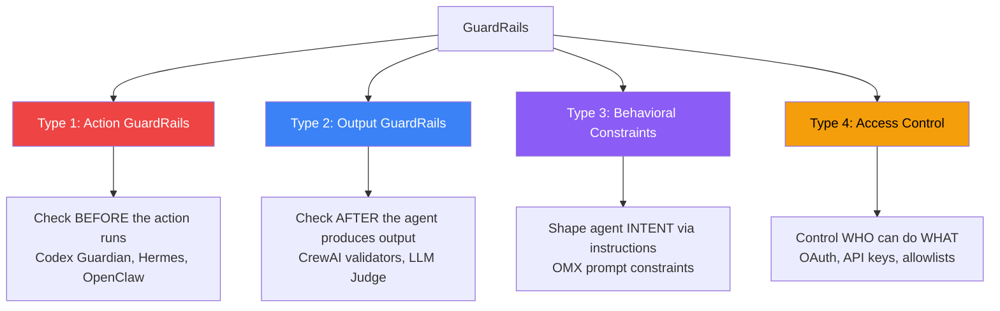

---

### Type 1 — Action GuardRails (Pre-Execution)

**What:** Check every action the agent wants to take, BEFORE it runs.

**When to use:** When your agent can take actions in the real world — run code, delete files, call APIs, modify databases.

**How it works:**

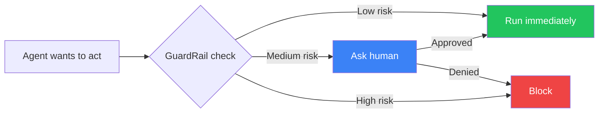

**Implementations seen:**

| Library | Mechanism | Risk Detection |
|---------|-----------|---------------|
| Codex | Guardian module | LLM risk scorer (0–100) |
| Hermes | Pattern detector | Regex/pattern matching |
| OpenClaw | Exec approvals | Policy + allowlist |

**The key question:** Is this action reversible?

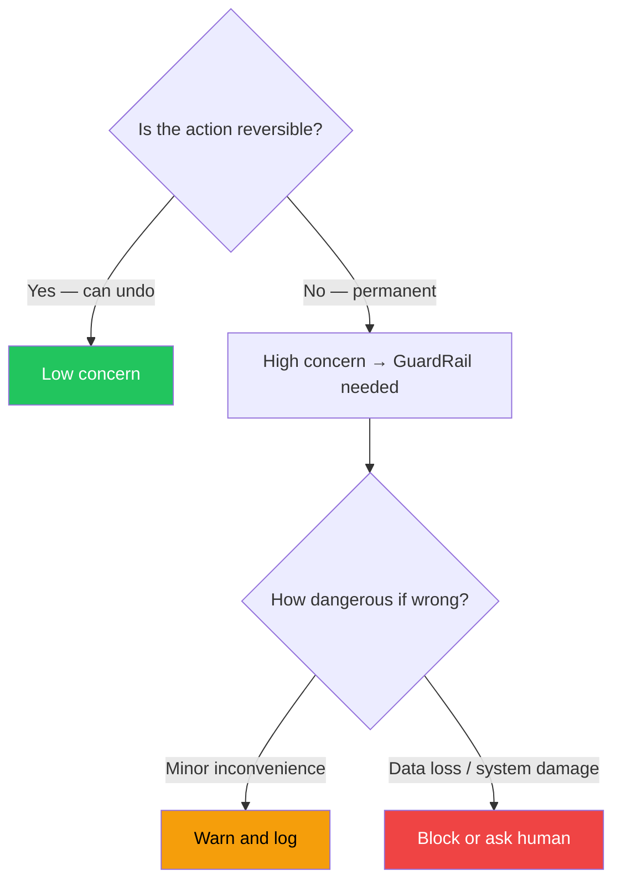

---

### Type 2 — Output GuardRails (Post-Execution)

**What:** Validate what the agent produced, AFTER it finishes, BEFORE passing it on.

**When to use:** When your agent generates content, answers, or data that flows into another step or to a user.

**How it works:**

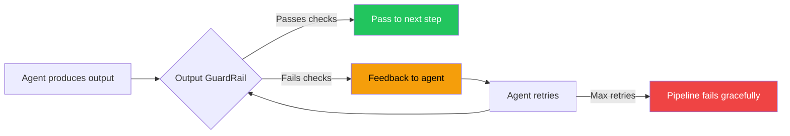

**Types of output checks:**

| Check | What it catches | Example |
|-------|----------------|---------|
| Format check | Wrong structure/schema | JSON malformed, missing fields |
| Content check | Harmful or off-topic content | Profanity, off-topic answers |
| Factual check | Hallucinated claims | Facts not in source material |
| Quality check | Too short, vague, or incomplete | Summary missing key points |
| LLM Judge | General quality evaluation | "Does this answer the question?" |

**Implementations seen:**

| Library | Mechanism |
|---------|-----------|
| CrewAI | Guardrail callable `(bool, result_or_error)` |
| CrewAI | LLM Guardrail — dedicated judge agent |
| CrewAI | Hallucination Guardrail — checks vs source |
| LangChain | PydanticOutputParser, custom runnables |

---

### Type 3 — Behavioral Constraints (Prompt-Level)

**What:** Rules written in plain English and given to the agent as part of its instructions.

**When to use:** As a first line of defense, or when you want to shape general agent behavior without building hard technical checks.

**How it works:**

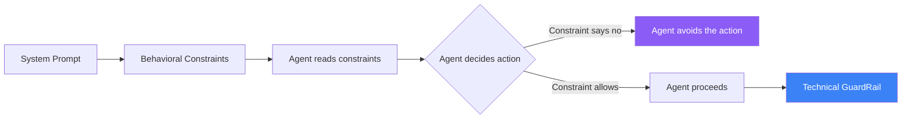

**Important limitation:**

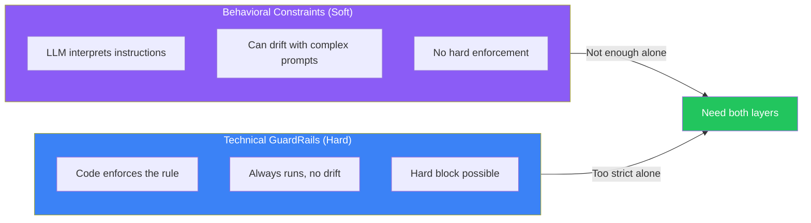

Behavioral constraints guide **intent**. Technical guardrails provide **enforcement**. You need both.

**Implementations seen:**

| Library | Approach |
|---------|---------|
| Oh-My-Codex | AGENTS.md with executor/planner constraints |
| Codex (system prompt) | Safety guidance embedded in base prompt |
| All LLMs | RLHF / Constitutional AI at model level |

---

### Type 4 — Access Control

**What:** Control WHO can do WHAT. Not what the agent does, but whether it is even allowed to try.

**When to use:** Multi-user systems, agents accessing external resources, or when different agents should have different capability levels.

**How it works:**

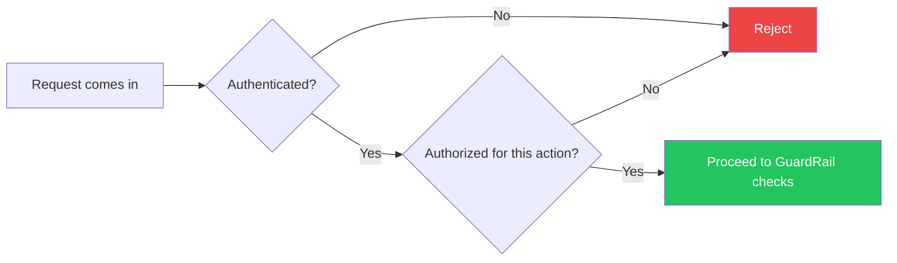

**Implementations seen:**

| Library | Mechanism |
|---------|-----------|
| OpenClaw | Allowlist per agent, security policy per context |
| Hermes | Session/always/once approval levels |
| SuperMemory | OAuth 2.0, API keys, per-user isolation |

---

## How the 4 Types Work Together

In a well-designed agent system, all 4 types stack as layers of defense:

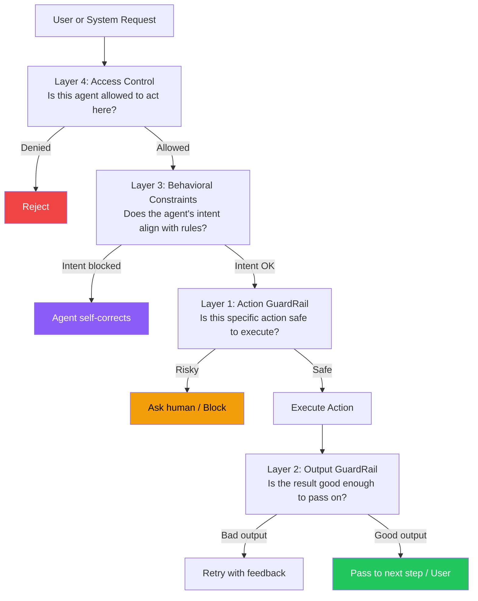

Each layer catches different things. If one layer misses something, the next layer may still catch it. This is called **defense in depth**.

---

## Patterns Observed Across All Libraries

### Pattern 1 — Fail Closed (Default Deny)

When in doubt, **block**. Never default to allow when the action is ambiguous.

```
OpenClaw default: security = "deny"
Hermes timeout: deny after 60 seconds with no response
Codex: risk score ≥ 80 → block (not ask)
```

### Pattern 2 — Separate the Judge from the Agent

The component that checks safety should be **independent** from the agent being checked.

```
Codex: dedicated guardian LLM session, does not share context with main agent
CrewAI: dedicated "Guardrail Agent" separate from the crew
```

Why: if the same agent judges itself, it will rationalize its own decisions.

### Pattern 3 — Fail Fast with Clear Feedback

When a guardrail fails, give clear, actionable error messages so the agent can retry intelligently.

```
CrewAI: (False, "Output too short, needs at least 100 words")
            ↓ agent retries knowing exactly what to fix
```

Vague errors → random retries → wasted tokens and time.

### Pattern 4 — Escalating Approval

Start automated. Escalate to human only when needed. Give humans clear options.

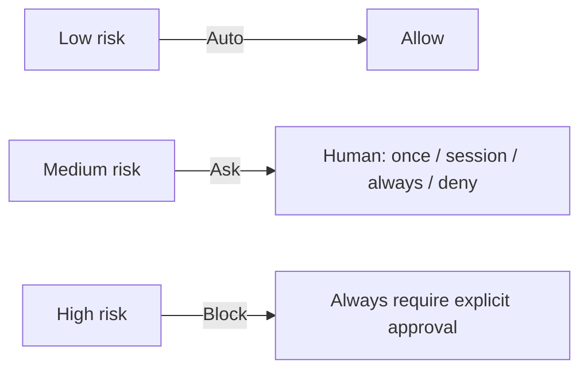

### Pattern 5 — Irreversibility = Risk

The more irreversible an action, the more protection it needs.

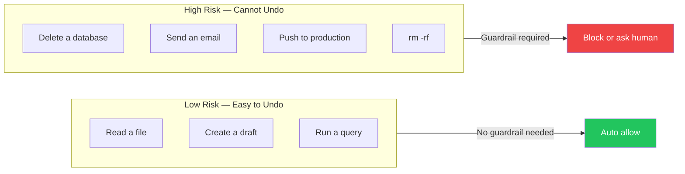

---

## How to Think When Designing GuardRails

Use these questions as your design checklist.

### Step 1 — What can your agent DO?

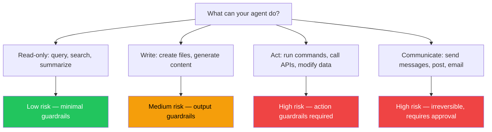

### Step 2 — What can go WRONG?

For each agent capability, ask: "What is the worst thing that could happen?"

| Capability | Worst case | Guardrail type needed |
|------------|-----------|----------------------|
| Search the web | Returns bad data | Output guardrail (fact check) |
| Write a file | Overwrites wrong file | Action guardrail (confirm path) |
| Delete data | Permanent data loss | Action guardrail (approval required) |
| Generate a report | Contains hallucinations | Output guardrail (LLM judge) |
| Call external API | Sends private data externally | Action guardrail (destination check) |
| Run shell command | Destroys system | Action guardrail (pattern + risk score) |

### Step 3 — How Often Should a Human Be Involved?

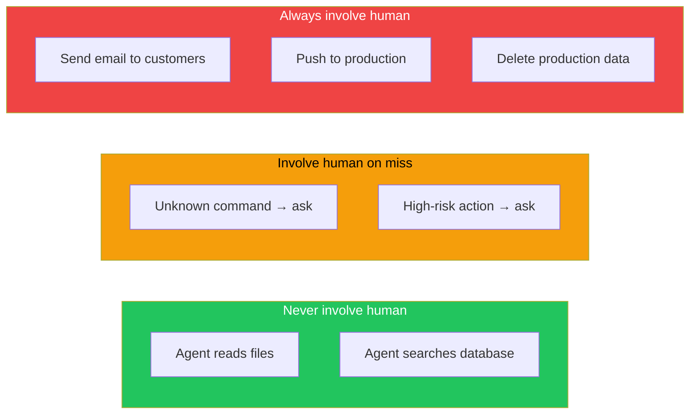

**Rule:** The more irreversible + the wider the impact = the more human oversight is needed.

### Step 4 — What Should Happen on Failure?

For each guardrail, define all 3 outcomes:

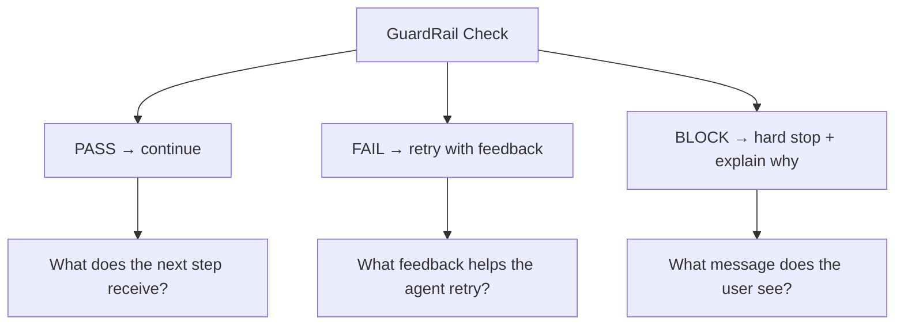

Never fail silently. Always explain why the guardrail triggered.

### Step 5 — What Is the Cost of Being Wrong?

Two types of errors:

| Error Type | Definition | Example | Cost |
|-----------|------------|---------|------|
| **False Positive** | Blocked a safe action | GuardRail stops `ls -la` as dangerous | Agent is useless |
| **False Negative** | Allowed a dangerous action | GuardRail misses `rm -rf /var` | System destroyed |

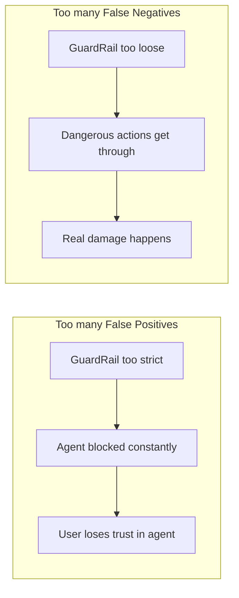

Balance by:
- Tuning the risk threshold (Codex: score of 80, not 50 or 100)
- Using allowlists to trust known-safe patterns (OpenClaw, Hermes)
- Escalating to human for the gray area in the middle

---

## Design Decision Map

Use this to quickly find which guardrail type you need:

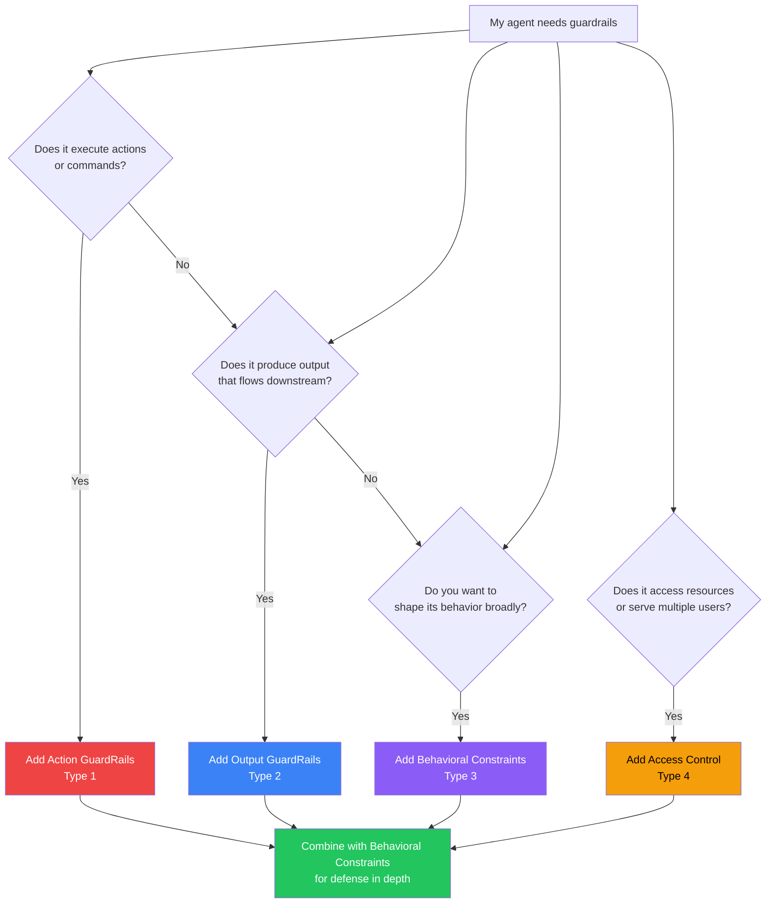

---

## Summary Table — GuardRail Types at a Glance

| Type | Name | When | What it checks | Libraries |
|------|------|------|---------------|-----------|
| 1 | Action GuardRails | Before action runs | Is this action safe? | Codex, Hermes, OpenClaw |
| 2 | Output GuardRails | After output produced | Is this output good? | CrewAI, LangChain |
| 3 | Behavioral Constraints | Always (in prompt) | Does the agent intend the right thing? | OMX, all LLMs |
| 4 | Access Control | Before anything runs | Is this agent/user allowed? | OpenClaw, SuperMemory |

---

## Key Principles (Remember These)

1. **Fail closed** — default deny when uncertain
2. **Separate the judge** — don't let the agent evaluate itself
3. **Fail fast with feedback** — clear errors enable smart retries
4. **Irreversibility = risk level** — the harder to undo, the more protection needed
5. **Defense in depth** — layer all 4 types; each catches what others miss
6. **Balance** — too strict makes agents useless; calibrate thresholds carefully
7. **Escalate don't block** — prefer "ask human" over hard block for edge cases
