# DeerFlow — Plain English Guide

> **Who is this for?**
> This guide is written for anyone — even people who have never coded before. We use simple words, real-life examples, and pictures to explain how DeerFlow works.

---

## Table of Contents

- [Context: What Problem Are We Solving?](#context-what-problem-are-we-solving)
- [1. What Is DeerFlow?](#1-what-is-deerflow)
- [2. How Does It Work?](#2-how-does-it-work)
- [3. Main Components Overview](#3-main-components-overview)
- [4. Deep Dive Into Each Component](#4-deep-dive-into-each-component)
  - [4.1 Lead Agent — The Brain](#41-lead-agent--the-brain)
  - [4.2 Middleware Chain — The Checklist Before Thinking](#42-middleware-chain--the-checklist-before-thinking)
  - [4.3 Sub-Agents — The Team of Helpers](#43-sub-agents--the-team-of-helpers)
  - [4.4 Sandbox — The Safe Workspace](#44-sandbox--the-safe-workspace)
  - [4.5 Memory — The Notebook](#45-memory--the-notebook) ⭐ Deep Dive
  - [4.6 Skills — The Instruction Manuals](#46-skills--the-instruction-manuals)
  - [4.7 Tools — The Toolbox](#47-tools--the-toolbox)
  - [4.8 Gateway API — The Front Desk](#48-gateway-api--the-front-desk)
  - [4.9 NGINX — The Traffic Director](#49-nginx--the-traffic-director)
  - [4.10 Frontend — The Window](#410-frontend--the-window)
  - [4.11 IM Channels — The Messenger](#411-im-channels--the-messenger)
- [5. How Everything Connects](#5-how-everything-connects)
- [6. Real-World Example: Step by Step](#6-real-world-example-step-by-step)
- [7. Quick Glossary](#7-quick-glossary)

---

## Context: What Problem Are We Solving?

Imagine you hire a new assistant. This assistant is smart but has some limits:

- They forget everything after each conversation
- They can only give you advice, but cannot open your computer and actually do the work
- They can only work on one thing at a time
- They need a different person for each type of job

This is the problem with most AI chatbots today.

**DeerFlow fixes all of this.**

---

## 1. What Is DeerFlow?

**DeerFlow** stands for:
> **D**eep **E**xploration and **E**fficient **R**esearch **Flow**

It is an **open-source AI super agent** made by **ByteDance** (the company behind TikTok).

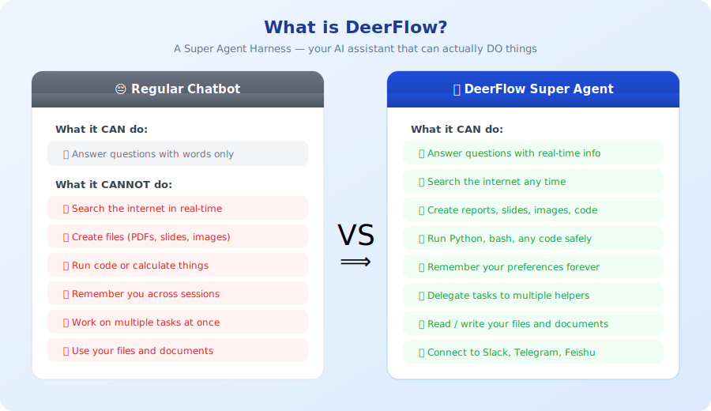

### Simple Analogy

| Regular Chatbot | DeerFlow |
|---|---|
| Like a librarian who can only tell you where books are | Like a research assistant who actually reads the books, writes a summary, and builds you a report |
| Forgets you after each chat | Remembers you over time |
| Can only talk | Can run code, create files, search the web |
| Works alone | Can hire helpers for big tasks |

---

## 2. How Does It Work?

Here is the full flow — from when you type a message to when you get a result:

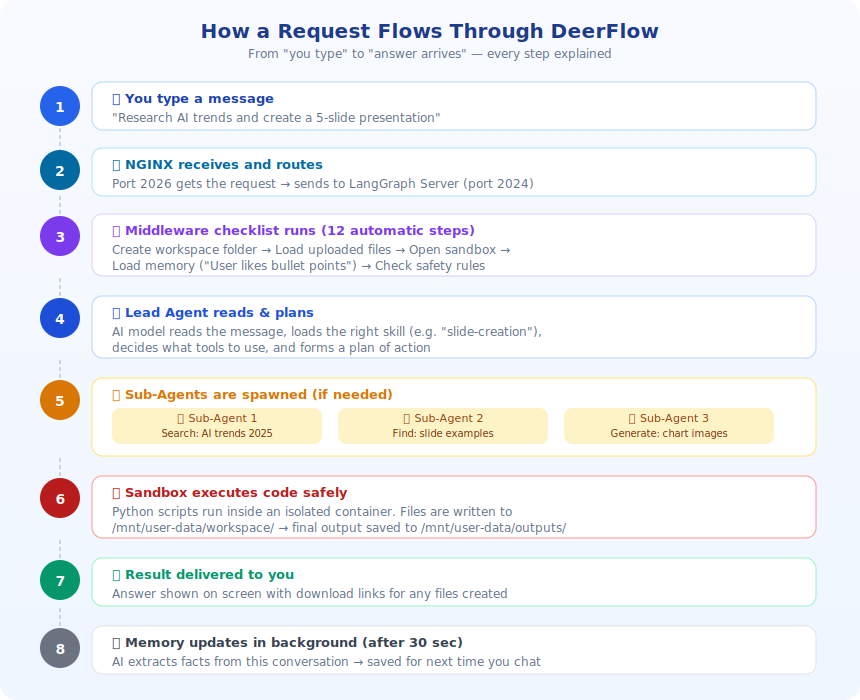

The system is built on two main ideas:

1. **A lead AI** that reads your message, makes a plan, and coordinates everything
2. **A set of tools and helpers** that actually do the work (search the web, write files, run code)

---

## 3. Main Components Overview

Think of DeerFlow like a **restaurant kitchen**:

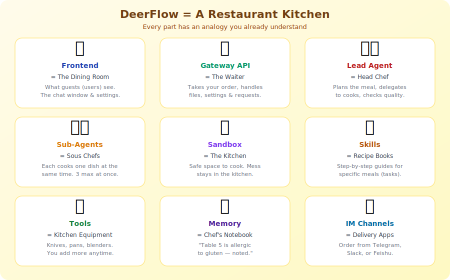

Here is the full system showing how all parts connect:

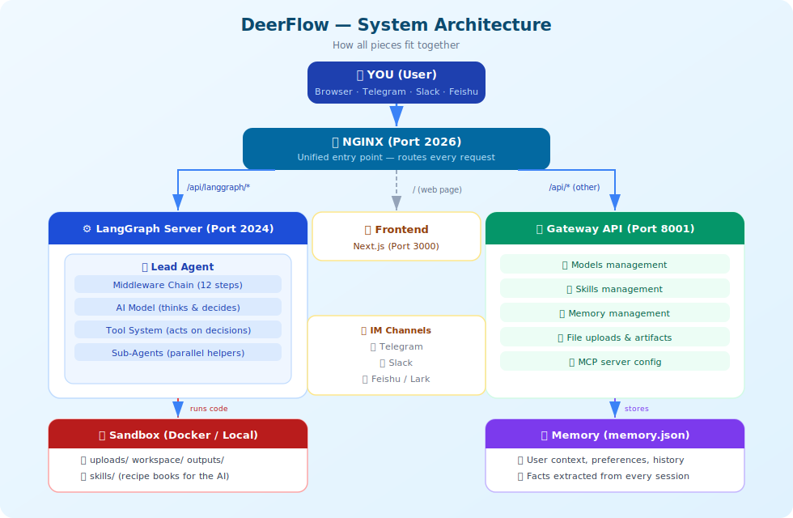

| Component | Simple Description |
|---|---|
| **Frontend** | The website/chat window you type into |
| **Gateway API** | The manager who handles settings and files |
| **Lead Agent** | The main AI brain that reads and responds |
| **Sub-Agents** | Worker AIs that handle specific small tasks |
| **Sandbox** | An isolated computer where code runs safely |
| **Memory** | Storage of what you told DeerFlow before |
| **Skills** | Step-by-step guides for specific jobs |
| **Tools** | Actions the AI can take (search, write file, run code) |
| **Middleware** | Automatic checks that happen before each response |
| **IM Channels** | Connections to Slack, Telegram, Feishu |

---

## 4. Deep Dive Into Each Component

---

### 4.1 Lead Agent — The Brain

The Lead Agent is **the main AI** that receives your message and decides what to do.

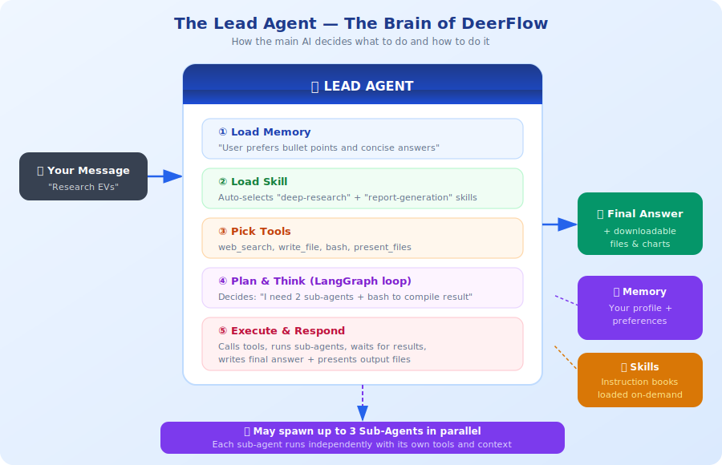

#### What it does

1. **Reads your message**
2. **Loads memory** — "I know this user likes bullet points"
3. **Loads the right skill** — e.g. "deep-research"
4. **Decides which tools to use**
5. **Chooses if sub-agents are needed**
6. **Thinks and responds** (using LangGraph — a step-by-step thinking loop)

#### Real-life analogy

> Imagine you call a travel agency and say: "Plan me a 5-day trip to Japan."
>
> The **Lead Agent** is the senior travel consultant who:
> - Hears your request
> - Looks at your past trips (memory)
> - Assigns one person to find hotels, another to find flights
> - Combines everything into one itinerary for you

---

### 4.2 Middleware Chain — The Checklist Before Thinking

Before the Lead Agent responds, it runs through a **checklist of 12 steps** automatically. These are called **middlewares** — like a pilot doing pre-flight checks.

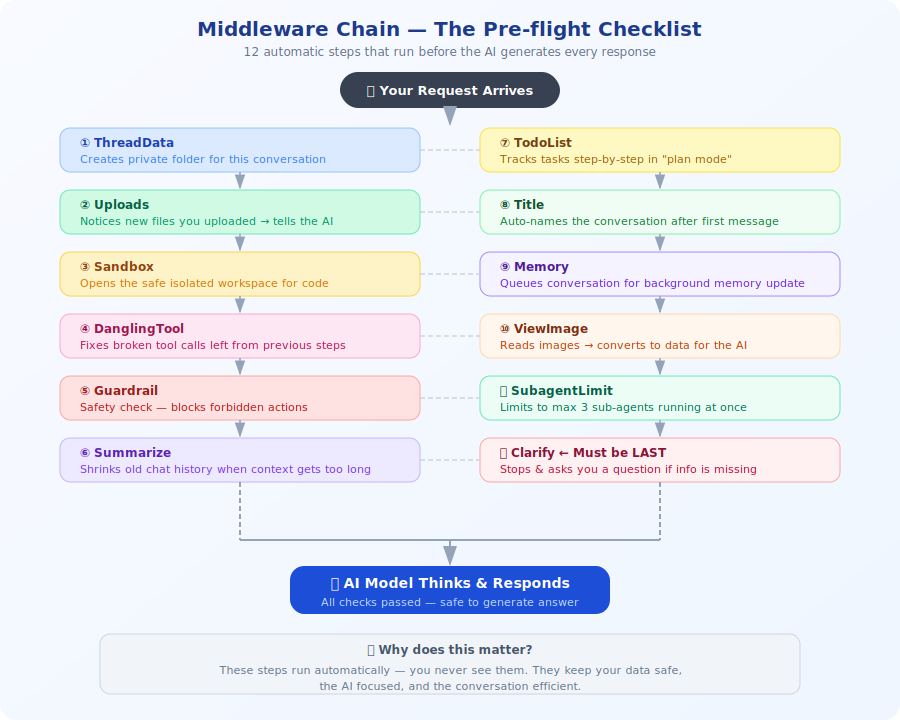

#### What each one does (simple version)

| # | Name | What it does |
|---|---|---|
| 1 | **ThreadData** | Creates a private folder for your conversation |
| 2 | **Uploads** | Notices when you uploaded a file and tells the AI |
| 3 | **Sandbox** | Opens the safe computer workspace |
| 4 | **DanglingTool** | Cleans up if a previous step was interrupted |
| 5 | **Guardrail** | Checks if the AI is allowed to do what it's about to do |
| 6 | **Summarize** | Shrinks old conversation to save memory space |
| 7 | **TodoList** | Tracks tasks when in "plan mode" |
| 8 | **Title** | Gives the chat a name after the first message |
| 9 | **Memory** | Saves the conversation for future learning |
| 10 | **ViewImage** | Reads any images and turns them into data |
| 11 | **SubagentLimit** | Makes sure only 3 helpers run at once |
| 12 | **Clarify** | If the AI needs more info, it stops and asks you |

> These steps run automatically — you never see them.

---

### 4.3 Sub-Agents — The Team of Helpers

When a task is too big or has multiple parts, the Lead Agent creates **Sub-Agents** — smaller AI workers each focused on one job.

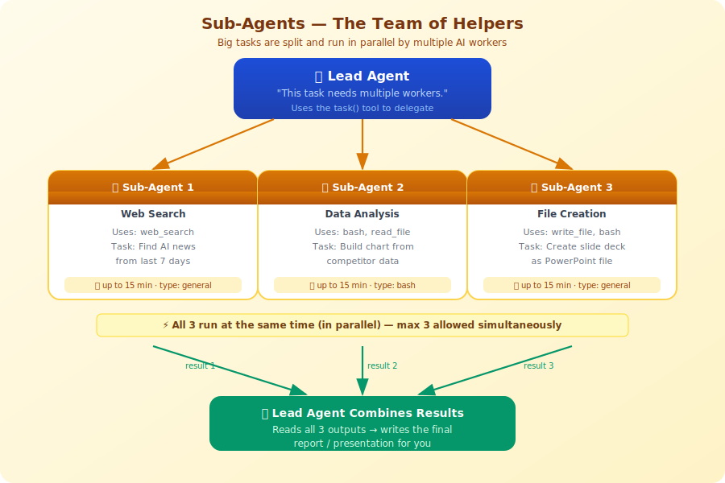

#### Real-life analogy

> You ask a manager: "Build me a new product website."
>
> The manager doesn't do everything themselves. They assign:
> - Designer → makes the layout
> - Writer → writes the content
> - Developer → builds the code
>
> Each works at the same time. The manager combines the results.

#### Rules

- Max **3 sub-agents** at the same time
- Each sub-agent has **15 minutes** to finish
- Sub-agents have two types:
  - **general-purpose** — can use all tools
  - **bash** — specialist for running commands

---

### 4.4 Sandbox — The Safe Workspace

The **Sandbox** is like a separate, isolated computer inside a box. When DeerFlow needs to run code or create files, it does it inside this box — not on your real computer.

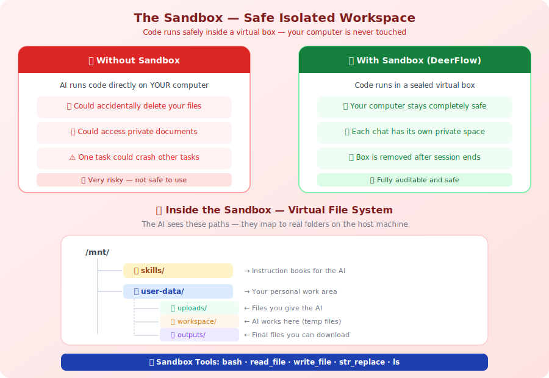

#### The virtual file system

Inside the sandbox, DeerFlow sees its own file structure:

```
/mnt/
├── skills/              ← Recipe books (skills)
└── user-data/
    ├── uploads/         ← Files YOU uploaded
    ├── workspace/       ← Where the AI works
    └── outputs/         ← Final files to download
```

#### Two modes

| Mode | Description |
|---|---|
| **Local** | Runs on your computer directly. Simple, fast. |
| **Docker** | Runs in a sealed virtual container. Fully isolated and safer. |

---

### 4.5 Memory — The Notebook

The **Memory** system lets DeerFlow remember things about you across many conversations. It is one of the most powerful features — and most hidden. This section explains every detail.

---

#### Overview Diagram

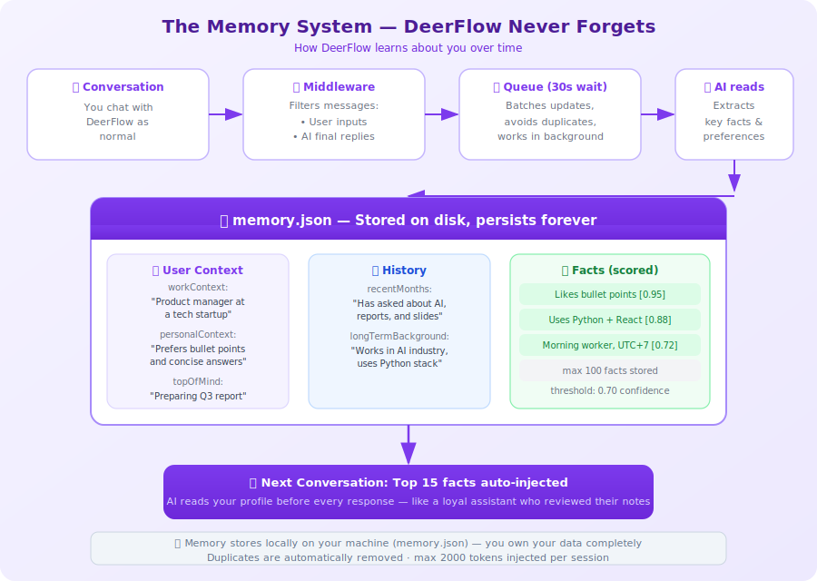

---

#### Deep Dive: Memory System

> **Simple analogy:** Imagine a hotel concierge who keeps a private notebook about every guest. Every time you stay, they read the notebook before you arrive: "Mr. John prefers a high floor, quiet room, non-spicy food." DeerFlow does the same thing — for your AI sessions.

---

##### Step 1 — The Chat Ends, Middleware Activates

After the Lead Agent finishes responding, `MemoryMiddleware.after_agent()` runs automatically.

It calls `_filter_messages_for_memory()` — a filter that decides which messages are **worth remembering**.


**What gets KEPT:**
- Human messages (your actual questions)
- Final AI responses (no tool calls — just the answer)

**What gets DROPPED:**
- AI messages that contain tool calls (intermediate steps — "let me search the web...")
- Tool result messages (raw search data, file contents)
- Upload-only messages (just `<uploaded_files>` with no real question)
- AI responses paired with upload-only turns

**Why?** The AI only needs the conversation's essence — not every intermediate step. Tool call data is noisy and meaningless out of context. Upload paths would confuse future sessions (those files won't exist next time).

---

##### Step 2 — The Debounce Queue (Wait 30 Seconds)

The filtered messages are passed to `MemoryUpdateQueue.add()`.

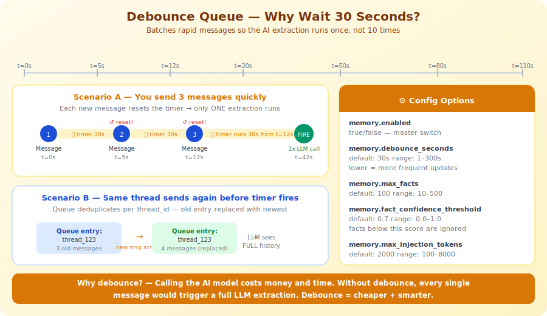

**How debounce works:**

1. A message arrives → queue stores it, starts a 30-second timer
2. Another message arrives within 30 seconds → timer **resets**
3. Timer fires (30 seconds of silence) → extraction runs **once**

**Per-thread deduplication:** If you send 3 messages in thread `thread_abc`, only the **newest** entry survives in the queue. The LLM sees the full conversation, not just the last message.

**Why wait 30 seconds?** Calling the AI model to extract facts costs time and money. Without debounce, every single message would trigger a full extraction call. With debounce, a rapid back-and-forth conversation triggers only one extraction.

**Configurable:** `debounce_seconds` can be set from 1 to 300 in `config.yaml`.

---

##### Step 3 — The AI Extracts Facts (MEMORY_UPDATE_PROMPT)

A background thread picks up the queue and runs `MemoryUpdater.update_memory()`.


The updater:
1. Loads the current `memory.json` from disk (with file-mtime cache)
2. Formats the conversation: `User: [text]\n\nAssistant: [text]` (max 1000 chars per message)
3. Sends both to the AI model with `MEMORY_UPDATE_PROMPT`
4. Parses the JSON response
5. Applies the updates to the current memory
6. Saves atomically to disk

**The extraction prompt tells the AI:**

```
You are a memory management system. Analyze the conversation and update the user's memory profile.

Extract facts with these categories:
  - preference   → tools, styles, approaches user likes/dislikes
  - knowledge    → expertise, technologies mastered
  - context      → background facts (job, projects, location)
  - behavior     → working patterns, communication habits
  - goal         → stated objectives, learning targets

Confidence levels:
  - 0.9–1.0 → explicitly stated: "I work on X", "My role is Y"
  - 0.7–0.8 → strongly implied from actions
  - 0.5–0.6 → inferred patterns (sparingly)

Return ONLY valid JSON.
```

**The AI returns a JSON object** with:
- `user.workContext.summary` — updated role description (if changed)
- `user.personalContext.summary` — updated preferences
- `user.topOfMind.summary` — current ongoing priorities
- `history.recentMonths.summary` — what happened in recent months
- `newFacts[]` — list of new facts with category + confidence
- `factsToRemove[]` — IDs of facts that are now outdated

---

##### The memory.json Data Structure

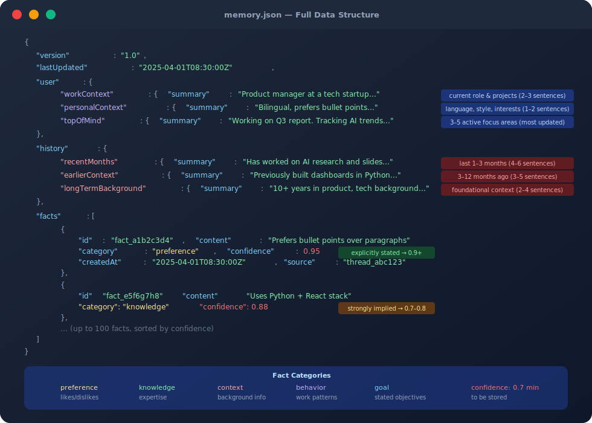

The full structure stored on disk:

```json
{
  "version": "1.0",
  "lastUpdated": "2025-04-01T08:30:00Z",
  "user": {
    "workContext":     { "summary": "PM at a tech startup...", "updatedAt": "..." },
    "personalContext": { "summary": "Prefers bullet points...", "updatedAt": "..." },
    "topOfMind":       { "summary": "Working on Q3 report...", "updatedAt": "..." }
  },
  "history": {
    "recentMonths":       { "summary": "Has worked on AI research...", "updatedAt": "..." },
    "earlierContext":     { "summary": "Previously built dashboards...", "updatedAt": "..." },
    "longTermBackground": { "summary": "10+ years in product...", "updatedAt": "..." }
  },
  "facts": [
    {
      "id":         "fact_a1b2c3d4",
      "content":    "Prefers bullet points over paragraphs",
      "category":   "preference",
      "confidence": 0.95,
      "createdAt":  "2025-04-01T08:30:00Z",
      "source":     "thread_abc123"
    }
  ]
}
```

**Key constraints:**
- Max **100 facts** (configurable 10–500)
- Facts below confidence **0.7** are never stored
- Duplicate facts (same content, trimmed) are silently skipped
- Upload-event sentences are stripped from all summaries automatically
- File saves via **temp file + atomic rename** — crash-safe

---

##### Step 4 — Memory Injected Into the Next Chat

At the start of every new conversation, `format_memory_for_injection()` runs.

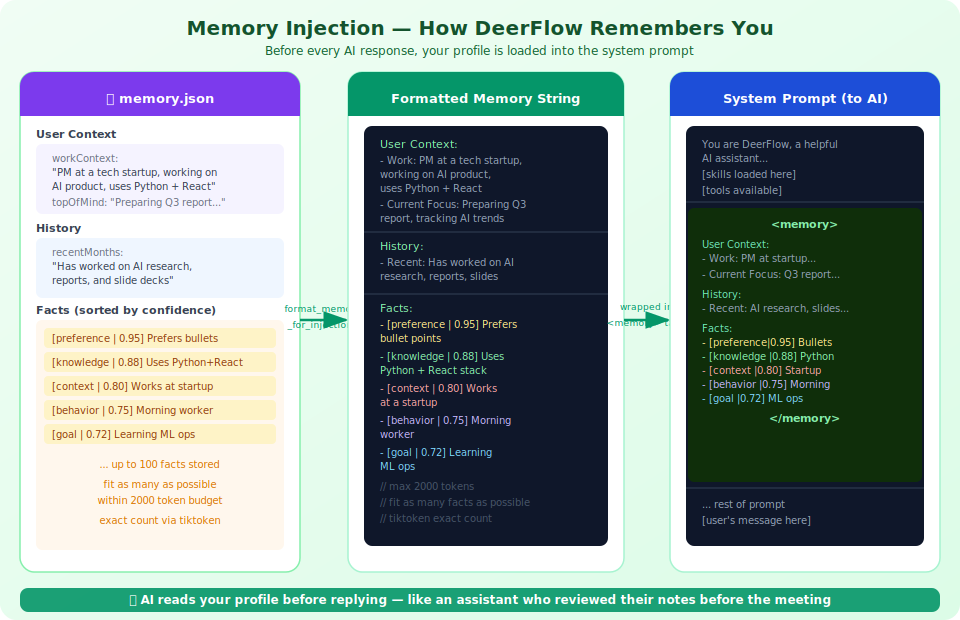

**How it builds the injection string:**

1. **Loads `memory.json`** (file-mtime cache — only re-reads if file changed)
2. **Formats three sections:** User Context → History → Facts
3. **Ranks facts by confidence** (highest confidence first)
4. **Counts tokens exactly** using `tiktoken` (OpenAI's tokenizer)
5. **Keeps adding facts** until the 2000-token budget is reached
6. **Wraps in `<memory>` tags** and inserts into the system prompt

**Example of what the AI sees:**

```
<memory>
User Context:
- Work: PM at a tech startup, working on AI product, uses Python + React
- Current Focus: Preparing Q3 report, tracking AI trends in LLM space

History:
- Recent: Has worked on AI research, reports, and slide deck creation

Facts:
- [preference | 0.95] Prefers bullet points over paragraphs
- [knowledge  | 0.88] Uses Python + React stack
- [context    | 0.80] Works at a startup
- [behavior   | 0.75] Morning worker
- [goal       | 0.72] Learning ML ops
</memory>
```

The AI reads this block before generating any response. It personalizes tone, format, and depth automatically — without you having to repeat your preferences every session.

---

##### Full Lifecycle in One Diagram


---

#### Configuration Reference

All memory settings go in `config.yaml` under the `memory:` key:

| Setting | Default | Range | What it does |
|---|---|---|---|
| `enabled` | `true` | bool | Master switch — turn off to disable all memory |
| `injection_enabled` | `true` | bool | Disable injection only (still saves, but doesn't use) |
| `debounce_seconds` | `30` | 1–300 | How long to wait before running extraction |
| `model_name` | `null` | string | Which AI model to use for extraction (null = use default) |
| `max_facts` | `100` | 10–500 | Maximum stored facts |
| `fact_confidence_threshold` | `0.7` | 0.0–1.0 | Minimum confidence to store a fact |
| `max_injection_tokens` | `2000` | 100–8000 | Token budget for memory in system prompt |
| `storage_path` | `` | path | Custom path for memory.json |

**Example config.yaml:**
```yaml
memory:
  enabled: true
  debounce_seconds: 30
  max_facts: 100
  fact_confidence_threshold: 0.7
  max_injection_tokens: 2000
```

---

#### Where Is Memory Stored?

By default: `backend/.deer-flow/memory.json`

This file lives on **your own machine**. DeerFlow never sends it anywhere. You can:
- Read it directly (it is plain JSON)
- Delete it to start fresh
- Back it up
- View it via the API: `GET /api/memory`
- Force reload: `POST /api/memory/reload`

> Memory is stored locally on your machine — you own your data completely.

---

### 4.6 Skills — The Instruction Manuals

**Skills** are pre-written guides that tell DeerFlow HOW to do specific jobs. Each skill is just a text file (Markdown) with instructions.

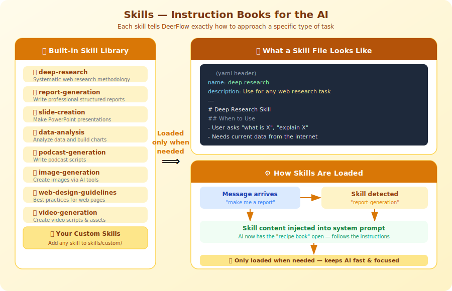

#### Built-in skills

| Skill | What it does |
|---|---|
| `deep-research` | Systematic web research methodology |
| `report-generation` | Write professional structured reports |
| `slide-creation` | Make PowerPoint presentations |
| `data-analysis` | Analyze data and build charts |
| `podcast-generation` | Write podcast scripts |
| `image-generation` | Create images via AI |
| `web-design-guidelines` | Best practices for web pages |
| `video-generation` | Create video scripts and assets |

> Skills are loaded **only when needed** — this keeps the AI fast and focused.

---

### 4.7 Tools — The Toolbox

**Tools** are the actual actions DeerFlow can take. If skills are the "how-to manual," tools are the "hands" that do the work.

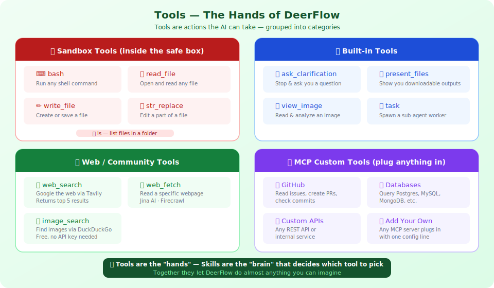

#### Key tools explained simply

| Tool | What it does |
|---|---|
| `bash` | Run any command (like Python scripts) |
| `web_search` | Google something in real-time |
| `web_fetch` | Read a specific webpage |
| `read_file` | Open and read a file |
| `write_file` | Create or save a file |
| `task` | Hire a sub-agent to do a specific job |
| `ask_clarification` | Stop and ask you a question |
| `present_files` | Show you output files to download |
| `view_image` | Analyze a picture |

#### MCP — Plugging in custom tools

Add any tool via MCP (Model Context Protocol):

```json
"mcpServers": {
  "github": {
    "enabled": true,
    "command": "npx",
    "args": ["@modelcontextprotocol/server-github"],
    "env": {"GITHUB_TOKEN": "your-token"}
  }
}
```

Now DeerFlow can read issues, create PRs, check commits!

---

### 4.8 Gateway API — The Front Desk

The **Gateway API** is a bridge between the website and the AI brain. It handles all management tasks — not the actual conversations.

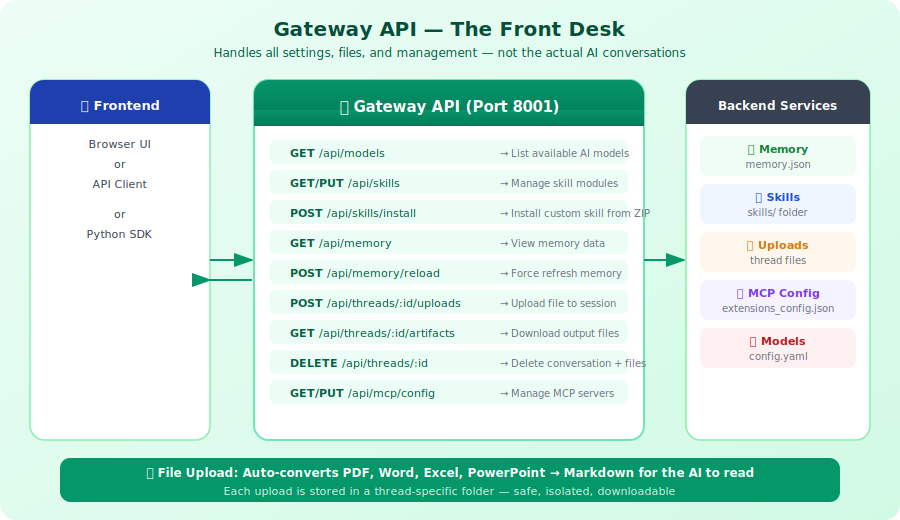

#### What it manages

| Endpoint | Purpose |
|---|---|
| `GET /api/models` | List available AI models |
| `GET/PUT /api/skills` | Enable or disable skills |
| `GET /api/memory` | View what DeerFlow remembers |
| `POST /api/threads/:id/uploads` | Upload a file to your session |
| `GET /api/threads/:id/artifacts` | Download output files |
| `DELETE /api/threads/:id` | Delete a conversation and its files |

> File uploads are auto-converted: PDF, Word, Excel, PowerPoint → Markdown for the AI to read.

---

### 4.9 NGINX — The Traffic Director

NGINX sits at the front door (port 2026) and routes every request to the right service.

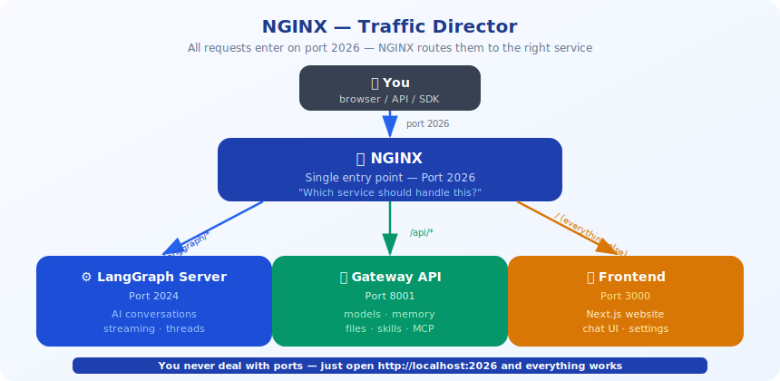

| URL pattern | Goes to |
|---|---|
| `/api/langgraph/*` | LangGraph Server (AI conversations) |
| `/api/*` (other) | Gateway API (settings, files, memory) |
| `/` (everything else) | Frontend (the website) |

> You never deal with ports — just open `http://localhost:2026` and everything works.

---

### 4.10 Frontend — The Window

The **Frontend** is the website you open in your browser. Built with **Next.js**.

```
http://localhost:2026
─────────────────────────────────────────────────
┌──────────────────────────────────────────────┐
│  DeerFlow                         [Settings] │
├──────────────────────────────────────────────┤
│  Previous chats:                             │
│  • "AI trends report" (yesterday)            │
│  • "Japan trip plan" (last week)             │
├──────────────────────────────────────────────┤
│  AI:  Here is your research report...        │
│  [Download report.pdf]                       │
├──────────────────────────────────────────────┤
│  You: [Type your message here...]    [Send]  │
└──────────────────────────────────────────────┘
```

---

### 4.11 IM Channels — The Messenger

DeerFlow can receive tasks directly from messaging apps — no browser needed.

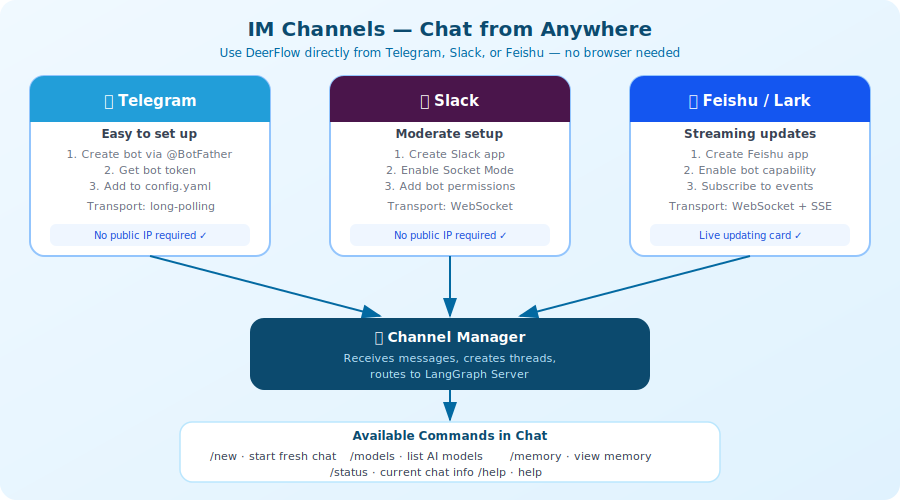

#### Supported apps

| App | Setup difficulty | Transport |
|---|---|---|
| Telegram | Easy | Long-polling |
| Slack | Moderate | WebSocket (Socket Mode) |
| Feishu / Lark | Moderate | WebSocket + live card updates |

#### Available commands in chat

| Command | What it does |
|---|---|
| `/new` | Start a fresh conversation |
| `/models` | See which AI models are available |
| `/memory` | See what DeerFlow remembers about you |
| `/status` | Check current chat status |
| `/help` | Show help |

#### Example — Telegram conversation

```
You:        "Research the top 5 EV companies in 2025"

DeerFlow:   "On it! Researching now..."
            [2 minutes later]
            "Here are the top 5 EV companies in 2025:
             1. Tesla — ...
             2. BYD — ..."
```

---

## 5. How Everything Connects

Here is the complete system in one picture:


---

## 6. Real-World Example: Step by Step

Let's trace exactly what happens when you ask:

> "Find the latest AI news and make me a 5-minute podcast script."

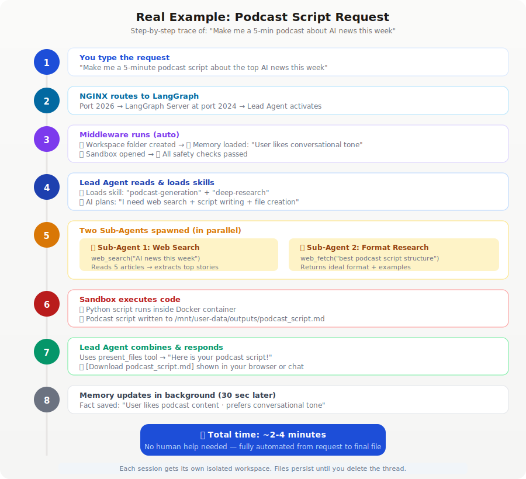

| Step | What happens |
|---|---|
| 1 | You type the request |
| 2 | NGINX routes to LangGraph Server |
| 3 | 12 middleware steps run (workspace created, memory loaded, sandbox opened) |
| 4 | Lead Agent reads the message and loads podcast + research skills |
| 5 | Two sub-agents spawn in parallel (one searches news, one finds format) |
| 6 | Sandbox runs Python to write the script file |
| 7 | Lead Agent presents the result with a download link |
| 8 | Memory updates in background (30 sec later) |

**Total time: ~2-4 minutes. Fully automated.**

---

## 7. Quick Glossary

| Word | What it means |
|---|---|
| **Agent** | An AI that can take actions, not just talk |
| **Sub-agent** | A helper AI created by the main agent for a specific task |
| **LangGraph** | The framework that powers DeerFlow's "thinking in steps" |
| **LangChain** | The library that connects the AI to different models and tools |
| **Sandbox** | An isolated, safe computer where code runs without touching your real computer |
| **Middleware** | Automatic steps that run before or after each AI response |
| **Skill** | A text file with instructions for the AI on how to do a specific job |
| **MCP** | A standard way to plug new tools into DeerFlow |
| **Gateway API** | The part of DeerFlow that manages settings, files, memory, and models |
| **NGINX** | A traffic director that sends requests to the right service |
| **Thread** | One conversation session — each has its own memory and files |
| **Memory** | DeerFlow's long-term storage of what it knows about you |
| **Artifacts** | Files that DeerFlow creates for you (reports, images, slides) |
| **Docker** | A technology that runs the sandbox in an isolated container |
| **FastAPI** | The technology behind the Gateway API |
| **Next.js** | The technology behind the website/frontend |
| **SSE** | Server-Sent Events — how DeerFlow streams responses to you in real-time |

---

> Made with care for non-IT readers.
> Source: [bytedance/deer-flow](https://github.com/bytedance/deer-flow)
> DeerFlow is open-source under the MIT License.
