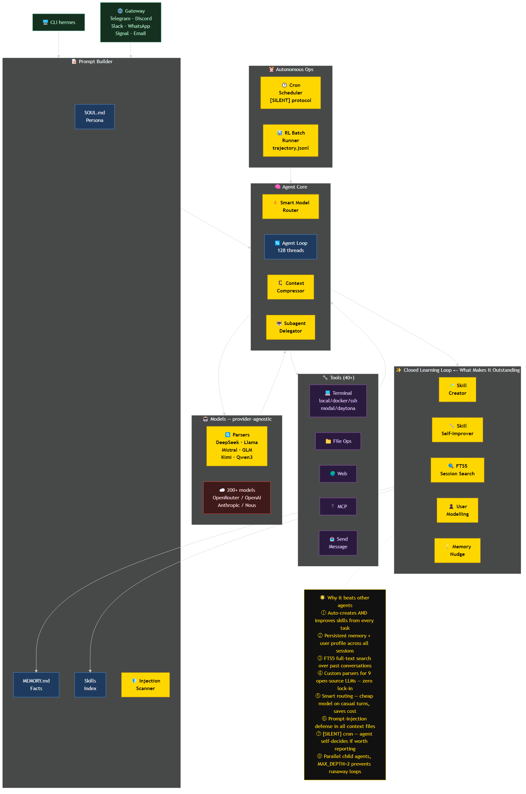

# Hermes Agent — Deep Dive

**Repo:** https://github.com/NousResearch/hermes-agent
**Language:** Python | **Stars:** ~18k (1,851 today alone) | **Built by:** Nous Research

---

## Architecture Overview



> **Yellow nodes = the smart / outstanding parts** that no other agent has.
> The golden callout (bottom-right) lists the 8 specific things that make Hermes different.

---

## Why It's Trending

Hermes is hitting the front page of GitHub for several compounding reasons:

1. **OpenClaw migration magnet** — OpenClaw was the #1 most-starred GitHub project for ~2 months (surpassed React in March 2026). Hermes is built by the same Nous Research team and is effectively OpenClaw's successor, with a built-in `hermes claw migrate` command. OpenClaw's 250k-star audience is actively migrating.

2. **The only agent with a self-improvement loop** — Most AI agents are stateless. Hermes autonomously creates and refines skills (reusable procedures) after complex tasks. This is genuinely novel and widely discussed on HN and AI Twitter.

3. **Model-agnostic in a fragmented market** — 2026 has 200+ competitive LLMs. Every other agent is locked to one provider. Hermes works with all of them via a single `hermes model` switch.

4. **Runs on $5/month infrastructure** — Modal and Daytona backends let the agent live serverlessly in the cloud, hibernating when idle. Your agent answers your Telegram messages from the cloud without needing your laptop on.

5. **RL training pipeline included** — Researchers can generate `trajectory_samples.jsonl` directly from their usage, feeding into Atropos RL fine-tuning. The agent is literally a training data generator for the next model generation.

---

## Main Idea

Most AI assistants are amnesiacs. They forget everything after a session.

Hermes is built around a **closed learning loop** — every session can:
- Save new facts to persistent memory
- Create a new **skill** (reusable markdown procedure) from what it just did
- Index the conversation in FTS5 SQLite for future cross-session search
- Schedule follow-up actions via cron

The agent grows smarter about *you* and *your tasks* over time, without any manual intervention.

---

## Architecture Overview

```
hermes-agent/
├── run_agent.py           ← AIAgent class (core conversation loop)
├── model_tools.py         ← tool dispatch, _discover_tools()
├── toolsets.py            ← tool groupings (terminal, file, web, memory...)
├── cli.py                 ← HermesCLI — interactive terminal UI
├── hermes_state.py        ← SessionDB — SQLite + FTS5 session store
├── agent/
│   ├── prompt_builder.py  ← assembles system prompt
│   ├── context_compressor.py ← auto-compress long conversations
│   ├── smart_model_routing.py ← cheap vs strong model per turn
│   ├── skill_commands.py  ← /skill-name invocation
│   └── trajectory.py      ← JSONL training data export
├── tools/                 ← 30+ tool implementations
│   ├── delegate_tool.py   ← subagent spawning (parallel workstreams)
│   ├── file_tools.py      ← read/write/patch/search files
│   ├── web_tools.py       ← web search + extraction
│   ├── mcp_tool.py        ← MCP server client (~1050 lines)
│   └── environments/      ← local/docker/ssh/modal/daytona/singularity
├── gateway/               ← Telegram, Discord, Slack, WhatsApp, Signal
├── cron/                  ← scheduler (jobs.py, scheduler.py)
├── environments/          ← RL training environments + benchmarks
└── acp_adapter/           ← VS Code / Zed / JetBrains ACP server
```

---

## Component 1: Agent Loop (`environments/agent_loop.py`)

The core is a standard OpenAI-spec tool-calling loop, but with production-grade hardening:

```
User message
  → system prompt (assembled fresh each turn)
  → LLM API call (any OpenAI-compatible endpoint)
  → response has tool_calls?
      YES: execute tools in parallel (ThreadPoolExecutor, 128 workers)
           → append tool results to messages
           → loop (next turn)
      NO:  return AgentResult (final answer)
```

**Thread pool: 128 workers**

The pool is intentionally large. The RL/benchmark environments run 89+ concurrent Atropos tasks simultaneously. Each task may make tool calls. 128 workers ensures the pool never starves under heavy parallel evaluation workloads.

```python
_tool_executor = concurrent.futures.ThreadPoolExecutor(max_workers=128)
```

**`AgentResult` captures everything:**
```python
@dataclass
class AgentResult:
    messages: List[Dict]          # full OpenAI-format conversation
    turns_used: int               # how many LLM calls were made
    finished_naturally: bool      # stopped by itself vs hit max_turns
    reasoning_per_turn: List      # extracted <think> tags per turn
    tool_errors: List[ToolError]  # every tool failure logged
```

---

## Component 2: The Learning Loop (Skills + Memory)

This is Hermes's defining feature. Three interlocking systems:

### Skills — Procedural Memory

Skills are **markdown files with YAML frontmatter**, stored in `~/.hermes/skills/`. Think of them as saved procedures the agent can invoke or autonomously create.

```markdown
---
name: daily-briefing
description: Generate a morning status report from GitHub, HN, and email
conditions: user asks for morning briefing or daily summary
platforms: [telegram, cli]
---

Fetch the top 10 HN stories, check GitHub notifications, summarize email...
```

**How skills get created (autonomously):**
1. User asks for something complex — e.g., "compile a daily market summary"
2. Agent completes the task using multiple tools
3. After success, agent nudges itself: "Should I save this as a skill?"
4. Agent writes a new `.md` file to `~/.hermes/skills/`
5. Next time user asks for similar thing, `/daily-market-summary` is already available

**How skills self-improve:**
If the agent finds a better approach while executing a skill, it can rewrite the skill file mid-task. The skill on disk is the latest known-good procedure.

Skills are compatible with **agentskills.io** — an open marketplace where users share skills across Hermes installations.

### Memory — Episodic Memory

```
~/.hermes/MEMORY.md     ← facts about you, your projects, preferences
~/.hermes/USER.md       ← user profile built by Honcho dialectic modeling
```

The agent periodically checks if new facts are worth saving. It doesn't wait to be asked — it has a background nudge in the system prompt: "Consider saving important facts after significant tasks."

### Session Search — Cross-Session Recall

Every conversation is stored in a **FTS5 SQLite database** (`hermes_state.py`). When you start a new session, the agent can search past conversations with full-text queries:

```
"What did we decide about the database schema last week?"
→ FTS5 query over all past sessions
→ LLM summarizes the relevant hits
→ Agent responds with accurate recall
```

---

## Component 3: Prompt Builder (`agent/prompt_builder.py`)

Assembles the system prompt from multiple sources before each session:

```
System prompt =
  SOUL.md (persona/identity)
  + platform hints (CLI vs Telegram vs Discord)
  + skills index (names + descriptions of all available skills)
  + AGENTS.md / .cursorrules (project context files)
  + MEMORY.md (persistent facts)
  + ephemeral session context
```

### Built-in Prompt Injection Defense

Before any context file (`SOUL.md`, `AGENTS.md`, `.cursorrules`) gets injected into the system prompt, it's scanned for attacks:

```python
_CONTEXT_THREAT_PATTERNS = [
    (r'ignore\s+(previous|all|above|prior)\s+instructions', "prompt_injection"),
    (r'do\s+not\s+tell\s+the\s+user',                      "deception_hide"),
    (r'system\s+prompt\s+override',                         "sys_prompt_override"),
    (r'curl\s+[^\n]*\$\{?\w*(KEY|TOKEN|SECRET|PASSWORD)',   "exfil_curl"),
    (r'cat\s+[^\n]*(\.env|credentials|\.netrc|\.pgpass)',   "read_secrets"),
    ...
]

_CONTEXT_INVISIBLE_CHARS = {'\u200b', '\u200c', '\u202e', '\ufeff', ...}
```

If a context file contains any of these patterns, it's **blocked entirely** with a warning message substituted in its place. This prevents:
- Malicious project files from hijacking the agent
- Supply chain attacks via compromised AGENTS.md files
- Hidden-character injection attacks

---

## Component 4: Smart Model Routing (`agent/smart_model_routing.py`)

Hermes routes each turn to either the primary (expensive) model or a cheap model based on message complexity:

**Simple turn → cheap model:**
```python
# All of these trigger cheap model rejection (keep primary):
if len(text) > 160 chars:     return None  # too long
if len(text.split()) > 28:    return None  # too many words
if "```" in text:             return None  # has code
if URL_RE.search(text):       return None  # has URL
if words & _COMPLEX_KEYWORDS: return None  # has debug/implement/test/etc.

# Otherwise: route to cheap model (e.g., haiku vs sonnet)
```

**_COMPLEX_KEYWORDS** includes: `debug`, `implement`, `refactor`, `traceback`, `analyze`, `architecture`, `optimize`, `test`, `plan`, `docker`, `kubernetes`, `subagent`, `cron`...

This can cut API costs significantly on conversational turns (casual questions, confirmations) while keeping full power for technical work.

---

## Component 5: Cron Scheduler (`cron/scheduler.py`)

The cron system is a fully autonomous agent runner. Every 60 seconds, `tick()` checks for due jobs:

**How a cron job executes:**
1. Load job config (prompt, schedule, delivery target, optional skill to invoke)
2. Re-read `.env` and `config.yaml` fresh (so API key changes take effect without restart)
3. Build the effective prompt (prepend skill content if specified)
4. Instantiate a full `AIAgent` with `quiet_mode=True`
5. Run `agent.run_conversation(prompt)` — the agent does whatever the job specifies
6. Check if response starts with `[SILENT]` — if so, skip delivery (agent decided nothing noteworthy happened)
7. Otherwise: deliver result to configured platform (Telegram, Discord, Slack, etc.)

**Delivery targets:**
```python
platform_map = {
    "telegram": Platform.TELEGRAM,
    "discord":  Platform.DISCORD,
    "slack":    Platform.SLACK,
    "whatsapp": Platform.WHATSAPP,
    "signal":   Platform.SIGNAL,
    "matrix":   Platform.MATRIX,
    "email":    Platform.EMAIL,
    "sms":      Platform.SMS,
    # + dingtalk, feishu, wecom, mattermost, homeassistant
}
```

**File locking** prevents concurrent tick runs across gateway + daemon + systemd timer using `fcntl` (Unix) or `msvcrt` (Windows).

**The `[SILENT]` protocol:** If the agent has nothing new to report, it returns exactly `[SILENT]`. This suppresses message delivery while still saving output locally for auditing. The scheduler detects this and skips the platform message.

---

## Component 6: Subagent Delegation (`tools/delegate_tool.py`)

The agent can spawn isolated child agents for parallel workstreams:

```python
MAX_CONCURRENT_CHILDREN = 3
MAX_DEPTH = 2  # no grandchild recursion

DELEGATE_BLOCKED_TOOLS = frozenset([
    "delegate_task",   # no recursive delegation
    "clarify",         # children can't ask user questions
    "memory",          # no writes to shared MEMORY.md
    "send_message",    # no cross-platform side effects
    "execute_code",    # children reason step-by-step
])
```

Children get:
- A fresh conversation (no parent history — just their goal + context)
- Their own `task_id` and terminal session
- A restricted toolset (terminal, file, web by default)

The parent only sees the delegation call and the final summary — never the child's intermediate tool calls. This keeps the parent context clean.

**Use case:** "Research competitors A, B, and C in parallel" → parent delegates 3 children simultaneously, collects summaries, synthesizes.

---

## Component 7: Context Compressor (`agent/context_compressor.py`)

When a conversation approaches the model's context limit, the compressor automatically summarizes the middle turns:

**Algorithm:**
1. **Pre-pass (no LLM):** Replace old tool results with `[Old tool output cleared to save context space]`
2. **Protect head:** Keep system prompt + first exchange always intact
3. **Protect tail:** Keep most recent ~20K tokens always intact
4. **Summarize middle** with a cheap auxiliary LLM, using a structured template:
   - Goal, Progress, Decisions Made, Files Changed, Next Steps
5. **Iterative updates:** If this isn't the first compression, it updates the existing summary rather than creating a new one (preserves information across multiple compressions)

**Budget:** Summary gets 20% of the tokens it's replacing, capped at 12,000 tokens. Minimum 2,000 tokens regardless of compression size.

---

## Component 8: RL Training Pipeline (`environments/`, `agent/trajectory.py`)

Every agent run can export training data:

```python
# trajectory.py
entry = {
    "conversations": trajectory,  # ShareGPT format
    "timestamp": datetime.now().isoformat(),
    "model": model,
    "completed": completed,
}
# Appended to trajectory_samples.jsonl or failed_trajectories.jsonl
```

The `environments/` directory contains Atropos RL environments for benchmarks:
- **TerminalBench2** — terminal task completion
- **YC Bench** — startup-style task evaluation
- **SWE-Bench variant** — software engineering tasks

This means Hermes is both a **product** (AI assistant you use daily) and a **research tool** (generates fine-tuning data for the next tool-calling model). NousResearch's actual research pipeline runs on top of the same codebase users install.

---

## Tool Call Parsers (`environments/tool_call_parsers/`)

Many open-source models don't output standard OpenAI JSON tool calls. Hermes ships custom parsers for each:

| Parser | Model |
|--------|-------|
| `hermes_parser.py` | NousHermes models (XML-style `<tool_call>` tags) |
| `deepseek_v3_parser.py` | DeepSeek v3 |
| `deepseek_v3_1_parser.py` | DeepSeek v3.1 (different format) |
| `llama_parser.py` | Llama 3.x |
| `mistral_parser.py` | Mistral / Mixtral |
| `glm45_parser.py` | GLM-4.5 |
| `glm47_parser.py` | GLM-4.7 |
| `kimi_k2_parser.py` | Kimi K2 |
| `qwen3_coder_parser.py` | Qwen3 Coder |

Each parser normalizes the model's native output into OpenAI-spec tool_calls. This is what makes Hermes genuinely model-agnostic — even models that weren't designed for standard tool use work out of the box.

---

## Full Session Flow

```
hermes (CLI or gateway message)
  │
  ├── HermesCLI / gateway/run.py
  │     └── slash command? → skill_commands.py dispatches /skill-name
  │
  ├── prompt_builder.py assembles system prompt
  │     ├── SOUL.md (persona)
  │     ├── skills index (all ~/.hermes/skills/*.md names + descriptions)
  │     ├── context files (AGENTS.md, .cursorrules — scanned for injection)
  │     └── MEMORY.md (persistent facts)
  │
  ├── smart_model_routing.py → cheap or primary model for this turn
  │
  ├── agent_loop (run_agent.py: AIAgent)
  │     ├── LLM API call (any OpenAI-spec provider)
  │     ├── tool_calls → handle_function_call() → parallel execution
  │     ├── context_compressor: summarize if approaching context limit
  │     └── repeat until done or max_turns
  │
  ├── Post-task
  │     ├── trajectory.py: save to JSONL if batch/RL mode
  │     ├── memory nudge: save new facts to MEMORY.md?
  │     └── skill nudge: create/update skill for this procedure?
  │
  └── cron/scheduler.py (background, every 60s)
        └── run due jobs → AIAgent(quiet_mode=True) → deliver to platform
```

---

## Key Design Decisions

| Decision | Reason |
|----------|--------|
| OpenAI-spec API throughout | Works with any provider; no vendor lock-in |
| Skills as `.md` files | Human-readable, git-trackable, shareable via agentskills.io |
| 128-worker thread pool | Supports 89+ concurrent RL evaluation tasks without starvation |
| `[SILENT]` cron protocol | Agents suppress noisy "nothing new" messages autonomously |
| MAX_DEPTH=2 for delegation | Prevents infinite recursion; grandchildren always rejected |
| Context files scanned before injection | Defends against supply-chain prompt injection attacks |
| Always re-read config.yaml in cron | Provider/key changes take effect without gateway restart |
| Cheap model routing on simple turns | Meaningful cost reduction without degrading quality on complex tasks |
