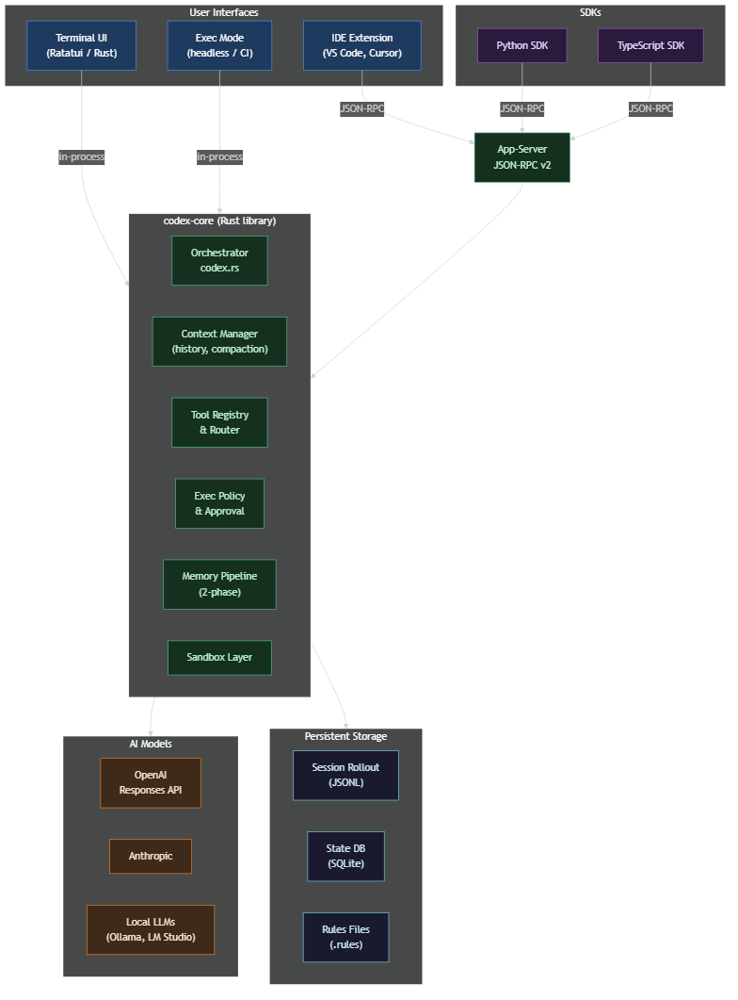
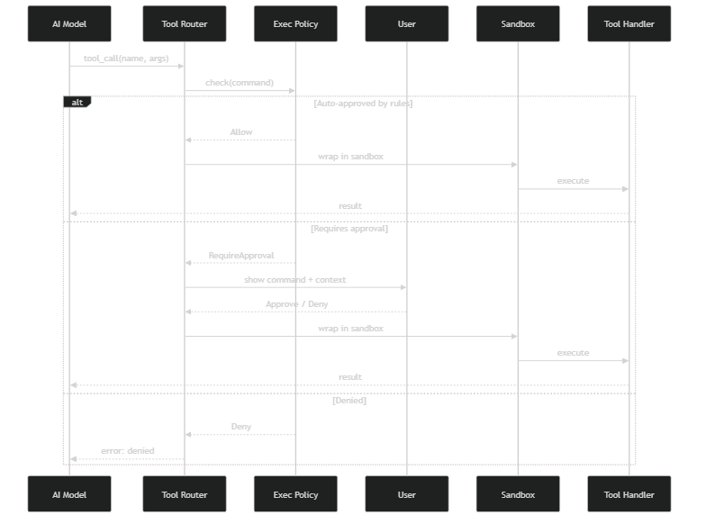
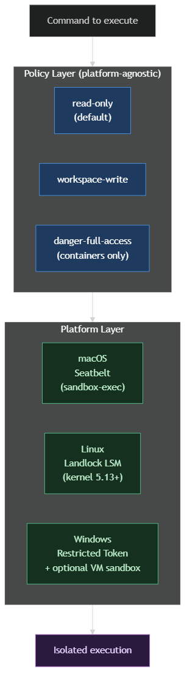
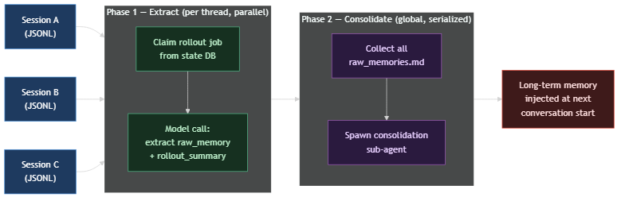

# OpenAI Codex — Technical Deep Dive

## Contents

1. [Overview](#1-overview)
2. [Architecture Diagram](#2-architecture-diagram)
3. [Component 1 — Core Library](#3-component-1--core-library)
4. [Component 2 — User Interfaces](#4-component-2--user-interfaces)
5. [Component 3 — App-Server & SDKs](#5-component-3--app-server--sdks)
6. [Component 4 — Tool System](#6-component-4--tool-system)
7. [Component 5 — Approval & Exec Policy](#7-component-5--approval--exec-policy)
8. [Component 6 — Sandbox Layer](#8-component-6--sandbox-layer)
9. [Component 7 — Context & Memory](#9-component-7--context--memory)
10. [Component 8 — Session Persistence](#10-component-8--session-persistence)
11. [How a Request Flows Through All Components](#11-how-a-request-flows-through-all-components)
12. [What Makes Codex Different](#12-what-makes-codex-different)

---

## 1. Overview

**Codex** is an open-source AI coding agent from OpenAI that runs entirely on your local machine. It is not a cloud service — it runs as a terminal application, and all execution happens on your computer.

The key idea: instead of just *suggesting* code for you to copy, Codex can *act* — it runs shell commands, edits files, reads directories, and navigates your project. Every action goes through an explicit approval and sandboxing system so you remain in control.

The codebase has two major parts:

| Directory | Language | Role |
|---|---|---|
| `codex-rs/` | Rust | The maintained engine — core library, TUI, CLI, app-server |
| `codex-cli/` | TypeScript | Legacy CLI (deprecated, kept for reference) |
| `sdk/` | Python / TypeScript | Client SDKs that talk to the app-server via JSON-RPC |

Everything of importance lives in `codex-rs/`. The Rust core is designed as a **reusable library** — the terminal UI, the CLI, and the IDE adapter all consume it as a dependency rather than calling a subprocess.

---

## 2. Architecture Diagram



The diagram shows the main layers:

- **User Interfaces** — the terminal UI, headless exec mode, and IDE extensions all connect to the same core
- **App-Server** — a JSON-RPC v2 bridge that lets external programs (SDKs, IDE plugins) talk to the core
- **codex-core** — the single Rust library that does all the real work
- **AI Models** — OpenAI, Anthropic, or local LLMs via Ollama / LM Studio
- **Persistent Storage** — session logs, a SQLite state database, and user-defined rules files

---

## 3. Component 1 — Core Library

**Location:** `codex-rs/core/`

This is the brain of the whole system. Every other component is either a thin UI wrapper or a client of this library.

The core library is responsible for:

- Running the **agent loop** — taking a user message, calling the model, receiving tool calls, executing them, and feeding results back until the model stops calling tools
- **Assembling the prompt** — injecting real-time context (current directory, environment, recent git changes) before every model call
- **Managing conversation history** — storing every turn so the model has the right context
- **Compacting long conversations** — when history grows too large, summarizing older messages to stay within the model's context window
- **Routing to AI models** — supporting OpenAI Responses API, Anthropic, and local LLMs through a connector abstraction

The orchestrator (`codex.rs`) is the central file (~300 KB). It coordinates all the sub-systems below and drives the turn-by-turn execution loop.

---

## 4. Component 2 — User Interfaces

**Locations:** `codex-rs/tui/`, `codex-rs/exec/`, `codex-rs/cli/`

Codex ships three ways to interact with the core:

### Terminal UI (TUI)
The default interactive experience. A full-screen terminal application built with the [Ratatui](https://ratatui.rs/) library. It renders conversation history, tool output, and approval prompts inside the terminal. It communicates with the core library via an in-process channel — no network hop.

### Exec Mode (headless)
A non-interactive runner for CI/CD pipelines and scripts. You pass a prompt and it runs until complete, printing structured output. Useful for automating coding tasks.

### CLI Dispatcher
The `codex` binary is a dispatcher. Running `codex` launches the TUI. Running `codex exec` runs headless. Running `codex app-server` starts the JSON-RPC server for IDE integration. One binary, three modes.

---

## 5. Component 3 — App-Server & SDKs

**Locations:** `codex-rs/app-server/`, `sdk/python/`, `sdk/typescript/`

### App-Server
A JSON-RPC v2 server that wraps the core library. It communicates over stdin/stdout, which is the standard way IDE extensions launch and talk to language servers.

This is how VS Code extensions, Cursor, and Windsurf integrate Codex: they spawn the `codex app-server` process and send JSON-RPC messages to it.

### SDKs
The Python and TypeScript SDKs are thin clients for the app-server. They let you write a Python or TypeScript script that starts Codex, sends a message, and receives structured events back — without touching Rust or JSON-RPC directly.

```python
# Python SDK example shape
async with Codex() as codex:
    thread = await codex.create_thread()
    result = await thread.send("Refactor this function to be async")
```

The SDKs also ship a bundled `codex` binary as a platform wheel, so `pip install codex` gives you everything you need.

---

## 6. Component 4 — Tool System

**Location:** `codex-rs/core/src/tools/`

Tools are how the model interacts with your computer. When the model wants to do something, it emits a tool call. The tool system routes that call to the right handler, enforces approval and sandboxing, and returns the result to the model.



### Built-in tools

| Tool | What it does |
|---|---|
| `shell` | Runs a shell command, captures stdout/stderr + exit code |
| `apply_patch` | Applies a unified diff to files — the primary way code gets edited |
| `read_file` | Reads file contents, with safe truncation for large files |
| `list_dir` | Lists directory contents with metadata |
| `view_image` | Renders images in the terminal (SIXEL/iTerm2 protocol) |
| `agent_jobs` | Spawns sub-agents for parallel tasks |
| `js_repl` | Runs lightweight JavaScript in a Node.js sandbox |
| `mcp_resource` | Reads resources from connected MCP servers |
| `request_user_input` | Pauses execution and asks the user a question |

### MCP integration
Codex connects to external **Model Context Protocol (MCP)** servers. Tools from those servers are registered dynamically alongside the built-ins, so third-party tools work exactly like first-party ones — including the same approval and sandboxing wrappers.

---

## 7. Component 5 — Approval & Exec Policy

**Location:** `codex-rs/core/src/exec_policy.rs`

Before any tool executes, Codex evaluates it against a policy engine. This is what makes Codex safe to use on real projects — the model cannot act without your knowledge.

### How policy evaluation works

Every command goes through three checks:

1. **Rules files** — User-defined `.rules` files in `~/.codex/rules/`. You write lines like `allow python3` or `deny bash -c`. Matched commands are auto-approved or auto-denied.

2. **Heuristics** — Built-in patterns for known-dangerous commands (`rm -rf /`, `sudo`, `env`, etc.). These are denied automatically.

3. **Default** — Anything not matched by rules or heuristics requires explicit user approval before running.

### Approval modes

You can configure how aggressively Codex asks:

| Mode | Behavior |
|---|---|
| `never` | Deny all unapproved commands |
| `on-failure` | Only ask if the command fails |
| `on-request` | Ask before every command |
| `unless-trusted` | Ask unless the rule file explicitly allows it |
| `granular` | Separate rules for sandbox vs. non-sandbox actions |

When you approve a command, you can also choose to save the approval as a new rule — so you only approve each command class once.

---

## 8. Component 6 — Sandbox Layer

**Location:** `codex-rs/core/src/sandboxing/`, `codex-rs/linux-sandbox/`, `codex-rs/windows-sandbox-rs/`

Even with approval, commands run inside a sandbox. The sandbox limits what an executed command can do to your system.



### Policy layer (platform-agnostic)

Three sandbox modes:

- **read-only** (default) — can read files but not write, no network access
- **workspace-write** — can read/write within the current project folder
- **danger-full-access** — no restrictions, intended only for container environments

### Platform layer

Each operating system has a native sandboxing mechanism:

- **macOS** — Apple Seatbelt (`sandbox-exec`), a mandatory access control framework built into the OS
- **Linux** — Landlock, a Linux Security Module available from kernel 5.13 onward
- **Windows** — Restricted Token sandboxing, which strips privileges from the process before it runs

The policy layer picks the right platform backend at runtime. On systems without sandboxing support, Codex degrades gracefully — the approval system still applies, only the OS-level isolation is absent.

---

## 9. Component 7 — Context & Memory

**Location:** `codex-rs/core/src/message_history.rs`, `compact.rs`, `memories/`, `realtime_context.rs`

Managing what the model knows — and what it remembers across sessions — is one of Codex's more sophisticated subsystems.

### Per-turn real-time context

Before each model call, Codex injects live information:
- Current working directory (from a captured shell snapshot)
- Relevant environment variables
- Recent file changes (git-aware diff summary)

This prevents the model from operating on stale assumptions about where you are in the project.

### In-session compaction

Conversations grow long. When history exceeds a token threshold:
1. Codex summarizes the oldest messages locally
2. If still too large, it calls the model to consolidate further
3. The result replaces the raw history — the model sees a summary + recent turns

### Cross-session memory pipeline

This is what makes Codex learn from past work. After a session ends, a two-phase background process extracts and consolidates memory.



**Phase 1 — Extract (runs in parallel, one job per thread):**
- Claims the session from the state database so no other process touches it
- Calls the model to extract structured memory facts and a session summary
- Writes results to `raw_memories.md` per thread

**Phase 2 — Consolidate (runs once, globally):**
- Collects all Phase 1 outputs
- Spawns an internal sub-agent to merge and deduplicate
- The final memory is injected into the system prompt at the start of the next conversation

The state database (SQLite) coordinates the two phases — acting as a job queue and watermark tracker to prevent duplicate work across concurrent processes.

---

## 10. Component 8 — Session Persistence

**Location:** `codex-rs/core/src/rollout.rs`

Every session is recorded to disk as an **append-only JSONL file**:

```
~/.codex/sessions/
  2025/01/15/
    my-project/
      session-abc123.jsonl
```

Each line in the file is one event — a user turn, a tool call, a tool result, an approval decision, an assistant response. The format is chosen deliberately:

- **Append-only** — corruption-resistant, no transactions needed
- **JSONL** — searchable with `grep` and `jq`, streamable
- **Git-friendly** — diffs are readable, conflicts are rare

Session files serve three purposes: they feed the memory pipeline, they enable full replay of any past conversation, and they create a complete audit trail of every action Codex took.

---

## 11. How a Request Flows Through All Components

Here is what happens from the moment you type a message to the moment you see a result:

```
1. You type a message in the TUI

2. TUI → Core Orchestrator
   The message is handed to codex.rs via an in-process channel

3. Core assembles the prompt
   - Loads conversation history
   - Injects real-time context (cwd, env, git diff)
   - Loads long-term memory from prior sessions

4. Core calls the AI model
   - Streams the response token by token

5. Model emits a tool call (e.g., run this shell command)

6. Tool Router receives the call
   → Exec Policy evaluates the command
   → If approval needed: pause and ask the user in the TUI
   → Sandbox Layer wraps the command with OS-level restrictions
   → Tool Handler executes the command

7. Result is returned to the model
   → Model may emit more tool calls (back to step 5)
   → Or model emits a final text response

8. TUI renders the response

9. Session Persistence
   Every turn, tool call, and result is appended to the JSONL rollout file

10. After session ends
    Memory Pipeline runs in the background to extract and consolidate learnings
```

---

## 12. What Makes Codex Different

Most AI coding tools are **read-only advisors** — they suggest changes and you apply them manually. Codex is an **active agent** — it acts directly on your system.

What makes that safe and useful:

**Approval before action.** The model cannot execute anything without going through the policy engine. You define the rules; Codex follows them.

**OS-level sandboxing.** Even approved commands run inside a native sandbox. The model cannot reach outside the allowed scope even if it tries.

**Full audit trail.** Every command ever run, every result, every approval — all recorded to disk in a human-readable format.

**Cross-session learning.** The two-phase memory pipeline means Codex gets better at working with your project over time. It remembers patterns, preferences, and project-specific knowledge from past sessions.

**One core, many frontends.** The core is a reusable Rust library. The TUI, the headless CLI, IDE extensions, and third-party apps through the SDK all get identical behavior — no logic is duplicated across frontends.

**MCP extensibility.** Any MCP server can extend Codex with new tools. Third-party tools participate in the same approval and sandbox system as built-ins — no special casing.

**Multi-model support.** OpenAI, Anthropic, and local models (Ollama, LM Studio) are all first-class. The connector abstraction means switching providers does not change any other behavior.

These properties together define the Codex philosophy: **powerful enough to act, transparent enough to trust.**
