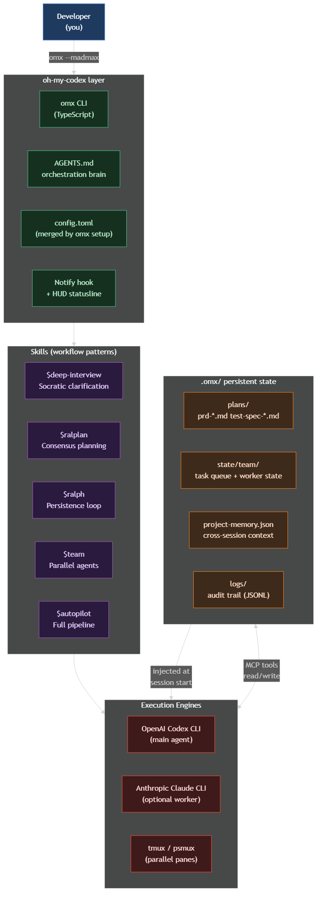
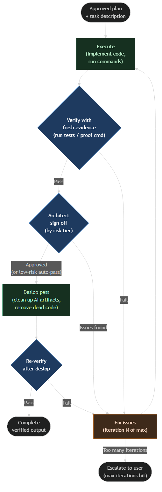
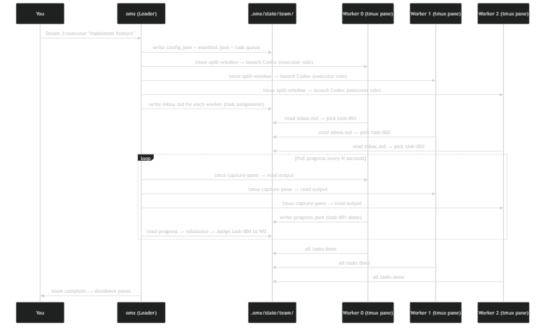
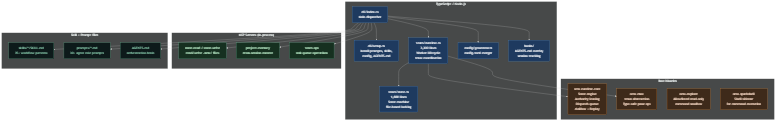
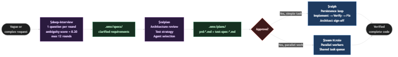

# oh-my-codex — Technical Deep Dive

## Contents

1. [What Is It?](#1-what-is-it)
2. [Why Do We Need It?](#2-why-do-we-need-it)
3. [Who Is It For?](#3-who-is-it-for)
4. [How to Install and Use It](#4-how-to-install-and-use-it)
5. [How It Helps in Daily Work](#5-how-it-helps-in-daily-work)
6. [Architecture Overview](#6-architecture-overview)
7. [Component 1 — CLI & Setup](#7-component-1--cli--setup)
8. [Component 2 — Skills (Workflow Patterns)](#8-component-2--skills-workflow-patterns)
9. [Component 3 — The Ralph Loop (Persistence)](#9-component-3--the-ralph-loop-persistence)
10. [Component 4 — Team Execution (Parallel Agents)](#10-component-4--team-execution-parallel-agents)
11. [Component 5 — State & Memory](#11-component-5--state--memory)
12. [Component 6 — Rust Core Engines](#12-component-6--rust-core-engines)
13. [How All Components Work Together](#13-how-all-components-work-together)

---

## 1. What Is It?

**oh-my-codex (OMX)** is an orchestration layer built on top of OpenAI Codex CLI (and optionally Anthropic Claude CLI). It adds structure, workflow, and multi-agent coordination to what would otherwise be a plain chat interface.

You install it once, run `omx setup`, and from that point every Codex session becomes a structured environment with:
- Named workflow patterns called **Skills** (`$deep-interview`, `$ralph`, `$team`, etc.)
- A **persistent state directory** (`.omx/`) that survives session restarts
- A **parallel execution engine** that can split work across multiple AI agents in tmux panes
- A **verification gate** that prevents the agent from declaring work done until it actually is

OMX does not replace Codex — it wraps it. You still use Codex normally. OMX installs files into `~/.codex/` (prompts, skills, config) so Codex automatically picks up the new behaviors.

---

## 2. Why Do We Need It?

Codex CLI alone has a core limitation: **it is a single agent that tries its best and then stops**. For simple tasks that is fine. For real engineering work it creates problems:

| Problem | What happens without OMX |
|---|---|
| **Vague tasks** | Codex makes assumptions, builds the wrong thing |
| **Long tasks** | Codex drifts, loses track of what is done vs pending |
| **Parallel work** | You manually open terminals and coordinate yourself |
| **No completion guarantee** | Codex says "done", but tests still fail |
| **No persistent plans** | Context disappears when you close the session |
| **No multi-agent coordination** | One agent does everything sequentially |

OMX solves each of these with a specific tool: clarification before building, a persistence loop, parallel worker panes, explicit verification gates, file-based durable state, and a team runtime.

---

## 3. Who Is It For?

**Primary users:**
- Developers using Codex CLI who want stronger default behavior and more reliable results
- Teams running long or complex tasks (multi-file refactors, new features, bug investigations) where a single agent session is not enough
- Engineers who want parallel AI work without manually managing multiple terminal windows

**Also useful for:**
- Teams standardizing on a shared agent workflow (everyone follows the same skill patterns)
- Projects with custom conventions — OMX's `AGENTS.md` file teaches Codex how your project works

**Not for:**
- Simple, one-shot tasks that need no planning
- Users who do not want any workflow structure on top of Codex

---

## 4. How to Install and Use It

### Install

```bash
npm install -g oh-my-codex
omx setup
```

`omx setup` does several things automatically:
- Installs 30+ agent role prompts to `~/.codex/prompts/`
- Installs 35+ skill definitions to `~/.codex/skills/`
- Merges `config.toml` with OMX settings (notify hook, feature flags, model config)
- Creates an `AGENTS.md` orchestration brain in your project root
- Creates `.omx/` state directory with `.gitignore`

### Start a session

```bash
omx --madmax --high
```

This starts Codex with maximum model power and high reasoning effort, plus all OMX overlays active. You now have the full skill set available.

### Key CLI commands

| Command | What it does |
|---|---|
| `omx setup` | First-time install |
| `omx doctor` | Check that everything is installed correctly |
| `omx --madmax --high` | Start a powerful session |
| `omx team 3:executor "task"` | Launch 3 parallel executor agents |
| `omx ralph "task"` | Start a persistence loop from the command line |
| `omx explore --prompt "find X"` | Safe read-only codebase search |
| `omx resume` | Continue the previous session |
| `omx status` | Show current team/ralph state |

### In-session skill invocations

Once inside a Codex session started by OMX, you use skills by typing their name:

```
$deep-interview "help me think through the caching strategy"
$ralplan "review the plan and identify risks"
$ralph "implement the approved caching layer"
$team 3:executor "build all three API endpoints in parallel"
```

---

## 5. How It Helps in Daily Work

### Scenario 1: You have a vague feature request

Instead of asking Codex to implement something unclear:
```
$deep-interview "add OAuth2 support"
```
Codex asks one focused question per round, scores the ambiguity numerically, and keeps asking until the requirements are clear enough to act on (ambiguity score < 0.20). The result is saved to `.omx/specs/`.

### Scenario 2: You need an architecture decision

```
$ralplan "design the OAuth2 implementation"
```
Codex reviews the architecture, identifies tradeoffs, proposes a test strategy, and asks for your approval before a single line of code is written. The approved plan goes to `.omx/plans/`.

### Scenario 3: You need guaranteed completion

```
$ralph "implement the OAuth2 module from the approved plan"
```
Ralph loops: implement → verify with evidence → fix → architect review → clean up → re-verify. It does not stop until every item passes. If it hits its retry limit, it escalates to you rather than silently calling itself done.

### Scenario 4: You need parallel work

```
$team 3:executor "implement OAuth2 module, write tests, and update docs"
```
Three Codex agents run in parallel tmux panes. Each picks tasks from a shared queue. When one finishes, it picks the next pending task. You watch progress from the leader pane.

### Scenario 5: Autonomous end-to-end

```
$autopilot "build a REST API for task management with tests and docs"
```
OMX runs the full pipeline autonomously: clarify → plan → implement → verify — no approval gates unless you configure them.

---

## 6. Architecture Overview



OMX sits between you and Codex. It:
1. Modifies Codex's configuration so it loads OMX's prompts and skills automatically
2. Injects an `AGENTS.md` file that tells Codex how to behave for your project
3. Exposes MCP (Model Context Protocol) tools that let Codex read and write state files
4. Provides a team runtime that launches and coordinates multiple Codex/Claude agents via tmux
5. Persists everything to `.omx/` so work survives session restarts

---

## 7. Component 1 — CLI & Setup

**Key files:** `src/cli/index.ts`, `src/cli/setup.ts`, `src/config/generator.ts`

The `omx` command is a Node.js CLI that does two kinds of work:

### Setup (`src/cli/setup.ts`)

Runs once (or on update). It:
- Copies all prompt and skill files into `~/.codex/`
- Merges the following into your `config.toml`:

```toml
notify = ["node", "/path/to/notify-hook.js"]
model = "gpt-5.4"
model_reasoning_effort = "high"
developer_instructions = "You have oh-my-codex installed. AGENTS.md is your orchestration brain..."

[features]
multi_agent = true
child_agents_md = true
```

- Registers OMX MCP servers in `config.toml` so Codex loads them automatically
- Creates `AGENTS.md` in the project root from a template

### Session launch (`src/cli/index.ts`)

When you run `omx`, it:
1. Generates a session-scoped `AGENTS.md` overlay (merges project-level + OMX runtime markers)
2. Resolves model flags (`--madmax`, `--high`, `--spark`)
3. Launches Codex with the right environment variables
4. Attaches the HUD status line if inside tmux

### Config generation (`src/config/generator.ts`)

The config merger is careful: it upserts OMX-owned keys at the top of `config.toml` before any `[table]` headers, so they do not accidentally fall inside a table section. It handles MCP server entries separately in `[mcp_servers]`.

---

## 8. Component 2 — Skills (Workflow Patterns)

**Key files:** `skills/*/SKILL.md`, `prompts/*.md`

Skills are markdown files that define structured workflows. When you invoke `$deep-interview`, Codex reads `skills/deep-interview/SKILL.md` and follows the instructions inside it.

OMX ships 35+ skills. The four most important:

### $deep-interview

A Socratic clarification loop before any planning or implementation.

- Asks **one question per round**
- Scores ambiguity across four dimensions: intent (40%), scope (30%), success criteria (20%), timeline (10%)
- Stops when ambiguity score drops below the threshold for the chosen depth:

| Depth | Score threshold | Max rounds |
|---|---|---|
| Quick | 0.30 | 5 |
| Standard | 0.20 | 12 |
| Deep | 0.15 | 20 |

- Output: `.omx/specs/` with a structured requirements document

### $ralplan

Consensus planning with explicit approval before execution.

- Reviews the proposed architecture and identifies tradeoffs
- Designs a test strategy
- Lists which agent roles are available for execution
- **Waits for your approval** — does not start building until you say go
- Output: `.omx/plans/prd-*.md` (requirements) and `.omx/plans/test-spec-*.md` (tests)

### $ralph

Persistence loop — keeps going until the task is actually done.

See [Component 3](#9-component-3--the-ralph-loop-persistence) for full detail.

### $team

Parallel multi-agent execution via tmux.

See [Component 4](#10-component-4--team-execution-parallel-agents) for full detail.

### Agent role prompts

The `prompts/` directory has 30+ role-specific system prompts installed into `~/.codex/prompts/`. When a worker is started with role `executor`, Codex loads `prompts/executor.md` as its system prompt. Key roles:

| Role | What it does |
|---|---|
| `executor` | Implements tasks from a plan |
| `architect` | High-level design review |
| `debugger` | Root-cause analysis |
| `verifier` | Checks that work is actually done |
| `security-reviewer` | OWASP analysis |
| `code-reviewer` | Style and quality review |
| `test-engineer` | Writes and runs tests |
| `explorer` | Maps the codebase without changing it |

---

## 9. Component 3 — The Ralph Loop (Persistence)

**Key files:** `src/ralph/persistence.ts`, `skills/ralph/SKILL.md`



The ralph loop solves the "I thought I was done but wasn't" problem. Instead of the agent doing its best and stopping, ralph enforces a completion guarantee.

### The loop

1. **Execute** — implement the work
2. **Verify with fresh evidence** — run the actual commands that prove it works (not just "the code looks right")
3. **Fix if failing** — go back to execute
4. **Architect sign-off** — a separate verification step by role level based on risk:
   - Low risk (< 5 files): light review
   - Standard: normal architect review
   - Thorough (> 20 files, security changes): deep review
5. **Deslop pass** — remove AI-generated noise: commented-out code, unnecessary TODOs, redundant wrappers
6. **Re-verify after deslop** — confirm the cleanup did not break anything
7. **Done** — only when all checks pass

If the loop hits its iteration limit without passing, it **escalates to you** rather than silently completing.

### State persistence

Ralph saves its progress to `.omx/state/ralph-state.json` after each step. If the session is interrupted (network drop, laptop sleep), `omx resume` picks up from where it left off.

---

## 10. Component 4 — Team Execution (Parallel Agents)

**Key files:** `src/team/runtime.ts`, `src/team/state.ts`, `src/team/tmux-session.ts`



Team mode runs N Codex (or Claude) agents in parallel, each in its own tmux pane, all sharing a task queue.

### Invocation

```
$team 3:executor "implement the three API endpoints from the plan"
```

Parsed as: **3 workers**, role **executor**, task description is the rest.

### How it works

**1. Setup**

The team runtime creates the state directory and writes:
- `config.json` — worker count, role, team name
- `manifest.json` — the task list
- `tasks/task-N.json` — individual task descriptions

**2. Spawn workers**

For each worker, tmux splits the window and creates a new pane. The runtime launches Codex (or Claude) in that pane with environment variables:

```
OMX_TEAM_WORKER=team-name/worker-0
OMX_TEAM_STATE_ROOT=/path/.omx/state
OMX_TEAM_LEADER_CWD=/path/to/project
```

Workers read these variables and know they are in team mode. They load the worker role prompt and wait for their `inbox.md`.

**3. Task assignment**

The leader writes `inbox.md` for each worker — a markdown file describing the task they should work on. Workers read this via the MCP `state-read` tool.

**4. Progress polling**

The leader polls each worker by calling `tmux capture-pane` on their pane. It reads the output and detects completion signals (specific strings or state file updates).

**5. Rebalancing**

When a worker finishes its task, the leader assigns the next pending task from the queue. Workers are never left idle if there is more work available.

**6. Mixed teams**

You can mix Codex and Claude workers:

```
$team 2:codex:executor 1:claude:debugger "fix the auth bug and write regression tests"
```

Each worker uses its own CLI. The coordination layer (tmux + state files) works the same for both.

**7. Durable workers**

Workers in tmux survive leader interruptions. If the leader process crashes, `omx resume` reconnects to the existing panes and continues coordinating.

### Team state directory

```
.omx/state/team/{team-name}/
├── config.json              ← worker count, role, team name
├── manifest.json            ← task list + assignment status
├── tasks/
│   ├── task-001.json        ← task description + status
│   └── task-002.json
├── worker-agents.md         ← AGENTS.md overlay for all workers
├── worker-0/
│   ├── inbox.md             ← current task assignment
│   └── progress.json        ← task completion tracking
└── events/
    └── team-{name}.log      ← append-only event log for audit
```

---

## 11. Component 5 — State & Memory

**Key files:** `src/mcp/state-paths.ts`, `src/hooks/`

All state lives in `.omx/` in the project root. This directory is created by `omx setup` and has a `.gitignore` by default (you can check it in if you want cross-machine persistence).

### Full `.omx/` layout

```
.omx/
├── specs/                      ← deep-interview output
│   └── deep-interview-*.md
├── plans/                      ← ralplan output
│   ├── prd-*.md                ← product requirements
│   └── test-spec-*.md          ← test plans
├── state/                      ← runtime state
│   ├── ralph-state.json        ← current ralph loop progress
│   └── team/
│       └── {team-name}/        ← team execution state
├── logs/                       ← session logs
├── context/                    ← context snapshots
│   └── {task-slug}-{ts}.md
├── notepad.md                  ← session scratchpad
└── project-memory.json         ← cross-session project knowledge
```

### project-memory.json

This file is the cross-session memory for your project. It stores things that the team and ralph modes learn about your project:

```json
{
  "architecture": "REST API with PostgreSQL + Redis caching",
  "recent_decisions": [
    "Use Zod for validation (2025-04-01)",
    "Adopted service-oriented structure"
  ],
  "known_issues": ["slow PDF export", "memory leak in scheduler"],
  "external_constraints": ["deadline: 2025-04-30"]
}
```

This is read at session start and injected into the model's context so it has project-level knowledge without you repeating it every session.

### MCP tools for state access

Codex agents access `.omx/` through MCP tools (not raw file I/O). This keeps access controlled:

| MCP tool | What it does |
|---|---|
| `state_read` | Read a file from `.omx/state/` |
| `state_write` | Write a file to `.omx/state/` |
| `project_memory_read` | Read `project-memory.json` |
| `project_memory_write` | Update `project-memory.json` |
| `team_ops` | Task queue operations (claim, complete, rebalance) |

Using MCP tools instead of direct filesystem access means the paths are validated, escape attempts (via `../`) are blocked, and access is scoped to the project's `.omx/` directory.

### AGENTS.md — the orchestration brain

`AGENTS.md` is a markdown file in your project root that OMX generates from a template. It tells Codex:
- What OMX is and how to use its skills
- How to behave for this specific project (conventions, structure, constraints)
- Which agent roles to use for which types of tasks
- How to handle state reading/writing via MCP tools

OMX generates a session-scoped overlay version of `AGENTS.md` each time you start a session, injecting runtime information (team state, current mode, active workers).

---

## 12. Component 6 — Rust Core Engines

**Key directories:** `crates/`

Four Rust crates handle the performance-critical parts.

### omx-runtime-core

A state machine for team coordination. Three sub-systems:

**Authority leasing** — prevents split-brain when multiple processes might think they are the leader:
```
Acquire authority (owner, lease_id, TTL=30s)
Renew authority (heartbeat every 15s)
Lose authority (crash → TTL expires → next candidate takes over)
```

**Dispatch queue** — task lifecycle state machine:
```
Queued → Notified (sent to worker) → Delivered (worker confirmed) → Done
                                                                  → Failed (retry)
```

**Mailbox** — typed messages between leader and workers. Used for task assignment handshake and escalation.

**Event replay** — after a crash, the engine replays its event log to recover the last known state.

### omx-mux

Abstracts tmux into typed operations. Instead of building raw tmux command strings everywhere, the TypeScript team runtime calls this crate's API:

```rust
SendInput { target, envelope }       // inject keys into a pane
CaptureTail { target, lines }        // read last N lines from pane output
InspectLiveness { target }           // is the pane still alive?
```

Also handles **confirmation policies** — after sending a command to a pane, the mux can wait for a specific output pattern to confirm delivery before continuing.

### omx-explore

A sandboxed read-only codebase search tool. When you run `omx explore --prompt "find where team state is written"`, this Rust binary handles the underlying file search. It enforces an explicit allowlist of safe commands:

```
rg, grep, ls, find, wc, cat, head, tail, pwd, printf
```

Anything not on the list is rejected. This prevents `omx explore` from being used to run arbitrary code.

### omx-sparkshell

A native shell sidecar — a lightweight command execution harness that Codex can use to run commands through OMX's sandboxing layer instead of directly.

---

## 13. How All Components Work Together



### The standard workflow from start to finish



Here is a complete walkthrough of implementing a new feature using OMX:

**Step 1 — Install and start**
```bash
omx setup          # runs once
omx --madmax --high
```
OMX merges config, installs skills/prompts, generates `AGENTS.md`. Codex starts and loads everything automatically.

**Step 2 — Clarify**
```
$deep-interview "add user notification preferences to the profile API"
```
Deep-interview asks focused questions until the feature is well-understood. Ambiguity score drops to 0.18. Requirements saved to `.omx/specs/notification-prefs.md`.

**Step 3 — Plan**
```
$ralplan "design the notification preferences feature"
```
Ralplan reviews the spec, proposes: add a `notification_prefs` column (JSON), extend the Profile API with GET/PATCH endpoints, write integration tests. Identifies tradeoffs (JSON vs separate table). Asks for your approval.

You approve. Plan saved to `.omx/plans/prd-notifications.md`.

**Step 4 — Execute in parallel**
```
$team 3:executor "implement the notification preferences feature from the approved plan"
```
Three Codex agents start in parallel tmux panes:
- Worker 0 picks: add database column + migration
- Worker 1 picks: implement API endpoints
- Worker 2 picks: write integration tests

Leader polls progress every 10 seconds. Workers complete and pick remaining tasks. All done in ~10 minutes instead of 30.

**Step 5 — Verify and ship**

The team's verifier lane runs in parallel. Once all tasks complete, the leader runs the final verification gate: runs tests, checks outputs, escalates any failures. When verification passes, you get a clean "team complete" signal.

State at the end:
- Code committed (or ready to commit)
- `.omx/` has full audit trail: plans, task assignments, event log
- `project-memory.json` updated with new knowledge about the notification system