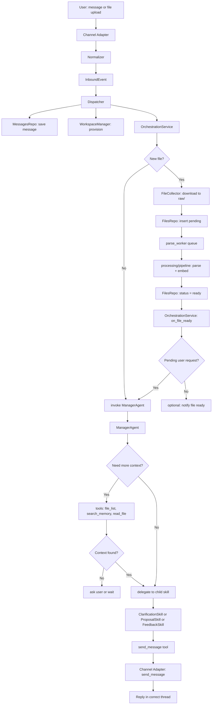

# Runtime Flows

## Session State Machine

Each channel has at most one active session at a time.

```
IDLE
 │  @bot proposal request
 ▼
PROCESSING_INPUTS  ──► wait for files if any are pending
 │  all inputs ready
 ▼
CLARIFYING  ◄──────────────────────┐
 │  enough info                    │  still missing
 ▼                                 │
DRAFTING ─────────────────────────►┘  (re-enters CLARIFYING if new gaps found)
 │  proposal posted
 ▼
PROPOSAL_READY
 │  feedback received
 ▼
UPDATING
 │  update posted
 ▼
PROPOSAL_READY  (loop until user is satisfied)
```

State transitions on any state: `@bot reset` → IDLE

---

## Flow 1 — Upload File + Ask for Proposal

**Purpose:** User uploads one or more files and asks the bot to draft a proposal.

**Steps:**

1. Slack sends `file_shared` event
2. `SlackAdapter` downloads the file → `FileCollector.collect()` saves to `raw/` and inserts a `pending` DB record
3. `parse_worker` picks up the job → `pipeline.run()`:
   - parse raw file → Markdown (`clean/`)
   - embed chunks → ChromaDB
   - generate summary
   - update DB status to `ready`
4. User sends `@bot create a proposal`
5. `SlackAdapter` normalises → `InboundEvent` → `Dispatcher.dispatch()`
6. Dispatcher saves message, provisions workspace, calls `OrchestrationService.handle_user_event()`
7. Orchestration checks: are files still pending? → if yes, stores the user message and waits
8. When last file becomes `ready`, `parse_worker` calls `on_file_ready` callback
9. Orchestration resumes with the stored message → calls `ManagerAgent.run()`
10. Manager Agent checks context → decides: clarify or draft
11. Agent sends reply via `send_message()` → Slack thread

**Participating components:**
`SlackAdapter` → `FileCollector` → `parse_worker` → `processing/pipeline` → `OrchestrationService` → `ManagerAgent` → `ProposalSkill` / `ClarificationSkill` → `SlackAdapter.send_message`

---

## Flow 2 — Ask Without New File

**Purpose:** User asks the bot to act using files already in the workspace.

**Steps:**

1. User sends `@bot create a proposal`
2. `Dispatcher` saves message, calls `OrchestrationService.handle_user_event()`
3. Orchestration checks: no pending files → calls `ManagerAgent.run()` immediately
4. Manager Agent reads conversation history + workspace files via tools
5. If information is sufficient → `ProposalSkill` drafts proposal → saves to `output/proposal_vN.md` → posts to Slack
6. If information is missing → `ClarificationSkill` posts a single message with all missing items to Slack thread
7. Session state → `CLARIFYING`

**Participating components:**
`SlackAdapter` → `Dispatcher` → `OrchestrationService` → `ManagerAgent` → `ClarificationSkill` or `ProposalSkill` → `SlackAdapter.send_message`

---

## Flow 3 — Feedback Update

**Purpose:** Team gives a revision instruction on an existing proposal draft.

**Steps:**

1. User sends feedback (e.g. `@bot add a data migration section`) in the channel
2. Dispatcher detects session is in `PROPOSAL_READY` state → calls `handle_feedback()`
3. Orchestration saves feedback to `feedback_instructions` table, sets session to `UPDATING`
4. `ManagerAgent.run()` is called with the feedback context
5. Agent reads current proposal (`proposal_latest.md`) + all active feedback instructions
6. `ProposalSkill` revises the proposal → saves `proposal_vN+1.md` + overwrites `proposal_latest.md`
7. Agent posts updated proposal + short change summary to Slack thread
8. Session returns to `PROPOSAL_READY`

**Participating components:**
`SlackAdapter` → `Dispatcher` → `OrchestrationService` → `FeedbackRepo` → `ManagerAgent` → `ProposalSkill` → `workspace/files/versioning` → `SlackAdapter.send_message`

---

## Flow 4 — Full System Event Diagram



---

## Clarification Loop Detail

- Agent posts **one message per round** listing all critical missing items as numbered questions
- User replies in the same Slack thread
- Reply is treated as a clarification answer and re-routed to `handle_clarification_answer()`
- Agent re-evaluates completeness; exits the loop when:
  - all critical items are covered, or
  - user says `proceed` / `skip` / `make assumptions`, or
  - `MAX_CLARIFICATION_ROUNDS` is reached (agent then drafts with explicit assumptions)
