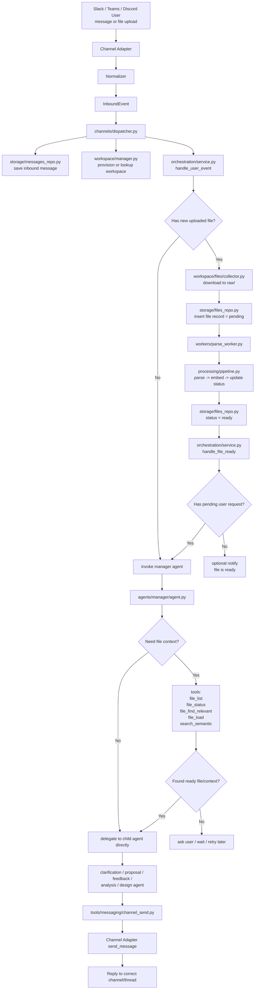

# Source Code Structure

## Contents

1. [Project Overview](#1-project-overview)
2. [Full Directory Structure](#2-full-directory-structure)
3. [The Tool → Skill → Agent Hierarchy](#3-the-tool--skill--agent-hierarchy)
4. [How Pieces Connect — ProposalAgent Example](#4-how-pieces-connect--proposalagent-example)
5. [Tool Sharing Map](#5-tool-sharing-map)
6. [Agent Registry — Manager Crew](#6-agent-registry--manager-crew)
7. [Why CrewAI](#7-why-crewai)
8. [Adding a New Agent (future)](#8-adding-a-new-agent-future)
9. [Data Storage Design](#9-data-storage-design)
   - [9.0 SQLModel — How It Works Here](#90-sqlmodel--how-it-works-here)
   - [9.1 Storage Systems Overview](#91-storage-systems-overview)
   - [9.2 Relational DB — ERD](#92-relational-db--erd)
   - [9.3 Vector DB — ChromaDB Collections and Metadata](#93-vector-db--chromadb-collections-and-metadata)
   - [9.4 Tool Definitions](#94-tool-definitions)
   - [9.5 Storage Layout Summary](#95-storage-layout-summary)

---

## 1. Project Overview

A multi-channel AI agent system where:

- **Multiple agents** handle different task types (proposal, data analysis, solution design, …)
- **Each agent** is composed of one or more **skills**
- **Each skill** selects a subset of shared **tools** + injects a `SKILL.md` instruction prompt
- **Tools** are shared — the same `search_semantic` tool is reused across every skill that needs it
- **Channels** (Slack, Teams, Discord) are abstracted behind a `ChannelAdapter` — the agent layer never knows which platform it is on

**Framework:** CrewAI for agent orchestration (Agents, Tasks, Crews).

---

## 2. Full Directory Structure


```
proposal-agent/
├── channels/
├── orchestration/
│   └── workflow.py        # LangGraph/custom workflow
├── processing/
├── workers/
├── agents/
│   ├── manager/
│   ├── clarification/
│   ├── proposal/
│   └── feedback/
├── tools/                 # LangChain tools
├── skills/               #
├── workspace/
├── storage/
└── common/
```


```
proposal-agent/
│
├── main.py                                # app entrypoint: start adapters, db, workers
├── config.py                              # settings
├── requirements.txt
├── .env.example
│
├── channels/                              # channel adapter layer
│   ├── __init__.py
│   ├── base.py                            # ChannelAdapter, InboundEvent, FileRef
│   ├── registry.py                        # load adapters from config
│   ├── dispatcher.py                      # normalize event -> save message -> call orchestration
│   │
│   ├── slack/
│   │   ├── __init__.py
│   │   ├── adapter.py
│   │   └── normalizer.py
│   │
│   ├── teams/                             # future
│   │   ├── __init__.py
│   │   ├── adapter.py
│   │   └── normalizer.py
│   │
│   └── discord/                           # future
│       ├── __init__.py
│       ├── adapter.py
│       └── normalizer.py
│
├── orchestration/                         # system workflow, not agent reasoning
│   ├── __init__.py
│   └── service.py                         # handle_user_event()
│                                           # handle_file_ready()
│                                           # resolve_request_context()
│                                           # enqueue_parse_if_needed()
│                                           # invoke_manager_agent()
│
├── processing/                            # deterministic processing pipeline
│   ├── __init__.py
│   ├── parser.py                          # raw file -> clean markdown
│   ├── embedder.py                        # markdown -> chunks -> vector db
│   ├── summarizer.py                      # optional file summary
│   └── pipeline.py                        # parse/embed/update-status pipeline
│
├── workers/                               # background workers
│   ├── __init__.py
│   └── parse_worker.py                    # consume parse jobs -> processing.pipeline
│                                           # -> notify orchestration.handle_file_ready()
│
├── agents/                                # agent runtime layer
│   ├── __init__.py
│   ├── base.py                            # BaseAgent / shared builder
│   ├── registry.py                        # register manager + child agents
│   │
│   ├── manager/
│   │   ├── __init__.py
│   │   ├── agent.py                       # master agent
│   │   └── builder.py                     # create LangChain agent with skills/tools
│   │
│   ├── clarification/
│   │   ├── __init__.py
│   │   ├── agent.py
│   │   └── builder.py
│   │
│   ├── proposal/
│   │   ├── __init__.py
│   │   ├── agent.py
│   │   ├── builder.py
│   │   └── runner.py                      # proposal-specific state rules only
│   │
│   ├── feedback/
│   │   ├── __init__.py
│   │   ├── agent.py
│   │   └── builder.py
│   │
│   ├── data_analysis/                     # future
│   │   ├── __init__.py
│   │   ├── agent.py
│   │   └── builder.py
│   │
│   └── design/                            # future
│       ├── __init__.py
│       ├── agent.py
│       └── builder.py
│
├── skills/                                # project-level skill abstraction
│   ├── __init__.py
│   ├── base.py                            # BaseSkill
│   ├── loader.py                          # load SKILL.md, load tool subset, build skill object
│   ├── registry.py                        # skill_name -> skill class
│   │
│   ├── manager_routing/
│   │   ├── __init__.py
│   │   ├── skill.py                       # choose child agent / decide next action
│   │   └── SKILL.md
│   │
│   ├── file_context_resolution/
│   │   ├── __init__.py
│   │   ├── skill.py                       # how to find/check/load relevant files
│   │   └── SKILL.md
│   │
│   ├── clarification/
│   │   ├── __init__.py
│   │   ├── skill.py
│   │   └── SKILL.md
│   │
│   ├── proposal_draft/
│   │   ├── __init__.py
│   │   ├── skill.py
│   │   └── SKILL.md
│   │
│   ├── feedback_update/
│   │   ├── __init__.py
│   │   ├── skill.py
│   │   └── SKILL.md
│   │
│   ├── file_qa/
│   │   ├── __init__.py
│   │   ├── skill.py
│   │   └── SKILL.md
│   │
│   ├── data_analysis/
│   │   ├── __init__.py
│   │   ├── skill.py
│   │   └── SKILL.md
│   │
│   └── solution_design/
│       ├── __init__.py
│       ├── skill.py
│       └── SKILL.md
│
├── tools/                                 # shared callable tools
│   ├── __init__.py
│   ├── base.py
│   │
│   ├── messaging/
│   │   ├── __init__.py
│   │   ├── msg_fetch_recent.py            # get recent messages by channel/thread
│   │   ├── msg_summarize.py               # summarize thread history
│   │   └── channel_send.py                # send reply to Slack/Teams/etc
│   │
│   ├── files/
│   │   ├── __init__.py
│   │   ├── file_list.py                   # list files in workspace/channel
│   │   ├── file_status.py                 # check file processing status
│   │   ├── file_load.py                   # load clean markdown by file_id
│   │   ├── file_find_relevant.py          # find likely relevant file from query/history
│   │   └── file_write.py                  # write outputs
│   │
│   ├── memory/
│   │   ├── __init__.py
│   │   ├── store_requirements.py          # read/write requirements.md
│   │   └── store_proposal.py              # read/write proposal versions
│   │
│   └── search/
│       ├── __init__.py
│       ├── search_semantic.py             # vector search in workspace docs
│       └── search_web.py                  # future
│
├── workspace/                             # workspace lifecycle + file intake
│   ├── __init__.py
│   ├── manager.py                         # provision / lookup workspace
│   ├── registry.py                        # channel_id -> workspace path
│   ├── schema.py
│   │
│   └── files/
│       ├── __init__.py
│       ├── collector.py                   # download uploaded file -> raw/ + insert file row
│       └── versioning.py
│
├── storage/                               # persistence layer
│   ├── __init__.py
│   ├── db.py
│   ├── models.py                          # messages, files, agent_sessions, feedback
│   ├── messages_repo.py
│   ├── files_repo.py
│   ├── sessions_repo.py
│   └── vector_repo.py
│
├── runtime/                               # runtime helpers for LangChain/LangGraph
│   ├── __init__.py
│   ├── llm.py                             # model/provider factory
│   ├── graph.py                           # optional LangGraph builder
│   └── tracing.py                         # logging / observability hooks
│
├── api/                                   # internal API / health check
│   ├── __init__.py
│   └── routes.py
│
├── chromadb/
│   ├── workspace_documents/
│   └── common_knowledge/
│
├── workspaces/
│   └── {channel-name}/
│       └── data/
│           ├── raw/
│           ├── clean/
│           └── output/
│
└── common/
    ├── requirements/
    ├── technical/
    ├── member_profiles/
    └── company_progress/
```

---

## 2. Work Flows




## 3. Data Storage Design


### 3.1 Storage Systems Overview

Three storage systems, each with a distinct role:

| # | Type | Technology | What it stores |
|---|---|---|---|
| 1 | **Relational (RDB)** | PostgreSQL | Structured records — messages, files, sessions, feedback |
| 2 | **Vector DB** | ChromaDB | Document chunks + embeddings for semantic search |
| 3 | **Filesystem** | Disk | Raw uploaded files, processed Markdown, proposal outputs |

**Single Postgres database** (`proposal_agent`) with `channel_id` as the workspace boundary on every table. All channels share one DB — no per-workspace files to manage, migrate, or back up.


### 3.2 Relational DB — ERD

One database (`proposal_agent`), four tables. `channel_id` on every table is the workspace isolation key.

```
┌─────────────────────────────────────────────────────────────────────────────────┐
│  proposal_agent  (PostgreSQL)                                                   │
│                                                                                 │
│  ┌──────────────────────────────┐     ┌──────────────────────────────────────┐  │
│  │ messages                     │     │ files                                │  │
│  │──────────────────────────────│     │──────────────────────────────────────│  │
│  │ PK  id            UUID       │     │ PK  id            UUID               │  │
│  │     channel_id    TEXT  ──┐  │     │     channel_id    TEXT  ──┐          │  │
│  │     channel_type  TEXT   │  │     │     user_id        TEXT   │          │  │
│  │     user_id       TEXT   │  │     │     original_name  TEXT   │          │  │
│  │     role          TEXT   │  │     │     stored_name    TEXT   │          │  │
│  │     content       TEXT   │  │     │     file_type      TEXT   │          │  │
│  │     thread_id     TEXT   │  │     │     file_size      BIGINT │          │  │
│  │     file_ids      JSONB  │  │     │     raw_path       TEXT   │          │  │
│  │     platform_ts   TEXT   │  │     │     clean_path     TEXT   │          │  │
│  │     created_at    TIMESTAMPTZ     │     status        TEXT   │          │  │
│  │                          │  │     │     file_summary   TEXT   │          │  │
│  │  INSERT only             │  │     │     is_latest      BOOL   │          │  │
│  │  No UPDATE / DELETE      │  │     │     is_deleted     BOOL   │          │  │
│  └──────────────────────────┘  │     │     created_at     TIMESTAMPTZ       │  │
│                                │     │     updated_at     TIMESTAMPTZ       │  │
│                                │     │                          │          │  │
│                                │     │  status enum:            │          │  │
│                                │     │    pending               │          │  │
│                                │     │    extracting            │          │  │
│                                │     │    extracted             │          │  │
│                                │     │    embedding             │          │  │
│                                │     │    ready                 │          │  │
│                                │     │    failed                │          │  │
│                                │     │    unsupported           │          │  │
│                                │     └──────────────────────────┘          │  │
│                                │                                │          │  │
│  ┌─────────────────────────────┴──────────────────────────────────────┐    │  │
│  │                        channel_id (workspace key)                  │    │  │
│  └─────────────────────────────┬──────────────────────────────────────┘    │  │
│                                │                                            │  │
│  ┌─────────────────────────────┴────────┐  ┌────────────────────────────┐  │  │
│  │ agent_sessions                       │  │ feedback_instructions       │  │  │
│  │──────────────────────────────────────│  │────────────────────────────│  │  │
│  │ PK  id                 UUID          │  │ PK  id            UUID      │  │  │
│  │     channel_id         TEXT  ────────┼──┤     channel_id    TEXT ─────┘  │  │
│  │     channel_type       TEXT          │  │     text          TEXT         │  │
│  │     task_type          TEXT          │  │     active        BOOL         │  │
│  │     status             TEXT          │  │     applied_to_   INT          │  │
│  │     clarification_round INT          │  │       version                  │  │
│  │     proposal_version   INT           │  │     created_at    TIMESTAMPTZ  │  │
│  │     thread_id          TEXT          │  │                                │  │
│  │     pending_message    TEXT          │  │  FK  channel_id →              │  │
│  │     created_at         TIMESTAMPTZ   │  │      agent_sessions            │  │
│  │     updated_at         TIMESTAMPTZ   │  └────────────────────────────────┘  │
│  │                                      │                                      │
│  │  status enum:                        │                                      │
│  │    idle                              │                                      │
│  │    processing_inputs                 │                                      │
│  │    clarifying                        │                                      │
│  │    drafting                          │                                      │
│  │    proposal_ready                    │                                      │
│  │    updating                          │                                      │
│  │    failed                            │                                      │
│  │                                      │                                      │
│  │  UNIQUE (channel_id)                 │                                      │
│  │    WHERE status NOT IN               │                                      │
│  │    ('idle','failed')                 │                                      │
│  └──────────────────────────────────────┘                                      │
└─────────────────────────────────────────────────────────────────────────────────┘
```


### 3.3 Vector DB — ChromaDB Collections and Metadata

Shared across all workspaces. Isolation enforced by `channel_id` metadata filter — no separate collection per workspace.

**Chunk metadata fields:**

| Field | Value | Purpose |
|---|---|---|
| `channel_id` | e.g. `C08XXXXXXX` | Always included in query filter — workspace boundary |
| `file_id` | UUID | Foreign key → `files.id` in Postgres |
| `file_name` | `requirements.pdf` | Human-readable source reference |
| `file_type` | `pdf` / `docx` / … | Allows file-type filtering |
| `chunk_index` | `3` | Position within the document |
| `chunk_total` | `12` | Total chunks for this file |
| `is_requirement` | `"true"` / `"false"` | Fast filter for requirement-type files |
| `created_at` | ISO 8601 | When the chunk was indexed |

Every query always includes `where={"channel_id": channel_id}` — one workspace never sees another's documents. `channel_id` is injected at tool construction time so the agent cannot skip the filter.

Chunks added: `DataProcessingAgent` calls `vector_repo.add_chunks()` after setting `status = 'ready'` in Postgres.
Chunks removed: `vector_repo.delete_file_chunks(file_id)` called when `is_deleted = true` is set on the file.

---
