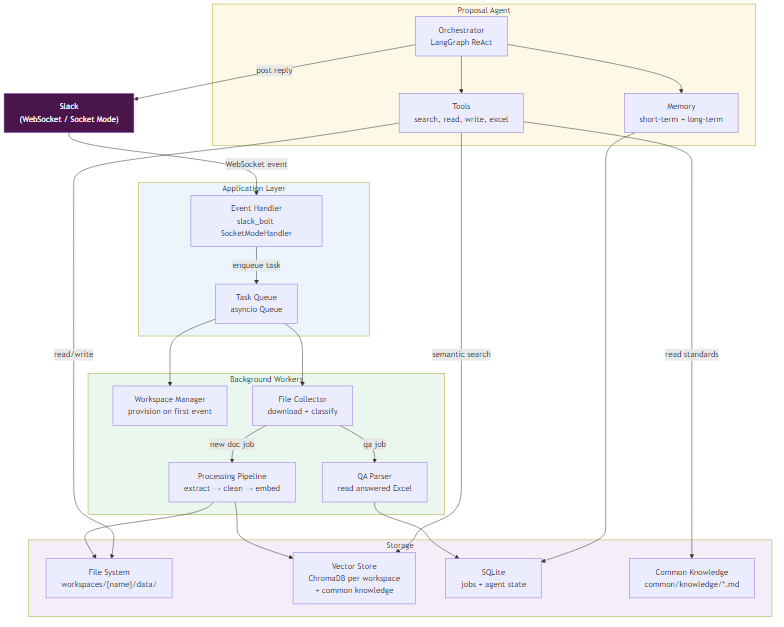
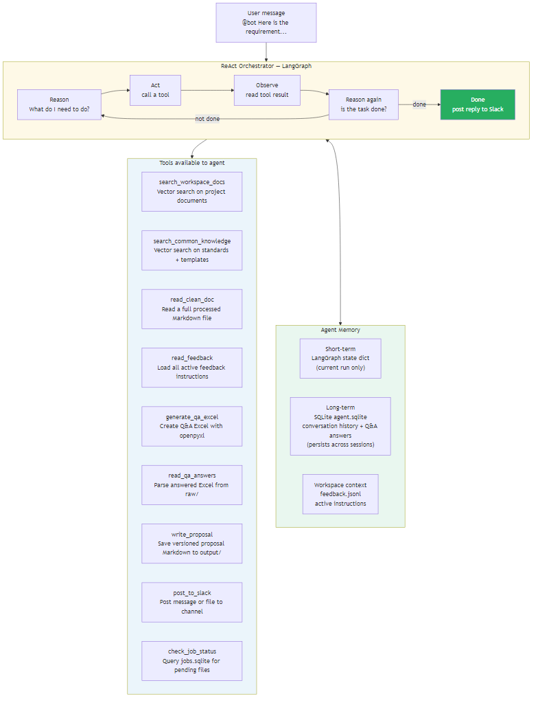
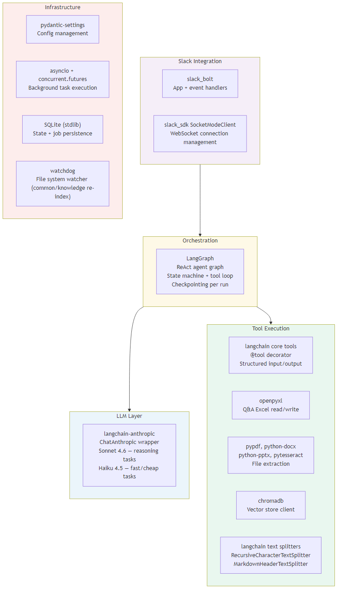
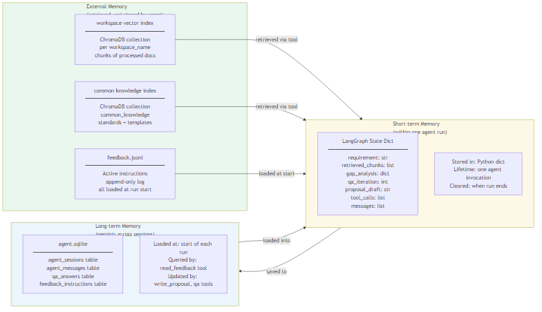
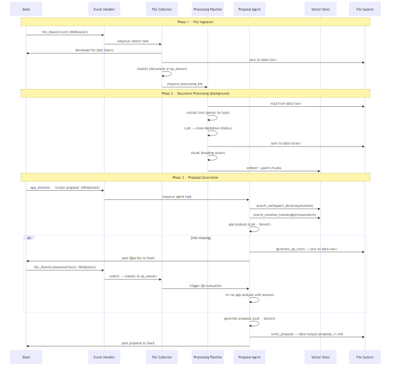
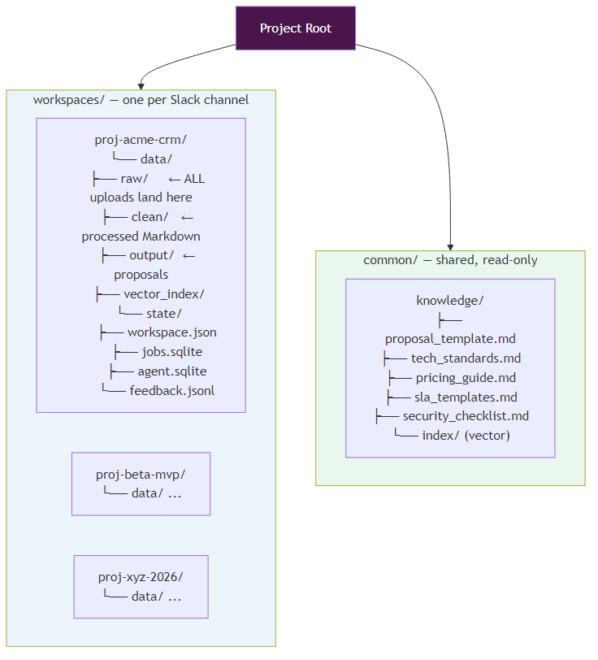

# ARC — System Architecture
## Slack-Based Project Agent System

**Version:** 1.0 | Aligned with REQ.md v1.1

---

## Contents

1. [System Architecture](#1-system-architecture)
2. [Agent Design](#2-agent-design)
   - [2.1 Orchestration — ReAct with LangGraph](#21-orchestration--react-with-langgraph)
   - [2.2 Library Stack](#22-library-stack)
   - [2.3 Memory](#23-memory)
   - [2.4 Tools](#24-tools)
3. [Data Flow](#3-data-flow)
4. [Workspace Layout](#4-workspace-layout)
5. [Key Design Decisions](#5-key-design-decisions)

---

## 1. System Architecture

The system has three independent runtime layers that communicate through the file system and SQLite — not through direct function calls. This keeps each layer replaceable and independently testable.



### The Three Layers

| Layer | What it does | Always running? |
|-------|-------------|----------------|
| **Event Handler** | Receives Slack events over WebSocket, enqueues tasks | Yes — persistent connection |
| **Background Workers** | Process files, parse Q&A, manage workspaces | Yes — poll loop |
| **Proposal Agent** | Reasons over context, generates proposals | On demand — triggered by mention |

### Communication between layers

```
Event Handler  →  asyncio Task Queue  →  Workers + Agent
Workers        →  File System (raw/, clean/)
Workers        →  SQLite (jobs.sqlite — status updates)
Agent          →  SQLite (agent.sqlite — state + history)
Agent          →  File System (output/proposal*.md)
Agent          →  Vector Store (read-only at run time)
Agent          →  Slack API (post reply)
```

No layer calls another directly. The queue decouples event receiving from processing, so a slow agent run never blocks Slack event acknowledgment.

### Slack Connection: WebSocket Only

The bot uses **Slack Socket Mode** — a persistent outbound WebSocket connection. There is no inbound HTTP endpoint, no public URL, no TLS certificate to manage.

```
Bot process  ──(outbound WSS)──►  Slack WebSocket Gateway
                                        │
                          Slack pushes events over this connection
```

---

## 2. Agent Design

---

### 2.1 Orchestration — ReAct with LangGraph

The Proposal Agent uses the **ReAct** (Reason + Act) pattern, implemented with **LangGraph**.

**Why ReAct?**
- The agent needs to decide *dynamically* which tools to call and in what order — this is not a fixed pipeline
- The number of gap-analysis + Q&A iterations is unknown upfront
- ReAct is the simplest loop that handles open-ended tool-calling naturally

**Why LangGraph over plain LangChain AgentExecutor?**
- LangGraph gives explicit control over the state passed between steps — the agent's full working context (requirement, retrieved chunks, Q&A answers, proposal draft) lives in the graph state dict
- Checkpointing: LangGraph can persist state to SQLite between turns, enabling pause-and-resume across Slack messages
- Cleaner conditional edges: `has_enough_info = true/false` maps directly to a graph edge, not buried in prompt text



#### The ReAct Loop

```
START
  │
  ▼
[Reason] LLM reads: system prompt + memory snapshot + tool results so far
          Decides: what tool to call next, or "I'm done"
  │
  ▼
[Act]    Call the chosen tool (search, read file, write Excel, etc.)
  │
  ▼
[Observe] Tool result appended to state
  │
  ▼
[Reason again] → loop until LLM decides task is complete
  │
  ▼
END — post final result to Slack
```

#### LangGraph State

```python
from typing import Annotated
from langgraph.graph import StateGraph, END
from langchain_core.messages import BaseMessage

class AgentState(TypedDict):
    # Inputs
    workspace_name: str
    requirement: str
    feedback_instructions: list[str]

    # Working memory (built up during the run)
    messages: Annotated[list[BaseMessage], add_messages]  # full tool call history
    retrieved_project_chunks: list[dict]
    retrieved_common_chunks: list[dict]
    gap_analysis: dict | None           # {has_enough_info, missing_items, ...}
    qa_iteration: int
    qa_answers: list[dict]

    # Output
    proposal_version: int
    proposal_path: str | None
```

#### Graph Structure

```python
graph = StateGraph(AgentState)

graph.add_node("reason",  llm_with_tools)    # LLM decides next action
graph.add_node("act",     tool_executor)     # executes the chosen tool

graph.set_entry_point("reason")
graph.add_edge("act", "reason")              # always reason after acting

graph.add_conditional_edges(
    "reason",
    should_continue,                         # "act" | END
)
```

`should_continue` returns `END` when the LLM produces a response with no tool calls (i.e., it has finished reasoning and posted its conclusion).

#### Checkpointing (pause between Slack messages)

LangGraph's `SqliteSaver` persists the full agent state between turns:

```python
from langgraph.checkpoint.sqlite import SqliteSaver

checkpointer = SqliteSaver.from_conn_string(
    f"workspaces/{workspace_name}/data/state/agent.sqlite"
)
graph = graph.compile(checkpointer=checkpointer)

# Each Slack thread gets its own checkpoint thread_id
config = {"configurable": {"thread_id": slack_thread_ts}}
result = graph.invoke(input, config=config)
```

This means: if the agent posts a Q&A file and waits for the team's response, the full agent state is saved. When the answered file arrives (a new Slack event), the agent resumes from exactly where it left off.

---

### 2.2 Library Stack



#### Core Dependencies

| Package | Role | Why chosen |
|---------|------|-----------|
| `langgraph` | Agent orchestration, state machine, checkpointing | Explicit state, pause/resume, clean conditional edges |
| `langchain-anthropic` | Claude LLM wrapper | First-class Anthropic support, tool calling, streaming |
| `langchain-core` | `@tool` decorator, message types, base classes | Standard tool interface, works with LangGraph natively |
| `langchain-chroma` | ChromaDB vector store integration | Simple local vector store, no separate server needed |
| `langchain-text-splitters` | Document chunking | `MarkdownHeaderTextSplitter` + `RecursiveCharacterTextSplitter` |
| `slack_bolt` | Slack app framework, event routing | Official Slack SDK, Socket Mode built-in |
| `slack_sdk` | WebSocket client, file upload | Low-level Slack API access |
| `openpyxl` | Q&A Excel read/write | No LLM needed for structured Excel I/O |
| `pypdf` + `pdfplumber` | PDF text extraction | `pypdf` for clean PDFs, `pdfplumber` for tables |
| `python-docx` | Word document extraction | Native `.docx` support |
| `python-pptx` | PowerPoint extraction | Native `.pptx` support |
| `pytesseract` | OCR for images and scanned PDFs | Fallback when text extraction fails |
| `pydantic-settings` | Config from `.env` | Type-safe config, no boilerplate |
| `watchdog` | File system watcher | Re-index `common/knowledge/` on file change |

#### What is NOT used and why

| Not used | Reason |
|----------|--------|
| **CrewAI** | Multi-agent framework — overkill here. One agent with tools is simpler than multiple agents coordinating. CrewAI adds crew/task/agent boilerplate that this system doesn't need. |
| **LangChain AgentExecutor** | Replaced by LangGraph — AgentExecutor has no built-in checkpointing or explicit state, making pause/resume between Slack messages impossible. |
| **OpenAI** | Anthropic Claude covers all LLM needs; mixing providers adds complexity. |
| **Qdrant** | ChromaDB is simpler for local deployment; upgrade path exists if scale demands it. |
| **Redis** | Not needed — asyncio queue + SQLite handles job state without additional infrastructure. |

---

### 2.3 Memory

The agent has three memory layers with different lifetimes:



#### Layer 1 — Short-term: LangGraph State (current run only)

Everything the agent learns during one run lives in the `AgentState` dict. This is the agent's working memory — tool results, retrieved chunks, gap analysis output, Q&A answers accumulated in this session.

**Scope:** One `graph.invoke()` call  
**Stored in:** Python dict in memory (+ checkpointed to SQLite if paused)  
**Cleared:** When the run ends

```python
# Built up during tool calls:
state["retrieved_project_chunks"] = search_workspace_docs(requirement)
state["gap_analysis"] = analyze_gaps(requirement, chunks)
state["qa_answers"] += parse_qa_file(answered_excel_path)
```

#### Layer 2 — Long-term: SQLite (`agent.sqlite`)

Conversation history, Q&A answers, and feedback instructions persist across sessions. This is what lets the agent "remember" what was discussed in a previous Slack message without the user repeating themselves.

**Scope:** Entire lifetime of the workspace  
**Stored in:** `workspaces/{name}/data/state/agent.sqlite`  
**Tables:** `agent_sessions`, `agent_messages`, `qa_answers`, `feedback_instructions`

LangGraph's `SqliteSaver` checkpointer writes to this file automatically, storing the full message history per `thread_id` (Slack thread timestamp).

**On run start:** The agent loads:
- All prior `qa_answers` for this workspace
- All `active = 1` feedback instructions
- The last checkpoint for this Slack thread (if resuming)

#### Layer 3 — Retrieval: Vector Store (read-only at run time)

The agent does not write to the vector store during a run. Documents are indexed by the **Processing Pipeline** (a separate worker). The agent only reads via search tools.

**Two separate indexes:**

| Index | Collection name | Contents |
|-------|----------------|---------|
| Per-workspace | `{workspace_name}` | Chunks of processed client documents |
| Common knowledge | `common_knowledge` | Standards, templates, rate cards |

**Retrieval at run start:** The agent issues `search_workspace_docs` and `search_common_knowledge` tool calls at the beginning of every proposal run. Results enter the LangGraph state and stay there for the duration of the run.

---

### 2.4 Tools

All tools are defined with LangChain's `@tool` decorator and registered with the LangGraph agent. The LLM chooses which to call based on its reasoning.

#### Tool Summary

| Tool | Input | Output | When used |
|------|-------|--------|----------|
| `search_workspace_docs` | query: str, k: int=10 | list of chunks with metadata | Start of every proposal run |
| `search_common_knowledge` | query: str, k: int=5 | list of chunks with metadata | Start of every proposal run |
| `read_clean_doc` | job_id: str | full Markdown text | When a specific document needs full content |
| `read_feedback_instructions` | workspace_name: str | list of active instructions | Start of every run + after feedback event |
| `check_pending_jobs` | workspace_name: str | list of pending/processing jobs | Before starting — ensure docs are ready |
| `analyze_gaps` | requirement, chunks, qa_answers | `{has_enough_info, missing_items, ...}` | After retrieval, before drafting |
| `generate_qa_excel` | questions: list[dict] | file path of generated Excel | When gaps found |
| `read_qa_answers` | file_path: str | list of `{question, answer}` | When answered Excel is detected |
| `write_proposal` | content: str, workspace_name: str | file path of saved proposal | When enough info confirmed |
| `post_file_to_slack` | channel_id, file_path, message | Slack API response | Post Q&A Excel or proposal |
| `post_message_to_slack` | channel_id, text, thread_ts | Slack API response | Acknowledgments and updates |

#### Tool Implementations

```python
from langchain_core.tools import tool

@tool
def search_workspace_docs(query: str, workspace_name: str, k: int = 10) -> list[dict]:
    """Search processed project documents for content relevant to the query."""
    collection = chroma_client.get_collection(workspace_name)
    results = collection.query(query_texts=[query], n_results=k)
    return [
        {"text": doc, "source": meta["source_file"], "section": meta["section"]}
        for doc, meta, dist in zip(results["documents"][0], results["metadatas"][0], results["distances"][0])
        if dist < 0.8
    ]

@tool
def search_common_knowledge(query: str, k: int = 5) -> list[dict]:
    """Search the shared knowledge base (standards, templates, pricing) for relevant content."""
    collection = chroma_client.get_collection("common_knowledge")
    results = collection.query(query_texts=[query], n_results=k)
    return [
        {"text": doc, "file": meta["file"]}
        for doc, meta, dist in zip(results["documents"][0], results["metadatas"][0], results["distances"][0])
        if dist < 0.8
    ]

@tool
def generate_qa_excel(questions: list[dict], workspace_name: str) -> str:
    """
    Create a Q&A Excel file from a list of questions.
    Each question must have: topic, question, why_needed, priority.
    Returns the file path of the saved Excel.
    """
    wb = openpyxl.Workbook()
    ws = wb.active
    ws.title = "Questions"
    ws.append(["#", "Topic", "Question", "Why Needed", "Priority", "Answer"])
    for i, q in enumerate(questions, 1):
        ws.append([i, q["topic"], q["question"], q["why_needed"], q["priority"], ""])
    path = f"workspaces/{workspace_name}/data/raw/qa_{workspace_name}_{iteration}.xlsx"
    wb.save(path)
    return path

@tool
def write_proposal(content: str, workspace_name: str) -> str:
    """Save a proposal draft as a versioned Markdown file. Returns the file path."""
    version = get_next_version(workspace_name)
    path = f"workspaces/{workspace_name}/data/output/proposal_v{version}.md"
    Path(path).write_text(content)
    # Also update proposal_latest.md
    Path(f"workspaces/{workspace_name}/data/output/proposal_latest.md").write_text(content)
    return path
```

#### System Prompt (injected into every agent run)

```
You are a proposal writing assistant for a software consultancy.

Your job:
1. Read the client requirement and retrieved project documents.
2. Use search_workspace_docs and search_common_knowledge to gather context.
3. Identify whether you have enough information to write a complete proposal.
   A complete proposal needs: scope, deliverables, timeline, tech approach, assumptions, pricing basis.
4. If information is missing: use generate_qa_excel to create clarifying questions, then post_file_to_slack.
5. If information is sufficient: write the proposal with write_proposal, then post_file_to_slack.
6. Apply all feedback instructions when updating an existing proposal.

Rules:
- Always search documents before deciding anything.
- Never make up specific numbers (timelines, costs, user counts) — use [TBD] or ask.
- Apply feedback instructions exactly as stated.
- Use common knowledge for structure and standards, project documents for client specifics.
```

---

## 3. Data Flow

End-to-end flow from file upload to proposal delivered in Slack:



### Three Phases

**Phase 1 — File Ingestion** (triggered by any Slack upload)
```
Slack file_shared event
  → FileCollector downloads to data/raw/
  → Classify: document or qa_answer
  → Enqueue appropriate worker job
```

**Phase 2 — Background Processing** (runs automatically, no user trigger needed)
```
ProcessingPipeline picks up document job
  → Extract text (parser by file type)
  → LLM converts to clean Markdown (Haiku — cheap, fast)
  → Save to data/clean/{job_id}.md
  → Chunk by heading structure
  → Embed + upsert to workspace ChromaDB collection
```

**Phase 3 — Proposal Generation** (triggered by @bot mention)
```
Agent starts ReAct loop:
  Reason: "I need to read the requirement and search documents"
  Act:    search_workspace_docs(requirement)
  Act:    search_common_knowledge(requirement)
  Reason: "Do I have enough info?"
  Act:    analyze_gaps(...)
  
  → if gaps: generate_qa_excel → post to Slack → wait (checkpoint saved)
  → when answered: read_qa_answers → re-analyze
  
  → if complete: write_proposal → post to Slack
```

---

## 4. Workspace Layout

One directory per Slack channel, named after the channel. All file I/O goes through `data/raw/` first.



### Why `data/raw/` receives everything

Every file that arrives from Slack — client documents, Q&A answered files, anything — lands in `data/raw/` first. Classification happens after saving. This gives:

- **Single ingestion point** — one code path for all uploads
- **Complete audit trail** — nothing is discarded at receive time
- **Replayability** — any file can be re-classified and re-processed by re-queuing its job

The Q&A answered Excel is not special — it goes to `data/raw/` like everything else, gets classified as `qa_answer`, and is routed to `QAParser` instead of the processing pipeline.

---

## 5. Key Design Decisions

| Decision | Choice | Reason |
|----------|--------|--------|
| **Orchestration** | LangGraph ReAct | Handles variable tool-call depth, supports checkpointing between Slack messages, explicit state |
| **Agent framework** | LangGraph (not CrewAI) | Single agent with tools is simpler than a multi-agent crew for this use case; no inter-agent coordination needed |
| **Slack transport** | WebSocket Socket Mode | No public HTTP endpoint; outbound-only; authentication at connection, not per-request |
| **Vector store** | ChromaDB (local) | Zero infrastructure, file-based, per-workspace collection; upgrade to Qdrant if needed |
| **State persistence** | SQLite via LangGraph checkpointer | Built-in to LangGraph, no extra infra, enables pause/resume across Slack message gaps |
| **LLM for reasoning** | Claude Sonnet 4.6 | Best instruction-following + tool use for gap analysis and proposal writing |
| **LLM for processing** | Claude Haiku 4.5 | 10× cheaper for high-volume Markdown conversion; quality sufficient for extraction |
| **All files → raw/** | Yes, without exception | Single ingestion point, complete audit log, replayable, no pre-filter logic at receive time |
| **Common knowledge** | Shared read-only index outside workspaces | Standards and templates are the same for all clients; keeping them separate prevents duplication across workspaces |
| **No Redis, no Celery** | asyncio queue + SQLite | Sufficient for ≥10 concurrent workspaces; avoids operational complexity of additional services |
